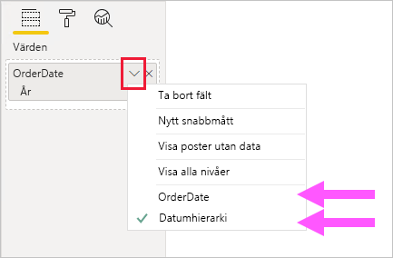
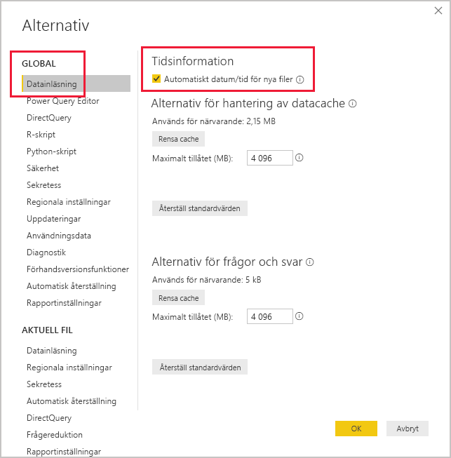

# <a name="apply-auto-datetime-in-power-bi-desktop"></a>Använda automatisk datum/tid i Power BI Desktop

Den här artikeln vänder sig till datamodellerare som utvecklar importmodeller eller sammansatta modeller i Power BI Desktop. Den introducerar och beskriver alternativet _Automatiskt datum/tid_.

Automatiskt datum/tid är ett datainläsningsalternativ i Power BI Desktop. Syftet med alternativet är att stödja tidsinformationsrapportering som baseras på de datumkolumner som har lästs in i en modell. Mer specifikt kan rapportförfattarna använda datamodellen till att filtrera, gruppera och öka detaljnivån genom att använda kalenderns tidsperioder (år, kvartal, månader och dagar). Det viktiga här är att du inte uttryckligen behöver utveckla de här tidsseriefunktionerna.

När alternativet är aktiverat skapar Power BI Desktop en dold automatisk datum/tidtabell för varje datumkolumn, förutsatt att alla följande villkor är uppfyllda:

- Tabellens lagringsläge är Importera
- Kolumnen är inte en beräknad kolumn
- Kolumnens datatyp är datum eller datum/tid
- Kolumnen är inte på ”många”-sidan i en modellrelation

## <a name="how-it-works"></a>Så här fungerar det

Varje automatisk datum/tidtabell är i själva verket en [beräknad tabell](desktop-calculated-tables.md) som genererar datarader med hjälp av funktionen DAX [CALENDAR](/dax/calendar-function-dax). Varje tabell innehåller också sex beräknade kolumner: **Day**, **MonthNo**, **Month**, **QuarterNo**, **Quarter** och **Year**.

> [!NOTE]
> Power BI översätter och formaterar kolumnnamnen och värdena enligt [modellspråket](supported-languages-countries-regions.md#choose-the-language-for-the-model-in-power-bi-desktop). Om modellen till exempel har skapats med hjälp av engelska visas fortfarande månadsnamn och så vidare på engelska, även om den öppnas i en koreansk klient.

Dessutom skapar Power BI en relation mellan kolumnen **Date** i datum/tid-tabellen och modellens datumkolumn.

Den automatiska datum/tid-tabellen innehåller hela kalenderår och alla datumvärden som lagras i modellens datumkolumn. Om det tidigaste värdet i en datumkolumn till exempel är 20 mars 2016 och det senaste värdet är 23 oktober 2019 så innehåller tabellen 1 461 rader. Den visar en rad för varje datum under de fyra kalenderåren 2016 till 2019. När Power BI uppdaterar modellen uppdateras också varje automatiskt datum- och tidsschema. På så sätt innehåller modellen alltid datum som omfattar värdena i datumkolumnen.

Om det skulle gå att se raderna i en automatisk datum/tid-tabell skulle de se ut så här:


> [!NOTE]
> Automatiska datum/tidtabeller är alltid dolda, även för modellerare. De går inte att se i fönstret **Fält** eller i modellens vydiagram och det går inte att se dess rader i datavyn. Dessutom går det inte att referera till tabellen och dess kolumn direkt från DAX-uttryck.
>
> Du kan inte heller arbeta med dem när du använder [Analysera i Excel](service-analyze-in-excel.md) eller när du ansluter till modellen via en annan rapportdesigner än Power BI.

Tabellen definierar också en hierarki, vilket ger visuella objekt en detaljnivå med nivåerna år, kvartal, månad och dag.

Om det skulle gå att se en automatisk datum/tid-tabell i modellvydiagrammet skulle den se ut så här (relaterade kolumner är markerade):


## <a name="work-with-auto-datetime"></a>Arbeta med automatisk datum/tid

När det finns en automatisk datum/tidtabell för en datumkolumn (och kolumnen är synlig), hittar inte rapportförfattarna den kolumnen som ett fält i fönstret **Fält**. I stället finns det ett expanderbart objekt med samma namn som datumkolumnen. Det är enkelt att hitta eftersom det är märkt med en kalenderikon. När rapportförfattarna expanderar kalenderobjektet ser de en hierarki med namnet **Datumhierarki**. Den här hierarkin har fyra nivåer: **Year**, **Quarter**, **Month** och **Day**.


Den automatiska datum/tidgenererade hierarkin kan användas för att konfigurera ett visuellt objekt på exakt samma sätt som vanliga hierarkier kan användas. Visuella objekt kan konfigureras med hjälp av hela hierarkin **Date Hierarchy**, eller med vissa nivåer i hierarkin.

Det finns dock en extra funktion som inte stöds av vanliga hierarkier. När den automatiska datum/tid-hierarkin, eller en nivå i hierarkin, läggs till i ett visuellt objekt kan rapportförfattaren växla mellan att använda hierarkin eller datumkolumnen. Den här metoden passar bra för vissa visuella objekt, när det enda som behövs är datumkolumnen och inte hierarkin eller dess nivåer. Du börjar genom att konfigurera det visuella fältet (högerklicka på det visuella fältet eller klicka på nedåtpilen). Använd sedan snabbmenyn för att växla mellan datumkolumnen och datumhierarkin.



Slutligen kan modellberäkningar skrivna i DAX referera antingen _direkt_ till en datumkolumn, eller _indirekt_ till de dolda kolumnerna i den automatiska datum/tid-tabellen.

Formeln som skrivs i Power BI Desktop kan referera till en datumkolumn på vanligt sätt. Kolumnerna för den automatiska datum/tidtabellen måste dock refereras med hjälp av en särskild utökad syntax. Du börjar genom att först referera till datumkolumnen följt av en punkt (.). Formelfältet fylls i automatiskt och du kan välja en kolumn i den automatiska datum/tidtabellen.

![Exempel på att ange ett DAX-måttuttryck i formelfältet. Än så länge läser formeln Date Count = COUNT(Sales[OrderDate]. och i listan Komplettera automatiskt visas alla sju kolumnerna från den dolda automatiska datum/tidtabellen. Dessa kolumner är: Date, Day, Month, MonthNo, Quarter, QuarterNo och Year.](media/desktop-auto-date-time/auto-date-time-dax-auto-complete.png)

I Power BI Desktop kan ett giltigt måttuttryck läsa:

```dax
Date Count = COUNT(Sales[OrderDate].[Date])
```

> [!NOTE]
> Även om det här måttuttrycket är giltigt i Power BI Desktop, är det inte rätt DAX-syntax. Internt transponerar Power BI Desktop ditt uttryck för att referera till den sanna (dolda) automatiska datum/tidtabellen.

## <a name="configure-auto-datetime-option"></a>Konfigurera alternativ för automatisk datum/tid

Automatisk datum/tid kan konfigureras _globalt_ eller för _aktuell fil_. Det globala alternativet tillämpas på nya Power BI Desktop-filer och kan aktiveras eller inaktiveras när som helst. Vid en ny installation av Power BI Desktop är båda alternativen som standard aktiverade.

Det aktuella filalternativet kan också aktiveras eller inaktiveras när som helst. När det är aktiverat skapas automatiska datum/tidtabeller. Vid inaktivering tas alla automatiska datum/tidtabeller bort från modellen.

> [!CAUTION]
> Var försiktig när du inaktiverar alternativet för den aktuella filen, eftersom de automatiska datum/tid-tabellerna då tas bort. Se till att åtgärda eventuella felaktiga rapportfilter eller visuella objekt som har konfigurerats för användning.

Välj _Arkiv > Alternativ och inställningar > Alternativ_ i Power BI Desktop och sedan antingen sidan **Global** eller **Aktuell fil**. På båda sidorna finns alternativet i avsnittet **Tidsinformation**.



## <a name="next-steps"></a>Nästa steg

Mer information om ämnet i den här artikeln finns i följande resurser:

- [Vägledning om automatiskt datum/tid i Power BI Desktop](guidance/auto-date-time.md)
- [Konfigurera och använda datumtabeller i Power BI Desktop](desktop-date-tables.md)
- Har du några frågor? [Fråga Power BI Community](https://community.powerbi.com/)
- Har du förslag? [Bidra till att förbättra Power BI](https://ideas.powerbi.com/)
