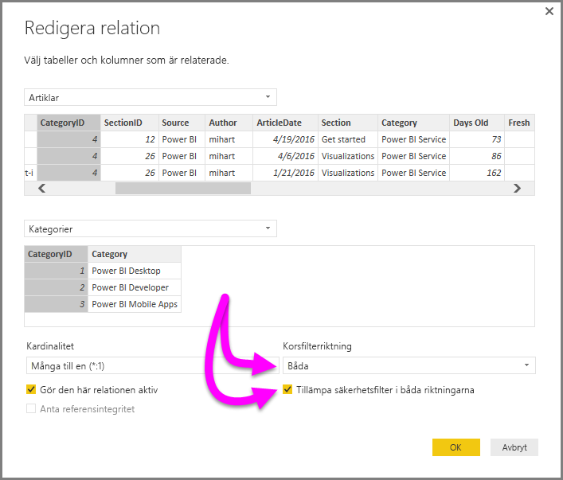

# Aktivera dubbelriktad korsfiltrering för DirectQuery i Power BI Desktop

Vid filtrering av tabeller för att skapa en lämplig vy av data ställs rapportskapare och datamodellerare inför en utmaning vad gäller att tillämpa filter på en rapport. Tidigare behölls tabellens filterkontext på ena sidan av relationen, men inte på den andra. På grund av detta krävdes ofta en komplex DAX-formel för önskat resultat.

Med dubbelriktad korsfiltrering har rapportskapare och datamodellerare nu mer kontroll över hur de kan tillämpa filter vid arbete med relaterade tabeller. Dubbelriktad korsfiltrering gör det möjligt att tillämpa filter på *båda* sidorna i en tabellrelation. Du kan tillämpa filter genom att sprida filterkontexten till en annan relaterad tabell på andra sidan av en tabellrelation.

## Aktivera dubbelriktad korsfiltrering för DirectQuery

Du kan aktivera korsfiltrering i dialogrutan **Redigera relation**. För att aktivera korsfiltrering för en relation måste du konfigurera följande alternativ:

* Ange **Korsfilterriktning** till **Båda**.
* Välj **Tillämpa säkerhetsfilter i båda riktningarna**.

  

> [!NOTE]
> När du skapar DAX-formler för korsfiltrering i Power BI Desktop använder du *UserPrincipalName*. Det här fältet är ofta samma som användarens inloggningsuppgifter, till exempel <em>joe@contoso.com</em>, i stället för *UserName*. Därmed kan du behöva skapa en relaterad tabell som mappar *UserName* eller *EmployeeID* till *UserPrincipalName*.

Mer information och exempel på hur dubbelriktad korsfiltrering fungerar finns i [white paper om Dubbelriktad korsfiltrering för Power BI Desktop](https://download.microsoft.com/download/2/7/8/2782DF95-3E0D-40CD-BFC8-749A2882E109/Bidirectional%20cross-filtering%20in%20Analysis%20Services%202016%20and%20Power%20BI.docx).

