# Använda bokmärken för att dela information och skapa artiklar i Power BI 
Med hjälp av **bokmärken** i Power BI kan du avbilda konfigurerade visningar av rapportsidan, inklusive filtrering och tillstånd för visuell information och senare gå tillbaka till det aktuella tillståndet genom att helt enkelt välja det sparade bokmärket. 

Du kan också skapa en samling bokmärken, ordna dem i valfri ordning och sedan gå igenom varje bokmärke i en presentation om du vill markera en serie insikter eller artikeln som du vill förmedla med din visuella information och dina rapporter. 

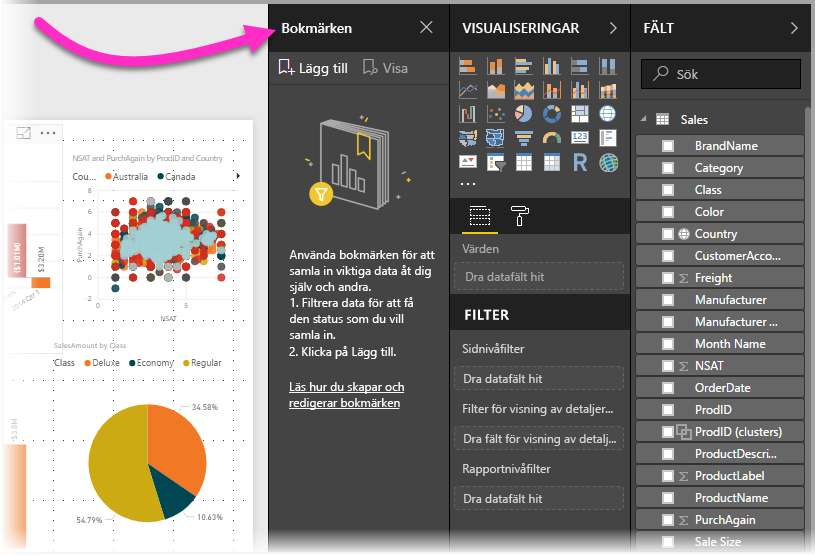

Bokmärken har många användningsområden. Du kan använda dem för att övervaka förloppet i att skapa rapporter (bokmärken är lätta att lägga till, ta bort och byta namn på) och du kan skapa bokmärken för att skapa en PowerPoint-liknande presentation visar bokmärken i ordning, så att din rapport utgör en berättelse. Det kan finnas andra användningsområden, baserat på hur du vill använda bokmärken.

> [!TIP]
> Information om användning av personliga bokmärken i Power BI-tjänsten finns i [blogginlägget](https://powerbi.microsoft.com/blog/announcing-personal-bookmarks-in-the-power-bi-service/) om funktionen Personliga bokmärken. 

### Aktivera förhandsversionen för bokmärken (versioner före mars 2018)
Från och med versionen från mars 2018 av Power BI Desktop är bokmärken allmänt tillgängliga. 

Vi rekommenderar alltid att du uppgraderar till den senaste versionen. Men om du har en tidigare version av Power BI Desktop kan du prova funktionen **bokmärken** från och med versionen från **oktober 2017** av **Power BI Desktop**, och för rapporter som har aktiverats för bokmärken i **Power BI-tjänsten**. Aktivera förhandsversionsfunktionen genom att välja **Arkiv > Alternativ och inställningar > Alternativ > Förhandsversionsfunktioner** och markera kryssrutan bredvid **Bokmärken**. 

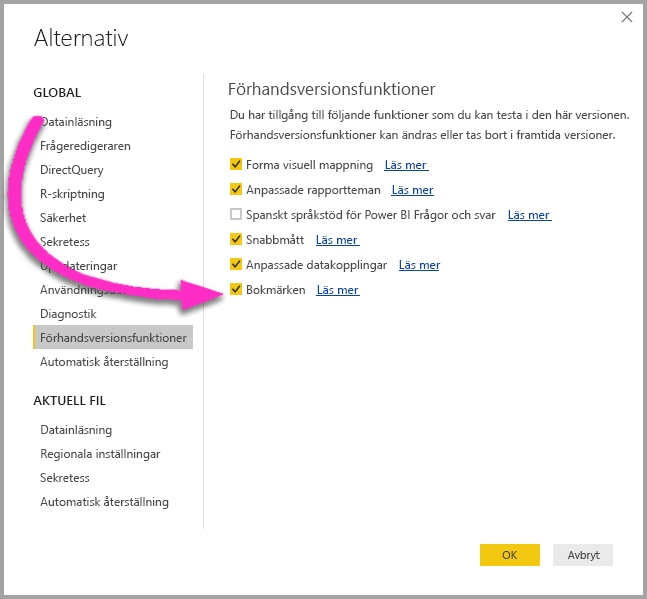

Du måste starta om **Power BI Desktop** när du har gjort valet för att aktivera förhandsversionen av bokmärken.

## Använda bokmärken
Om du vill använda bokmärken väljer du menyflikfönstret **Visa** och väljer sedan kryssrutan för **fönstret Bokmärken**. 

När du skapar ett bokmärke sparas följande element med bokmärket:

* Nuvarande sida
* Filter
* Utsnitt, inklusive utsnittstyp (till exempel listruta eller lista) och utsnittstillstånd
* Tillstånd för markering i visuellt objekt (till exempel filtrering för flera markeringar)
* Sorteringsordning
* Riktning för detaljnivån
* Synlighet (för ett objekt med hjälp av fönstret **Val**)
* Fokus- eller **Spotlight**-lägen för synliga objekt

Konfigurera en rapport som du vill att den ska visas i bokmärket. När du har utformat din rapportsida och visuella objekt väljer du **Lägg till** från fönstret **Bokmärken** om du vill lägga till ett bokmärke. 

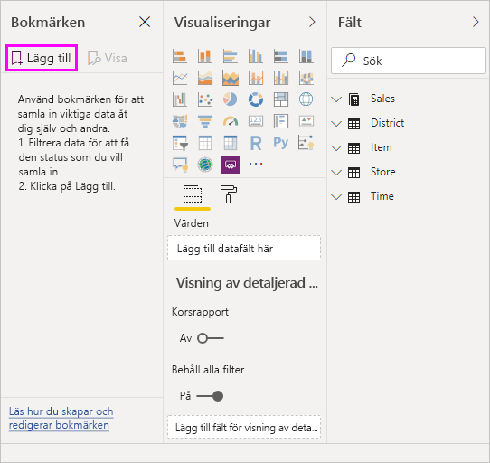

**Power BI Desktop** skapar ett bokmärke och ger den ett allmänt namn. Du kan enkelt *byta namn på*, *ta bort* eller *uppdatera* ett bokmärke genom att välja ellipsen bredvid bokmärkets namn och sedan välja en åtgärd på menyn som visas.

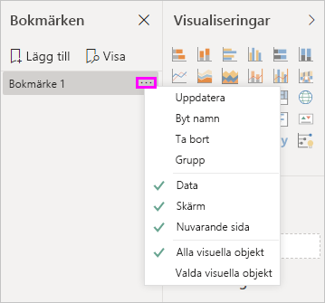

När du har ett bokmärke kan du visa det genom att klicka på bokmärket i fönstret **Bokmärken**. 

Du kan också välja om varje bokmärke ska tillämpa *data*-egenskaper, som filter och utsnitt, *visa*-egenskaper som aktuellt och dess synlighet och sidändringar som visar den sida som var synlig när bokmärket lades till. De här funktionerna är användbara när du använder bokmärken för att växla mellan rapportvyer och urval av visuella objekt – då du förmodligen vill inaktivera dataegenskaperna så att filter inte återställs när användarna byter vy genom att välja ett bokmärke. 

För att göra dessa ändringar väljer du ellipsen bredvid bokmärkets namn, som visas i föregående bild, och sedan markerar eller avmarkerar du bockmarkeringarna bredvid *Data*, *Visa* och andra kontroller. 

## Ordna bokmärken
När du skapar bokmärken kanske du lägger märke till att ordningen du skapade dem i inte nödvändigtvis är samma ordning som du vill visa dem. Inga problem, kan du enkelt ändra ordningen på bokmärken.

I rutan **bokmärken** är det bara att dra och släppa bokmärken för att ändra deras inbördes ordning enligt i följande bild. Det gula fältet mellan bokmärkena visar var det flyttade bokmärket ska placeras.

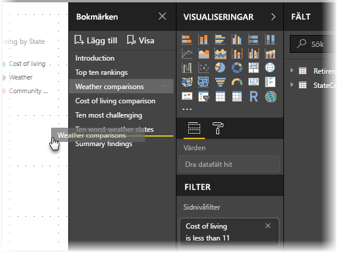

Ordningen på dina bokmärken kan vara viktiga när du använder funktionen **Visa** i bokmärken, enligt beskrivningen i nästa avsnitt.

## Bokmärken som ett bildspel
När du har en samling bokmärken som du vill presentera i ordning kan du välja **Visa** från fönstret **Bokmärken** om du vill starta ett bildspel.

När du är i **visnings**läget finns det några funktioner att observera:

1. Namnet på bokmärket visas i namnlisten för bokmärket, som visas längst ned i arbetsytan.
2. Namnlistan för bokmärket har pilar som låter dig flytta till nästa eller föregående bokmärke.
3. Du kan avsluta **Visnings**läget genom att välja **Avsluta** från rutan **Bokmärken** eller genom att välja **X** som finns i namnlisten för bokmärket. 

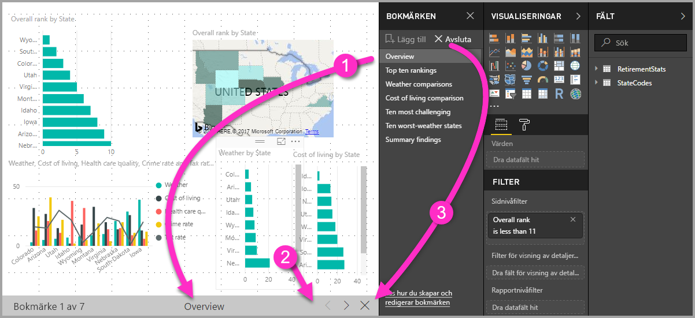

När du är i **Visningsläget** kan du stänga fönstret **Bokmärken** (genom att klicka på X i det här fönstret) för att ge mer utrymme till presentationen. Medan du är i **Visningsläget** är alla visuella objekt interaktiva och är tillgängliga för korsmarkering, precis som de annars skulle vara när du interagerar med dem. 

## Synlighet – använda synlighetsfönstret
Med lanseringen av bokmärken introduceras även det nya fönstret **Urval**. Fönstret **Urval** innehåller en lista över alla objekt på sidan och gör att du kan markera objektet och ange om ett angivet objekt är synlig. 

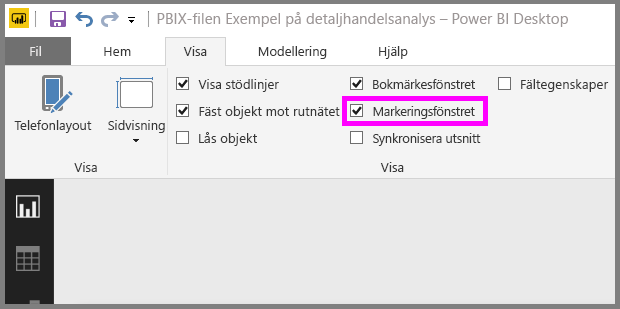

Du kan välja ett objekt med hjälp av fönstret **Urval**. Du kan också växla om objektet är synligt genom att klicka på ögonikonen till höger om den visuella informationen. 

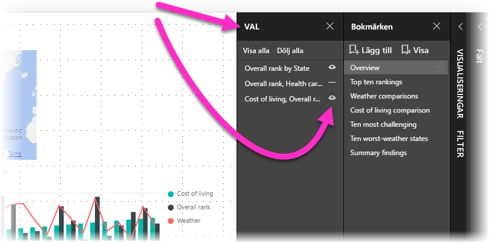

När ett bokmärke har lagts till sparas statusen för varje objekt även baserat på dess inställning i fönstret **Urval**. 

Det är viktigt att notera att **utsnitt** fortsätter att filtrera en rapportsida, oavsett om de är synliga. Du kan därför skapa många olika bokmärken med olika utsnittsinställningar så att en enstaka rapportsida ser helt annorlunda ut (och markerar olika insikter) i olika bokmärken.

## Bokmärken för former och bilder
Du kan också länka former och bilder till bokmärken. När du klickar på ett objekt med den här funktionen visas bokmärket som associeras med objektet. Det kan vara speciellt användbart när du arbetar med knapparna. Du kan lära dig mer genom att läsa artikeln om att [använda knappar i Power BI](desktop-buttons.md). 

Om du vill tilldela ett bokmärke till ett objekt expanderar du avsnittet **Åtgärd** från fönstret **Formatera form** som visas i följande bild.

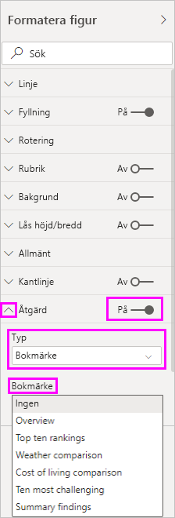

När du växlar skjutreglaget **Åtgärd** till **På**, kan du välja om objektet är en svart knapp, ett bokmärke eller ett Frågor och Svar-kommando. Om du väljer bokmärke kan sedan du välja vilka av dina bokmärken objektet är kopplat till.

Det finns alla typer av intressanta saker du kan göra med ett objektlänkat bokmärke. Du kan skapa en visuell innehållsförteckning på rapportsidan eller kan ange olika vyer (till exempel visuella typer) av samma information genom att klicka på ett objekt.

När du är i redigeringsläge kan du använda ctrl + klicka om du vill följa länken när du inte är i redigeringsläget. Bara klicka på objekt om du vill följa länken. 

## Bokmärkesgrupper

Från och med **Power BI Desktop**-versionen för augusti 2018 kan du skapa och använda bokmärkesgrupper. En bokmärkesgrupp är en samling bokmärken som du anger, som kan visas och ordnas i en grupp. 

Om du vill skapa en bokmärkesgrupp håller du ned CTRL-tangenten och markerar de bokmärken som du vill ta med i gruppen. Sedan klickar du bara på ellipserna bredvid något av de markerade bokmärkena och väljer **Gruppera** på menyn som visas.

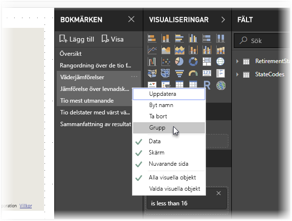

**Power BI Desktop** ger automatiskt gruppen namnet *Grupp 1*. Om du vill byta namn på gruppen dubbelklickar du bara på namnet.

När du klickar på namnet på en bokmärkesgrupp expanderas eller komprimeras bara gruppen med bokmärken, och du ser alltså inte själva bokmärkena i gruppen. 

När du använder funktionen **Visa** för bokmärken gäller följande:

* Om det valda bokmärket finns i en grupp när du väljer **Visa** från bokmärken, visas endast bokmärkena *i den gruppen* i visningssessionen. 

* Om det valda bokmärket inte finns i en grupp, eller om det finns på den högsta nivån (till exempel namnet på en bokmärkesgrupp), visas alla bokmärken för hela rapporten, inklusive alla bokmärken i alla grupper. 

Om du vill dela upp en bokmärkesgrupp markerar du bara valfritt bokmärke i gruppen, klickar på ellipserna och väljer sedan **Dela upp grupp** på menyn som visas. 

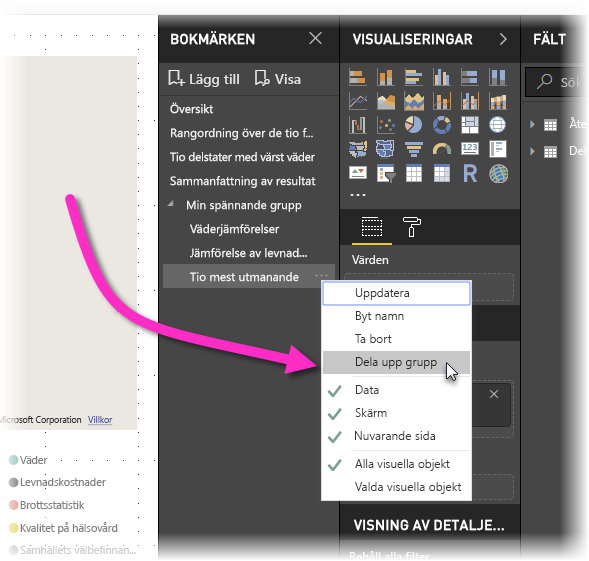

Om du väljer **Dela upp grupp** för ett bokmärke från en grupp tas alla bokmärken bort från gruppen (gruppen tas bort, men inte själva bokmärkena). Om du vill ta bort ett enskilt bokmärke från en grupp måste du därför ta bort hela gruppen först genom att välja **Dela upp grupp** för valfritt bokmärke i gruppen. Därefter markerar du de bokmärken som ska ingå i den nya gruppen (genom att hålla ned CTRL och klicka på bokmärkena) och väljer **Gruppera** igen. 

## Använda Spotlight
En annan funktion som lanseras med bokmärken är **Spotlight**. Med **Spotlight** kan du dra uppmärksamhet till ett specifikt diagram, till exempel när du presenterar dina bokmärken i **Visningsläget**.

Vi kan jämföra **Spotlight** med **fokus**läge för att se hur de skiljer sig åt.

1. I **fokus**läge kan du låta ett visuellt objekt fylla hela arbetsytan genom att välja ikonen **Fokusläge**.
2. Med hjälp av **Spotlight** kan du markera ett visuellt objekt i ursprunglig storlek genom att låta andra visuella objekt tona bort så att de nästan är osynliga. 

När det visuella objektet i föregående bild har aktiverat **fokus**ikonen ser sidan ut ungefär så här:

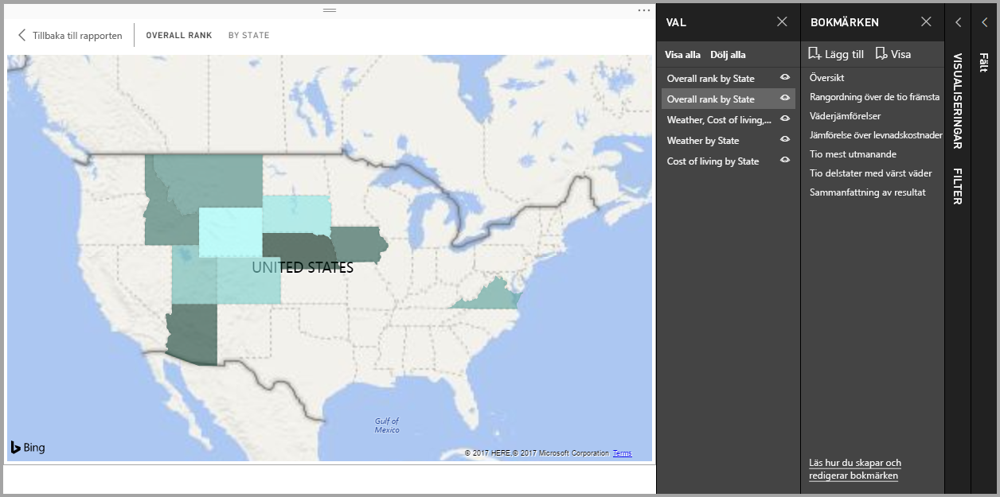

När **Spotlight** däremot väljs från ellipsmenyn för det visuella objektet ser sidan ut så här:

Om något av dessa lägen aktiveras när du har lagt till ett bokmärke blir läget (fokus eller spotlight) kvar i bokmärket.

## Bokmärken i Power BI-tjänsten
När du publicerar en rapport i **Power BI-tjänsten** med minst ett bokmärke kan du visa och interagera med dessa bokmärken i **Power BI-tjänsten**. När bokmärken är tillgängliga i en rapport kan du välja **Visa > urvalsfönster** eller **Visa > Fönstret bokmärken** för att visa var och ett av dessa fönster.

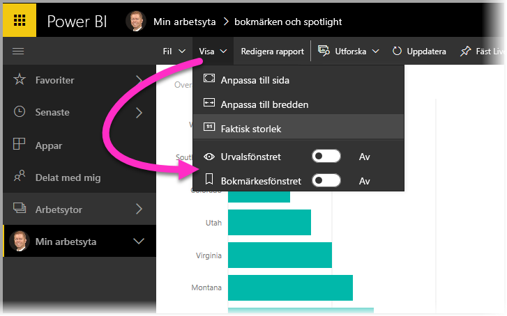

I **Power BI-tjänsten** fungerar **Fönstret bokmärken** precis som **Power BI Desktop**, inklusive möjligheten att välja **Visa** att visa dina bokmärken i ordning, precis som ett bildspel.

Observera att du måste använda den grå namnlisten för att navigera bland bokmärken snarare än de svarta pilarna (de svarta pilarna förflyttar dig genom rapportens sidor, inte bokmärken).

## Begränsningar och överväganden
Det finns några begränsningar och saker du bör tänka på för den här versionen av **bokmärken**.

* De flesta anpassade visuella objekt bör fungera väl med bokmärkning. Om du stöter på problem med bokmärkning och ett anpassat visuell objekt, kontaktar du den person som skapat det anpassade visuella objektet och ber dem att lägga till stöd för bokmärken till sina visuella objekt. 
* Om du lägger till ett visuellt objekt på en rapportsida efter att du har skapat ett bokmärke kommer det visuella objektet att visas i sitt standardläge. Det innebär att om du lägger till ett utsnitt på en sida där du tidigare skapade bokmärken så fungerar utsnittet i standardtillståndet.
* Flytta runt visuella objekt när ett bokmärke har skapats visas i bokmärket. 

## Nästa steg
Mer information om liknande funktioner eller funktioner som interagerar med bokmärken finns i följande artiklar:

* [Använd detaljinformation i Power BI Desktop](desktop-drillthrough.md)
* [Visa instrumentpanelen eller rapportvisualiseringen i läget Fokus](consumer/end-user-focus.md)

