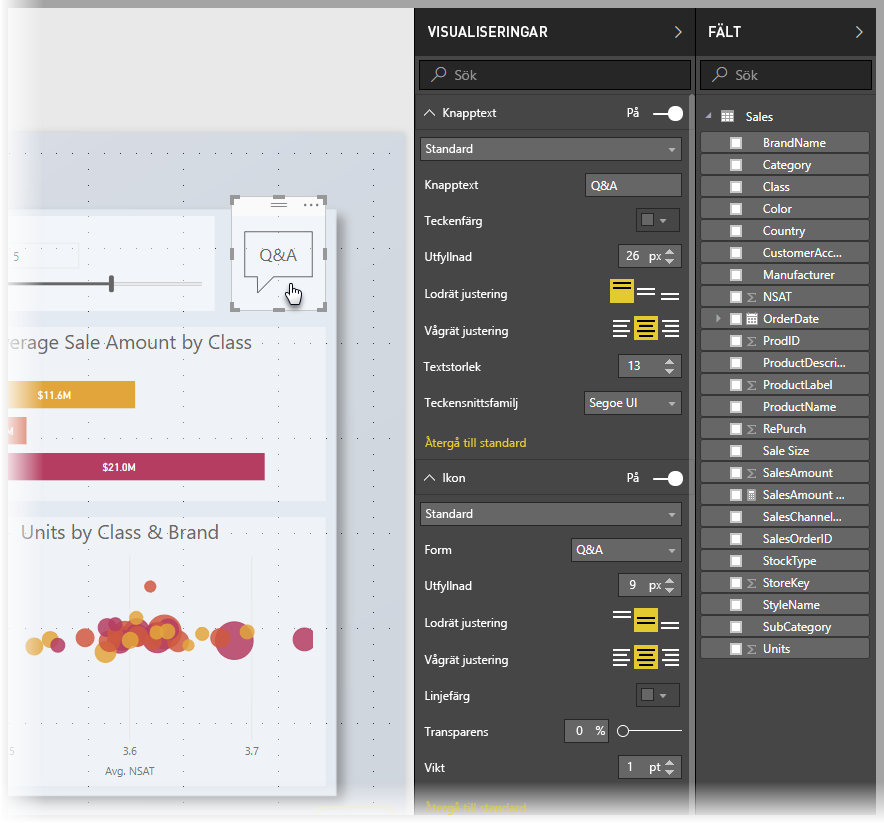
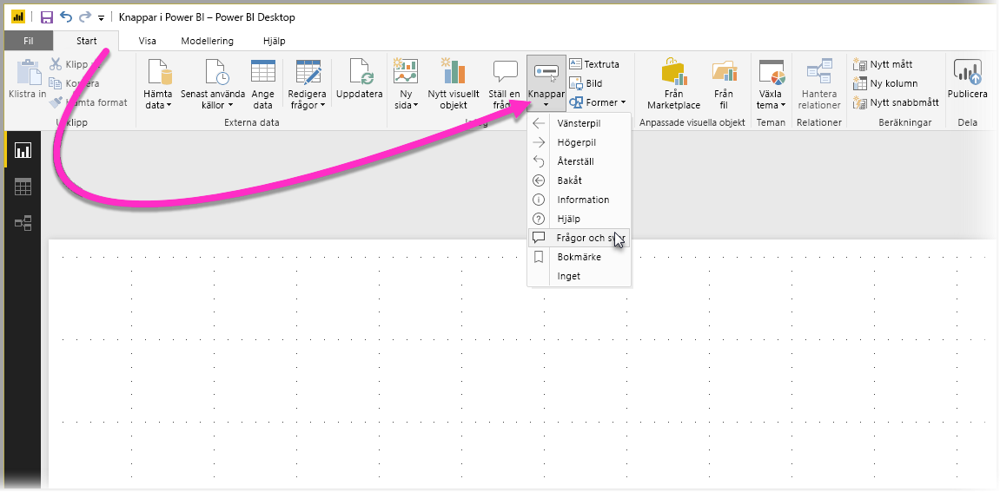
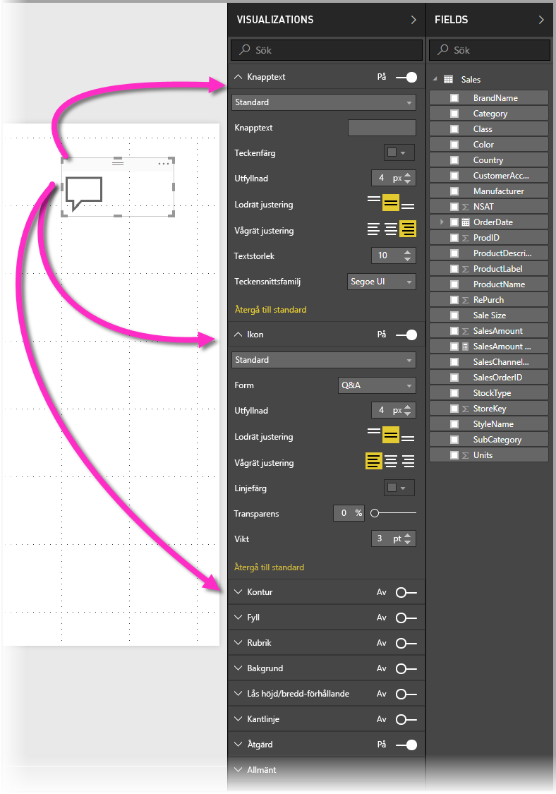
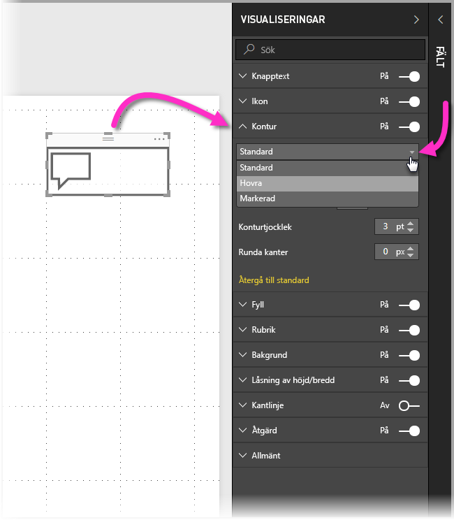
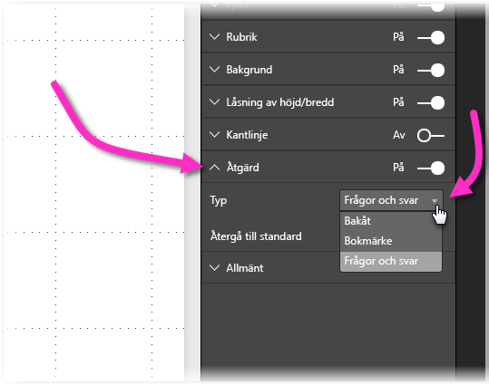

# Använda knappar i Power BI
Med hjälp av **knappar** i Power BI kan du skapa rapporter och instrumentpaneler som fungerar ungefär som appar. Därigenom skapar du en engagerande miljö så att användarna kan hovra, klicka och interagera ytterligare med Power BI-innehåll. Du kan lägga till knappar i rapporter i **Power BI Desktop**, och dela eller publicera dessa rapporter till Power BI-tjänsten för att skapa instrumentpaneler som fungerar ungefär som en app för användarna.

Knappar som du skapar i **Power BI Desktop** är tillgängliga för användning i rapporter och instrumentpaneler som publiceras i **Power BI-tjänsten**.

## Skapa knappar i rapporter
Du skapar en knapp i en **Power BI Desktop**-rapport genom att gå till fliken **Start** och välja **Knappar**. Då visas en listmeny där du kan välja en knapp från en samling med alternativ, enligt följande bild. 

När du skapar en knapp och markerar den på rapportarbetsytan visas de många sätt som du kan anpassa knappen efter dina behov i fönstret **Visualiseringar**. Du kan till exempel aktivera eller inaktivera **Knapptext** genom att växla skjutreglaget i det kortet i fönstret **Visualiseringar**. Du kan också ändra knappens ikon, knappfyllning, rubrik och vad som händer när användare klickar på knappen i en rapport eller instrumentpanel, bland andra egenskaper.

## Ange knappegenskaper vid inaktivitet, hovring eller markering

Knappar i Power BI har tre lägen: standard (hur de visas utom vid hovring eller markering), vid hovring eller vid markering (kallas ofta för *klickning*). Många av korten i fönstret **Visualiseringar** kan ändras individuellt baserat på dessa tre lägen, vilket ger stor flexibilitet för anpassning av knapparna.

På följande kort i fönstret **Visualiseringar** kan du ändra formatering eller funktion för en knapp baserat på dess tre lägen:

* Knapptext
* Ikon
* Kontur
* Fyllning

Du väljer hur knappen ska visas för respektive läge genom att expandera ett av korten och välja listrutan som visas längst upp på kortet. På följande bild är kortet **Kontur** expanderat, med listrutan vald så att de tre lägena visas:

## Välja åtgärden för en knapp

Du kan välja vilken åtgärd som ska utföras när en användare markerar en knapp i Power BI. Du hittar alternativen för knappåtgärder på kortet **Åtgärd** i fönstret **Visualiseringar**.

Alternativen för knappåtgärder är:

* Bakåt
* Bokmärke
* Frågor och svar

Om du väljer **Bakåt** kommer användaren tillbaka till föregående sida i rapporten. Det är särskilt användbart för sidor med ökad detaljnivå.

Om du väljer **Bokmärke** visas rapportsidan som är kopplad till ett bokmärke som har definierats för den aktuella rapporten. Du kan [läsa mer om bokmärken i Power BI](desktop-bookmarks.md). 

Om du väljer **Frågor och svar** i listrutan visas fönstret **Frågor och svar-utforskaren**. 

Vissa knappar har en standardåtgärd som väljs automatiskt. För knapptypen **Frågor och svar** väljs till exempel automatiskt **Frågor och svar** som standardåtgärd. Du kan läsa mer om **Frågor och svar-utforskaren** i [det här blogginlägget](https://powerbi.microsoft.com/blog/power-bi-desktop-april-2018-feature-summary/#Q&AExplorer).

Du kan prova eller testa knapparna som du skapar för rapporten genom att *CTRL+klicka* på knappen som du vill använda. 

## Nästa steg
Mer information om liknande funktioner eller funktioner som interagerar med knappar finns i följande artiklar:

* [Använd detaljinformation i Power BI Desktop](desktop-drillthrough.md)
* [Visa instrumentpanelen eller rapportvisualiseringen i läget Fokus](consumer/end-user-focus.md)
* [Använda bokmärken för att dela information och skapa artiklar i Power BI](desktop-bookmarks.md)

