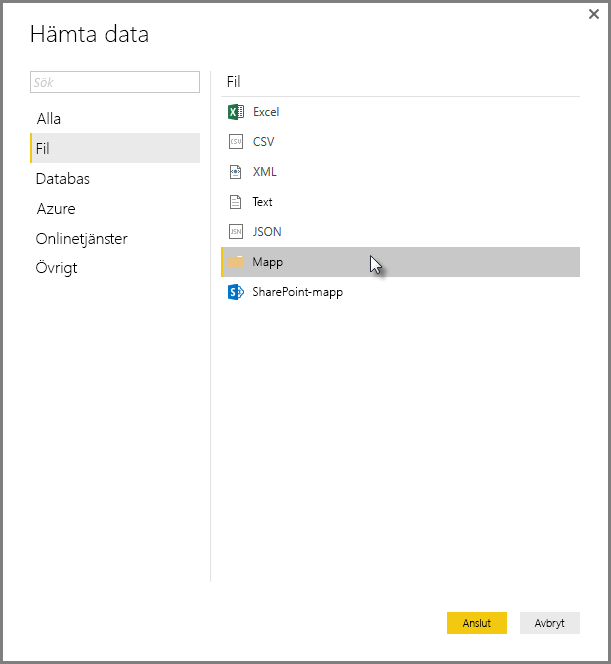
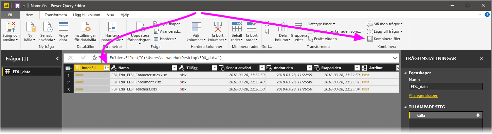
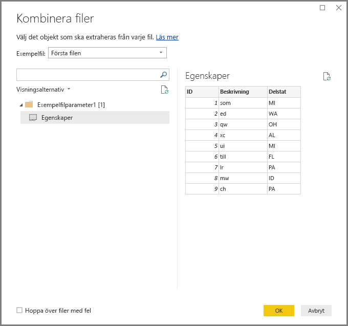
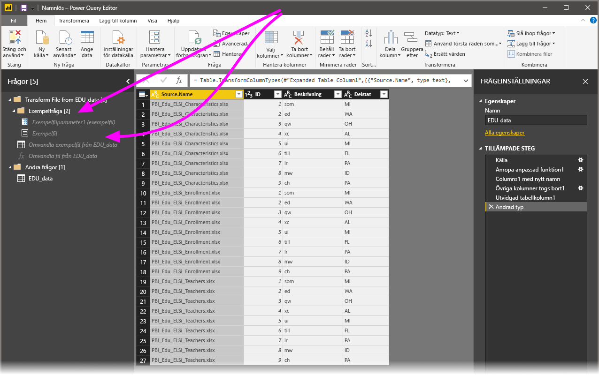

# Kombinera filer (binära) i Power BI Desktop
Ett kraftfullt sätt att importera data till **Power BI Desktop** är att kombinera flera filer som har samma schema i en logisk tabell. I och med versionen av **Power BI Desktop** från november 2016 (och senare versioner) har den här bekväma och populära metoden blivit ännu enklare och omfattande, vilket beskrivs i den här artikeln.

Om du vill börja kombinera filer från samma mapp väljer du **Hämta data > Arkiv > Mapp**.

## Beteende för tidigare kombinerade filer (binära)
I versionen **Power BI Desktop**, kallades denna funktion **Kombinera binärfiler** före November 2016 och du kunde kombinera vissa filtyper med omvandlingen **kombinera binärfiler**, men det fanns vissa begränsningar:

* Transformationer beaktades inte för varje enskild fil innan de komprimerades i en tabell. Av den anledningen var du ofta tvungen att kombinera filer och därefter filtrera ut *rubrikvärden* genom att filtrera rader som del av redigeringsprocessen.
* Transformationen **Kombinera binärfiler** fungerade endast för *text-* eller *CSV*-filer och fungerade inte på andra filformat som stöds, till exempel Excel-arbetsböcker och JSON-filer.

Kunderna har begärt en mer intuitiv användning av åtgärden **Kombinera binärfiler**, så vi har förbättrat transformationen och döpt om **kombinera filer**.

## Det aktuella beteendet för kombinera filer
**Power BI Desktop** hanterar nu **Kombinera filer (binära)** mer effektivt. Du startar genom att välja **Kombinera filer**, antingen från **Start**-menyfliken i **frågeredigeraren**, eller från själva kolumnen.

Transformeringen **kombinera filer** fungerar nu på följande sätt:

* Transformeringen **kombinera filer** analyserar varje indatafil och avgör rätt filformat att använda, till exempel *text*, *Excel-arbetsbok* eller *JSON*-fil.
* Med transformeringen kan du välja ett specifikt objekt att extrahera från den första filen, till exempel en *Excel-arbetsbok*.
  
  
* **Kombinera filer** utför automatiskt följande frågor:
  
  * Den skapar en exempelfråga som utför alla nödvändiga uppackningssteg i en enda fil.
  * Den skapar en *funktionsfråga* som organiserar parametrar i filen/binära indata i *exempelfrågan*. Exempelfrågan och funktionsfrågan är kopplade, vilket innebär att ändringar i exempelfrågan reflekteras i funktionsfrågan.
  * Den tillämpar *funktionsfrågan* på den ursprungliga frågan med binärfilerna för indata (till exempel *mappen* fråga). Funktionsfrågan tillämpas för binära inmatningar på varje rad och expanderar resulterande dataextrahering som toppkolumner.
    
    

Med det nya beteendet för **kombinera filer** kan du enkelt kombinera alla filer i en angiven mapp så länge de har samma filtyp och struktur (t.ex. samma kolumner).

Dessutom kan du lätt kan använda ytterligare omvandlings- eller extraheringssteg genom att ändra den automatiskt skapade *exempelfrågan*, utan att behöva bekymra dig om att ändra eller skapa ytterligare steg i *funktionsfrågan*. Ändringar i *exempelfrågan* skapas automatiskt i den länkade *funktionsfrågan*.

## Nästa steg
Det finns alla möjliga sorters data du kan ansluta till med Power BI Desktop. Kolla in följande resurser för mer information om datakällor:

* [Vad är Power BI Desktop?](desktop-what-is-desktop.md)
* [Datakällor i Power BI Desktop](desktop-data-sources.md)
* [Forma och kombinera data i Power BI Desktop](desktop-shape-and-combine-data.md)
* [Anslut till CSV-filer i Power BI Desktop](desktop-connect-csv.md)   
* [Ange data direkt i Power BI Desktop](desktop-enter-data-directly-into-desktop.md)   

