# Vanliga frågeuppgifter i Power BI Desktop
När du arbetar i fönstret **Frågeredigeraren** i Power BI Desktop finns det några återkommande uppgifter. I det här dokumentet får du exempel på dessa återkommande uppgifter och länkar med ytterligare information. 

De återkommande frågeuppgifter beskrivs här är följande:

* Ansluta till data
* Forma och kombinera data
* Gruppera rader
* Pivotera kolumner
* Skapa anpassade kolumner
* Fråga formler

Vi kommer att använda några dataanslutningar för att utföra dessa uppgifter. Du kan hämta eller ansluta till dessa data, ifall du vill gå igenom dessa uppgifter på egen hand.

Den första anslutningen är en Excel-arbetsbok. Den andra är en webbresurs (som också används i annat Power BI Desktop-hjälpinnehåll), och som du hittar här:

[*http://www.bankrate.com/finance/retirement/best-places-retire-how-state-ranks.aspx*](http://www.bankrate.com/finance/retirement/best-places-retire-how-state-ranks.aspx)

De steg du måste följa för att ansluta till båda dessa datakällor inleder själva frågeuppgiftsarbetet.

## Ansluta till data
Anslut till data i Power BI Desktop genom att klicka på knappen **Hämta data** på fliken **Start** i menyfliksområdet. Power BI Desktop visar en meny med de vanligaste datakällorna. Om du vill ha en fullständig lista över datakällor till vilka Power BI Desktop kan ansluta, så klicka på knappen **Mer...**  längst ned på menyn. Mer information finns i [Datakällor i Power BI Desktop](https://docs.microsoft.com/en-us/power-bi/desktop-data-sources).

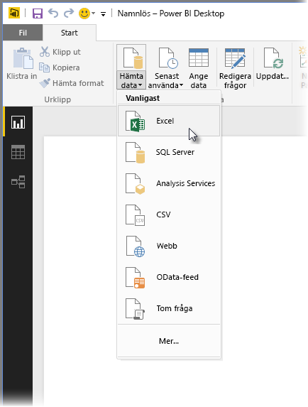

Välj **Excel**, navigera till arbetsboken och välj den. Frågan söker igenom arbetsboken och presenterar sedan de data den hittat i innehåller och visar data hittades i fönstret **Navigatör**.

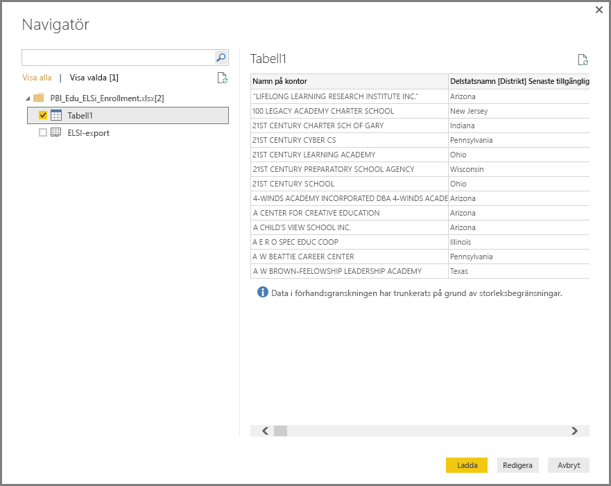

Du kan justera data genom att välja **Redigera** eller forma dem genom att välja *Form* innan du läser in dem i Power BI Desktop. Att redigera en fråga innan du läser in data är särskilt användbart när du arbetar med stora datamängder som du vill skära ned innan du läser in dem. Vi vill göra det, så vi väljer **Redigera**.

Att ansluta till olika typer av data är enkelt. Vi vill också ansluta till en webbresurs. Välj **Hämta data \> Mer...**  och välj sedan **Annan \> Webb**.

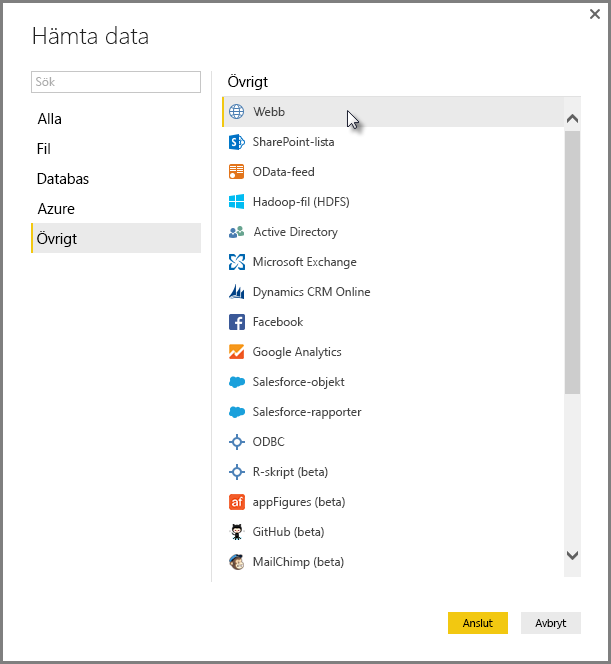

Fönstret **Från webben** visas. Där kan du ange webbsidans URL.

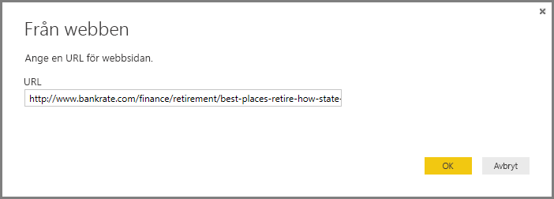

Välj **OK**, och liksom tidigare granskar Power BI Desktop arbetsboken innehåller och presenterar de data den hittat i fönstret **Navigatör**.

Andra dataanslutningar är av liknande slag. Om autentisering krävs för att göra en dataanslutning så uppmanas du av Power BI Desktop att ange autentiseringsuppgifterna.

En stegvis demonstration av hur man ansluter till data i Power BI Desktop finns i [Anslut till Data i Power BI Desktop](https://docs.microsoft.com/en-us/power-bi/desktop-connect-to-data).

## Forma och kombinera data
Du kan enkelt forma och kombinera data med Frågeredigeraren. Det här avsnittet innehåller några exempel på hur du kan forma data. En mer fullständig demonstration av hur du kan forma och kombinera data finns i **[Forma och kombinera Data med Power BI Desktop](https://docs.microsoft.com/en-us/power-bi/desktop-shape-and-combine-data)**.

I det förra avsnittet anslöt vi till två datauppsättningar – en Excel-arbetsbok och en webbresurs. Efter inläsningen i Frågeredigeraren visas följande, med frågan från den valda webbsidan (tagen från de tillgängliga frågor som visas i rutan **Frågor** längst till vänster i Frågeredigerarens fönster).

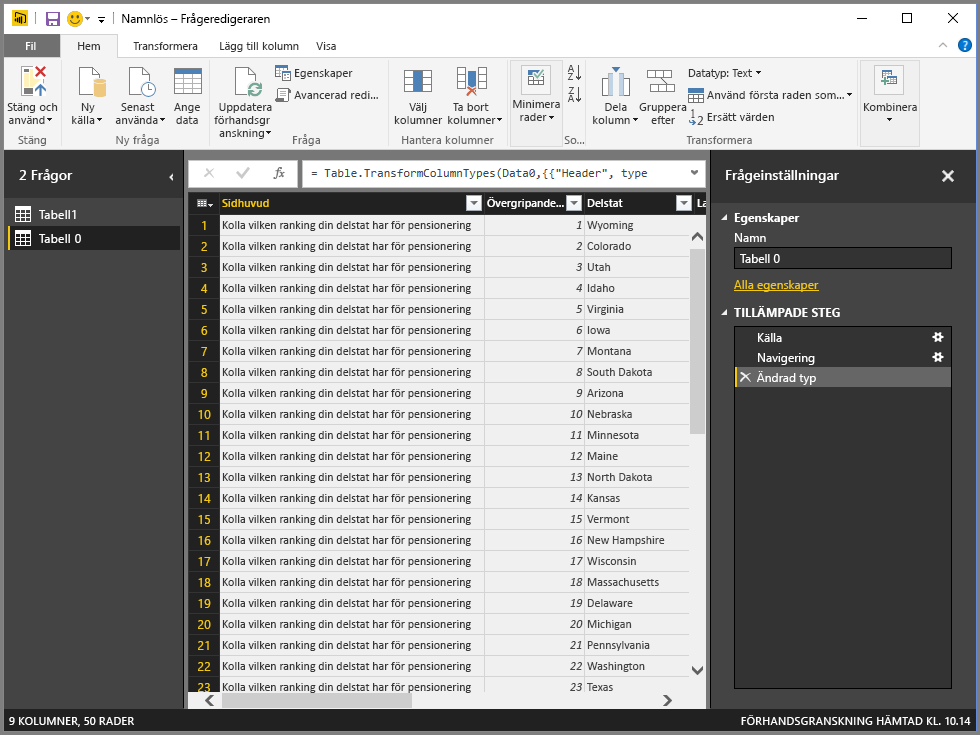

När du formar data omvandlar du en datakälla till ett formulär och ett format som motsvarar dina behov. I det här fallet vi behöver inte den första kolumnen med namnet *Rubrik*, så tar vi bort den.

I **Frågeredigeraren** hittar du många kommandon i menyfliksområdet och i en sammanhangsberoende snabbmeny. Om du t.ex. högerklickar på kolumnen *Rubrik* kan du ta bort kolumnen från den meny som visas. Du kan också markera kolumnen och sedan klicka på knappen **Ta bort kolumner** i menyfliksområdet.

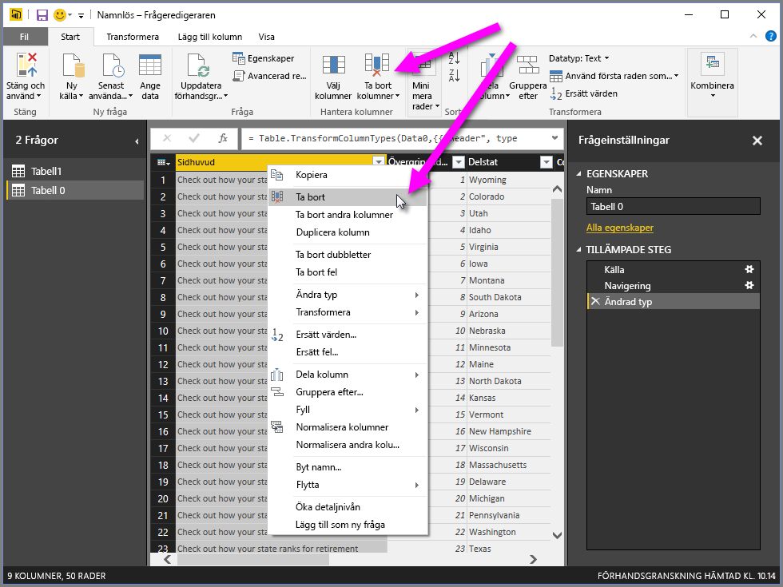

Det finns många andra sätt på vilka du kan forma data i den här frågan. Du kan ta bort ett valfritt antal rader uppifrån eller nedifrån. Du kan lägga till kolumner, dela kolumner, ersätta värden och utföra andra formeringsuppgifter som anger för Frågeredigeraren hur data ska hämtas och presenteras.

## Gruppera rader
I Frågeredigeraren du kan gruppera värdena i flera rader till ett enskilt värde. Detta kan vara användbart när du ska sammanfatta antalet erbjudna produkter, total försäljning eller antalet studenter.

I det här exemplet grupperar vi raderna i en datauppsättning för utbildningsregistrering. Data har hämtats från en Excel-arbetsbok och utformats i Frågeredigeraren, så att bara de kolumner vi behöver hämtas, tabellen ges ett nytt namn och ytterligare några transformeringar görs.

Låt oss ta reda på hur många myndigheter (detta omfattar skoldistrikt och andra utbildningsmyndigheter) varje distrikt har. Vi väljer kolumnen *State Abbr* och väljer sedan knappen **Gruppera efter** på fliken **Transformera** eller fliken **Start** på menyfliksområdet (**Gruppera efter** finns på båda flikarna).

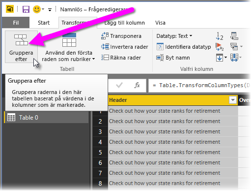

Fönstret **Gruppera efter…** visas. När Frågeredigeraren grupperar rader, skapas en ny kolumn som placeras i **Gruppera efter**-resultatet. Du kan justera åtgärden **Gruppera efter** på följande sätt:

1. *Gruppera efter* – detta är den kolumn som ska grupperas. Frågeredigeraren väljer den markerade kolumnen, men du kan ändra valet i det här fönstret till vilken som helst av kolumnerna i tabellen.
2. *Nytt kolumnnamn* – Frågeredigeraren föreslår ett namn på den nya kolumnen baserat på den åtgärd som tillämpas på den grupperade kolumnen, men du kan kalla den nya kolumnen vad du vill.
3. *Åtgärd* – här du anger den åtgärd som Frågeredigeraren tillämpar.
4. *Lägg till grupp* och *Lägg till sammansättningen* – dessa alternativ visas när du har valt alternativet **Avancerat**. Du kan utföra grupperingsåtgärder (**Gruppera efter**) på flera kolumner och utföra flera aggregeringar – allt i samma **Gruppera efter**-fönster och i samma åtgärd. Frågeredigeraren skapar en ny kolumn (baserat på dina val i det här fönstret) som fungerar på flera kolumner. 

Välj knappen **Lägg till grupp** eller **Lägg till sammansättning** för att lägga till flera grupperingar eller sammansättningar till en **Gruppera efter**-funktion. Du kan ta bort en gruppering eller sammansättning genom att välja ikonen **...** och välja **Ta bort**. Testa själv och se hur det fungerar.
   
   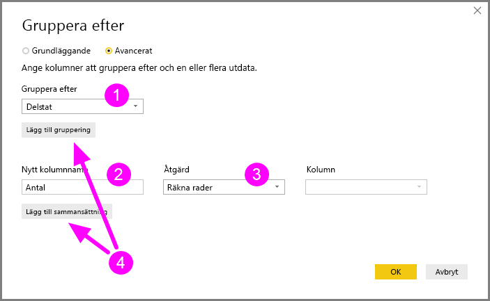

När vi väljer **OK** utför frågan **Gruppera efter**-åtgärden och returnerar resultaten. Oj, ser man på – Ohio, Texas, Illinois och Kalifornien har nu över tusen myndigheter!

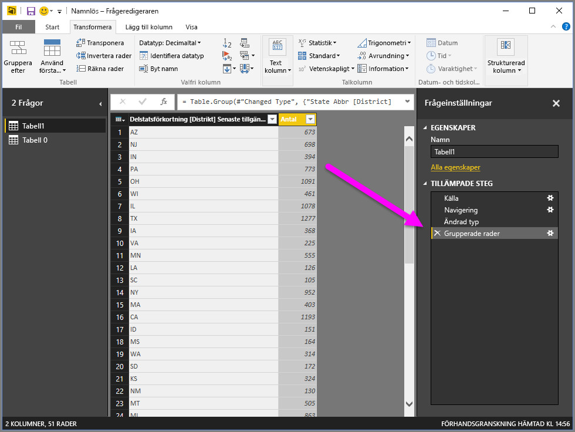

Och med Frågeredigeraren kan du alltid ta bort den senaste formeringsåtgärden genom att välja **X** intill det nyss avslutade steget. Så sätt igång och experimentera, och gör om stegen om du inte gillar resultatet, till dess att Frågeredigeraren presenterar dina data jus så som du vill ha dem.

## Pivotera kolumner
Med Power BI Desktop kan du pivotera kolumner och skapa en tabell som innehåller sammanställda värden för varje unikt värde i en kolumn. Om du t.ex. vill veta hur många olika produkter som du har i varje produktkategori, så kan du snabbt skapa en tabell som visar just detta.

Låt oss titta på ett exempel. Följande tabell **Produkter** har utformats till att bara visa varje unika produkt (efter namn) och under vilken kategori varje produkt faller. Om du vill skapa en ny tabell som visar antalet produkter för varje kategori (baserat på kolumnen *CategoryName*), så markera först kolumnen och sedan **Pivotera kolumn** på fliken **Transformera** i menyfliksområdet.

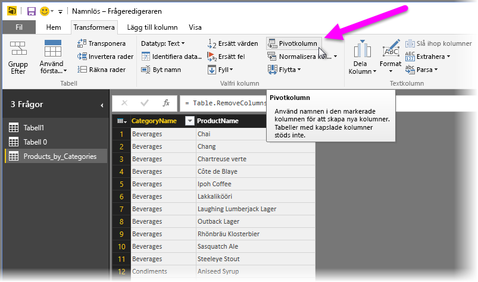

Fönstret **Pivotera kolumn** visas, så att du kan se vilka kolumnvärden som används för att skapa nya kolumner (1), och när du expanderar **Avancerade alternativ** (2), så kan du välja den funktion som ska tillämpas på de sammanställda värdena (3).

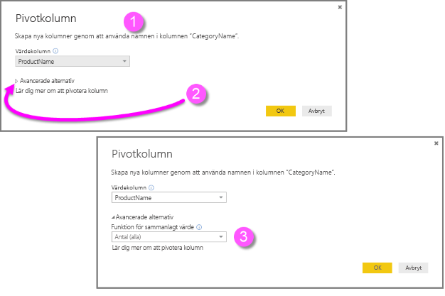

När du väljer **OK** visar frågan tabellen enligt de tillhandahållna utformningsinstruktionerna i fönstret **Pivotera kolumn**.

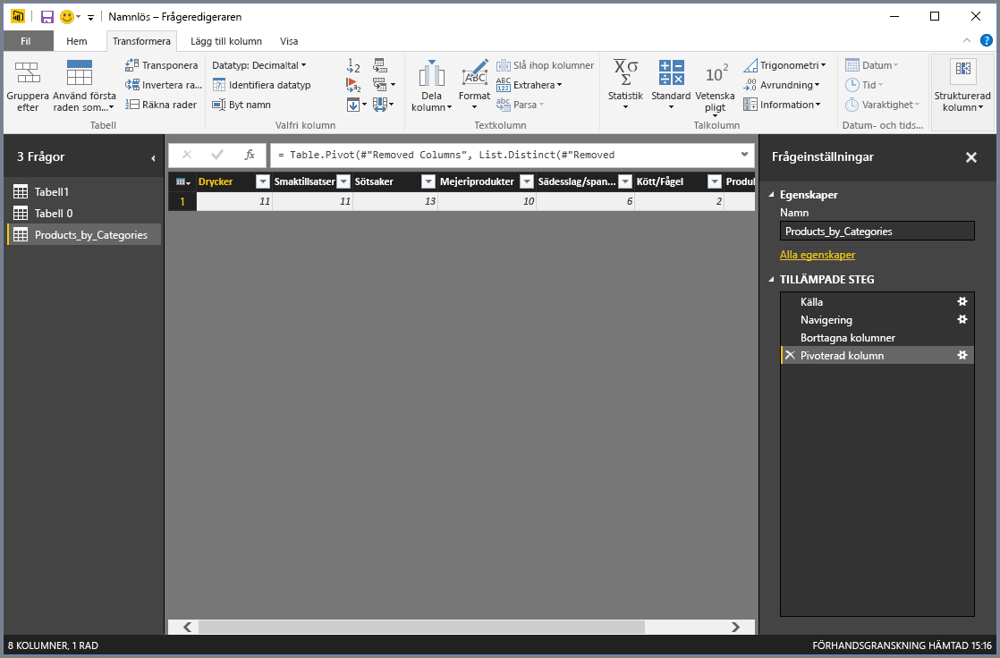

## Skapa anpassade kolumner
I Frågeredigeraren kan du skapa anpassade formler som kan användas på flera kolumner i tabellen, och sedan placera resultatet i en ny (anpassad) kolumn. Med Frågeredigeraren är det enkelt att skapa anpassade kolumner.

Välj **Anpassad kolumn** på fliken **Lägg till kolumn** i menyfliksområdet i Frågeredigeraren.

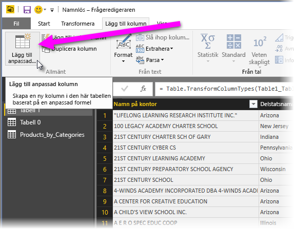

Följande fönster visas. I följande exempel skapar vi en anpassad kolumn med namnet *Percent ELL* som beräknar hur stor andel av det totala antalet studenter som är English Language Learners (ELL).

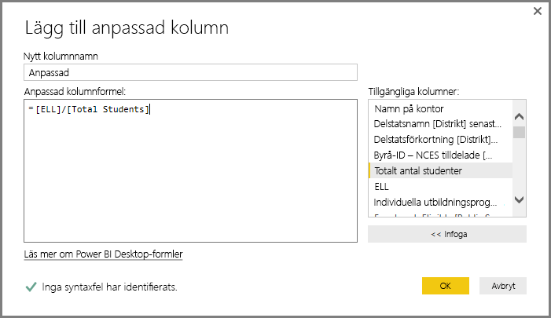

Som med andra steg i Frågeredigeraren, om den nya anpassade kolumnen inte tillhandahåller de data som du önskar, så kan du helt enkelt ta bort steget från avsnittet **Tillämpade steg** i rutan **Frågeinställningar** genom att välja **X** intill steget **Lägg till egen**.

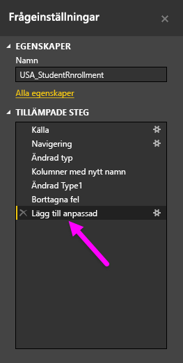

## Fråga formler
Du kan redigera de steg som Frågeredigeraren genererar och du kan skapa anpassade formler som ger dig fullständig kontroll över hur du ansluter till och utformar dina data. När Frågeredigeraren utför en åtgärd på vissa data, så visas den formel som är kopplad till åtgärden i **formelfältet**. Du visar **formelfältet** genom att markera kryssrutan intill **Formelfält** på fliken **Visa** i menyfliksområdet.

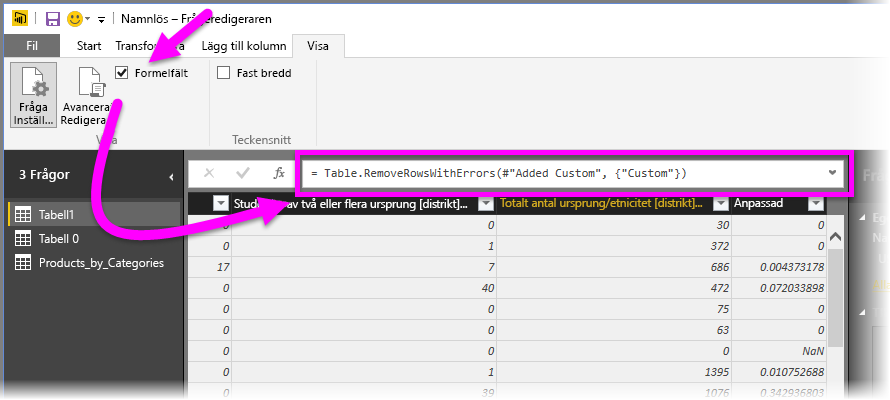

Frågeredigeraren innehåller alla tillämpade steg för respektive fråga som text, vilken du kan visa och redigera. Du kan visa eller ändra en frågas text med hjälp av den **avancerade redigeraren**, som visas när du väljer **Avancerad redigerare** på fliken **Visa** i menyfliksområdet.

Låt oss ta en titt på den **avancerade redigeraren**, med de frågesteg som är kopplade till den visade frågan **USA\_StudentEnrollment**. De här stegen skapas i Power Query-formelspråket, vilket ofta kallas **M**. Mer information finns i [Lär dig mer om Power Query-formler](https://support.office.com/article/Learn-about-Power-Query-formulas-6bc50988-022b-4799-a709-f8aafdee2b2f?ui=en-US&rs=en-US&ad=US). Om du vill visa själva språkspecifikationen kan du gå till [Microsoft Power Query for Excel Formula Language Specification](http://go.microsoft.com/fwlink/?linkid=320633).

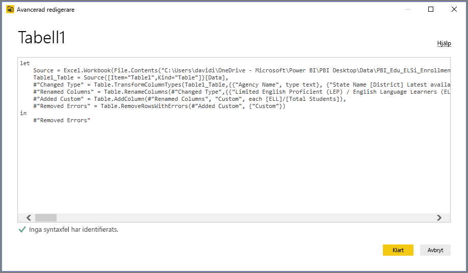

Power BI Desktop innehåller en omfattande uppsättning formelkategorier. Mer information och en fullständig referens för alla frågeredigerarformler finns i [Power Query-formelkategorier](https://support.office.com/en-in/article/Power-Query-formula-categories-125024ec-873c-47b9-bdfd-b437f8716819).

Frågeredigerarens formelkategorier är följande:

* Tal
  * Konstanter
  * Information
  * Konvertering och formatering
  * Format
  * Avrundning
  * Åtgärder
  * Slumpmässig
  * Trigonometri
  * Byte
* Text
  * Information
  * Textjämförelser
  * Extrahering
  * Ändring
  * Medlemskap
  * Omvandlingar
* Logiskt
* Datum
* Tid
* DateTime
* DateTimeZone
* Varaktighet
* Post
  * Information
  * Omvandlingar
  * Val
  * Serialisering
* Lista
  * Information
  * Val
  * Datatransformering
  * Medlemskap
  * Ange åtgärder
  * Ordning
  * Medelvärden
  * Tillägg
  * Siffror
  * Generatorer
* Tabell
  * Tabellkonstruktion
  * Konverteringar
  * Information
  * Radåtgärder
  * Kolumnåtgärder
  * Medlemskap
* Värden
* Aritmetiska åtgärder
* Parametertyper
* Metadata
* Åtkomst till data
* URI
* Binärt format
  * Läsa siffror
* Binär
* Rader
* Uttryck
* Funktion
* Fel
* Jämförelsefunktion
* Delare
* Kombinerare
* Ersättare
* Typ

## Nästa steg
Det finns olika typer av saker som du kan göra med Power BI Desktop. Läs följande resurser för mer information om dess möjligheter:

* [Komma igång med Power BI Desktop](desktop-getting-started.md)
* [Frågeöversikt med Power BI Desktop](desktop-query-overview.md)
* [Datakällor i Power BI Desktop](desktop-data-sources.md)
* [Anslut till data i Power BI Desktop](desktop-connect-to-data.md)
* [Forma och kombinera data i Power BI Desktop](desktop-shape-and-combine-data.md)

