# Villkorsstyrd formatering i tabeller 
Med villkorsstyrd formatering för tabeller kan du ange anpassade cellfärger baserat på cellvärden, eller baserat på andra värden eller fält. Du kan även använda toningar. Du kan också visa cellvärden med datastaplar. 

Åtkomst till villkorlig formatering, i brunnen **fält** i fönstret **Visuella objekt** i Power BI Desktop väljer du nedpilen bredvid värdet i brunnen **Värden** som du vill formatera (eller högerklicka på fältet). Du kan endast hantera villkorsstyrd formatering för fälten i området **Värden** i brunnen **Fält**.

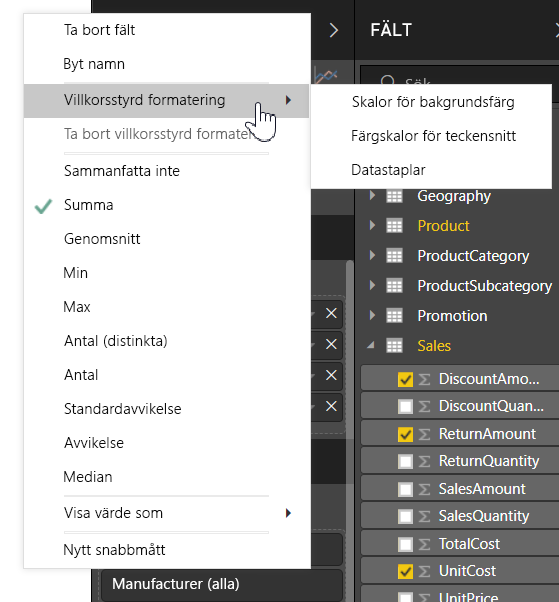

I följande avsnitt beskrivs vart och ett av dessa alternativ för villkorsstyrd formatering. Ett eller flera alternativ kan kombineras i samma tabellkolumn.

> [!NOTE]
> När villkorsstyrd formatering tillämpas i en tabell åsidosätts eventuella anpassade tabellformat som tillämpats på de villkorligt formaterade cellerna.

Om du vill ta bort villkorlig formatering från en visualisering högerklickar du bara på fältet igen, väljer **Ta bort villkorsstyrd formatering** och väljer sedan den typ av formatering som du vill ta bort.

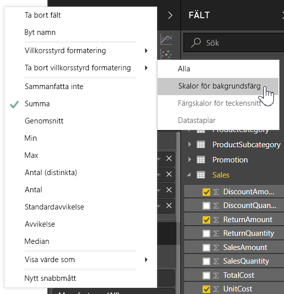

## Skalor för bakgrundsfärg

Om du väljer **Villkorsstyrd formatering** och sedan **Skalor för bakgrundsfärg** visas följande dialogruta.

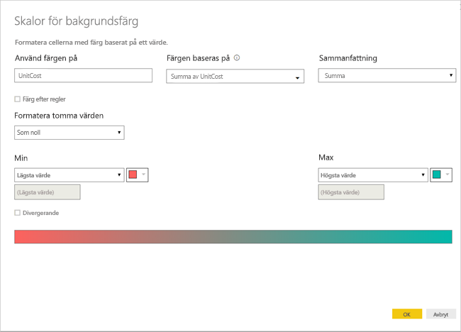

Du kan välja ett fält från datamodellen som färgerna ska baseras på genom att ange **Färgen baseras på** till det fältet. Du kan också ange aggregeringstypen för det valda fältet med värdet **Sammanfattning**. Fältet som färgerna tillämpas på anges i fältet **Använd färgen på**, så att du enkelt kan se vilket fält inställningarna tillämpas på. Du kan använda villkorsstyrd formatering för text- och datumfält, förutsatt att du väljer ett numeriskt värde som bas för formateringen.

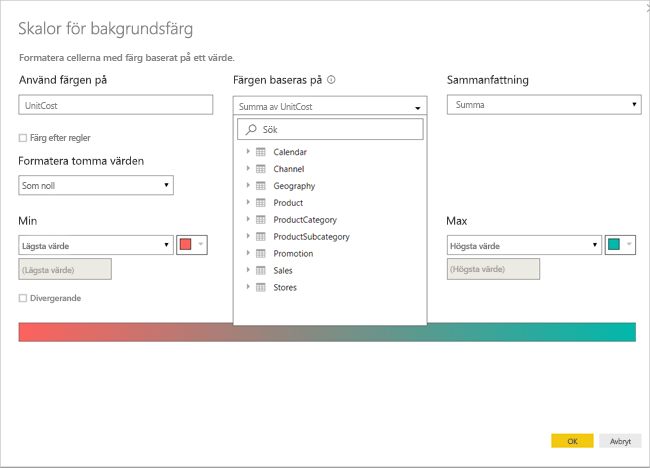

Om du vill använda diskreta färgvärden för specifika värdeintervall väljer du **Färg efter regler**. Om du vill använda ett färgspektrum lämnar du alternativet **Färg efter regler** avmarkerat. 

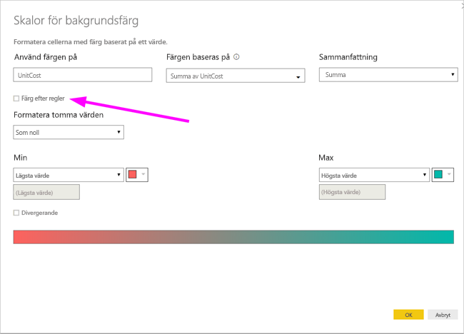

### Färg efter regler

När du väljer **Färg efter regler** kan du ange ett eller flera värdeintervall, vart och ett med en bestämd färg.  Varje värdeintervall börjar med ett *Om*-värdevillkor, ett *Och*-värdevillkor och en färg.

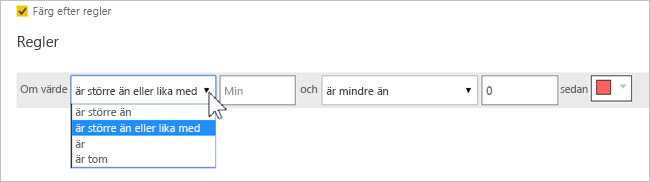

Tabellceller med värden i varje intervall fylls med den angivna färgen. Det finns tre regler i följande bild.

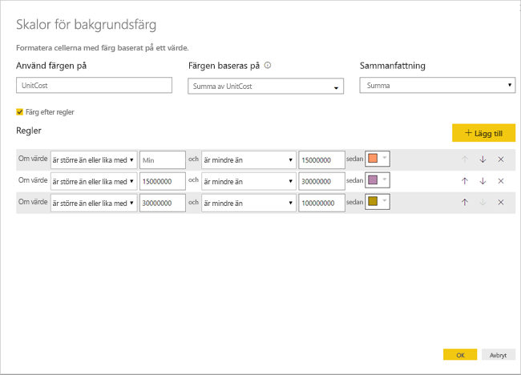

Nu ser exempeltabellen ut så här:

### Minsta och största värden för färg

Du kan konfigurera de *minsta* och *största* värdena och deras färger. Om du väljer rutan **Avvikande** kan du konfigurera ett valfritt *Centrumvärde*.

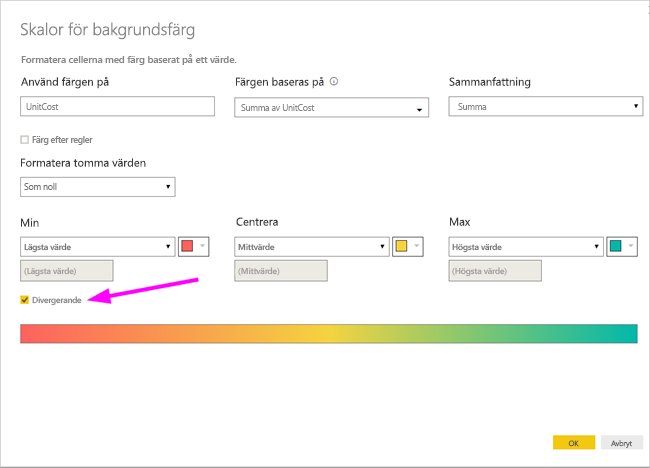

Nu ser exempeltabellen ut så här:

## Färgskalor för teckensnitt

Om du väljer **Villkorsstyrd formatering** och sedan **Färgskalor för teckensnitt** visas följande dialogruta. Den här dialogrutan liknar dialogrutan **Skalor för bakgrundsfärg**, men ändrar teckensnittsfärgen i stället för cellernas bakgrundsfärg.

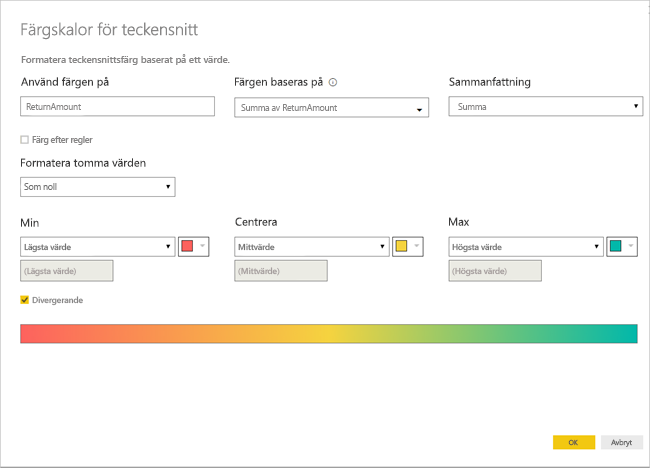

Nu ser exempeltabellen ut så här:

## Datastaplar

Om du väljer **Villkorsstyrd formatering** och sedan **Datastaplar** visas följande dialogruta. 

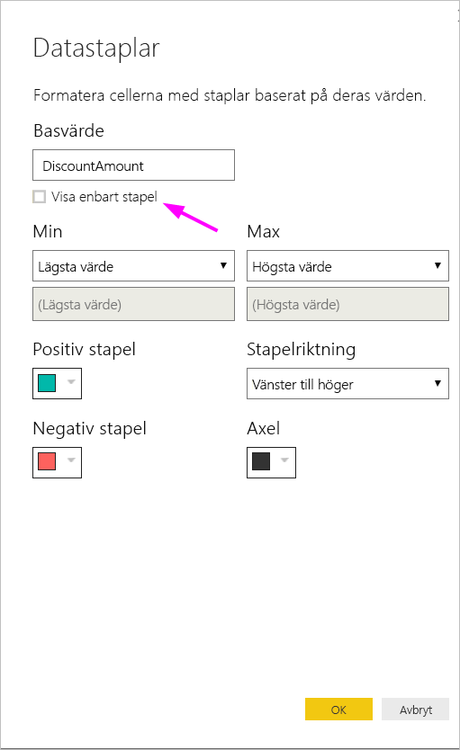

Alternativet **Visa enbart stapel** är avmarkerat som standard, vilket innebär att tabellcellen visar både stapeln och själva värdet.

Om alternativet **Visa enbart stapel** är markerat, så visar tabellcellen endast stapeln.

## Färgformatering efter fältvärde

Du kan använda ett mått eller en kolumn som definierar en viss färg, antingen med hjälp av ett textvärde eller en hexadecimal kod, och tillämpa den färgen på bakgrunden eller teckenfärgen i en tabell- eller matrisvisualisering. Du kan också skapa anpassad logik för ett visst fält och använda den för att tillämpa en specifik färg på texten eller bakgrunden.

I följande tabell associeras exempelvis en färg med varje produktmodell. 

Om du vill formatera cellen baserat på dess fältvärde öppnar du dialogrutan **Villkorsstyrd formatering** genom att högerklicka på kolumnen *Färg* för det visuella objektet, och väljer sedan i detta fall **Bakgrundsfärg** på menyn. 

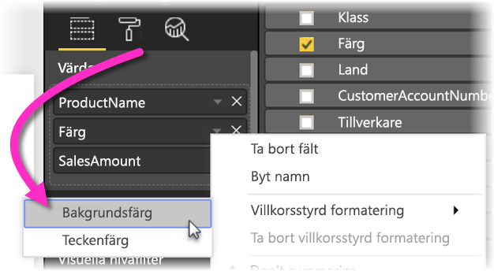

I dialogrutan som visas väljer du **Fältvärde** i området med listrutan **Formatera efter**, som du ser i följande bild.

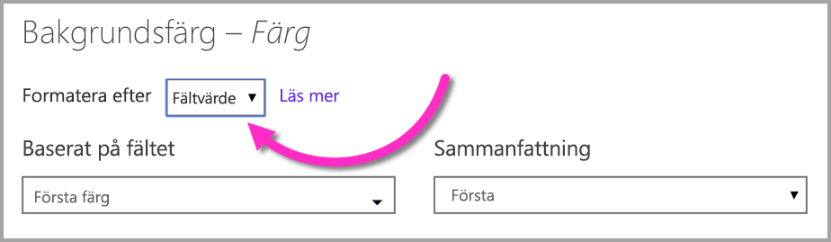

Du kan upprepa processen för teckenfärgen, så att en färg i **färgkolumnen** tillämpas på resultatet i det visuella objektet, som du ser i följande skärmbild.

Du kan också skapa en DAX-beräkning baserat på affärslogik som visar olika hexadecimala koder baserat på önskade villkor. Detta är vanligtvis enklare än att skapa flera regler i dialogrutan för villkorsstyrd formatering. Titta på fältet *ColorKPI* i följande exempelbild.

Du kan sedan ange fältvärdet för **Bakgrundsfärg** på följande sätt.

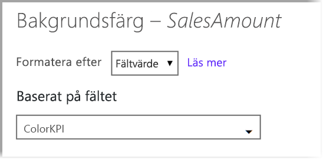

På så vis kan du sedan få resultat som liknar de i följande matris.

Du kan skapa många fler varianter genom att bara använda din fantasi och DAX.

Du kan använda vilka som helst av de värden som anges i CSS-färgspecifikationen på [https://www.w3.org/TR/css-color-3/](https://www.w3.org/TR/css-color-3/) för att färglägga visuella objekt:
* Hexadecimala koder med 3, 6 eller 8 siffror, till exempel #3E4AFF. #-symbolen ska finnas med i början av koden. "3E4AFF" fungerar inte. 
* RGB- eller RGBA-värden, till exempel RGBA(234, 234, 234, 0.5)
* HSL- eller HSLA-värden, till exempel HSLA(123, 75%, 75%, 0.5)
* Färgnamn, till exempel Green, SkyBlue eller PeachPuff 

## Överväganden och begränsningar
Det finns några saker att tänka på när du arbetar med villkorsstyrd tabellformatering:

* Villkorsstyrd formatering tillämpas endast på värdena för ett visuellt **matrisobjekt** och tillämpas inte på delsummor eller totalsummor. 
* Villkorsstyrd formatering tillämpas inte på raden **Summa**
* Tabeller som saknar gruppering visas som en enda rad som inte stöder villkorsstyrd formatering.
* Om du använder toningsformat med automatiska max/min-värden eller regelbaserad formatering med procentregler, kan inte villkorsstyrd formatering tillämpas om dina data innehåller NaN-värden. NaN står för ”Inte ett nummer” och orsakas vanligtvis av fel vid en division med noll. Du kan använda [DAX-funktionen DIVIDE()](https://docs.microsoft.com/dax/divide-function-dax) för att undvika dessa fel.

## Nästa steg
Mer information finns i följande artikel:  

* [Tips för färgformatering i Power BI](visuals/service-tips-and-tricks-for-color-formatting.md)  

