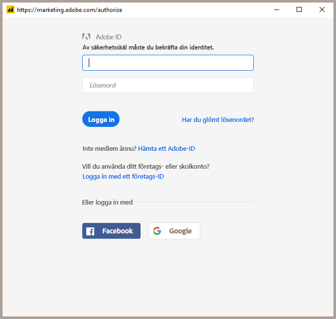

# Ansluta till Adobe Analytics i Power BI Desktop (förhandsversion)
I **Power BI Desktop** kan du ansluta till **Adobe Analytics** och använda underliggande data precis som andra datakällor i Power BI Desktop. 

## Aktivera förhandsversionen av Adobe Analytics-anslutningsappen 
Eftersom **Adobe Analytics**-anslutningsappen för närvarande finns som förhandsversion måste du aktivera förhandsversionsfunktionen för att anslutningsappen ska vara tillgänglig i fönstret **Hämta data**. Aktivera förhandsversionen av anslutningsappen genom att välja **Arkiv > Alternativ och inställningar > Alternativ > Förhandsversionsfunktioner** i Power BI Desktop och markera kryssrutan bredvid **Bokmärken**. 

Du måste starta om **Power BI Desktop** när du har gjort valet för att aktivera förhandsversionen av Adobe Analytics-anslutningsappen.

## Ansluta till Adobe Analytics-data
Om du vill ansluta till **Adobe Analytics**-data väljer du **Hämta data** på menyfliken **Start** i Power BI Desktop. Välj **Onlinetjänster** bland kategorierna till vänster för att visa **Adobe Analytics-anslutningsapp**.

I **Adobe Analytics**-fönstret som visas väljer du knappen **Logga in** och anger dina autentiseringsuppgifter för att logga in på ditt Adobe Analytics-konto. Adobe-inloggningsfönstret visas, enligt följande bild.

När du uppmanas, ange ditt användarnamn och lösenord. När anslutningen har upprättats kan du förhandsgranska och välja flera dimensioner och mått i dialogrutan **Navigatör** i Power BI för att skapa enskilda tabellutdata. Du kan också ange nödvändiga indataparametrar som krävs för de valda objekten. 

Du kan **Hämta** den markerade tabellen, vilket öppnar hela tabellen i **Power BI Desktop**, eller så kan du **Redigera** frågan, vilket öppnar **frågeredigeraren** så att du kan filtrera och begränsa uppsättningen av data som du vill använda och läsa in en förfinad datauppsättning till **Power BI Desktop**.

## Nästa steg
Det finns alla möjliga sorters data du kan ansluta till med Power BI Desktop. Kolla in följande resurser för mer information om datakällor:

* [Komma igång med Power BI Desktop](desktop-getting-started.md)
* [Datakällor i Power BI Desktop](desktop-data-sources.md)
* [Forma och kombinera data i Power BI Desktop](desktop-shape-and-combine-data.md)
* [Anslut till Excel-arbetsböcker i Power BI Desktop](desktop-connect-excel.md)   
* [Ange data direkt i Power BI Desktop](desktop-enter-data-directly-into-desktop.md)   

