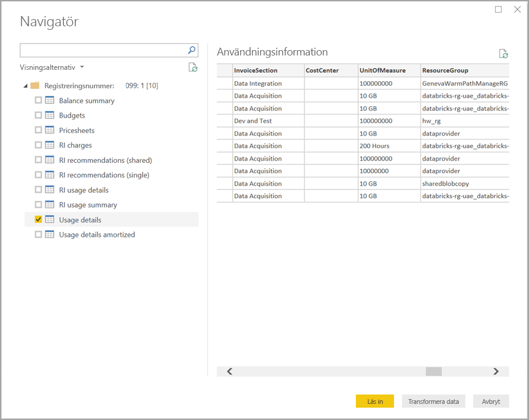

# Skapa visuella objekt och rapporter med anslutningsprogrammet för Azure Cost Management i Power BI Desktop

Du kan använda Azure Cost Management-anslutningsprogrammet för Power BI Desktop till att göra kraftfulla, anpassade visualiseringar och rapporter som hjälper dig att förstå dina Azure-utgifter bättre. Azure Cost Management-anslutningsprogrammet stöder för närvarande kunder med ett [Microsoft-kundavtal](https://azure.microsoft.com/pricing/purchase-options/microsoft-customer-agreement/) eller ett [Enterprise-avtal](https://azure.microsoft.com/pricing/enterprise-agreement/).  

Anslutningsprogrammet för Azure Cost Management använder OAuth 2.0 för autentisering med Azure och identifierar de användare som ska använda anslutningsprogrammet. De token som genereras i den här processen är giltiga under en viss period. Power BI bevarar token till nästa inloggning. OAuth 2.0 är en standard för processen som körs i bakgrunden och ser till att dessa behörigheter hanteras säkert. För att ansluta måste du använda ditt konto som [företagsadministratör](https://docs.microsoft.com/azure/billing/billing-understand-ea-roles) för Enterprise-avtal, eller vara [faktureringskontoinnehavare](https://docs.microsoft.com/azure/billing/billing-understand-mca-roles) för Microsofts kundavtal. 

> [!NOTE]
> Det här anslutningsprogrammet ersätter de tidigare anslutningsprogrammen [Azure Consumption Insights och Azure Cost Management (beta)](desktop-connect-azure-consumption-insights.md). Alla rapporter som har skapats med det tidigare anslutningsprogrammet måste återskapas med hjälp av det här anslutningsprogrammet.

## Ansluta med Azure Cost Management

Använd **Azure Cost Management-anslutningsprogrammet** i Power BI Desktop enligt följande:

1.  I menyfliken **Start** väljer du **Hämta data**.
2.  Välj **Azure** i listan med datakategorier.
3.  Välj **Azure Cost Management**.

    

4. I dialogrutan som visas anger du antingen ditt **faktureringsprofils-ID** för **Microsoft-kundavtal**, eller ditt **registreringsnummer** för **Enterprise-avtal (EA)** . 

## Ansluta till ett konto för Microsoft-kundavtal 

Om du vill ansluta till ett konto för **Microsoft-kundavtal** hämtar du ditt **faktureringsprofils-ID** från Azure-portalen:

1.  I **Azure-portalen** går du till [Cost Management och fakturering](https://portal.azure.com/).
2.  Välj din faktureringsprofil. 
3.  Under **Inställningar** i menyn väljer du **Egenskaper** i sidopanelen.
4.  Under **Faktureringsprofil** kopierar du **ID:t**. 
5.  I **Välj omfång** väljer du **Faktureringsprofils-ID** och klistrar in ID:t för faktureringsprofilen från föregående steg. 
6.  Ange antal månader och välj **OK**.

    

7.  När du uppmanas till det loggar du in med ditt användarkonto och lösenord för Azure. 

## Ansluta till ett Enterprise-avtalskonto

Om du vill ansluta med ett konto för Enterprise-avtalet (EA) kan du hämta ditt registrerings-ID från Azure-portalen:

1.  I **Azure-portalen** går du till [Cost Management och fakturering](https://portal.azure.com/).
2.  Välj ditt faktureringskonto.
3.  I menyn **Översikt** kopierar du **faktureringskontots ID**.
4.  I **Välj omfång** väljer du **Registreringsnummer** och klistrar in faktureringskontots ID från föregående steg. 
5.  Ange antal månader och välj sedan **OK**.

    

6.  När du uppmanas till det loggar du in med ditt användarkonto och lösenord för Azure. 

## Data som är tillgängliga via anslutningsprogrammet

När du har autentiserats visas fönstret **Navigatör** med följande tillgängliga datatabeller:

| **Tabell** | **Beskrivning** |
| --- | --- |
| **Saldosammanfattning** | Sammanfattning av saldot för Enterprise-avtal (EA). |
| **Faktureringshändelser** | Händelselogg med nya fakturor, kreditinköp etc. Endast Microsofts kundavtal. |
| **Budgetar** | Budgetinformation för att visa faktiska kostnader eller användning mot befintliga budgetmål. |
| **Avgifter** | En månatlig sammanfattning av Azure-användningen, Marketplace-kostnader samt avgifter som faktureras separat. Endast Microsofts kundavtal. |
| **Krediter** | Inköpsinformation med Azure-krediter för den angivna faktureringsprofilen. Endast Microsofts kundavtal. |
| **PriceSheets** | Tillämpliga mätarpriser för den angivna faktureringsprofilen eller EA-registreringen. |
| **RI-avgifter** | Kostnader som är kopplade till dina reserverade instanser under de senaste 24 månaderna. |
| **RI-rekommendationer (delad)** | Rekommendationer för köp av reserverade instanser baserat på dina användningstrender för alla dina prenumerationer under de senaste 7, 30 eller 60 dagarna. |
| **RI-rekommendationer (enkel)** | Rekommendationer för köp av reserverade instanser baserat på dina användningstrender för en enstaka prenumeration under de senaste 7, 30 eller 60 dagarna. |
| **RI-användningsinformation** | Information om förbrukning för dina befintliga reserverade instanser under den senaste månaden. |
| **Sammanfattning av RI-användning** | Daglig procentandel reservationsanvändning i Azure. |
| **Användningsinformation** | En uppdelning av förbrukade kvantiteter och beräknade avgifter för den angivna faktureringsprofilen i EA-registreringen. |
| **Användningsinformation för amorteringar** | En uppdelning av förbrukade kvantiteter och beräknade amorteringsavgifter för den angivna faktureringsprofilen i EA-registreringen. |

Du kan välja en tabell om du vill se en dialogruta med en förhandsgranskning. Du kan välja en eller flera tabeller genom att markera rutorna bredvid namnet och sedan välja **Läs in**.

När du väljer **Läs in** läses datan in i Power BI Desktop. 

När dina valda data har lästs in kommer datatabellerna och fälten visas i fönstret **Fält**.

## Nästa steg

Du kan ansluta till många olika datakällor med hjälp av Power BI Desktop. Mer information finns i följande artiklar:

* [Vad är Power BI Desktop?](desktop-what-is-desktop.md)
* [Datakällor i Power BI Desktop](desktop-data-sources.md)
* [Forma och kombinera data i Power BI Desktop](desktop-shape-and-combine-data.md)
* [Anslut till Excel-arbetsböcker i Power BI Desktop](desktop-connect-excel.md)   
* [Ange data direkt i Power BI Desktop](desktop-enter-data-directly-into-desktop.md)   
