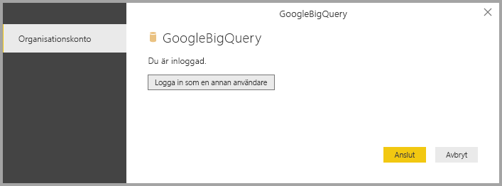

# <a name="connect-to-a-google-bigquery-database-in-power-bi-desktop"></a>Anslut till en Google BigQuery-databas i Power BI Desktop
I Power BI Desktop kan du ansluta till en Google **BigQuery**-databas och använda underliggande data precis som andra datakällor i Power BI Desktop.

## <a name="connect-to-google-bigquery"></a>Anslut till Google BigQuery
Om du vill ansluta till en Google **BigQuery**-databas, väljer du **Hämta Data** från **Start**-menyfliksområdet i Power BI Desktop. Välj **Databas** från kategorierna till vänster så ser du **Google BigQuery**.


I fönstret **Google BigQuery** som visas, loggar du in på ditt Google BigQuery-konto och väljer **Anslut**.


När du är inloggad, ser du följande fönster som indikerar att du har autentiserats. 



När du har anslutit, visas ett **navigator**-fönster som visar data som är tillgängliga på servern, där du kan välja ett eller flera element att importera och använda i **Power BI Desktop**.


## <a name="considerations-and-limitations"></a>Överväganden och begränsningar
Det finns några begränsningar och överväganden att tänka på med anslutningsappen för Google **BigQuery**:

* Google BigQuery-anslutningsappen är tillgänglig i Power BI Desktop och Power BI-tjänsten. I Power BI-tjänsten, når du anslutningsappen med moln-till-moln-anslutningen från Power BI till Google BigQuery.

Du kan använda Power BI med **faktureringsprojektet** för Google BigQuery. Som standard använder Power BI det första projektet från listan som returneras för användaren. För att anpassa beteendet för faktureringsprojektet när du använder det med Power BI, gör du följande:

 * Anger följande alternativ i den underliggande M i källsteget som kan anpassas med hjälp av **Power Query-redigeraren** i Power BI Desktop:

    ```Source = GoogleBigQuery.Database([BillingProject="Include-Billing-Project-Id-Here"])```

## <a name="next-steps"></a>Nästa steg
Det finns alla möjliga sorters data du kan ansluta till med Power BI Desktop. Kolla in följande resurser för mer information om datakällor:

* [Vad är Power BI Desktop?](desktop-what-is-desktop.md)
* [Datakällor i Power BI Desktop](desktop-data-sources.md)
* [Forma och kombinera data i Power BI Desktop](desktop-shape-and-combine-data.md)
* [Anslut till Excel-arbetsböcker i Power BI Desktop](desktop-connect-excel.md)   
* [Ange data direkt i Power BI Desktop](desktop-enter-data-directly-into-desktop.md)   

