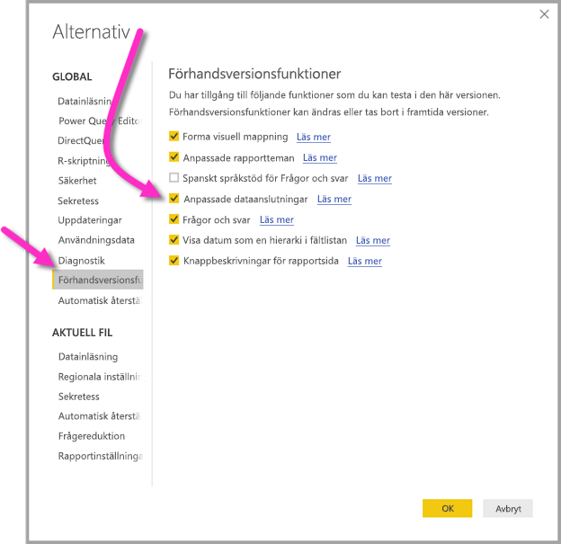

# Ansluta till data som skapats av Power BI-dataflöden i Power BI Desktop (förhandsversion)
I **Power BI Desktop** kan du ansluta till data som skapats av **Power BI-dataflöden** precis som andra datakällor i Power BI Desktop.

Med anslutningsappen för **Power BI-dataflöden (förhandsversion)** kan du ansluta till entiteter som skapats av dataflöden i Power BI-tjänsten. Eftersom dataflöden finns i förhandsversionen måste du vidta ett antal åtgärder för att göra anslutningsappen för dataflöden tillgänglig på datorn. 

## Ladda ned och aktivera anslutningsappen för Power BI-dataflöden (förhandsversion)

Du måste ladda ned en kopia av anslutningsappen för **Power BI-dataflöden** och sedan kopiera den till en specifik plats på datorn. I en kommande månadsuppdatering för Power BI Desktop tas anslutningsappen med automatiskt i listan över dataanslutningar. Då behövs inte de här stegen.

Du kan ladda ned **anslutningsappen för Power BI-dataflöden** här: [anslutningsappen för Power BI-dataflöden](https://visuals.azureedge.net/cds-analytics/PublicPreview/CDSA.mez)

Utför följande åtgärder för att göra anslutningsappen för **Power BI-dataflöden** (förhandsversion) tillgänglig på datorn:

1. Ladda ned en kopia av .MEZ-filen (dataanslutningsfilen). Kunder med privat förhandsversion får information om nedladdningen för .MEZ-filen direkt från Microsoft.

2. Placera den nedladdade dataanslutningsfilen i följande mapp på datorn: **Dokument > Power BI Desktop > Anpassade anslutningsappar**

3. Välj **Arkiv > Alternativ och inställningar > Alternativ** och sedan **Förhandsversionsfunktioner** i det vänstra fönstret i Power BI Desktop.

    

4. Markera rutan för **anpassade dataanslutningar** om den inte är markerad. 

5. Anslutningsappen visas när du startar om **Power BI Desktop**.

## Använda anslutningsappen för Power BI-dataflöden (förhandsversion)
När **Power BI Desktop** har startats om visas anslutningsappen som en tillgänglig datakälla. Om du vill ansluta till en datapool väljer du **Hämta Data > Onlinetjänster > Power BI dataflöden (beta)** enligt följande bild:

## Överväganden och begränsningar

Om du vill använda den här förhandsversionen av **anslutningsappen för Power BI-dataflöden** måste du köra den senaste versionen av **Power BI Desktop**. Du kan alltid [ladda ned Power BI Desktop](desktop-get-the-desktop.md) och installera det på din dator för att se till att du har den senaste versionen.  

Obs! När anslutningsappen för Power BI-dataflöden tas med i en kommande månadsuppdatering av **Power BI Desktop** *måste* du ta bort den här nedladdade .MEZ-filen från mappen **Dokument > Power BI Desktop > Anpassade anslutningar** för att undvika konflikter. 

## Nästa steg
Det finns många intressanta saker som du kan göra med Power BI-dataanslutningar och även artiklar om **Power BI Desktop** som kan vara användbara:

* [Datakällor i Power BI Desktop](desktop-data-sources.md)
* [Forma och kombinera data i Power BI Desktop](desktop-shape-and-combine-data.md)
* [Ange data direkt i Power BI Desktop](desktop-enter-data-directly-into-desktop.md)   

