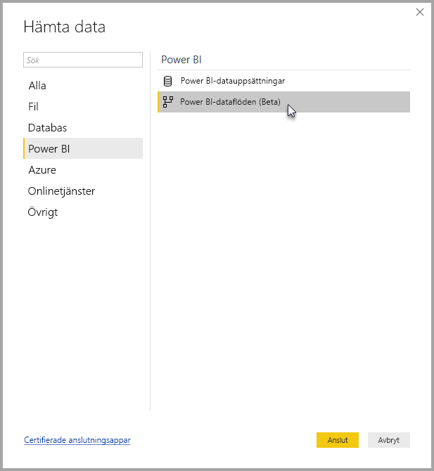

# Ansluta till data som skapats av Power BI-dataflöden i Power BI Desktop (Beta)
I **Power BI Desktop** kan du ansluta till data som skapats av **Power BI-dataflöden** precis som andra datakällor i Power BI Desktop.

Med anslutningsappen för **Power BI-dataflöden (Beta)** kan du ansluta till entiteter som skapats av dataflöden i Power BI-tjänsten. 

## Överväganden och begränsningar

Om du vill använda den här förhandsversionen av **anslutningsappen för Power BI-dataflöden** måste du köra den senaste versionen av **Power BI Desktop**. Du kan alltid [ladda ned Power BI Desktop](desktop-get-the-desktop.md) och installera det på din dator för att se till att du har den senaste versionen.  

> [!NOTE]
> Den tidigare versionen av anslutningsprogrammet för Power BI-dataflöden krävde att du hämtade en MEZ-fil och placerade den i en mapp. Aktuella versioner av **Power BI Desktop** innehåller anslutningsprogrammet för Power BI-dataflöden, så att filen inte längre krävs och kan orsaka konflikt med den inkluderade versionen av anslutningsprogrammet. Om du manuellt placerat denna MEZ-fil i mappen *måste* du ta bort denna hämtade MEZ-fil från mappen **Dokument > Power BI Desktop > Anpassade anslutningsprogram** för att undvika konflikter. 

## Skrivbordsprestanda
**Power BI Desktop** körs lokalt på den dator där den är installerad. Datainmatningsprestanda för dataflöden bestäms av olika faktorer. Dessa faktorer är storleken på data, datorns processor och RAM-minne, nätverkets bandbredd, avståndet från datacentret och andra faktorer.

Du kan förbättra datainmatningens prestanda för dataflöden. Om t.ex. datainmatningen är för stor för **Power BI Desktop** för att hantera på datorn, kan du använda länkade och beräknad entiteter i dataflöden för att aggregera data (inom dataflöden) och endast mata in i förväg förberedda, sammanställda data. På det sättet, utförs bearbetning av stora mängder data online i dataflöden i stället för lokalt i din instans som körs av **Power BI Desktop**. Med denna metod kan Power BI Desktop mata in mindre mängder data och behåller upplevelsen av dataflöden responsiv och snabb.

## Överväganden och begränsningar

De flesta dataflöden finns i Power BI-tjänsteklienten. Dock kan **Power BI Desktop**-användare inte komma åt dataflöden som är lagrade i Azure Data Lake Storage Gen2-kontot, såvida inte de är ägare av dataflödet eller de uttryckligen har godkänts för detta dataflödes CDM-mapp. Se följande situation:

1.  Anna skapar en ny apparbetsyta och konfigurerar den så att den lagrar dataflöden i organisationens data lake.
2.  Ben, som också är medlem i arbetsytan som Anna skapade, vill använda Power BI Desktop och anslutningsappen för dataflöden för att hämta data från det dataflöde som Anna skapade.
3.  Ben får ett fel eftersom han inte har lagts till som behörig användare av det dataflödets CDM-mapp i aktuell datasjö.

    

För att lösa problemet, måste Ben beviljas läsbehörighet till CDM-mappen och dess filer. Du kan läsa mer om hur du ger åtkomst till Common Data Service-mappen i [den här artikeln](https://go.microsoft.com/fwlink/?linkid=2029121).

## Nästa steg
Det finns alla möjliga intressanta saker du kan göra med Power BI-dataflöden. Mer information finns i följande källor:

* [Dataförberedelser med självbetjäning för dataflöden](service-dataflows-overview.md)
* [Skapa och använda dataflöden i Power BI](service-dataflows-create-use.md)
* [Använda beräknade entiteter i Power BI Premium (förhandsversion)](service-dataflows-computed-entities-premium.md)
* [Använda dataflöden med lokala datakällor (förhandsversion)](service-dataflows-on-premises-gateways.md)
* [Resurser för utvecklare för Power BI-dataflöden (förhandsversion)](service-dataflows-developer-resources.md)

Mer information om integration med Azure Data Lake Storage Gen2 finns i följande artiklar:

* [Dataflöden och Azure Data Lake-integrering (förhandsversion)](service-dataflows-azure-data-lake-integration.md)
* [Konfigurera inställningar för arbetsytans dataflöde (förhandsversion)](service-dataflows-configure-workspace-storage-settings.md)
* [Lägga till en CDM-mapp i Power BI som ett dataflöde (förhandsversion)](service-dataflows-add-cdm-folder.md)
* [Ansluta Azure Data Lake Storage Gen2 för lagring av dataflöde (förhandsversion)](service-dataflows-connect-azure-data-lake-storage-gen2.md)

Det finns även artiklar om **Power BI Desktop** som kan vara användbara:

* [Datakällor i Power BI Desktop](desktop-data-sources.md)
* [Forma och kombinera data i Power BI Desktop](desktop-shape-and-combine-data.md)
* [Ange data direkt i Power BI Desktop](desktop-enter-data-directly-into-desktop.md)   

