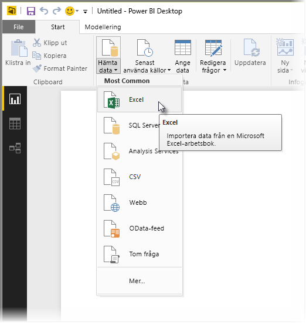
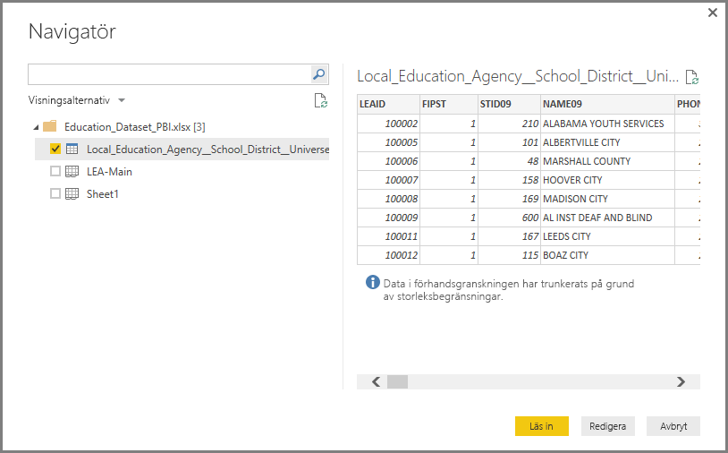

# Ansluta till Excel i Power BI Desktop
Det är enkelt att ansluta till en Excel-arbetsbok från Power BI Desktop. Den här artikeln vägleder dig genom stegen.

I Power BI Desktop väljer du **Hämta data** > Excel från fliken **Start** i menyfliksområdet.

Välj din arbetsbok från dialogrutan **Öppna** dialogrutan som visas.

Power BI Desktop anger tabellerna på andra dataelement från arbetsboken i fönstret **Navigator**. När du markerar en tabell i den vänstra rutan visas en förhandsgranskning av data i den högra rutan.

Du kan välja knappen Hämta för import av data, eller om du vill redigera data med hjälp av **frågeredigeraren**, eller knappen **Redigera** innan du hämtar dem till Power BI Desktop.

När du läser in data visar Power BI Desktop fönstret **Hämta** och visar aktiviteten som är associerad med att läsa in data.  

När du är färdig visar Power BI Desktop de tabeller och fält som har importerats från Excel-arbetsboken i rutan **Fält** till höger på skrivbordet.

Och sedan är du klar!

Du är nu redo att använda den importerade informationen från din Excel-arbetsbok i Power BI Desktop för att skapa visuella objekt och rapporter eller interagera med annan information som du kanske vill ansluta till och importera som andra Excel-arbetsböcker, databaser eller andra datakällor.

### Nästa steg
Det finns alla möjliga sorters data du kan ansluta till med Power BI Desktop. Kolla in följande resurser för mer information om datakällor:

* [Vad är Power BI Desktop?](desktop-what-is-desktop.md)
* [Datakällor i Power BI Desktop](desktop-data-sources.md)
* [Forma och kombinera data i Power BI Desktop](desktop-shape-and-combine-data.md)
* [Anslut till CSV-filer i Power BI Desktop](desktop-connect-csv.md)   
* [Ange data direkt i Power BI Desktop](desktop-enter-data-directly-into-desktop.md)   

