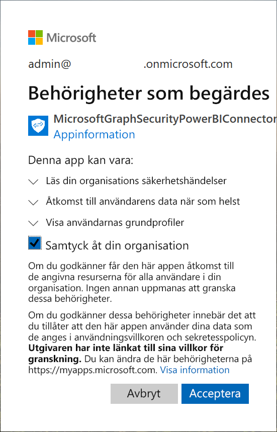
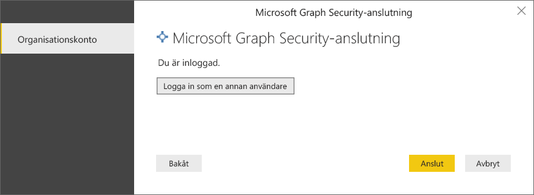
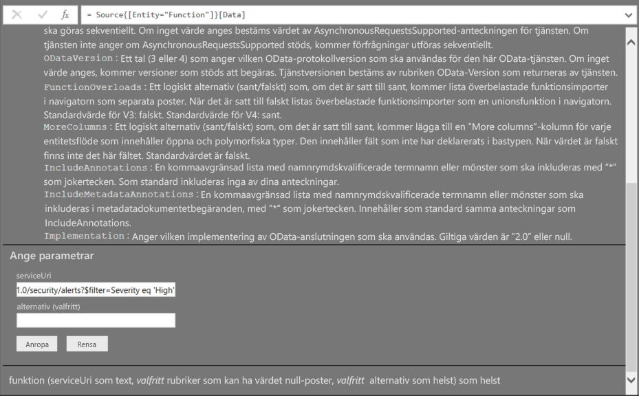

# Ansluta till Microsoft Graph-säkerhet i Power BI Desktop

Du kan använda Power BI Desktop för att ansluta till Säkerhets-API för Microsoft Graph med hjälp av Power BI-anslutningsappen för Microsoft Graph-säkerhet. Det gör att du kan skapa instrumentpaneler och rapporter som ger dig insikt i dina säkerhetsrelaterade [aviseringar](https://docs.microsoft.com/graph/api/resources/alert?view=graph-rest-1.0) och [Secure Score](https://docs.microsoft.com/graph/api/resources/securescores?view=graph-rest-beta). [Säkerhets-API för Microsoft Graph](https://aka.ms/graphsecuritydocs) ansluter [flera säkerhetslösningar](https://aka.ms/graphsecurityalerts) från Microsoft och ekosystemspartner för att få smidigare korrelation av aviseringar, omfattande sammanhangsinformation och enklare automatisering. Detta gör det möjligt för organisationer att snabbt få insikter och vidta åtgärder i sina säkerhetsprodukter samtidigt som både kostnaderna minskar och svårigheterna med att bygga upp och underhålla flera integreringar.

## Krav för att ansluta med anslutningsappen för Microsoft Graph-säkerhet

* Om du vill använda anslutningsappen för Microsoft Graph-säkerhet måste du ha *uttryckligt medgivande* från innehavaradministratören för Azure Active Directory (AD), vilket är ett av [autentiseringskraven för Microsoft Graph-säkerhet](https://aka.ms/graphsecurityauth). För det här medgivandet behöver du program-ID och namn för Power BI-anslutningsappen för Microsoft Graph-säkerhet, som du också hittar på [Azure-portalen](https://portal.azure.com):

   | Egenskap | Värde |
   |----------|-------|
   | **Programnamn** | `MicrosoftGraphSecurityPowerBIConnector` |
   | **Program-ID** | `cab163b7-247d-4cb9-be32-39b6056d4189` |
   |||

   Din Azure AD-innehavaradministratör kan följa något av de här stegen för att ge sitt medgivande för anslutningsappen:

   * [Ge innehavaradministratörens medgivande för Azure AD-program](https://docs.microsoft.com/azure/active-directory/develop/v2-permissions-and-consent).

   * Under den första körningen av din logikapp kan appen begära godkännande från Azure AD-innehavaradministratören via [funktionen för programmedgivande](https://docs.microsoft.com/azure/active-directory/develop/application-consent-experience).
   
* Det användarkonto som användes för att logga in och ansluta till Power BI-anslutningsappen för Microsoft Graph-säkerhet måste vara medlem i rollen Säkerhetsläsare begränsad administratör i Azure AD (antingen Säkerhetsläsare eller Säkerhetsadministratör). Följ stegen i avsnittet om att [tilldela Azure AD-roller till användare](https://docs.microsoft.com/graph/security-authorization#assign-azure-ad-roles-to-users). 

## Med anslutningsappen för Microsoft Graph-säkerhet

Följ dessa steg om du vill använda anslutningsappen för **Microsoft Graph-säkerhet**:

1. Välj **Hämta data -> Mer…** på menyfliksområdet **Start** i Power BI Desktop.
2. Välj **Onlinetjänster** från kategorierna till vänster.
3. Klicka på **Microsoft Graph Security (Beta)**.

    
    
4. I fönstret **Microsoft Graph Security** som visas väljer du vilken Microsoft Graph API-version du vill skicka frågor till. Du kan välja mellan v1.0 och beta.

    
    
5. Logga in på ditt Azure Active Directory-konto vid uppmaning. Det här kontot måste ha rollen **Säkerhetsläsare** som vi nämnde i avsnittet ovan om kraven.

    
    
6. Om du är innehavaradministratör **och** om du ännu inte har gett ditt medgivande till Power BI-anslutningsappen för Microsoft Graph-säkerhet enligt kraven, visas följande dialogruta. Se till att du väljer ”**Samtyck åt din organisation**”.

    
    
7. När du har loggat in ser du följande fönster som indikerar att du har autentiserats. Välj **Anslut**.

    
    
8. När du har anslutit visas fönstret **Navigatör** enligt med de entiteter som aviseringar m.m. som är tillgängliga i [Säkerhets-API för Microsoft Graph](https://aka.ms/graphsecuritydocs) för den version du valde i föregående steg. Välj en eller flera entiteter att importera och använda i **Power BI Desktop**. Klicka på **Läs in** att hämta resultatvyn som beskrivs i steg 10.

   
    
9. Om du vill skapa en avancerad fråga för Säkerhets-API för Microsoft Graph ska du välja funktionen **Specify custom Microsoft Graph Security URL to filter results** (Ange anpassad URL för Microsoft Graph-säkerhet för att filtrera resultat). Det innebär att du kan skapa en [OData.Feed](https://docs.microsoft.com/power-bi/desktop-connect-odata)-fråga till Säkerhets-API för Microsoft Graph med den behörighet som krävs för att få åtkomst till API:et.

   > [!NOTE]
   > Exemplet serviceUri som används nedan är `https://graph.microsoft.com/v1.0/security/alerts?$filter=Severity eq 'High'`. Referera till [ODATA-frågeparametrar som Graph stöder](https://docs.microsoft.com/graph/query-parameters) om du vill skapa frågor för att filtrera, ordna eller hämta det senaste resultatet.

   
    
   När du väljer **Invoke** anropar OData.Feed-funktionen API:et som öppnar frågeredigeraren där du kan filtrera och förfina den uppsättning data du vill använda och sedan läsa in den förfinade datauppsättningen i Power BI Desktop.

10. Följande bild visar resultatfönstret för en eller flera entiteter du frågade efter i Microsoft Graph-säkerhet.

   
    

Du är nu redo att använda den importerade informationen från anslutningsappen för Microsoft Graph-säkerhet i Power BI Desktop för att skapa visuella objekt och rapporter eller interagera med annan information som du kanske vill ansluta till och importera som andra Excel-arbetsböcker, databaser eller andra datakällor.

## Nästa steg
* Kolla in Power BI-exempel och mallar som använder den här anslutningsappen på [lagringsplatsen för Power BI-exempel i GitHub för Microsoft Graph-säkerhet](https://aka.ms/graphsecuritypowerbiconnectorsamples).

* Kolla in några användarscenarier och ytterligare information i [blogginlägget om Power BI-anslutningsappen för Microsoft Graph-säkerhet](https://aka.ms/graphsecuritypowerbiconnectorblogpost).

* Det finns alla möjliga sorters data du kan ansluta till med Power BI Desktop. Kolla in följande resurser för mer information om datakällor:

    * [Vad är Power BI Desktop?](desktop-what-is-desktop.md)
    * [Datakällor i Power BI Desktop](desktop-data-sources.md)
    * [Forma och kombinera data i Power BI Desktop](desktop-shape-and-combine-data.md)
    * [Anslut till Excel-arbetsböcker i Power BI Desktop](desktop-connect-excel.md)
    * [Ange data direkt i Power BI Desktop](desktop-enter-data-directly-into-desktop.md)
