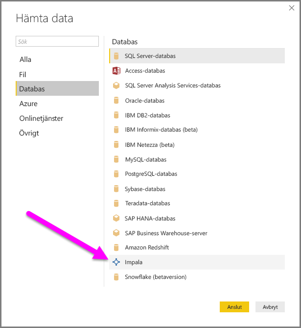
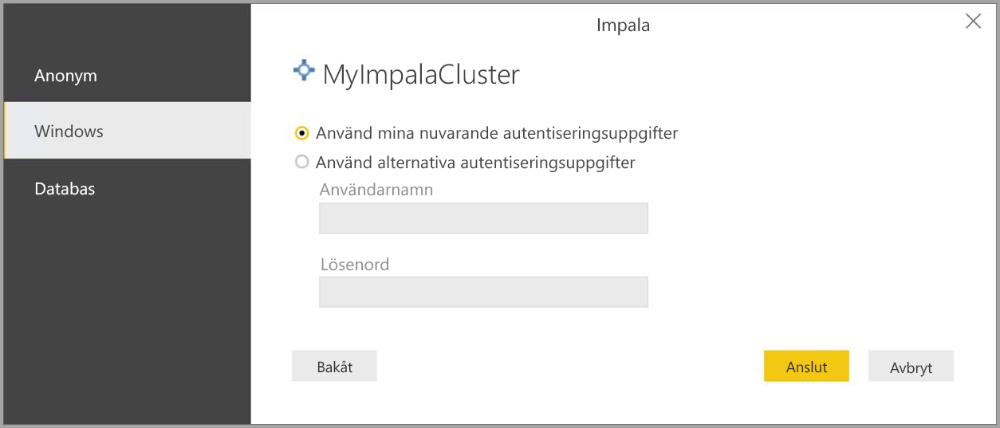
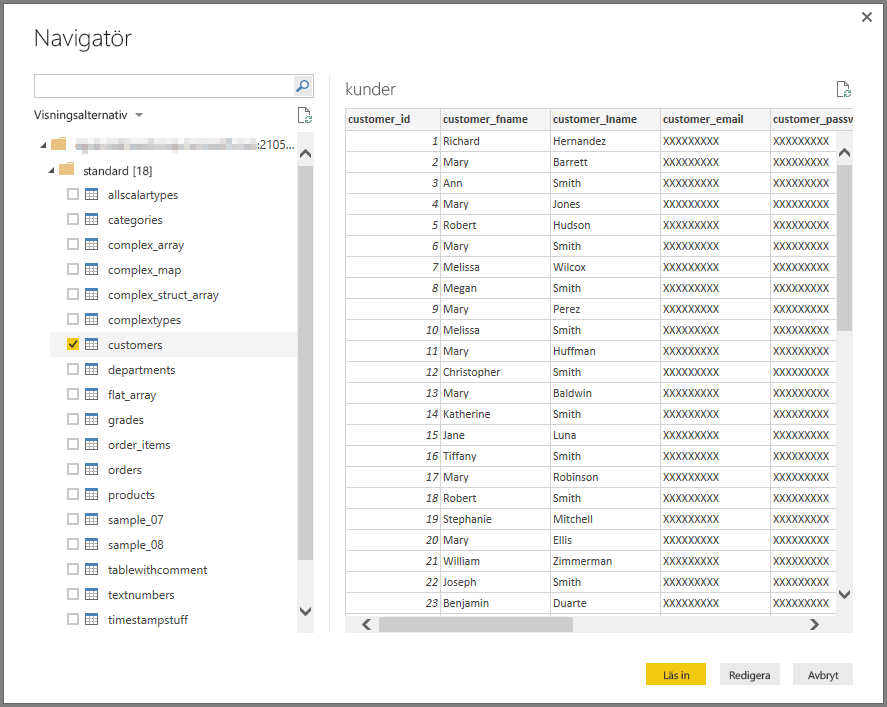

# Anslut till en Impala-databas i Power BI Desktop
I Power BI Desktop kan du ansluta till en **Impala**-databas och använda underliggande data precis som andra datakällor i Power BI Desktop.

## Anslut till en Impala-databas
Om du vill ansluta till en **Impala**-databas, väljer du **Hämta Data** från **Start**-menyfliksområdet i Power BI Desktop. Välj **Databas** från kategorierna till vänster så ser du **Impala**.

I **Impala**-fönstret som visas, skriver eller klistrar du in namnet på din Impala-server i rutan och väljer **Ok**. Observera att du kan välja att **importera** data direkt i Power BI, eller så kan du använda **DirectQuery**. Du kan läsa mer om att [använda DirectQuery](desktop-use-directquery.md).

När du uppmanas, skriver du in ditt användarnamn och lösenord, eller ansluter anonymt, bägge alternativ stöds.

> [!NOTE]
> När du anger ditt användarnamn och lösenord för en viss **Impala**-server, använder Power BI Desktop samma autentiseringsuppgifter i efterföljande anslutningsförsök. Du kan ändra autentiseringsuppgifterna genom att gå till **Arkiv > Alternativ och inställningar > Inställningar för datakälla**.
> 
> 

När du har anslutit, visas ett **navigator**-fönster som visar data som är tillgängliga på servern, där du kan välja ett eller flera element att importera och använda i **Power BI Desktop**.

## Överväganden och begränsningar
Det finns några begränsningar och överväganden att tänka på med anslutningsappen för **Impala**:

* Framtida planer inkluderar att aktivera stöd för uppdatering med **Power BI Gateway**.

## Nästa steg
Det finns alla möjliga sorters data du kan ansluta till med Power BI Desktop. Kolla in följande resurser för mer information om datakällor:

* [Komma igång med Power BI Desktop](desktop-getting-started.md)
* [Datakällor i Power BI Desktop](desktop-data-sources.md)
* [Forma och kombinera data i Power BI Desktop](desktop-shape-and-combine-data.md)
* [Anslut till Excel-arbetsböcker i Power BI Desktop](desktop-connect-excel.md)   
* [Ange data direkt i Power BI Desktop](desktop-enter-data-directly-into-desktop.md)   

