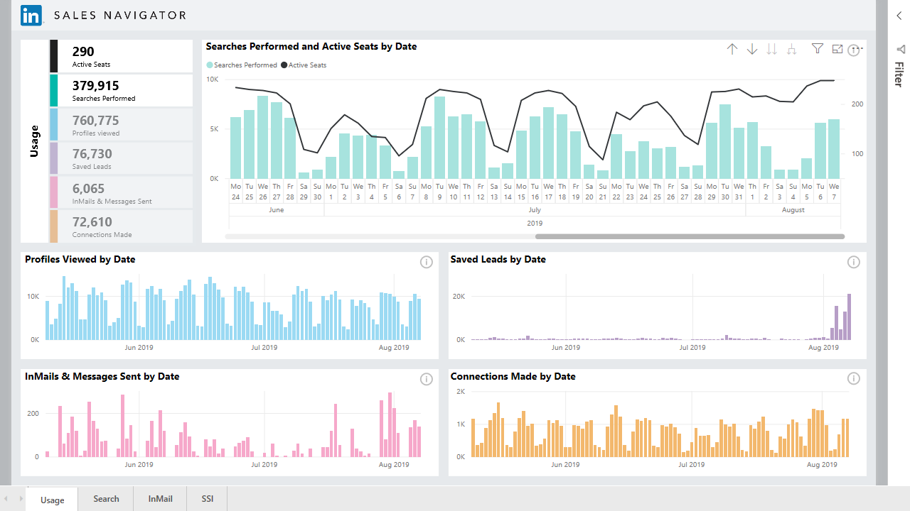
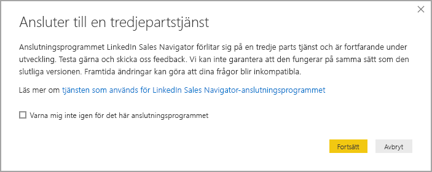
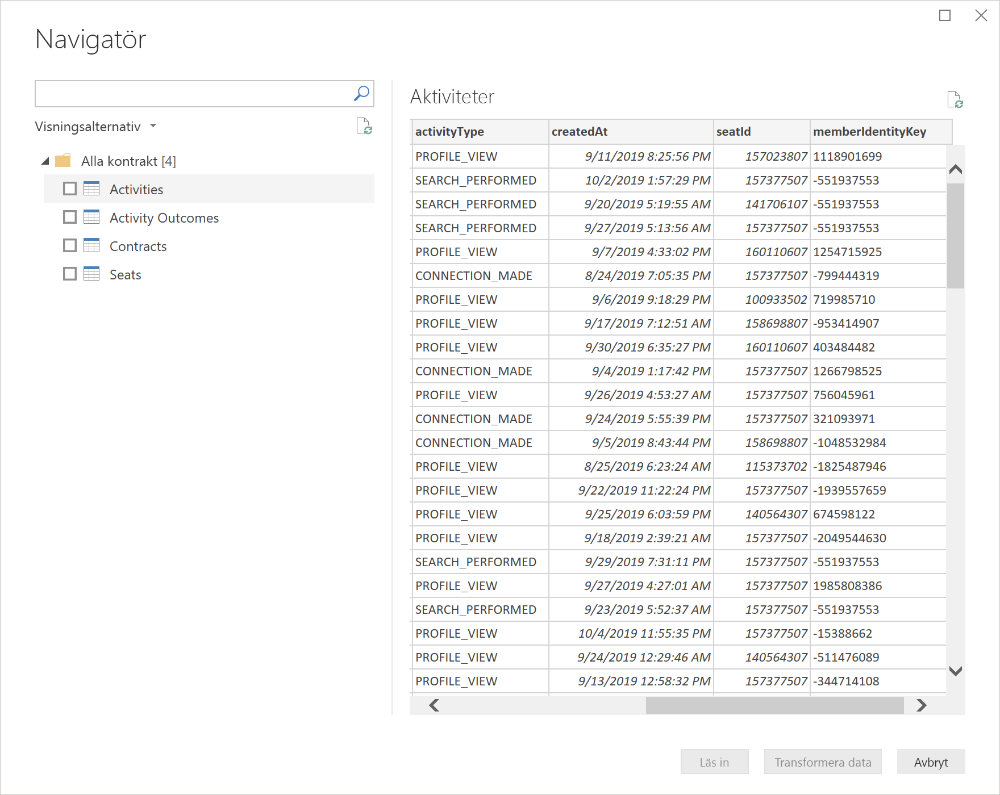
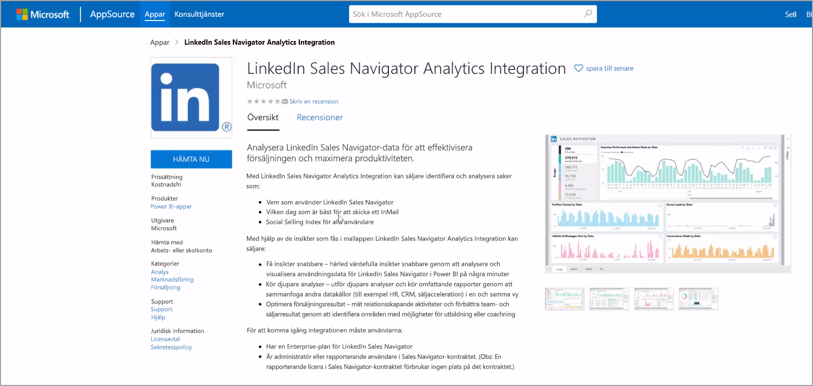
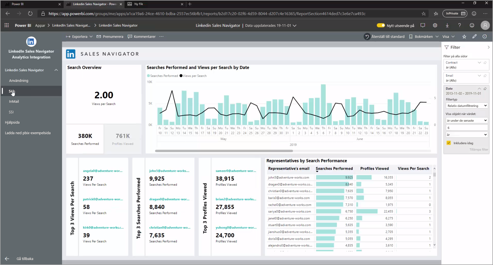
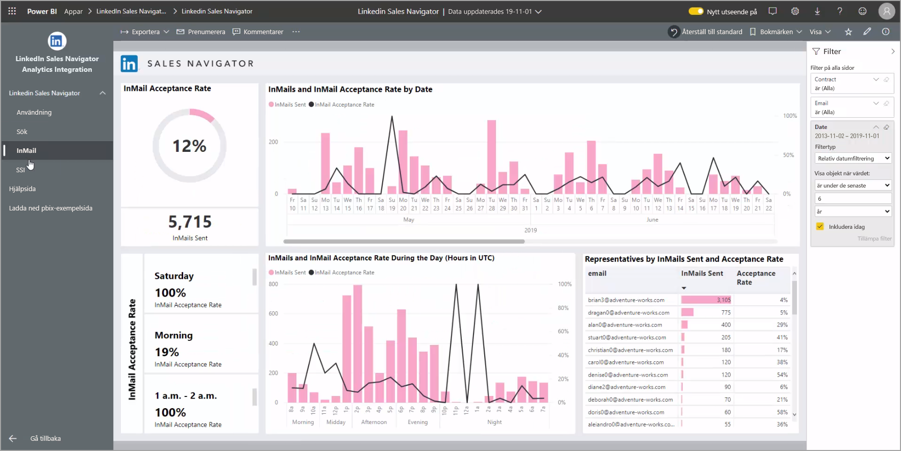
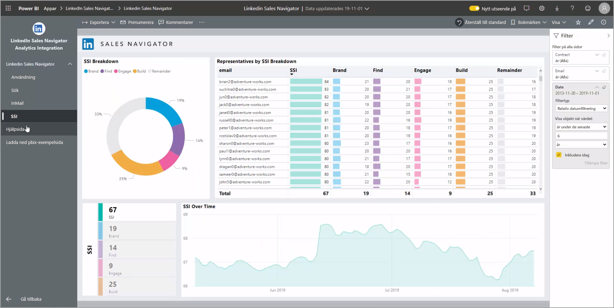
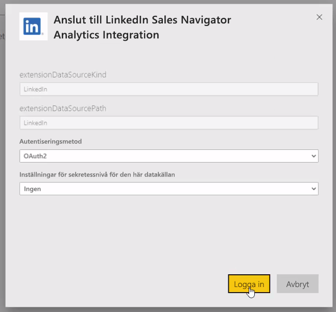

# Ansluta till LinkedIn Sales Navigator i Power BI Desktop

I **Power BI Desktop** kan du ansluta till **LinkedIn Sales Navigator** för att hitta och skapa relationer, på samma sätt som i andra datakällor i Power BI Desktop samt skapa färdiga rapporter för dina resultat.

Om du vill ansluta till LinkedIn-data med **LinkedIn Sales Navigator**, måste du ha ett LinkedIn Sales Navigator Enterprise-abonnemang och antingen vara administratörsanvändare eller rapporterande användare i Sales Navigator-kontraktet.

Följande video innehåller en guidad rundtur och självstudie om hur du använder mallappen för **LinkedIn Sales Navigator**, vilken beskrivs mer detaljerat [längre fram i den här artikeln](#using-the-linkedin-sales-navigator-template-app). 

> [!VIDEO https://www.youtube.com/embed/ZqhmaiORLw0]

## Ansluta till LinkedIn Sales Navigator

Om du vill ansluta till **LinkedIn Sales Navigator**-data väljer du **Hämta data** i menyfliksområdet **Start** i Power BI Desktop. Välj **Onlinetjänster** i kategorierna till vänster och bläddra tills du ser **LinkedIn Sales Navigator (Beta)** .

Ett meddelande visas om att du ansluter till en tredjepartsanslutning som fortfarande är under utveckling. 

När du väljer **Fortsätt** uppmanas du ange vilka data du önskar.

I fönstret **LinkedIn Sales Navigator** som visas väljer du vilka data du vill returnera, antingen *Alla kontakter* eller *Valda kontakter* i den första listrutan. Du kan sedan ange start- och slutdatum för att begränsa vilka data som hämtas.

När du har angett informationen ansluter Power BI Desktop till de data som är kopplade till ditt LinkedIn Sales Navigator-kontrakt. Använd samma e-postadress som du använder för att logga in på LinkedIn Sales Navigator via webbplatsen. 

När du har anslutit uppmanas du att välja data från ditt LinkedIn Sales Navigator-kontrakt från ett **Navigator**-fönster.

Du kan skapa vilka rapporter du vill med dina LinkedIn Sales Navigator-data. För att göra det enklare finns det också en .PBIX-fil för LinkedIn Sales Navigator som du kan ladda ned. Den innehåller redan dataexempel för att du ska kunna bekanta dig med data och rapporter, utan att behöva starta från början.

Du kan ladda ned PBIX-filen från följande plats:
* [PBIX för LinkedIn Sales Navigator](service-template-apps-samples.md)

Förutom PBIX-filen innehåller LinkedIn Sales Navigator också en mallapp som du kan ladda ned och använda. I nästa avsnitt beskrivs mallappen mer detaljerat.

## Använda mallappen i LinkedIn Sales Navigator

För att kunna använda **LinkedIn Sales Navigator** så enkelt som möjligt, kan du använda [mallappen](service-template-apps-overview.md) som automatiskt skapar en färdig rapport från dina LinkedIn Sales Navigator-data.

När du laddar ner appen kan du välja om du vill ansluta till dina data eller utforska appen med exempeldata. Du kan alltid gå tillbaka och ansluta till dina egna LinkedIn Sales Navigator-data när du har utforskat exempeldatan. 

Du kan hämta mallappen för **LinkedIn Sales Navigator** från följande länk:
* [Mallapp för LinkedIn Sales Navigator](https://appsource.microsoft.com/product/power-bi/pbi-contentpacks.linkedin_navigator-preview?flightCodes=17ad4c68-fbc5-4925-a351-139fd384ec33)

I mallappen finns fyra flikar som hjälper dig att analysera och dela din information:

* Användning
* Sök
* InMail
* SSI

På fliken **Användning** visas dina övergripande LinkedIn Sales Navigator-data.

På fliken **Sök** kan du söka mer detaljerat i dina sökresultat:

I **InMail** visas din InMail-användning, inklusive antal skickade InMail-meddelanden, godkännandefrekvenser och annan användbar information:

På fliken **SSI** finns ytterligare information om ditt SSI (Social Selling Index):

Om du vill gå från exempeldata till dina egna data väljer du **Redigera app** i det övre högra hörnet (pennikonen) och sedan **Anslut dina data** på skärmen som visas.

Därifrån kan du ansluta dina egna data och välja hur många dagars data som ska läsas in. Du kan läsa in upp till 365 dagars data. Du måste logga in med samma e-postadress som du använder för att logga in på LinkedIn Sales Navigator via webbplatsen. 

mallappen uppdaterar sedan datan i appen med dina data. Du kan också konfigurera en schemalagd uppdatering för att datan i din app ska vara lika aktuell som din uppdateringsfrekvens anger. 

När datan har uppdaterats kan du se att appen är ifylld med dina egna data.

## Få hjälp

Om du stöter på problem när du ansluter till dina data kan du kontakta LinkedIn Sales Navigator-supporten på https://www.linkedin.com/help/sales-navigator. 

## Nästa steg
Det finns alla möjliga sorters data du kan ansluta till med Power BI Desktop. Kolla in följande resurser för mer information om datakällor:

* [Vad är Power BI Desktop?](desktop-what-is-desktop.md)
* [Datakällor i Power BI Desktop](desktop-data-sources.md)
* [Forma och kombinera data i Power BI Desktop](desktop-shape-and-combine-data.md)
* [Anslut till Excel-arbetsböcker i Power BI Desktop](desktop-connect-excel.md)   
* [Ange data direkt i Power BI Desktop](desktop-enter-data-directly-into-desktop.md)   

