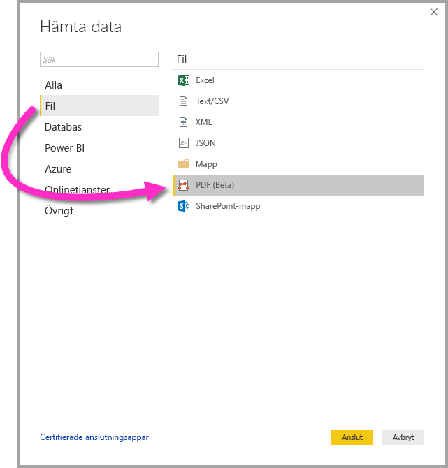

# Ansluta till en PDF-fil i Power BI Desktop
I Power BI Desktop kan du ansluta till en **PDF-fil** och använda inkluderade data från filen precis som andra datakällor i Power BI Desktop.

Följande avsnitt beskriver hur du ansluter till en **PDF-fil**, väljer data och börjar använda dessa data i **Power BI Desktop**.

Vi rekommenderar alltid att du uppgraderar till den senaste versionen av **Power BI Desktop**, som du kan hämta från en länk i avsnittet [Hämta Power BI Desktop](desktop-get-the-desktop.md). 

## Ansluta till en PDF-fil
Om du vill ansluta till en **PDF**-fil väljer du **Hämta Data** från **Start**-menyfliksområdet i Power BI Desktop. Välj **Fil** från kategorierna till vänster så ser du **PDF (beta)** .

Du uppmanas att ange platsen för PDF-filen som du vill använda. När du anger filens sökväg och PDF-filen läses in så visas ett **navigeringsfönster** med data som är tillgängliga från filen, där du kan välja ett eller flera element att importera och använda i **Power BI Desktop**.

Om du markerar en kryssruta bredvid de identifierade elementen i PDF-filen visas de i den högra rutan. När du vill importera väljer du knappen **Läs in** för att importera data till **Power BI Desktop**.

Från och med November 2018-versionen av **Power BI Desktop** så kan du ange **Start page** och **End page** som valfria parametrar för PDF-anslutningen. Du kan även ange dessa parametrar i M-formelspråket, med följande format:

`Pdf.Tables(File.Contents("c:\sample.pdf"), [StartPage=10, EndPage=11])`

## Nästa steg
Det finns alla möjliga sorters data du kan ansluta till med Power BI Desktop. Kolla in följande resurser för mer information om datakällor:

* [Vad är Power BI Desktop?](desktop-what-is-desktop.md)
* [Datakällor i Power BI Desktop](desktop-data-sources.md)
* [Forma och kombinera data i Power BI Desktop](desktop-shape-and-combine-data.md)
* [Anslut till Excel-arbetsböcker i Power BI Desktop](desktop-connect-excel.md)   
* [Ange data direkt i Power BI Desktop](desktop-enter-data-directly-into-desktop.md)   

