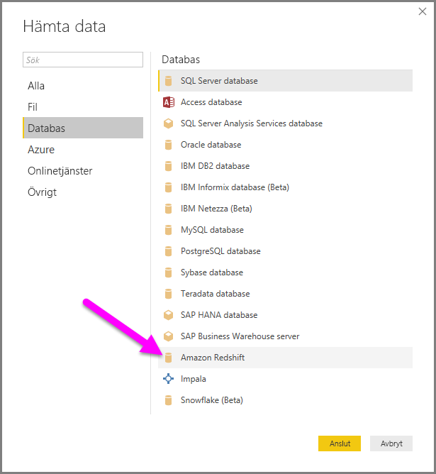

# Ansluta till Amazon Redshift i Power BI Desktop
I **Power BI Desktop** kan du ansluta till en **Amazon Redshift**-databas och använda underliggande data precis som andra datakällor i Power BI Desktop.

## Ansluta till en Amazon Redshift-databas
Om du vill ansluta till en **Amazon Redshift**-databas, väljer du **Hämta data** från **Start**-menyfliksområdet i Power BI Desktop. Välj **Databas** från kategorierna till vänster så ser du **Amazon Redshift**.

I fönstret **Amazon Redshift** som visas skriver eller klistrar du inte namnet på din **Amazon Redshift**-server och -databas i rutan. Som en del av fältet *Server* kan användarna ange en port i följande format: *ServerURL:Port*

När du uppmanas, ange ditt användarnamn och lösenord.

När du har anslutit, visas ett **navigator**-fönster som visar data som är tillgängliga på servern, där du kan välja ett eller flera element att importera och använda i **Power BI Desktop**.

När du väljer från fönstret **Navigator** kan du antingen **Hämta** eller **Redigera** data.

* Om du väljer att **Hämta** data får du en fråga om du vill använda läget *Importera* eller *DirectQuery* för att läsa in data. Mer information finns i den här [artikeln som förklarar DirectQuery](desktop-use-directquery.md).
* Om du väljer att **Redigera** data, visas **Frågeredigeraren** där du kan använda alla typer av omvandlingar och filter för data som tillämpas på den underliggande **Amazon Redshift** databasen (om detta stöds).

## Nästa steg
Det finns alla möjliga sorters data du kan ansluta till med Power BI Desktop. Kolla in följande resurser för mer information om datakällor:

* [Komma igång med Power BI Desktop](desktop-getting-started.md)
* [Datakällor i Power BI Desktop](desktop-data-sources.md)
* [Forma och kombinera data i Power BI Desktop](desktop-shape-and-combine-data.md)
* [Anslut till Excel-arbetsböcker i Power BI Desktop](desktop-connect-excel.md)   
* [Ange data direkt i Power BI Desktop](desktop-enter-data-directly-into-desktop.md)   

