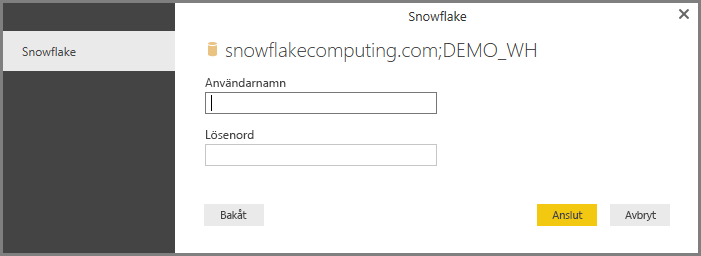

# Ansluta till Snowflake i Power BI Desktop
I Power BI Desktop kan du ansluta till en **Snowflake**-databas och använda underliggande data precis som andra datakällor i Power BI Desktop. 

> [!NOTE]
> Du *måste* också installera **Snowflake ODBC-drivrutinen** på datorer som använder anslutningsappen för **Snowflake**, med hjälp av arkitekturen som matchar installationen av  **Power BI Desktop**, 32-bitars eller 64-bitars. Följ länken nedan och [hämta lämplig Snowflake ODBC-drivrutin](http://go.microsoft.com/fwlink/?LinkID=823762).
> 
> 

## Ansluta till ett Snowflake Computing-lager
Om du vill ansluta till ett **Snowflake**-lager väljer du **Hämta data** från **Start**-menyfliksområdet i Power BI Desktop. Välj **Databas** från kategorierna till vänster så ser du **Snowflake**.

I fönstret **Snowflake** som visas skriver eller klistrar du in namnet på ditt Snowflake-datalager i rutan och väljer **OK**. Observera att du kan välja att **importera** data direkt i Power BI, eller så kan du använda **DirectQuery**. Du kan läsa mer om att [använda DirectQuery](desktop-use-directquery.md).

När du uppmanas, ange ditt användarnamn och lösenord.

> [!NOTE]
> När du anger ditt användarnamn och lösenord för en viss **Snowflake**-server, använder Power BI Desktop samma autentiseringsuppgifter i efterföljande anslutningsförsök. Du kan ändra autentiseringsuppgifterna genom att gå till **Arkiv > Alternativ och inställningar > Inställningar för datakälla**.
> 
> 

När du har anslutit, visas ett **navigator**-fönster som visar data som är tillgängliga på servern, där du kan välja ett eller flera element att importera och använda i **Power BI Desktop**.

Du kan **Hämta** den markerade tabellen, vilket öppnar hela tabellen i **Power BI Desktop**, eller så kan du **Redigera** frågan, vilket öppnar **frågeredigeraren** så att du kan filtrera och begränsa uppsättningen av data som du vill använda och läsa in en förfinad datauppsättning till **Power BI Desktop**.

## Nästa steg
Det finns alla möjliga sorters data du kan ansluta till med Power BI Desktop. Kolla in följande resurser för mer information om datakällor:

* [Vad är Power BI Desktop?](desktop-what-is-desktop.md)
* [Datakällor i Power BI Desktop](desktop-data-sources.md)
* [Forma och kombinera data i Power BI Desktop](desktop-shape-and-combine-data.md)
* [Anslut till Excel-arbetsböcker i Power BI Desktop](desktop-connect-excel.md)   
* [Ange data direkt i Power BI Desktop](desktop-enter-data-directly-into-desktop.md)   

