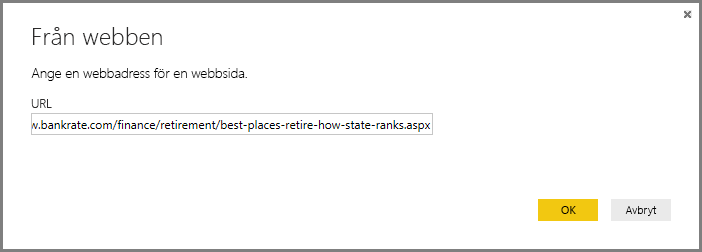
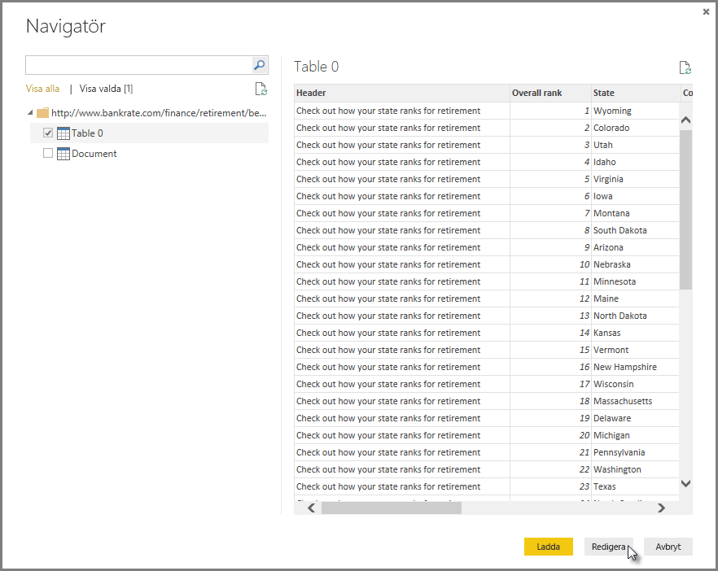
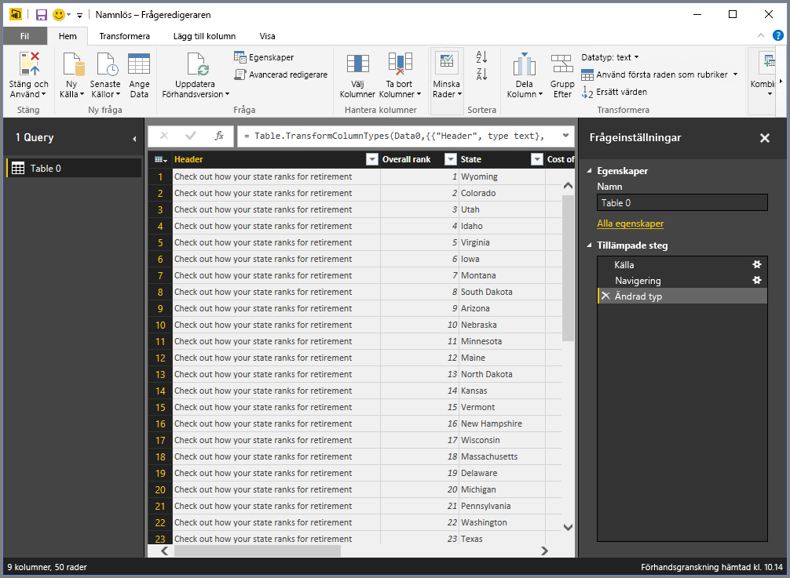
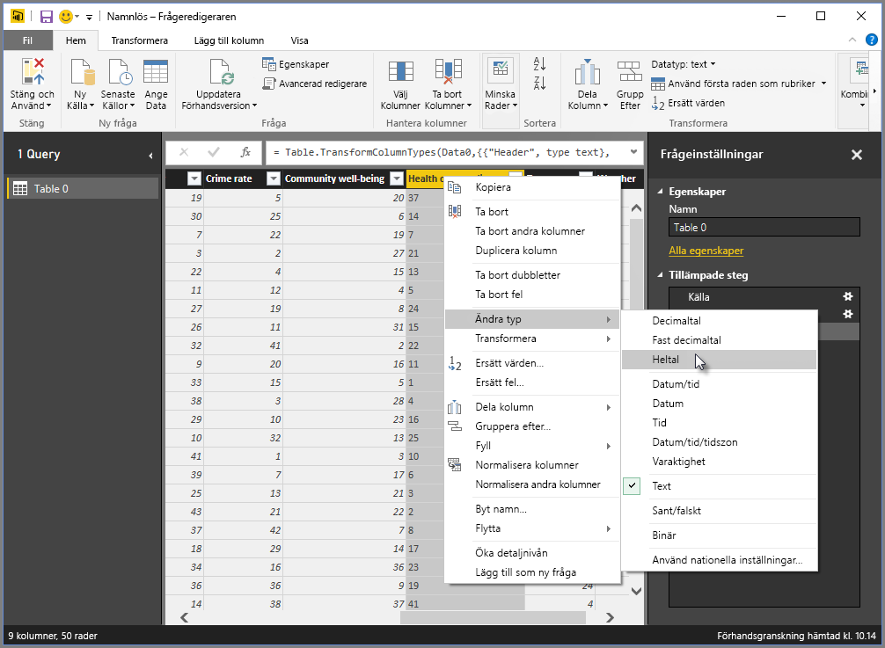
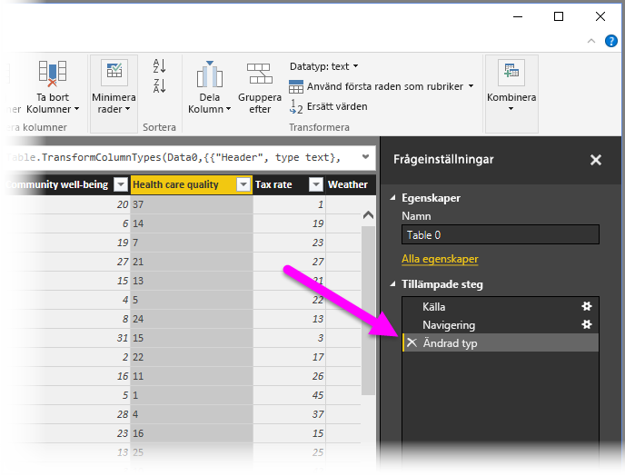
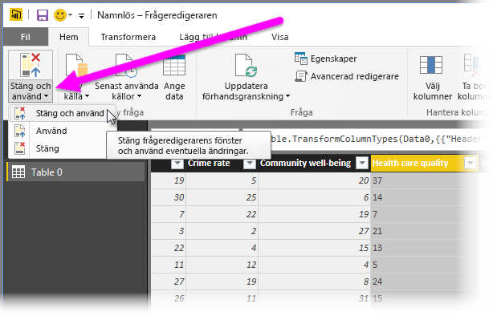
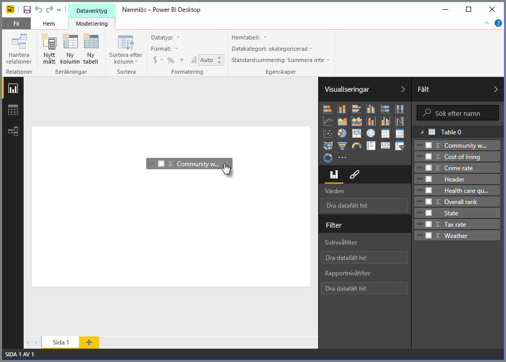
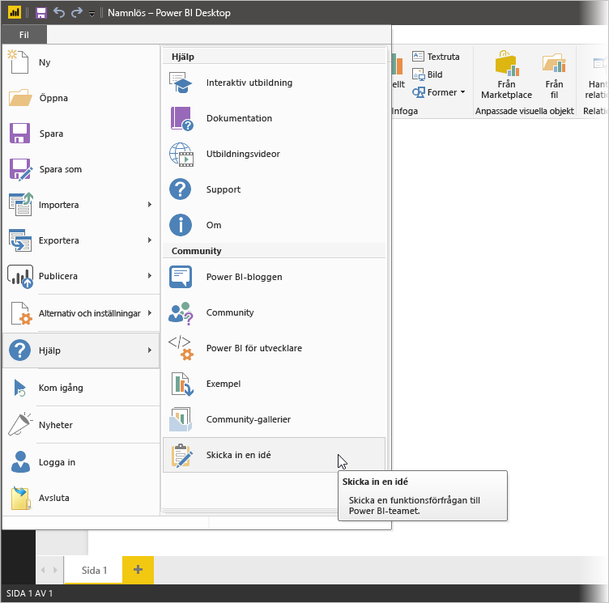

# Ansluta till datakällor i Power BI Desktop
Med Power BI Desktop kan du enkelt ansluta till den ständigt växande världen av data. Om du inte har Power BI Desktop, kan du [hämta](http://go.microsoft.com/fwlink/?LinkID=521662) och installera det.

I Power BI Desktop finns det *många olika typer* av datakällor. Följande bild visar hur du ansluter till data, genom att välja fliken **Arkiv** och sedan **Hämta data\> Mer**.

## Exempel på anslutning till data
I det här exemplet vi ansluter till en **Webb**datakälla.

Anta att du går i pension – du vill bo där solen skiner, skatterna är låga och sjukvården är bra. Eller... Du kanske är en dataanalytiker och du behöver information för att hjälpa kunderna – till exempel hjälpa din kund som tillverkar regnjackor att hitta områden där det regnar *mycket*.

I båda fallen hittar du en webbresurs som har intressant information om dessa ämnen med mera:

[*http://www.bankrate.com/finance/retirement/best-places-retire-how-state-ranks.aspx*](http://www.bankrate.com/finance/retirement/best-places-retire-how-state-ranks.aspx)

Du väljer **Hämta data \> Webb** och anger adressen.

När du väljer **OK** används **Fråge**funktionen i Power BI Desktop. Power BI Desktop kontaktar webbresursen och fönstret **Navigator** returnerar resultatet från den sidan. I det här fallet hittade den en tabell (tabell 0) och ett övergripande dokument. Vi vill använda tabellen så vi väljer den från listan. **Navigerings**fönstret visar en förhandsgranskning.

Vi kan nu redigera frågan innan du läser in tabellen genom att välja **Redigera** längst ned i fönstret eller läsa in tabellen.

Om vi väljer **Redigera** hämtas tabellen och frågeredigeraren startas. Fönstret **frågeinställningar** visas (om det inte öppnas kan du välja **Visa** från menyfliken och sedan **Visa \> Frågeinställningar** för att visa fönstret **Frågeinställningar**). Det ser ut så här.

Dessa resultat är text i stället för siffror och vi behöver siffror. Inga problem – det är bara att högerklicka på kolumnrubriken och välja **Ändra typ \> Heltal** för att ändra dem. Om du vill välja fler än en kolumn ska du först markera en kolumn och sedan hålla ned **SKIFT**. Välj fler intilliggande kolumner och högerklicka på en kolumnrubrik för att ändra alla valda kolumner. Använd **CTRL** för välja kolumner som inte ligger intill varandra.

I **Frågeinställningarna** återspeglar **tillämpade steg** de ändringar som har gjorts. När du ändrar ytterligare data, antecknar frågeredigeraren ändringarna i området **Tillämpade steg** som du kan justera, besöka, ändra eller ta bort efter behov.

Ytterligare ändringar i kan fortfarande göras i tabellen efter att den har lästs in, men detta räcker för tillfället. När det är klart vi väljer **Stäng & tillämpa** från den **Start**-menyfliksområdet och Power BI Desktop tillämpar våra ändringar och stänger frågeredigeraren.

Med datamodellen har lästs in i **Rapportvyn** i Power BI Desktop kan vi börja skapa visualiseringar genom att dra fält till arbetsytan.

Detta är förstås en enkel modell med en enkel dataanslutning. De flesta rapporterna i Power BI Desktop är kopplad till olika datakällor som har anpassats efter dina behov med relationer som skapar en omfattande datamodell. 

## Nästa steg
Det finns olika typer av saker som du kan göra med Power BI Desktop. Läs följande resurser för mer information om dess möjligheter:

* [Vad är Power BI Desktop?](desktop-what-is-desktop.md)
* [Frågeöversikt med Power BI Desktop](desktop-query-overview.md)
* [Datakällor i Power BI Desktop](desktop-data-sources.md)
* [Forma och kombinera data i Power BI Desktop](desktop-shape-and-combine-data.md)
* [Vanliga frågeuppgifter i Power BI Desktop](desktop-common-query-tasks.md)   

Vill du ge oss feedback? Toppen – använd menyalternativet **Skicka in en idé** i Power BI Desktop eller besök [Feedback från communityn](http://community.powerbi.com/t5/Community-Feedback/bd-p/community-feedback). Vi hoppas att få höra från dig!

