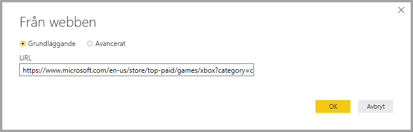
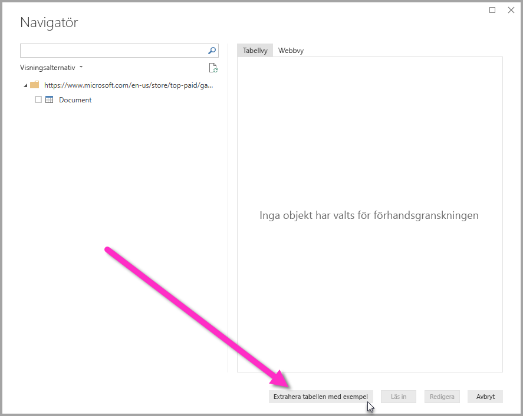
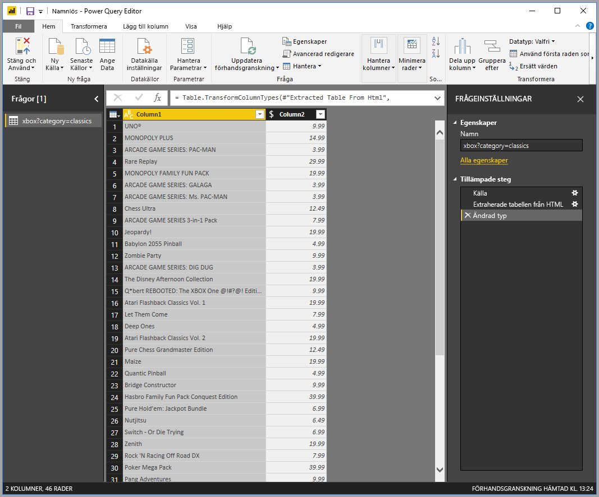

# Hämta webbsidesdata genom att tillhandahålla exempel

Hämtning av data från en webbplats låter användare enkelt extrahera data från webbsidor och importera dessa data till *Power BI Desktop*. Ofta är dock data för webbplatser inte organiserade i tydliga tabeller som är enkla att extrahera. Det kan vara svårt att hämta data från sådana sidor, även om data är strukturerade och konsekventa.

Det finns en lösning. Med funktionen *Hämta data från webben efter exempel* kan du i princip visa för Power BI Desktop vilka data som du vill extrahera genom att ange ett eller flera exempel i dialogrutan för anslutningsprogram. Power BI Desktop samlar in andra data på sidan som matchar dina exempel. Med den här lösningen kan du extrahera alla typer av data från webbsidor, inklusive data som hittats i tabeller *och* andra icke-tabelldata.

Priserna i bilderna är endast exempel.

## Använd Hämta data från webben efter exempel

Välj **Hämta data** från menyfliksområdet **Start**. I den dialogruta som visas väljer du **Annat** från kategorierna i det vänstra fönstret och väljer sedan **Webb**. Välj **Anslut** för att fortsätta.

I **Från webben** anger du URL:en för den webbplats som du vill extrahera data från. I den här artikeln använder vi Microsoft Store-webbplatsen och visar hur det här anslutningsprogrammet fungerar.

Om du vill följa med, kan du använda den [Microsoft Store-URL](https://www.microsoft.com/store/top-paid/games/xbox?category=classics) som vi använder i den här artikeln:

    https://www.microsoft.com/store/top-paid/games/xbox?category=classics

När du väljer **OK** öppnas dialogrutan **Navigatör**, där alla automatiskt identifierade tabeller från webbplatsen visas. I det fall som visas i bilden nedan hittades inga tabeller. Välj **Lägg till tabell med hjälp av exempel** för att ange exempel.

**Lägg till tabell med hjälp av exempel** visar ett interaktivt fönster där du kan förhandsgranska innehållet för webbplatsen. Ange exempelvärden för de data som du vill extrahera.

I det här exemplet ska vi extrahera *Namn* och *Pris* för varje spel på sidan. Vi kan göra det genom att ange några exempel från sidan för varje kolumn. När du anger exempel extraherar *Power Query* data som passar mönstret för exempelposter med hjälp av algoritmer för smart dataextrahering.

> [!NOTE]
> Värdeförslagen innehåller endast värden som är mindre än eller lika med 128 tecken.

När du är nöjd med de data som extraheras från webbplatsen väljer du **OK** för att gå till Power Query-redigeraren. Du kan tillämpa fler transformationer eller forma data, till exempel kombinera dessa data med andra datakällor.

Därifrån kan du kan skapa visuella objekt eller på annat sätt använda webbplatsens data när du skapar Power BI Desktop-rapporter.

## Nästa steg

Det finns alla möjliga sorters data du kan ansluta till med Power BI Desktop. Kolla in följande resurser för mer information om datakällor:

* [Lägg till en kolumn från ett exempel i Power BI Desktop](desktop-add-column-from-example.md)
* [Ansluta till webbplatser från Power BI Desktop](desktop-connect-to-web.md)
* [Datakällor i Power BI Desktop](desktop-data-sources.md)
* [Forma och kombinera data i Power BI Desktop](desktop-shape-and-combine-data.md)
* [Anslut till Excel-arbetsböcker i Power BI Desktop](desktop-connect-excel.md)
* [Anslut till CSV-filer i Power BI Desktop](desktop-connect-csv.md)
* [Ange data direkt i Power BI Desktop](desktop-enter-data-directly-into-desktop.md)
