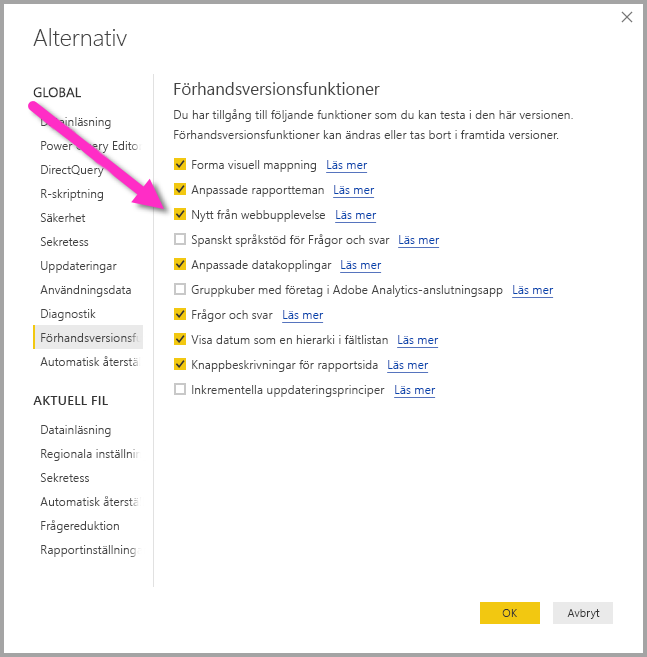

# Hämta data från en webbplats genom att ge ett exempel (förhandsgranskning)

Hämtning av data från en webbplats låter användare enkelt extrahera data från webbsidor och importera dessa data till **Power BI Desktop**. Många gånger finns data på webbsidor dock inte i välvårdade tabeller som är lätta att extrahera så det kan bli en utmaning att hämta data från sådana sidor, även om de är strukturerade och konsekventa. 

Det finns en lösning. Med funktionen **Hämta data från webben efter exempel**, kan du i princip visa **Power BI Desktop** vilka data som du vill extrahera genom att ge ett eller flera exempel i anslutningsdialogrutan så samlar den in övriga data på sidan som matchar dina exempel. Med den här lösningen kan du extrahera alla typer av data från webbsidor, inklusive data som hittats i tabeller *och* andra icke-tabelldata. 

## Aktivera förhandsfunktionen Hämta data från webben efter exempel

**Hämta data från webben efter exempel** är i förhandsversion och måste aktiveras i **Power BI Desktop**. För att aktivera det, väljer du **Arkiv > Alternativ och inställningar > Alternativ > Förhandsfunktioner** och väljer sedan kryssrutan **Ny från webbupplevelse**. Du måste starta om Power BI Desktop när du har gjort valet.

När förhandsfunktionen är aktiverad, är du redo att börja använda den. 

## Använd Hämta data från webben efter exempel

Om du vill använda **Hämta data från webben efter exempel** väljer du **Hämta data** från menyfliksområdet **Start**. I fönstret som visas väljer du **Övrigt** från kategorier i det vänstra fönstret och väljer sedan **Webb**.

Därifrån anger du URL för den webbsida som du vill extrahera data från. I den här artikeln använder vi Microsoft Store-webbplatsen och visar hur den här anslutningsappen fungerar. 

Om du vill följa med, kan du använda den [Microsoft Store-URL](https://www.microsoft.com/en-us/store/top-paid/games/xbox?category=classics) som vi använder i den här artikeln:

    https://www.microsoft.com/en-us/store/top-paid/games/xbox?category=classics

När du väljer **OK**, tas du till dialogrutan **Navigator** där alla automatiskt identifierade tabeller från webbsidan visas. I exemplet i bilden nedan hittades inga tabeller, men det finns en knapp längst ned på sidan som heter **Extrahera tabell med exempel** där du kan ange exempel.

Om du väljer **Extrahera tabell med exempel** så får du upp ett interaktivt fönster där du kan förhandsgranska innehållet på Webbsidor och ange exempelvärden för de data som du vill extrahera. 

I det här exemplet ska vi extrahera *Namn* och *Pris* för varje spel på sidan. Vi kan göra det genom att ange några exempel från sidan för varje kolumn, som visas i följande bild. Allteftersom exemplen skrivs in, kan **Power Query** (som är den underliggande teknik som hämtar data från webbsidan) extrahera data som passar mönstret för exempelposterna med hjälp av algoritmer för smart dataextrahering.

När vi är nöjda med de data som hämtats från webbsidan, väljer vi **OK** för att gå till **Frågeredigeraren**, där vi kan använda fler transformationer eller forma data, till exempel kombinera de med andra data från våra källor.

Därifrån kan du kan skapa visuell information eller på annat sätt använda webbsidans data när du skapar dina **Power BI Desktop**-rapporter.

## Nästa steg
Det finns en mängd olika typer av data du kan ansluta till med **Power BI Desktop**. Kolla in följande resurser för mer information om datakällor:

* [Lägg till kolumn efter exempel](desktop-add-column-from-example.md)
* [Anslut till en webbsida](desktop-connect-to-web.md)
* [Datakällor i Power BI Desktop](desktop-data-sources.md)
* [Forma och kombinera data i Power BI Desktop](desktop-shape-and-combine-data.md)
* [Anslut till Excel-arbetsböcker i Power BI Desktop](desktop-connect-excel.md)   
* [Anslut till CSV-filer i Power BI Desktop](desktop-connect-csv.md)   
* [Ange data direkt i Power BI Desktop](desktop-enter-data-directly-into-desktop.md)   

