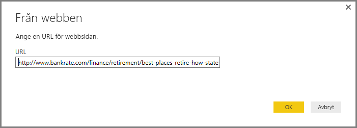
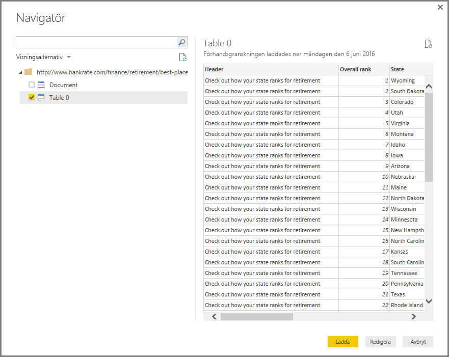

# Ansluta till en webbsida från Power BI Desktop
Du kan ansluta till en webbsida och importera data till Power BI Desktop för användning i visuella objekt och i datamodeller.

I **Power BI Desktop** väljer du **Hämta data > Webb** från fliken Start i menyfliksområdet.

En dialogruta visas som frågar om URL-adressen till sidan som du vill importera data från.

När du har skrivit (eller klistrat in) URL:en, väljer du **OK**. Power BI Desktop ansluter till sidan och sedan visas sidans tillgängliga data i fönstret **Navigator**. När du väljer ett av de tillgängliga dataelementen, till exempel en tabell över hela sidan, visar fönstret **Navigator** en förhandsgranskning av dessa data på höger sida av fönstret.

Du kan välja knappen **Redigera**, som startar **Frågeredigeraren** där du kan utforma och transformera data från OData-feeden innan du importerar dem till Power BI Desktop. Eller så kan du välja knappen **Hämta** och importera alla dataelement som du har valt i den vänstra rutan.

När vi väljer **Hämta** importerar Power BI Desktop de markerade objekten och gör dem tillgängliga i fönstret **Fält** tillgängliga på höger sida av vyn Rapporter i Power BI Desktop.

Svårare än så är det inte att ansluta till en webbplats och överföra dess data till Power BI Desktop.

Därifrån kan du dra fält till rapportarbetsytan och alla visuella objekt som du vill skapa. Du kan också använda data från webbplatsen precis som med andra data – du kan forma dem, skapa relationer mellan dem och andra datakällor i din modell och i övrigt göra vad du vill för att skapa den Power BI-rapporten du vill ha.

Om du vill lära dig mer om att ansluta till en webbplats, kan du läsa [Komma igång-guiden för Power BI Desktop](desktop-getting-started.md).

### Nästa steg
Det finns alla möjliga sorters data du kan ansluta till med Power BI Desktop. Kolla in följande resurser för mer information om datakällor:

* [Datakällor i Power BI Desktop](desktop-data-sources.md)
* [Forma och kombinera data i Power BI Desktop](desktop-shape-and-combine-data.md)
* [Anslut till Excel-arbetsböcker i Power BI Desktop](desktop-connect-excel.md)   
* [Anslut till CSV-filer i Power BI Desktop](desktop-connect-csv.md)   
* [Ange data direkt i Power BI Desktop](desktop-enter-data-directly-into-desktop.md)   

