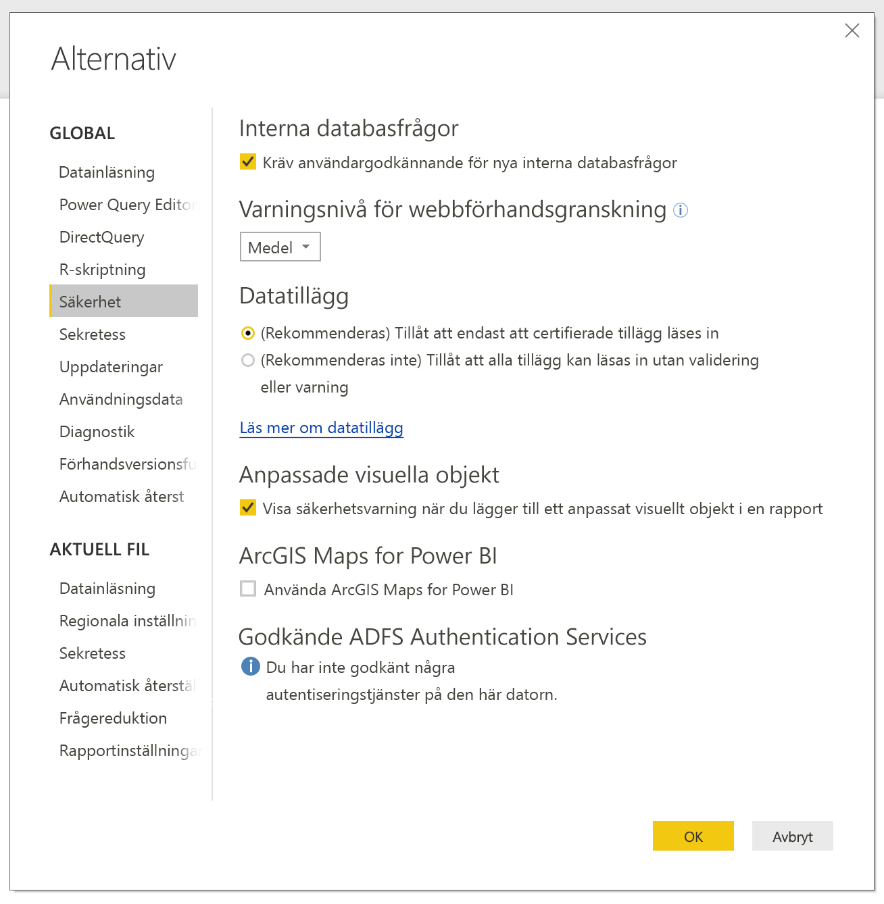
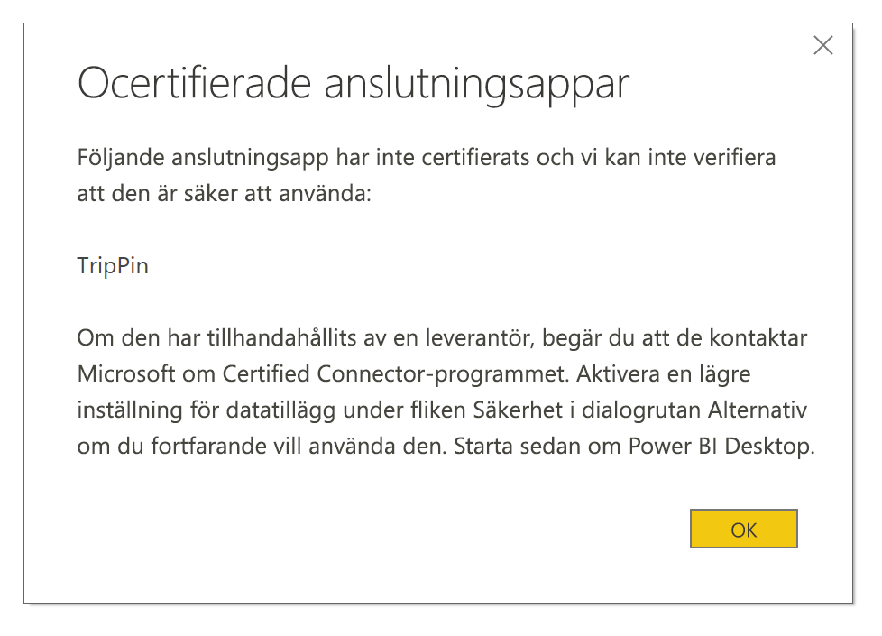

# Utökningsbarhet av anslutningsprogram i Power BI

Power BI kan ansluta till data med hjälp av befintliga anslutningsprogram och allmänna data källor som ODBC, OData, OLE DB, Web, CSV, XML och JSON. Utvecklare kan också aktivera nya datakällor med anpassade datatillägg som kallas *anpassade anslutningsprogram*. Vissa anpassade anslutningsprogram certifieras och distribueras av Microsoft som *certifierade kopplingar*.

Om du vill använda icke-certifierade anpassade anslutningsprogram som du eller en tredje part har utvecklat måste du justera säkerhetsinställningarna i Power BI Desktop så att tilläggen kan läsas in utan validering eller varningar. Eftersom den här koden kan hantera autentiseringsuppgifter, inklusive att skicka dem via HTTP, och ignorera sekretessnivåer ska du bara ändra den här säkerhetsinställningen om du litar helt och fullt på dina anpassade anslutningsprogram.

Ett annat alternativ är att utvecklaren signerar anslutningsprogrammet med ett certifikat och anger informationen du behöver för att använda det utan att ändra dina säkerhetsinställningar. Mer information finns i [Om betrodda anslutningsprogram från tredje part](desktop-trusted-third-party-connectors.md).

## Anpassade anslutningar

Icke-certifierade anpassade anslutningsprogram kan vara allt från små, affärskritiska API:er till stora, branschspecifika tjänster som Microsoft inte har publicerat något anslutningsprogram för. Många anslutningsprogram distribueras av leverantörerna. Om du behöver en specifik datakoppling kontaktar du leverantören. 

Om du vill använda ett icke-certifierat anpassat anslutningsprogram placerar du *.pq*-, *.pqx*-, *.m*- eller *.mez*-filen för anslutningsprogrammet i mappen *\[Dokument]\\Power BI Desktop\\Custom Connectors*. Skapa den här mappen om den inte redan finns.

Justera säkerhetsinställningarna för datatillägg så här:

Välj **Arkiv** > **Alternativ och inställningar** > **Alternativ** > **Säkerhet** i Power BI Desktop.

Under **Datatillägg** väljer du **(Rekommenderas inte) Tillåt att alla tillägg kan läsas in utan validering eller varning**. Välj **OK** och starta sedan om Power BI Desktop. 

Standardinställningen för datatillägg i Power BI Desktop är **(Rekommenderas) Tillåt endast Microsoft-certifierade och andra betrodda tillägg från tredje part att läsas in**. Om det finns icke-certifierade anpassade anslutningsprogram i systemet med den här inställningen så visas dialogrutan **Ocertifierade anslutningsappar** när du startar Power BI Desktop, där du ser vilka anslutningsprogram som inte går att läsa in säkert.

Du kan lösa det här problemet genom att antingen ändra säkerhetsinställningen **Datatillägg** eller ta bort de ocertifierade anslutningsprogrammen från mappen *Custom Connectors*.

## Certifierade kopplingar

En begränsad delmängd datatillägg betraktas som *certifierade*. Även om vi (Microsoft) distribuerar dessa anslutningsprogram ansvarar vi inte för deras prestanda eller funktion. Den tredjepartsutvecklare som har skapat anslutningsprogrammet ansvarar för underhåll och support. 

Du kan se certifierade anslutningsprogram från tredje part i listan i dialogrutan **Hämta data** i Power BI Desktop, tillsammans med de allmänna och vanliga anslutningsprogrammen. Du behöver inte ändra några säkerhetsinställningar för att använda certifierade anslutningsprogram.

Om du vill att ett anpassat anslutningsprogram ska certifieras ber du din leverantör att kontakta dataconnectors@microsoft.com.
