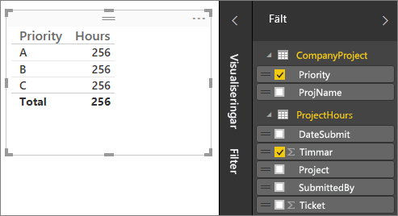
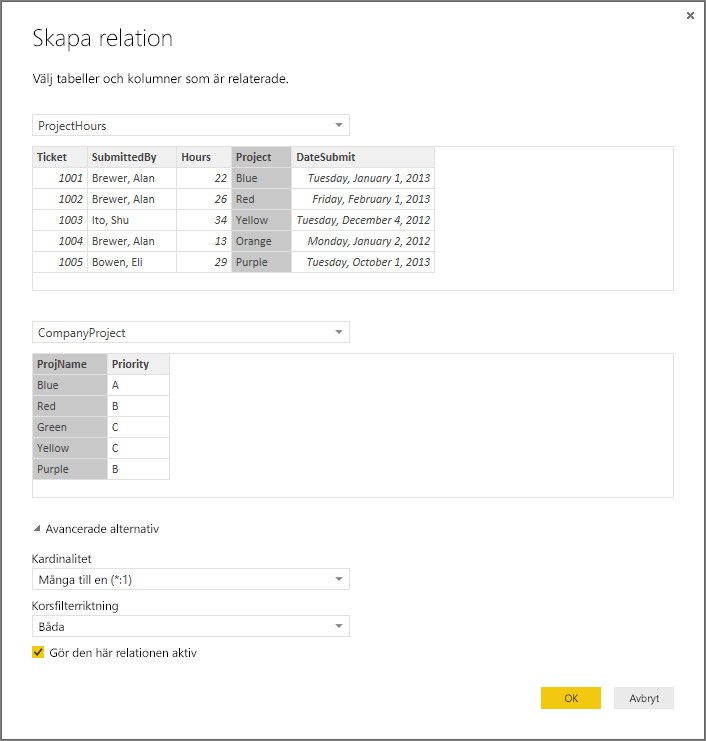
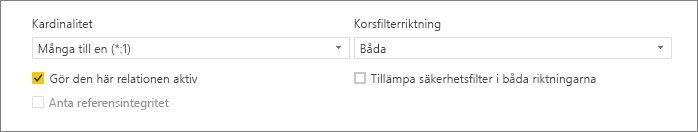
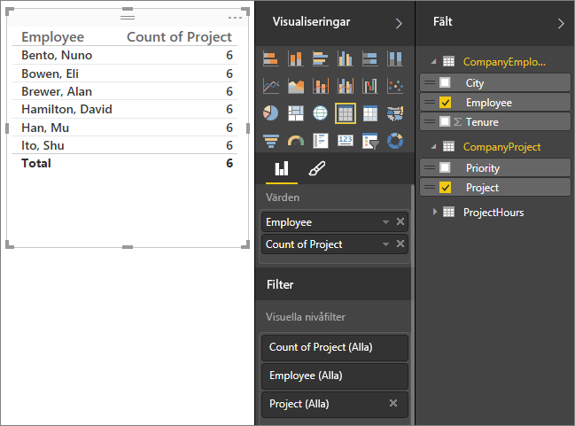
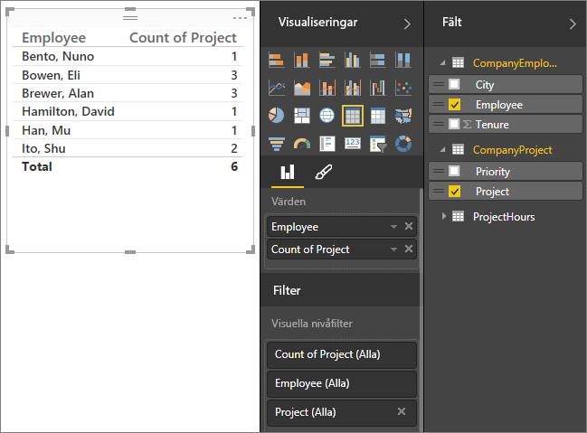
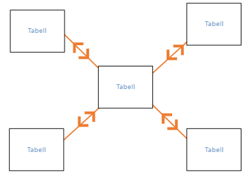
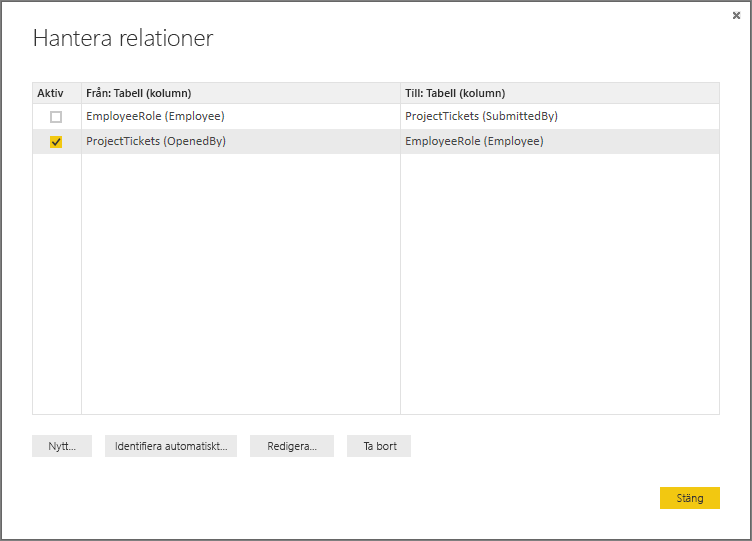
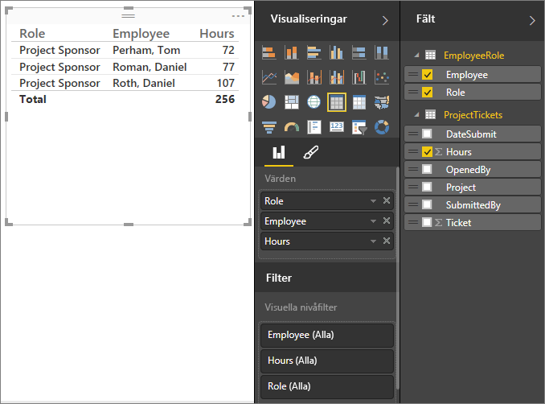
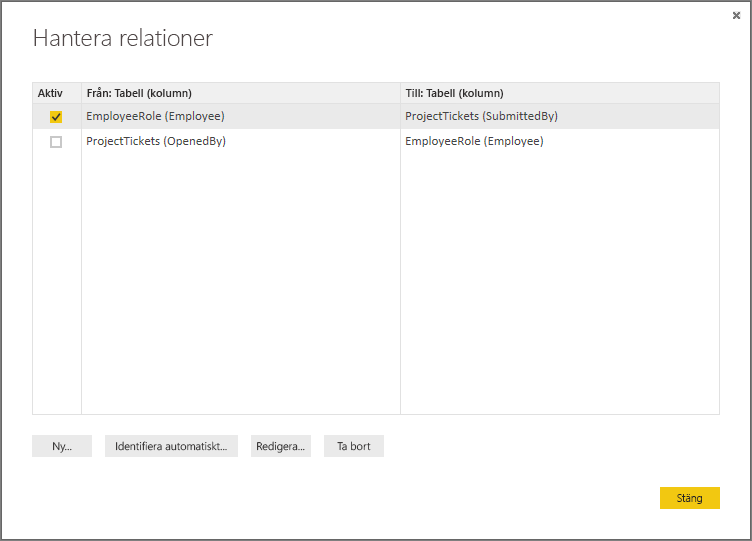

# Skapa och hantera relationer i Power BI Desktop
När du importerar flera tabeller är det möjligt att du kommer att utföra analyser med data från alla tabellerna. Det måste finnas relationer mellan dessa tabeller för att korrekt beräkna resultat och för att rätt information ska visas i dina rapporter. Med Power BI Desktop blir det enkelt att skapa dessa relationer. Det är faktiskt så att du inte behöver göra något alls i de flesta fall, funktionen Identifiera automatiskt gör det åt dig. I vissa fall kan du dock behöva skapa relationerna själv, eller behöva göra vissa ändringar i en relation. Oavsett vilket är det viktigt att förstå relationer i Power BI Desktop, samt hur du skapar och redigerar dem.

## Identifiera automatiskt under inläsning
Om du skickar frågor till två eller flera tabeller samtidigt, försöker Power BI Desktop hitta och skapa relationer åt dig när datan har lästs in. Kardinalitet, korsfilterriktning och aktiva egenskaper anges automatiskt. Power BI Desktop kontrollerar kolumnnamnen i tabellerna för att avgöra om det finns några möjliga relationer. Om det finns det skapas dessa relationer automatiskt. Om Power BI Desktop inte säkert kan fastställa att det finns en matchning, kommer inte relationen att skapas automatiskt. Du kan fortfarande använda dialogrutan Hantera relationer för att skapa eller redigera relationer.

## Skapa en relation med hjälp av Identifiera automatiskt
På fliken **Start** klickar du på **Hantera relationer** \> **Identifiera automatiskt**.

## Skapa en relation manuellt
1. På fliken **Start** klickar du på **Hantera relationer** \> **Ny**.
2. I dialogrutan **Skapa relation** väljer du en tabell i den första tabellens listruta. Markera sedan den kolumn som du vill använda i relationen.
3. I den andra tabellens listruta väljer du den andra tabell som du vill använda i relationen. Markera sedan den andra kolumn som du vill använda och klicka på **OK**.

Som standard konfigurerar Power BI Desktop kardinaliteten (riktningen), korsfilterriktningen och aktiva egenskaper för din nya relation automatiskt. Du kan dock ändra dem vid behov. Mer information finns i avsnittet Förstå ytterligare alternativ nedan.

Observera att ett felmeddelande visas som anger att *en av kolumnerna måste ha unika värden* om ingen av tabellerna som valts för relationen har unika värden. Minst en tabell i en relation *måste* har en distinkt, unik lista med nyckelvärden, vilket är ett vanligt krav för relationsdatabaser. 

Om felet visas kan du åtgärda det på ett par olika sätt:

* Skapa en kolumn med unika värden med hjälp av ”Ta bort dubblettraderna från tabellen”. Nackdelen med den här metoden är att du förlorar information när dubblettrader tas bort, och en nyckel (rad) dupliceras ofta av en särskild anledning.
* Lägg till en mellanliggande tabell som består av listan med distinkta nyckelvärden i modellen, som sedan kopplas till de båda ursprungliga kolumnerna i relationen.

Mer information finns i [blogginlägget](https://blogs.technet.microsoft.com/cansql/2016/12/19/relationships-in-power-bi-fixing-one-of-the-columns-must-have-unique-values-error-message/) som beskriver detta i detalj.

## Redigera en relation
1. På den **Start** klickar du på **Hantera relationer**.
2. I dialogrutan **Hantera relationer** väljer du relationen och klickar sedan på **Redigera**.

## Konfigurera ytterligare alternativ
Du kan konfigurera ytterligare alternativ när du skapar eller redigerar en relation.  Som standard konfigureras ytterligare alternativ automatiskt baserat på en kvalificerad gissning. Detta kan vara olika för varje relation baserat på data i kolumnerna.

## Kardinalitet
**Många-till-en (\*: 1)** – Det här är den vanligaste standardtypen. Det innebär att en kolumn i en tabell kan ha fler än en instans av ett värde och den andra relaterade tabellen (kallas ofta uppslagstabell) har endast en instans av ett värde.

**En-till-en (1:1)** – Detta innebär att kolumnen i en tabell endast har en instans av ett visst värde, och den andra relaterade tabellen endast har en instans av ett visst värde.

Se avsnittet Förstå ytterligare alternativ nedan för mer information om när du ska ändra kardinalitet.

## Korsfilterriktning
**Båda** – Det här är den vanligaste standardriktningen. Detta innebär för filtreringsändamål att båda tabellerna behandlas som om de är en enda tabell.  Detta fungerar bra med en tabell som har ett antal uppslagstabeller som omger den.  Ett exempel är en försäljningstabell med en uppslagstabell för avdelningar.  Det här kallas ofta en star-schemakonfiguration (en central tabell med flera uppslagstabeller.)  Men om du har två eller flera tabeller med uppslagstabeller (där några är gemensamma) kanske du inte vill använda inställningen Båda.  För att fortsätta med det tidigare exemplet har du i det här fallet också en budgetförsäljningstabell med målbudgeten för varje avdelning.  Och avdelningstabellen är kopplad till både försäljnings- och budgettabellen.  Undvik att inställningen Båda för den här typen av konfiguration.

**Enskild** – Detta innebär att filtrerade val i anslutna tabeller fungerar i den tabell där värdena aggregeras. Om du importerar en Power Pivot i Excel 2013 eller tidigare datamodell har alla relationer en enda riktning. 

Se avsnittet Förstå ytterligare alternativ nedan för mer information om när du ska ändra korsfilterriktningen.

## Gör den här relationen aktiv
Detta innebär att relationen fungerar som en aktiv standardrelation när alternativet är markerat.  I de fall där det finns fler än en relation mellan två tabeller, ger den aktiva relationen ett sätt för Power BI Desktop att automatiskt skapa visualiseringar som innehåller båda tabellerna.

Se avsnittet Förstå ytterligare alternativ nedan för mer information om när du ska göra en viss relation aktiv.

## Förstå relationer
När du har kopplat ihop två tabeller med en relation kan du arbeta med data i båda tabellerna som om de vore en enskild tabell. Detta innebär att du inte behöver bekymra dig om relationsinformation eller förenkla dessa tabeller till en enda tabell innan du importerar dem.  I många situationer kan Power BI Desktop automatiskt skapa relationer åt dig, så du kanske inte ens behöver skapa dessa relationer själv. Men om Power BI Desktop inte säkert kan avgöra om det ska finnas en relation mellan två tabeller, skapar den inte någon relation automatiskt. I så fall måste du skapa relationen.   

Låt oss göra en liten självstudie för att bättre se hur relationer fungerar i Power BI Desktop.

>[!TIP]
>Du kan slutföra den här lektionen själv. Kopiera tabellen ProjectHours nedan till ett Excel-kalkylblad, markera alla celler och klicka på **INSERT** \> **Tabell**. I dialogrutan **Skapa tabell** klickar du på **OK**. I **Tabellnamn** skriver du **ProjectHours**. Gör samma sak för CompanyProject-tabellen. Du kan sedan importera datan med hjälp av **Hämta data** i Power BI Desktop. Välj din arbetsbok och dina tabeller som en datakälla.

Den första tabellen, ProjectHours, är ett register för arbetsbiljetter med antal timmar som en person har arbetat med ett visst projekt.  

**ProjectHours**

| **Ticket** | **SubmittedBy** | **Hours** | **Project** | **DateSubmit** |
| ---:|:--- | ---:|:--- | ---:|
| 1001 |Brewer, Alan |22 |Blå |1/1/2013 |
| 1002 |Brewer, Alan |26 |Röd |2/1/2013 |
| 1003 |Ito, Shu |34 |Gul |12/4/2012 |
| 1004 |Brewer, Alan |13 |Orange |1/2/2012 |
| 1005 |Bowen, Eli |29 |Lila |10/1/2013 |
| 1006 |Bento, Nuno |35 |Grön |2/1/2013 |
| 1007 |Hamilton, David |10 |Gul |10/1/2013 |
| 1008 |Han, Mu |28 |Orange |1/2/2012 |
| 1009 |Ito, Shu |22 |Lila |2/1/2013 |
| 1010 |Bowen, Eli |28 |Grön |10/1/2013 |
| 1011 |Bowen, Eli |9 |Blå |10/15/2013 |

Den här andra tabellen, CompanyProject, är en lista över projekt med en tilldelad prioritet, A, B eller C. 

**CompanyProject**

| **ProjName** | **Priority** |
| --- | --- |
| Blå |A |
| Röd |B |
| Grön |C |
| Gul |C |
| Lila |B |
| Orange |C |

Observera att varje tabell har en projektkolumn. Alla har lite olika namn, men värdena ser ut som om de är samma. Det här är viktigt och vi kommer tillbaka till det om en liten stund.

Nu när vi har importerat våra två tabeller till en modell kan vi skapa en rapport. Det första vi ska hämta är antalet timmar som skickats in efter projektprioritet, så vi väljer **Priority** och **Hours** från Fält.

 

Om du tittar på vår tabell i rapportarbetsytan ser du att antalet timmar är **256,00** för varje projekt och det är också det totala antalet. Detta kan ju såklart inte stämma. Varför? Det beror på att vi inte kan beräkna en totalsumma för värdena i en tabell (Hours i tabellen Project), segmenterade efter värden i en annan tabell (Priority i tabellen CompanyProject), utan att ha en relation mellan de två tabellerna.

Därför ska vi nu skapa en relation mellan de två tabellerna.

Kommer du ihåg de kolumner som vi såg i båda tabellerna med ett projektnamn, men med värden som såg likadana ut? Vi ska använda de här två kolumnerna för att skapa en relation mellan våra tabeller.

Varför dessa kolumner? Om vi tittar på kolumnen Project i tabellen ProjectHours ser vi också värden som Blå, Röd, Gul, Orange osv. Vi ser i själva verket flera rader som har samma värde. Det innebär att vi har många färgvärden för Project.

Om vi tittar på kolumnen ProjName i tabellen CompanyProject ser vi att det bara finns en färg av varje för projektet. Varje färgvärde i den här tabellen är unikt och det är viktigt, eftersom vi då kan skapa en relation mellan de två tabellerna. I det här fallet en många-till-en-relation. I en många-till-en-relation måste minst en kolumn i någon av tabellerna innehålla unika värden. Det finns ett par ytterligare alternativ för vissa relationer och vi ska titta på dem senare, men nu ska vi skapa en relation mellan projektkolumnerna i våra två tabeller.

### Skapa en ny relation
1. Klicka på **Hantera relationer**.
2. I **Hantera relationer** klickar du på **Ny**. Dialogrutan **Skapa relation** öppnas där vi kan välja tabeller, kolumner och de ytterligare inställningar som vi vill ha för relationen.
3. I den första tabellen väljer du **ProjectHours**och kolumnen **Project**. Det här är en av flera sidor för vår relation.
4. I den andra tabellen väljer du **CompanyProject** och sedan kolumnen **ProjName**. Det här är den enda sidan för vår relation.  
5. Gå vidare genom att klicka på **OK** i dialogrutorna **Skapa relation** och **Hantera relationer**.

Du har nu skapat relationen på det svåra sättet. Du kunde bara ha klickat på knappen Identifiera automatiskt i dialogrutan Hantera relationer. Faktum är att Identifiera automatiskt skulle gjort det åt dig redan när du läste in data ifall båda kolumnerna hade samma namn. Men vad finns det för utmaning då?

Nu ska vi titta på tabellen på vår rapportarbetsyta igen.

 

Nu ser den betydligt bättre ut, inte sant?

När vi summerar timmarna efter prioritet letar Power BI Desktop efter varje förekomst av de unika färgvärdena i uppslagstabellen CompanyProject och sedan efter varje instans av de olika värdena i tabellen CompanyProject, samt beräknar totalsumman för varje unikt värde.

Detta var ganska enkelt och med Identifiera automatiskt hade du förmodligen inte behövt göra ens så här mycket.

## Förstå ytterligare alternativ
När en relation skapas, antingen med Identifiera automatiskt eller manuellt, konfigurerar Power BI Desktop automatiskt ytterligare alternativ baserat på data i tabellerna. Du kan konfigurera de här ytterligare relationsegenskaperna som du hittar i den nedersta delen av dialogrutan Skapa/Redigera relation.

 

Som nämnts tidigare anges dessa vanligtvis automatiskt och du behöver inte göra något själv. Det finns dock flera situationer där du kanske vill konfigurera de här alternativen.

## Framtida uppdateringar av datan kräver en annan kardinalitet
Power BI Desktop kan normalt sett avgöra den bästa kardinaliteten för relationen automatiskt.  Om du behöver åsidosätta den automatiska inställningen eftersom du vet att datan kommer att ändras i framtiden, kan du välja det i kontrollen Kardinalitet. Nu ska vi titta på ett exempel där vi måste välja en annan kardinalitet.

Tabellen CompanyProjectPriority nedan är en lista över alla företagets projekt och deras prioritet. Tabellen ProjectBudget är uppsättningen med projekt där budgeten har godkänts.

**ProjectBudget**

| **Approved Projects** | **BudgetAllocation** | **AllocationDate** |
|:--- | ---:| ---:|
| Blå |40 000 |12/1/2012 |
| Röd |100 000 |12/1/2012 |
| Grön |50 000 |12/1/2012 |

**CompanyProjectPriority**

| **Project** | **Priority** |
| --- | --- |
| Blå |A |
| Röd |B |
| Grön |C |
| Gul |C |
| Lila |B |
| Orange |C |

Om vi skapar en relation mellan projektkolumnen i tabellen CompanyProjectPriority och ApprovedProjects-kolumnen i tabellen ProjectBudget ser det ut så här:

 

Kardinaliteten är automatiskt inställd på En-till-en (1:1) och korsfiltreringen är Båda (enligt bilden).  Det beror på att för Power BI Desktop är den bästa kombinationen av två tabeller denna:

| **Project** | **Priority** | **BudgetAllocation** | **AllocationDate** |
|:--- | --- | ---:| ---:|
| Blå |A |40 000 |12/1/2012 |
| Röd |B |100 000 |12/1/2012 |
| Grön |C |50 000 |12/1/2012 |
| Gul |C |  |  |
| Lila |B |  |  |
| Orange |C |  |  |

Det finns en En-till-en-relation mellan våra två tabeller eftersom det inte finns några upprepade värden i den kombinerade tabellens projektkolumn. Kolumnen Project är unik och eftersom varje värde bara finns en gång kan raderna från de två tabellerna kombineras direkt utan att någon duplicering behövs.

Men vi antar att du vet att datan kommer att ändras nästa gång du uppdaterar den. I en uppdaterad version av tabellen ProjectBudget finns det nu nya rader för Blå och Röd:

**ProjectBudget**

| **Approved Projects** | **BudgetAllocation** | **AllocationDate** |
| --- | ---:| ---:|
| Blå |40 000 |12/1/2012 |
| Röd |100 000 |12/1/2012 |
| Grön |50 000 |12/1/2012 |
| Blå |80 000 |6/1/2013 |
| Röd |90 000 |6/1/2013 |

 Detta innebär att den bästa kombinationen av de två tabellerna nu ser ut så här: 

| **Project** | **Priority** | **BudgetAllocation** | **AllocationDate** |
| --- | --- | ---:| ---:|
| Blå |A |40 000 |12/1/2012 |
| Röd |B |100 000 |12/1/2012 |
| Grön |C |50 000 |12/1/2012 |
| Gul |C |  |  |
| Lila |B |  |  |
| Orange |C |  |  |
| Blå |A |80000 |6/1/2013 |
| Röd |B |90000 |6/1/2013 |

I den här nya kombinerade tabellen innehåller kolumnen Project upprepade värden.  De två ursprungliga tabellerna kommer inte ha någon En-till-en-relation när tabellen har uppdaterats. I det här fallet vet vi att de framtida uppdateringarna kommer orsaka att det finns dubbletter i kolumnen Project, så vi ställer in kardinaliteten som Många-till-en (\*:1), med Många på ProjectBudget-sidan och En på CompanyProjectPriority-sidan.

## Ändra korsfilterriktningen för en komplex uppsättning tabeller och relationer
I de flesta relationer anges korsfilterriktningen till ”Båda”.  Det finns dock vissa mer ovanliga situationer där du kan behöva ange detta på ett annat sätt, t.ex. om du importerar en modell från en äldre version av Power Pivot, där varje relation är inställd på en enda riktning. 

Med inställningen Båda kan Power BI Desktop hantera alla aspekter av de kopplade tabellerna som om de var en enda tabell.  Det finns dock vissa situationer där Power BI Desktop inte kan ange en relations korsfilterriktning till ”Båda” och samtidigt behålla en entydig uppsättning standardvärden i rapporteringssyfte. Om en relations korsfilterriktning inte är inställd på Båda är det vanligtvis eftersom det skulle skapa tvetydighet.  Om standardinställningen för korsfiltrering inte fungerar för dig, kan du försöka ange den för en viss tabell eller Båda.

En korsfiltrering i en riktning fungerar i många situationer.  Om du har importerat en modell från Power Pivot i Excel 2013 eller tidigare, är faktiskt alla relationer i en enda riktning.  Enkel riktning innebär att valen som filtreras i anslutna tabeller fungerar i den tabell där värdena aggregeras.  Ibland kan det vara svårt att förstå korsfiltrering, så vi tittar på ett exempel.

 

Om du skapar en rapport som sammanfattar projekttimmarna och använder korsfiltrering i en riktning, kan du sedan välja att sammanfatta (eller filtrera) efter CompanyProject, Priority eller CompanyEmployee, City.   Men om du vill räkna antalet medarbetare per projekt (en mindre vanlig fråga) fungerar det inte. Du får en kolumn med likadana värden.  I exemplet nedan har båda relationernas korsfiltreringsriktning angetts till en riktning – mot tabellen ProjectHours:

 

Filterspecifikationen flödar från CompanyProject till CompanyEmployee (som visas i bilden nedan), men det kommer inte att flöda upp till CompanyEmployee.  Men om du ställer in korsfiltreringsriktningen till Båda kommer den att fungera.  Med inställningen Båda kan filterspecifikationen flöda upp till Employee.

 

Nu när korsfiltreringsriktningen är inställd på Båda ser vår rapport korrekt ut:

 

Korsfiltrering i båda riktningarna fungerar bra vid ett mönster för tabellrelationer som ser ut som ovan. Detta kallas vanligtvis för ett star-schema, som detta:

 

Korsfiltreringens riktning fungerar inte särskilt bra med mer allmänna mönster som ofta finns i databaser, som i det här diagrammet:

 

Om du har ett tabellmönster med loopar som detta, kan korsfiltreringen skapa en tvetydig uppsättning relationer. Om du exempelvis summerar ett fält från TableX och sedan väljer att filtrera efter ett fält i TableY, är det oklart hur filtret ska färdas – via den översta tabellen eller den nedre tabellen. Ett vanligt exempel på den här typen av mönster är med TableX som en försäljningstabell med faktiska data och att TableY ska innehålla budgetdata. Sedan blir tabellerna i mitten uppslagstabeller som båda tabellerna använder, till exempel Division eller Region. 

Precis som med aktiva/inaktiva relationer tillåter Power BI Desktop inte att en relation anges som Båda om det kommer att skapa tvetydighet i rapporterna. Det finns flera olika sätt som du kan hantera detta på och här är de två vanligaste:

* Ta bort eller markera relationer som inaktiva för att minska tvetydighet. Sedan kan du kanske ange relationens korsfiltrering som Båda.
* Hämta en tabell två gånger (med ett annat namn den andra gången) för att undvika loopar.  Detta skapar ett relationsmönster som ett star-schema.  Med ett star-schema kan alla relationer anges som Båda.

## Fel aktiv relation
När Power BI Desktop skapar relationer automatiskt, påträffas ibland mer än en relation mellan två tabeller.  När detta inträffar anges endast en av relationerna som aktiv.  Den aktiva relationen fungerar som standardrelation, så när du väljer fält från två olika tabeller kan Power BI Desktop automatiskt skapa en visualisering åt dig.  I vissa fall kan den automatiskt valda relationen dock vara fel.  Du kan använda dialogrutan Hantera relationer för att ange en relation som aktiv eller inaktiv, eller så kan du ange den aktiva relationen i dialogrutan Redigera relation. 

För att se till att detta är standardrelationen tillåter Power BI Desktop bara en enda aktiv relation mellan två tabeller vid en viss tidpunkt.  Därför måste du först ange den aktuella relationen som inaktiv och sedan ange den relation som du vill ska vara aktiv.

Låt oss titta på ett exempel. Den första tabellen är ProjectTickets och nästa tabell är EmployeeRole.

**ProjectTickets**

| **Ticket** | **OpenedBy** | **SubmittedBy** | **Hours** | **Project** | **DateSubmit** |
| ---:|:--- |:--- | ---:|:--- | ---:|
| 1001 |Perham, Tom |Brewer, Alan |22 |Blå |1/1/2013 |
| 1002 |Roman, Daniel |Brewer, Alan |26 |Röd |2/1/2013 |
| 1003 |Roth, Daniel |Ito, Shu |34 |Gul |12/4/2012 |
| 1004 |Perham, Tom |Brewer, Alan |13 |Orange |1/2/2012 |
| 1005 |Roman, Daniel |Bowen, Eli |29 |Lila |10/1/2013 |
| 1006 |Roth, Daniel |Bento, Nuno |35 |Grön |2/1/2013 |
| 1007 |Roth, Daniel |Hamilton, David |10 |Gul |10/1/2013 |
| 1008 |Perham, Tom |Han, Mu |28 |Orange |1/2/2012 |
| 1009 |Roman, Daniel |Ito, Shu |22 |Lila |2/1/2013 |
| 1010 |Roth, Daniel |Bowen, Eli |28 |Grön |10/1/2013 |
| 1011 |Perham, Tom |Bowen, Eli |9 |Blå |10/15/2013 |

**EmployeeRole**

| **Employee** | **Role** |
| --- | --- |
| Bento, Nuno |Projektledare |
| Bowen, Eli |Projektledare |
| Brewer, Alan |Projektledare |
| Hamilton, David |Projektledare |
| Han, Mu |Projektledare |
| Ito, Shu |Projektledare |
| Perham, Tom |Projektsponsor |
| Roman, Daniel |Projektsponsor |
| Roth, Daniel |Projektsponsor |

Det finns faktiskt två relationer här. En är mellan SubmittedBy i tabellen ProjectTickets och Employee i tabellen EmployeeRole och den andra är mellan OpenedBy i tabellen ProjectTickets och Employee i tabellen EmployeeRole.

 

Om vi lägger till båda relationerna i modellen (OpenedBy först), kommer dialogrutan Hantera relationer visa att OpenedBy är aktiv:

 

Om vi nu skapar en rapport som använder fälten Role och Employee från EmployeeRole och fältet Hours från ProjectTickets i en tabellvisualisering på rapportarbetsytan, ser vi endast projektsponsorerna eftersom de är de enda som har öppnat en biljett för projektet.

 

Vi kan ändra den aktiva relationen och hämta SubmittedBy i stället för OpenedBy. I Hantera relationer avmarkerar vi ProjectTickets(OpenedBy) för relationen EmployeeRole(Employee) och sedan markerar vi Project Tickets(SubmittedBy) för relationen EmployeeRole(Employee).

## Se alla dina relationer i relationsvyn
Ibland kan din modell innehålla flera tabeller och komplexa relationer mellan dem. Relationsvyn i Power BI Desktop visar alla relationer i din modell, deras riktning och kardinalitet i ett anpassningsbart diagram som är lätt att förstå. Läs mer i [Relationsvy i Power BI Desktop](desktop-relationship-view.md).

