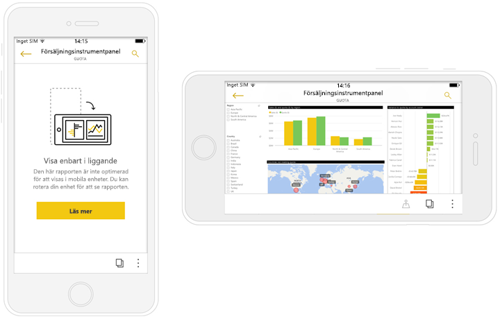

# Optimera Power BI-rapporter för mobilappen
Du kan förbättra upplevelsen av att visa rapporter i mobilapparna genom att skapa en stående layout. I Power BI Desktop och i Power BI-tjänsten ordnar du om och ändrar storlek på visuella objekt för att få en optimal upplevelse i stående läge.  

Letar du i stället efter information om visning av rapporter på en mobil enhet? Prova den här snabbstarten [Utforska instrumentpaneler och rapporter i Power BI-mobilappar](consumer/mobile/mobile-apps-quickstart-view-dashboard-report.md).

Du kan skapa [responsiva visuella objekt](#optimize-a-visual-for-any-size) och [responsiva utsnitt](#enhance-slicers-to-work-well-in-phone-reports) som anpassar sin storlek överallt. Om du lägger till filter i din rapport visas de automatiskt i den optimerade rapporten.

## Utforma en stående version av en rapportsida

När du har skapat en rapport kan du optimera den för telefoner och surfplattor.

1. Gå till fliken **Visa** och välj **Telefonlayout** i **rapportvyn** i Power BI Desktop.  
   
    
   
    Välj **Redigera rapport** > **Mobil layout** i Power BI-tjänsten.

    Du ser en tom arbetsyta som är formad som en telefon. Alla visuella objekt på den ursprungliga rapportsidan visas i fönstret **Visualiseringar** till höger.

1. Om du vill lägga till ett visuellt objekt i telefonlayouten drar du det från fönstret **Visualiseringar** till telefonens arbetsyta.
   
    Telefonrapporter använder sig av en rutnätslayout. När du drar visuella objekt till mobilarbetsytan fäster de vid rutnätet.
   
    
   
    Du kan lägga till några eller alla av huvudrapportsidans visuella objekt på telefonens rapportsida. Du kan lägga till varje visuellt objekt en gång och du behöver inte inkludera alla visuella objekt.

1. Du kan ändra storlek på de visuella objekten i rutnätet på samma sätt som med paneler på instrumentpaneler och mobila instrumentpaneler.
   
   Telefonens rapportrutnät anpassas till telefoner av olika storlekar, vilket innebär att din rapport kommer att se lika bra ut på telefoner med stora och små skärmar.
   
   

## Optimera ett visuellt objekt oavsett storlek
Du kan ange att de visuella objekten i din instrumentpanel eller rapport ska vara *dynamiska*. Visuella objekt kan ändras dynamiskt så att den maximala mängden data och insikter visas, oavsett skärmstorlek. 

När ett visuellt objekt får en annan storlek prioriterar Power BI datavyn. Till exempel kan det ta bort utfyllnad och flytta förklaringen överst i det visuella objektet automatiskt, så att objektet förblir informativt även när det blir mindre.

Du väljer om du ska aktivera svarstider för varje visuellt objekt. Läs mer om att [optimera visuella objekt](visuals/desktop-create-responsive-visuals.md).

## Överväganden när man skapar telefonrapportlayouter
* För rapporter med flera sidor kan du optimera alla sidor eller enbart ett fåtal. 
* Om du har definierat en bakgrundsfärg för en rapportsida, kommer telefonrapporten ha samma bakgrundsfärg.
* Du kan inte ändra formateringsinställningarna för enbart telefonen. Formateringen är likadan mellan huvud- och mobillayouter. Exempelvis kommer teckenstorlekarna vara desamma.
* Om du vill ändra ett visuellt objekt, exempelvis dess formatering, datauppsättning, filter eller andra attribut, återgår du till det vanliga rapportredigeringsläget.
* I Power BI finns standardrubriker och sidnamn för telefonrapporter i mobilappen. Om du har skapat visuella textobjekt för rubriker och sidnamn i rapporten, kan du fundera på om de ska läggas till eller ej i telefonrapporterna.     

## Ta bort ett visuellt objekt från telefonlayouten
* Du tar bort ett visuellt objekt genom att markera **X** i det övre högra fönstret på det visuella objektet på telefonarbetsytan, eller genom att markera det och trycka på **Ta bort**.
  
   Om du tar bort det visuella objektet här tas det bara bort från telefonlayoutens arbetsyta. Det visuella objektet och den ursprungliga rapporten påverkas inte.
  
   

## Förbättra utsnitt så att de fungerar bra i telefonrapporter
Utsnitten ger filtrering av rapportdata på arbetsytan. När utformning av utsnitt sker i det vanliga rapportredigeringsläget, kan du ändra vissa utsnittsinställningar för att göra dem mer användbara i telefonrapporter:

* Bestäm om rapportläsarna ska kunna välja ett eller flera objekt.
* Placera en ruta runt utsnittet för att göra rapporten enklare att skanna.
* Gör utsnittet lodrätt, vågrätt eller *dynamiskt*. 

Om du gör utsnittet dynamiskt, visar det fler eller färre alternativ när du ändrar storleken eller formen. Det kan vara högt, kort, brett eller smalt. Om du gör det tillräckligt litet, blir det bara en filterikon på rapportsidan. 

Läs mer om att [skapa dynamiska utsnitt](power-bi-slicer-filter-responsive.md).

## Publicera en telefonrapport
Om du vill publicera en telefonversion av en rapport [publicerar du huvudrapporten från Power BI Desktop till Power BI-tjänsten](desktop-upload-desktop-files.md). Telefonversionen publiceras samtidigt.
  
Läs mer om [delning och behörigheter i Power BI](service-how-to-collaborate-distribute-dashboards-reports.md).

## Visa optimerade och icke-optimerade rapporter i en telefon eller surfplatta
I mobilapparna för telefoner hittar Power BI automatiskt optimerade och icke-optimerade telefonrapporter. Om det finns en telefonoptimerad rapport kommer Power BI-telefonappen automatiskt öppna den i telefonrapportläge.

Om det inte finns någon telefonoptimerad rapport kommer rapporten öppnas i en icke-optimerad liggande vy.  

När du är i telefonrapporten kommer rapporten öppnas i en icke-optimerad vy med den ursprungliga rapportlayouten när du ändrar telefonens orientering till liggande, oavsett om rapporten är optimerad eller ej.

Om du enbart optimerar vissa sidor kommer läsarna att se ett meddelande i stående vy som visar att rapporten är tillgänglig i liggande vy.

Rapportläsarna kan vrida sina telefoner eller surfplattor åt sidan för att se rapporten i liggande läge. Läs mer om att [använda Power BI-rapporter som är optimerade för stående läge](consumer/mobile/mobile-apps-view-phone-report.md).

## Nästa steg
* [Skapa en telefonvy av en instrumentpanel i Power BI](service-create-dashboard-mobile-phone-view.md).
* [Visa Power BI-rapporter som är optimerade för din telefon](consumer/mobile/mobile-apps-view-phone-report.md).
* [Skapa dynamiska visuella objekt som optimerats för alla storlekar](visuals/desktop-create-responsive-visuals.md).
* Har du fler frågor? [Fråga Power BI Community](https://community.powerbi.com/).

