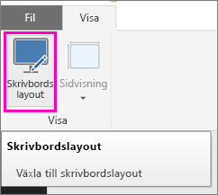
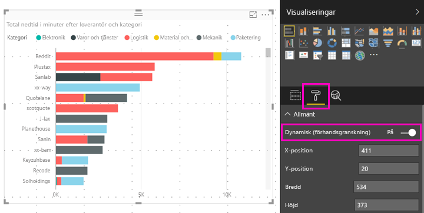

# Optimera ett visuellt Power BI-objekt oavsett storlek
När du skapar en ny rapport är de visuella objekten som standard *dynamiska*: De ändras dynamiskt så att maximal mängd data och insikter kan visas, oavsett skärmstorlek. När det gäller äldre rapporter kan du konfigurera deras visuella objekt så att även de ändrar storlek dynamiskt.

När ett visuellt objekt får en annan storlek prioriterar Power BI datavyn, genom att till exempel ta bort utfyllnad och flytta förklaringen överst i det visuella objektet automatiskt, så att objektet förblir informativt även när det blir mindre. Svarstiden är särskilt användbar i visuella objekt i Power BI-mobilappen på telefoner.

Alla visuella objekt med X- och Y-axlar, och utsnitt, kan ändra storlek dynamiskt.

## Aktivera svarstider i Power BI Desktop
1. I äldre rapporter i Power BI Desktop går du till fliken **Visa** och kontrollerar att du befinner dig i **Skrivbordslayout**.
   
    
2. Välj ett visuellt objekt och i fönstret **Visualiseringar** väljer du avsnittet **Format**.
3. Expandera **Allmänt** > och dra **Dynamisk** till **På**.
   
    
   
     Nu när du [skapar en rapport som är optimerad för telefonen](desktop-create-phone-report.md) och lägger till det här visuella objektet, ändras storleken på ett smidigt sätt.

## Aktivera svarstider i Power BI-tjänsten
Du kan aktivera svarstiden för ett visuellt objekt i en äldre rapport i Power BI-tjänsten. Du måste kunna redigera rapporten.

1. Välj **Redigera rapport** i en rapport i Power BI-tjänsten ([https://powerbi.com](https://powerbi.com)).
2. Välj ett visuellt objekt och i fönstret **Visualiseringar** väljer du avsnittet **Format**.
3. Expandera **Allmänt** > och dra **Dynamisk** till **På**.
   
    
   
     Nu när du [skapar en telefonvy av den här rapporten](desktop-create-phone-report.md) och lägger till det här visuella objektet så ändras storleken på ett smidigt sätt.

## Nästa steg
* [Skapa rapporter som är optimerade för Power BI-telefonappar](desktop-create-phone-report.md)
* [Visa Power BI-rapporter som är optimerade för din telefon](mobile-apps-view-phone-report.md)
* Har du fler frågor? [Fråga Power BI Community](http://community.powerbi.com/)

