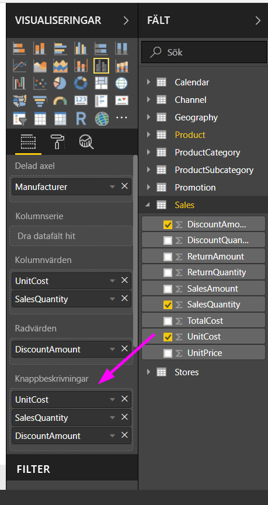
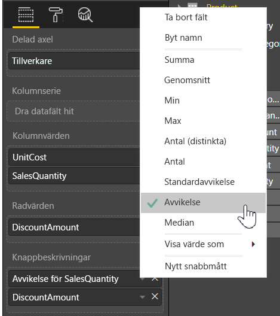

# Anpassa knappbeskrivningar i Power BI Desktop
Knappbeskrivningar är ett elegant sätt att visa sammanhanget och detaljerad information om datapunkter. Följande bild visar en knappbeskrivning som tillämpas på ett diagram i Power BI Desktop.

När ett visuellt objekt skapas visas standardknappbeskrivningen datapunktens värde och kategori. Det finns många fall då det vore användbart att kunna anpassa knappbeskrivningen och visa sammanhanget eller mer information för de användare som tittar på det visuella objektet. Med anpassade knappbeskrivningar kan du ange fler datapunkter som ska visas som del av knappbeskrivningen.

## Så här gör du för att anpassa knappbeskrivningar
Om du vill skapa en anpassad knappbeskrivning går du till brunnen **Fält** i fönstret **Visualiseringar**. Sedan drar du ett fält till bucketen **Knappbeskrivningar** enligt vad som visas i följande bild. I följande bild har två fält placerats i bucketen **Knappbeskrivningar**.

När knappbeskrivningarna har lagts till i fältbrunnen visas värden för dessa fält i knappbeskrivningen när du håller muspekaren över det visuella objektet.

## Anpassa knappbeskrivningar med aggregering eller snabberäkningar
Du kan anpassa en knappbeskrivning ytterligare genom att välja en aggregeringsfunktion eller en *Snabberäkning* genom att välja pilen bredvid fältet i bucketen **Knappbeskrivningar** och välja bland de tillgängliga alternativen.

Det finns många sätt att anpassa **knappbeskrivningar** med alla fält som är tillgängliga i din datamängd. Det gör att du kan förmedla snabb information och insikter till användare som tittar på dina instrumentpaneler och rapporter.

