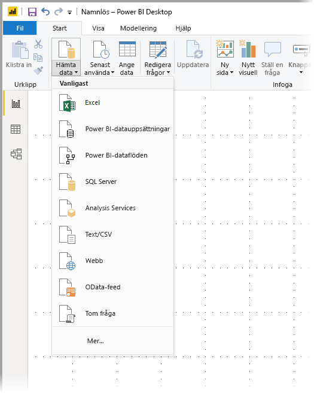
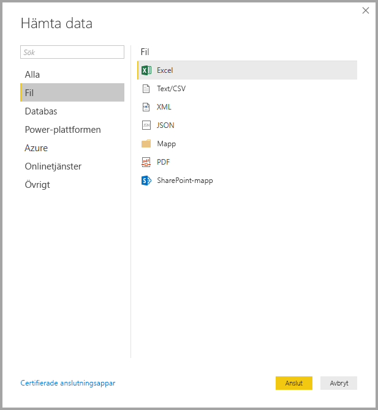
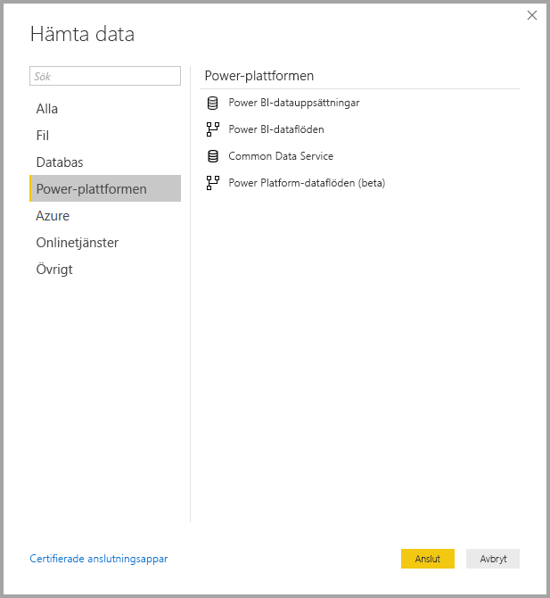
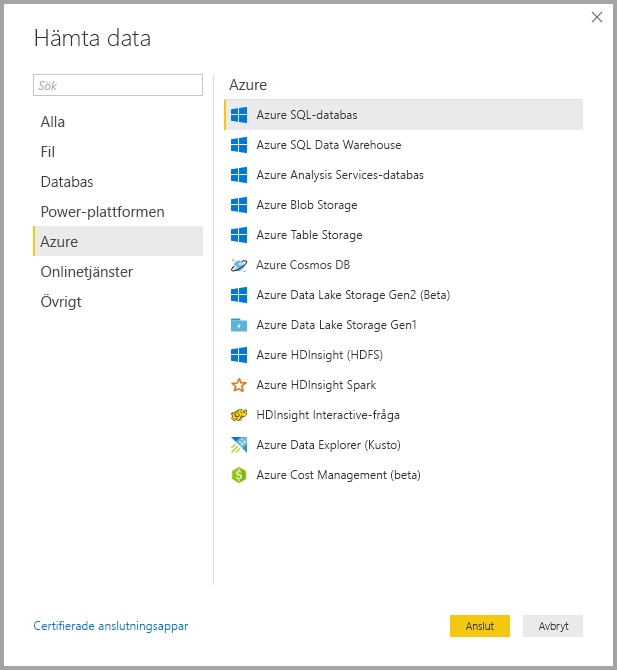
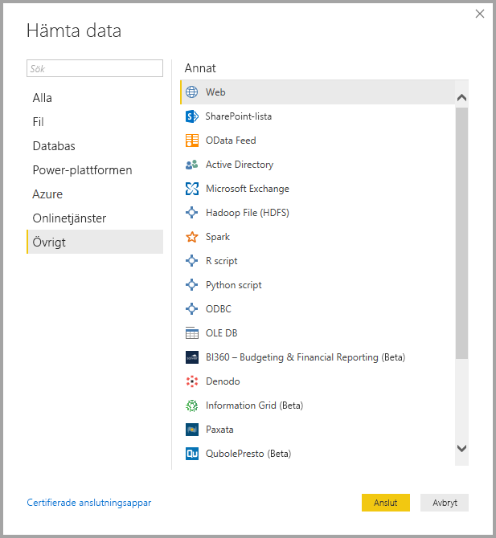
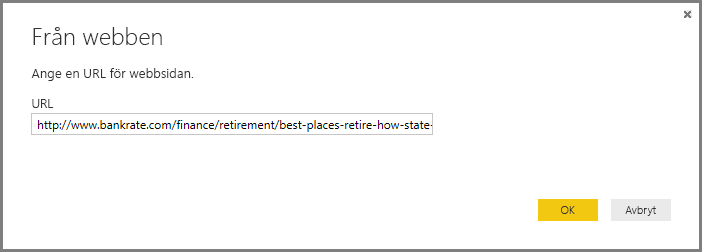
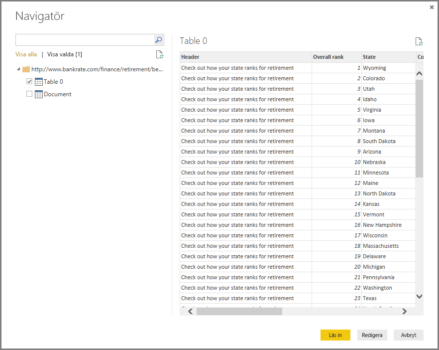

# <a name="data-sources-in-power-bi-desktop"></a>Datakällor i Power BI Desktop

Med Power BI Desktop kan du ansluta till data från många olika källor. En fullständig lista över tillgängliga datakällor finns i [Power BI-datakällor](power-bi-data-sources.md).

Anslut till data genom att välja **Hämta data** från menyfliksområdet **Start**. Om du väljer nedåtpilen eller texten **Hämta data** på knappen, visas menyn **Mest vanliga** datatyper, enligt följande bild:



Om du väljer **Mer...** från menyn **Mest vanliga** visas fönstret **Hämta data**. Du kan även öppna fönstret **Hämta data** (och kringgå menyn **Vanligast**) genom att välja **Hämta data**-**ikonknappen** direkt.


> [!NOTE]
> Power BI-teamet utökar kontinuerligt de datakällor som är tillgängliga för **Power BI Desktop** och **Power BI-tjänsten**. Därför visas ofta tidiga versioner av pågående datakällor markerade med *beta* eller *förhandsversion*. Alla datakällor som har markerats som *beta* eller *förhandsversion* har begränsad support och funktionalitet och ska inte användas i produktionsmiljöer. Dessutom kan det hända att datakällor som är markerade som *Beta* eller *Förhandsversion* för **Power BI Desktop** inte är tillgängliga för användning i **Power BI-tjänsten** eller andra Microsoft-tjänster förrän datakällan blir allmänt tillgänglig.

> [!NOTE]
> Det finns många dataanslutningar för Power BI Desktop som kräver Internet Explorer 10 (eller senare) för autentisering. 


## <a name="data-sources"></a>Datakällor
Datatyperna ordnas i följande kategorier:

* Alla
* Fil
* Databas
* Power BI
* Azure
* Onlinetjänster
* Annat

I kategorin **Alla** finns alla dataanslutningstyper från alla kategorier.

I kategorin **Fil** finns följande dataanslutningar:

* Excel
* Text/CSV
* XML
* JSON
* Mapp
* PDF
* SharePoint-mapp

Följande bild visar fönstret **Hämta data** för **Fil**.



Kategorin **Databas** innehåller följande dataanslutningar:

* SQL Server-databas
* Access-databas
* SQL Server Analysis Services-databas
* Oracle-databas
* IBM DB2-databas
* IBM Informix-databas (beta)
* IBM Netezza
* MySQL-databas
* PostgreSQL-databas
* Sybase-databas
* Teradata
* SAP HANA-databas
* SAP Business Warehouse Application Server
* SAP Business Warehouse Message Server
* Amazon Redshift
* Impala
* Google BigQuery
* Vertica
* Snowflake
* Essbase
* AtScale-kuber
* BI-anslutningsapp
* Dremio
* Exasol
* Indexima (Beta)
* InterSystems IRIS (Beta)
* Jethro (Beta)
* Kyligence Enterprise (Beta)
* MarkLogic (Beta)

> [!NOTE]
> Vissa databaskopplingar kräver att du aktiverar dem genom att välja **Arkiv > Alternativ och inställningar > Alternativ** sedan välja **Förhandsversionsfunktioner** och aktivera kopplingen. Om du inte ser några av de kopplingar som nämns ovan och vill använda dem, kontrollerar du dina inställningar för **Förhandsversionsfunktioner**. Observera att alla datakällor som har markerats som *beta* eller *förhandsversion* har begränsad support och funktionalitet och ska inte användas i produktionsmiljöer.

Följande bild visar fönstret **Hämta data** för **Databas**.


I **Power Platform**-kategorin finns följande dataanslutningar:

* Power BI-datauppsättningar
* Power BI-dataflöden
* Common Data Service
* Power Platform-dataflöden

Följande bild visar fönstret **Hämta data** för **Power Platform**.



Kategorin **Azure** innehåller följande dataanslutningar:

* Azure SQL Database
* Azure SQL Data Warehouse
* Azure Analysis Services-databas
* Azure Blob Storage
* Azure Table Storage
* Azure Cosmos DB
* Azure Data Lake Storage Gen2
* Azure Data Lake Storage Gen1
* Azure HDInsight (HDFS)
* Azure HDInsight Spark
* HDInsight Interactive-fråga
* Azure Data Explorer (Kusto)
* Azure Cost Management
* Azure Time Series Insights (beta)

Följande bild visar fönstret **Hämta data** för **Azure**.



Kategorin **Onlinetjänster** innehåller följande dataanslutningar:

* SharePoint Online-lista
* Microsoft Exchange Online
* Dynamics 365 (online)
* Dynamics NAV
* Dynamics 365 Business Central
* Dynamics 365 Business Central (lokal)
* Microsoft Azure Consumption Insights (beta)
* Azure DevOps (Beta)
* Azure DevOps Server (Beta)
* Salesforce-objekt
* Salesforce-rapporter
* Google Analytics
* Adobe Analytics
* appFigures (beta)
* Data.World – Hämta datauppsättning (beta)
* Facebook
* GitHub (beta)
* MailChimp (beta)
* Marketo (beta)
* Mixpanel (beta)
* Planview Enterprise One – PRM (beta)
* Planview Projectplace (beta)
* QuickBooks Online (beta)
* Smartsheet
* SparkPost (beta)
* Stripe (beta)
* SweetIQ (beta)
* Planview Enterprise One – CMT (beta)
* Twilio (beta)
* tyGraph (beta)
* Webtrends (beta)
* Zendesk (beta)
* Dynamics 365 Customer Insights (Beta)
* Emigo Data Source (Beta)
* Entersoft Business Suite (Beta)
* Industrial App Store
* Intune Data Warehouse (Beta)
* Microsoft Graph Security (Beta)
* Quick Base
* TeamDesk (beta)


Följande bild visar fönstret **Hämta data** för **Onlinetjänster**.


Kategorin **Övrigt** innehåller följande dataanslutningar:

* Webben
* SharePoint-lista
* OData-feed
* Active Directory
* Microsoft Exchange
* Hadoop-fil (HDFS)
* Spark
* R-skript
* Python-skript
* ODBC
* OLE DB
* BI360 –Budgeting & Financial Reporting (Beta)
* Denodo
* Information Grid (Beta)
* Paxata 
* QubolePresto (Beta)
* Roamler (Beta)
* SurveyMonkey (Beta)
* Tenforce (Smart)List (Beta)
* Workforce Dimensions (Beta)
* Tom fråga

Följande bild visar fönstret **Hämta data** för **Övrigt**.



> [!NOTE]
> För tillfället går det inte att ansluta till anpassade datakällor som skyddas med Azure Active Directory.

## <a name="connecting-to-a-data-source"></a>Ansluta till en datakälla
Anslut till en datakälla genom att välja datakällan i fönstret **Hämta data** och välja **Anslut**. I följande bild har **Webb** valts från dataanslutningskategorin **Övrigt**.


Ett fönster för anslutningen visas, specifik för dataanslutningstypen. Om det krävs autentiseringsuppgifter uppmanas du att ange dem. Följande bild visar en URL som anges för att ansluta till en webbdatakälla.



När URL:en eller anslutningsinformationen för resursen har angetts, väljer du **OK**. Power BI Desktop ansluter till datakällan och visar tillgängliga datakällor i **navigatören**.



Du kan antingen läsa in data genom att välja knappen **Läs in** längst ned i **navigatören**, eller redigera frågan innan du läser in data genom att välja knappen **Redigera**.

Det är allt du behöver veta om att ansluta till datakällor i Power BI Desktop! Försök att ansluta till data från våra växande lista med datakällor och kom tillbaka ofta – vi fyller på listan hela tiden.

## <a name="using-pbids-files-to-get-data"></a>Hämta data med PBIDS-filer

PBIDS-filer är Power BI Desktop-filer med en speciell struktur där ett .PBIDS-tillägg visar att det är en Power BI-datakällfil.

Du kan skapa en .PBIDS-fil för att effektivisera **Hämta data**-upplevelsen för rapportskapare i din organisation. Vi rekommenderar att administratörer skapar dessa filer för vanliga anslutningar, för att underlätta användningen av PBIDS-filer för nya rapportförfattare. 

När en författare öppnar en .PBIDS-fil, öppnas Power BI Desktop och användaren uppmanas att ange autentiseringsuppgifter för att kunna autentisera och ansluta till den datakälla som anges i filen. Navigeringsdialogrutan visas och användaren måste välja de tabeller från datakällan som ska läsas in i modellen. Användarna kan också behöva välja databas(er) om det inte har angetts någon i .PBIDS-filen. 

Från och med nu kan användaren börja skapa visualiseringar eller gå tillbaka till *Senast använda källor* för att läsa in en ny uppsättning tabeller i modellen. 

För närvarande har .PBIDS-filer bara stöd för en enda datakälla i en enda fil. Om du anger fler än en datakälla uppstår ett fel. 

För att skapa .PBIDS-filen måste administratören ange nödvändiga indata för en enskild anslutning och kan ange anslutningsläge, antingen **DirectQuery** eller **Import**. Om **läge** saknas eller är null i filen uppmanas användaren som öppnar filen i Power BI Desktop att välja DirectQuery eller Import. 

### <a name="pbids-file-examples"></a>Exempel på PBIDS-filer

Det här avsnittet innehåller några exempel på datakällor som används ofta. .PBIDS-filtypen stöder bara dataanslutningar som också stöds i Power BI Desktop, med två undantag: Live Connect och Tom fråga. 

.PBIDS-filen innehåller *inte* någon autentiseringsinformation eller tabell- och schemainformation.  

Nedan visas ett par vanliga exempel på .PBIDS-filer, men fler finns. För andra datakällor kan du referera till [DSR-formatet (Data Source Reference) för protokoll- och adressinformation](https://docs.microsoft.com/azure/data-catalog/data-catalog-dsr#data-source-reference-specification).

De här exemplen är bara tips, de är inte avsedda att vara heltäckande och inkluderar inte alla anslutningsprogram som stöds i DSR-formatet. Administratörer eller organisationer kan skapa sina egna datakällor med hjälp av de här exemplen som guider, som de kan använda för att skapa sina egna filer för datakällan. 


**Azure AS**
```
{ 
    "version": "0.1", 
    "connections": [ 
    { 
        "details": { 
        "protocol": "analysis-services", 
        "address": { 
            "server": "server-here" 
        }, 
        } 
    } 
    ] 
}
```


 

**Mapp**
```
{ 
  "version": "0.1", 
  "connections": [ 
    { 
      "details": { 
        "protocol": "folder", 
        "address": { 
            "path": "folder-path-here" 
        } 
      } 
    } 
  ] 
} 
```

**OData**
```
{ 
  "version": "0.1", 
  "connections": [ 
    { 
      "details": { 
        "protocol": "odata", 
        "address": { 
            "url": "URL-here" 
        } 
      } 
    } 
  ] 
} 
```
 
**SAP BW**
```
{ 
  "version": "0.1", 
  "connections": [ 
    { 
      "details": { 
        "protocol": "sap-bw-olap", 
        "address": { 
          "server": "server-name-here", 
          "systemNumber": "system-number-here", 
          "clientId": "client-id-here" 
        }, 
      } 
    } 
  ] 
} 
```
 
**SAP HANA**
```
{ 
  "version": "0.1", 
  "connections": [ 
    { 
      "details": { 
        "protocol": "sap-hana-sql", 
        "address": { 
          "server": "server-name-here:port-here" 
        }, 
      } 
    } 
  ] 
} 
```

**SharePoint-lista**

URL:en måste peka på själva SharePoint-webbplatsen och inte till en lista på webbplatsen. Användarna får en navigatör som de kan använda för att välja en eller flera listor från den platsen, där varje lista blir en tabell i modellen. 
```
{ 
  "version": "0.1", 
  "connections": [ 
    { 
      "details": { 
        "protocol": "sharepoint-list", 
        "address": { 
          "url": "URL-here" 
        }, 
       } 
    } 
  ] 
} 
```
 
 
**SQL Server**
```
{ 
  "version": "0.1", 
  "connections": [ 
    { 
      "details": { 
        "protocol": "tds", 
        "address": { 
          "server": "server-name-here", 
          "database": "db-name-here (optional) "
        } 
      }, 
      "options": {}, 
      "mode": "DirectQuery" 
    } 
  ] 
} 
```
 

**Textfil**
```
{ 
  "version": "0.1", 
  "connections": [ 
    { 
      "details": { 
        "protocol": "file", 
        "address": { 
            "path": "path-here" 
        } 
      } 
    } 
  ] 
} 
```
 

**Webb**
```
{ 
  "version": "0.1", 
  "connections": [ 
    { 
      "details": { 
        "protocol": "http", 
        "address": { 
            "url": "URL-here" 
        } 
      } 
    } 
  ] 
} 
```
 

**Dataflöde**
```
{
  "version": "0.1",
  "connections": [
    {
      "details": {
        "protocol": "powerbi-dataflows",
        "address": {
          "workspace":"workspace id (Guid)",
          "dataflow":"optional dataflow id (Guid)",
          "entity":"optional entity name"
        }
       }
    }
  ]
}
```


## <a name="next-steps"></a>Nästa steg
Det finns olika typer av saker som du kan göra med Power BI Desktop. Läs följande resurser för mer information om dess möjligheter:

* [Vad är Power BI Desktop?](desktop-what-is-desktop.md)
* [Frågeöversikt med Power BI Desktop](desktop-query-overview.md)
* [Datatyper i Power BI Desktop](desktop-data-types.md)
* [Forma och kombinera data i Power BI Desktop](desktop-shape-and-combine-data.md)
* [Vanliga frågeuppgifter i Power BI Desktop](desktop-common-query-tasks.md)    
