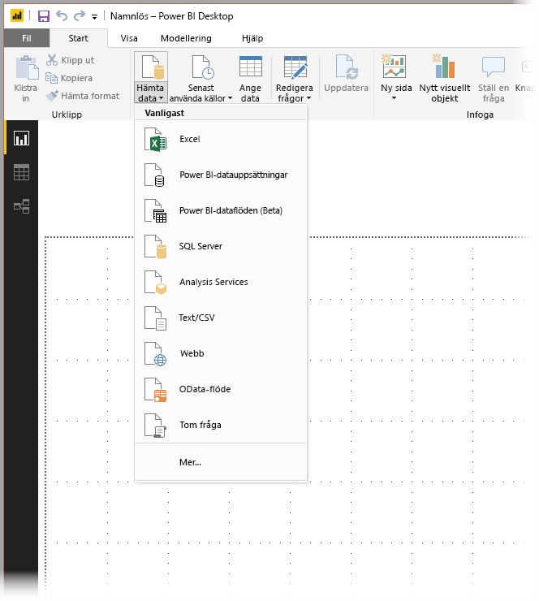
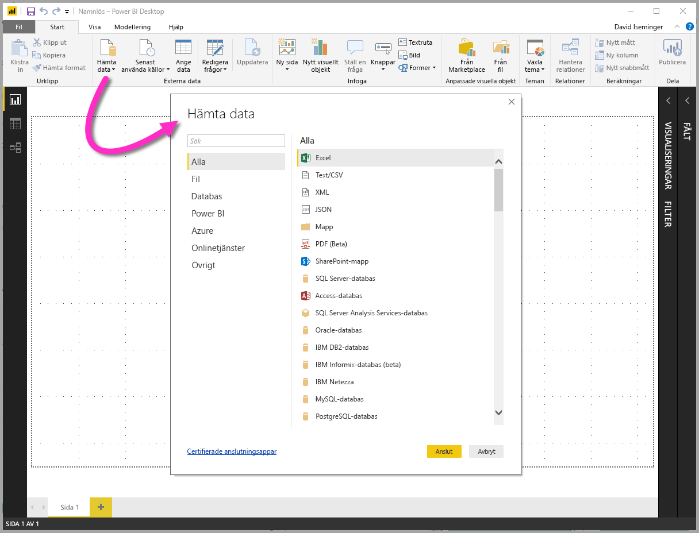
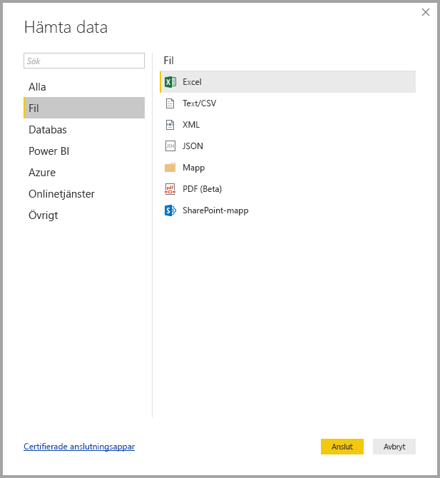
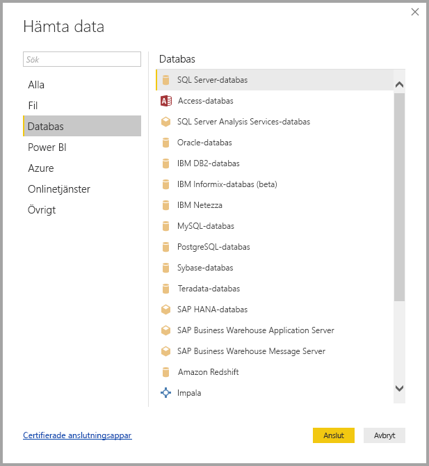
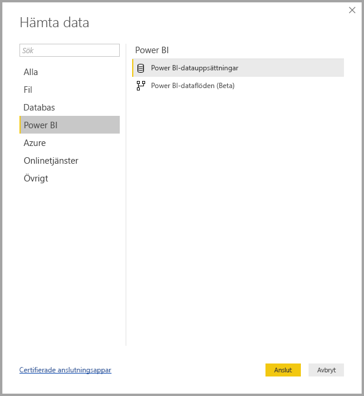
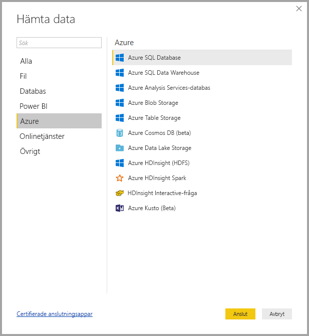
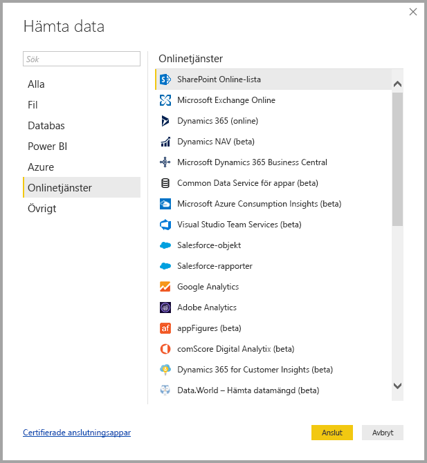
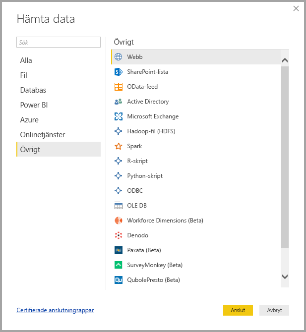
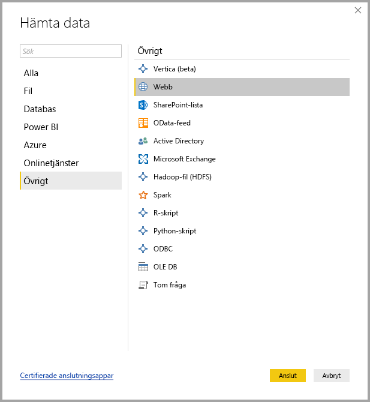

# Datakällor i Power BI Desktop
Med Power BI Desktop kan du ansluta till data från många olika källor. En fullständig lista med tillgängliga datakällor finns längst ned på den här sidan.

Anslut till data genom att välja **Hämta data** från menyfliksområdet **Start**. Om du väljer nedåtpilen eller texten **Hämta data** på knappen, visas menyn **Mest vanliga** datatyper, enligt följande bild:

Om du väljer **Mer...** från menyn **Mest vanliga** visas fönstret **Hämta data**. Du kan också öppna fönstret **Hämta data** (och kringgå menyn **Mest vanliga**) genom att välja **Hämta data**-**ikonen** direkt.

> [!NOTE]
> Power BI-teamet utökar kontinuerligt de datakällor som är tillgängliga för **Power BI Desktop** och **Power BI-tjänsten**. Därför visas ofta tidiga versioner av pågående datakällor markerade med *beta* eller *förhandsversion*. Alla datakällor som har markerats som *beta* eller *förhandsversion* har begränsad support och funktionalitet och ska inte användas i produktionsmiljöer.

## Datakällor
Datatyperna ordnas i följande kategorier:

* Alla
* Fil
* Databas
* Power BI
* Azure
* Onlinetjänster
* Övrigt

I kategorin **Alla** finns alla dataanslutningstyper från alla kategorier.

I kategorin **Fil** finns följande dataanslutningar:

* Excel
* Text/CSV
* XML
* JSON
* Mapp
* PDF (Beta)
* SharePoint-mapp

Följande bild visar fönstret **Hämta data** för **Fil**.

Kategorin **Databas** innehåller följande dataanslutningar:

* SQL Server-databas
* Access-databas
* SQL Server Analysis Services-databas
* Oracle-databas
* IBM DB2-databas
* IBM Informix-databas (beta)
* IBM Netezza
* MySQL-databas
* PostgreSQL-databas
* Sybase-databas
* Teradata-databas
* SAP HANA-databas
* SAP Business Warehouse Application Server
* SAP Business Warehouse Message Server
* Amazon Redshift
* Impala
* Google BigQuery
* Snowflake
* Essbase (Beta)
* BI-anslutningsapp
* Exasol
* Dremio (Beta)
* Jethro (Beta)
* Kyligence Enterprise (Beta)

> [!NOTE]
> Vissa databaskopplingar kräver att du aktiverar dem genom att välja **Arkiv > Alternativ och inställningar > Alternativ** sedan välja **Förhandsversionsfunktioner** och aktivera kopplingen. Om du inte ser några av de kopplingar som nämns ovan och vill använda dem, kontrollerar du dina inställningar för **Förhandsversionsfunktioner**. Observera att alla datakällor som har markerats som *beta* eller *förhandsversion* har begränsad support och funktionalitet och ska inte användas i produktionsmiljöer.

Följande bild visar fönstret **Hämta data** för **Databas**.

I **Power BI**-kategorin finns följande dataanslutningar:

* Power BI-datauppsättningar
* Power BI-dataflöden (Beta)

Följande bild visar fönstret **Hämta data** för **Power BI**.

Kategorin **Azure** innehåller följande dataanslutningar:

* Azure SQL Database
* Azure SQL Data Warehouse
* Azure Analysis Services-databas
* Azure Blob Storage
* Azure Table Storage
* Azure Cosmos DB (beta)
* Azure Data Lake Storage
* Azure HDInsight (HDFS)
* Azure HDInsight Spark
* HDInsight Interactive-fråga
* Azure Data Explorer (Beta)

Följande bild visar fönstret **Hämta data** för **Azure**.

Kategorin **Onlinetjänster** innehåller följande dataanslutningar:

* SharePoint Online-lista
* Microsoft Exchange Online
* Dynamics 365 (online)
* Dynamics NAV
* Dynamics 365 Business Central
* Dynamics 365 Business Central (lokal)
* Common Data Service för appar (beta)
* Microsoft Azure Consumption Insights (beta)
* Azure DevOps (Beta)
* Azure DevOps Server (Beta)
* Salesforce-objekt
* Salesforce-rapporter
* Google Analytics
* Adobe Analytics
* appFigures (beta)
* comScore Digital Analytix (beta)
* Dynamics 365 for Customer Insights (beta)
* Data.World – Hämta datauppsättning (beta)
* Facebook
* GitHub (beta)
* MailChimp (beta)
* Marketo (beta)
* Mixpanel (beta)
* Planview Enterprise One – PRM (beta)
* Planview Projectplace (beta)
* QuickBooks Online (beta)
* Smartsheet
* SparkPost (beta)
* Stripe (beta)
* SweetIQ (beta)
* Planview Enterprise One – CMT (beta)
* Twilio (beta)
* tyGraph (beta)
* Webtrends (beta)
* Zendesk (beta)
* TeamDesk (beta)

Följande bild visar fönstret **Hämta data** för **Onlinetjänster**.

Kategorin **Övrigt** innehåller följande dataanslutningar:

* Vertica
* Webb
* SharePoint-lista
* OData-feed
* Active Directory
* Microsoft Exchange
* Hadoop-fil (HDFS)
* Spark
* R-skript
* Python-skript
* ODBC
* OLE DB
* Denado
* Paxata (Beta)
* Tom fråga

Följande bild visar fönstret **Hämta data** för **Övrigt**.

> [!NOTE]
> För tillfället går det inte att ansluta till anpassade datakällor som skyddas med Azure Active Directory.

## Ansluta till en datakälla
Anslut till en datakälla genom att välja datakällan i fönstret **Hämta data** och välja **Anslut**. I följande bild har **Webb** valts från dataanslutningskategorin **Övrigt**.

Ett fönster för anslutningen visas, specifik för dataanslutningstypen. Om det krävs autentiseringsuppgifter uppmanas du att ange dem. Följande bild visar en URL som anges för att ansluta till en webbdatakälla.

När URL:en eller anslutningsinformationen för resursen har angetts, väljer du **OK**. Power BI Desktop ansluter till datakällan och visar tillgängliga datakällor i **navigatören**.

Du kan antingen läsa in data genom att välja knappen **Läs in** längst ned i **navigatören**, eller redigera frågan innan du läser in data genom att välja knappen **Redigera**.

Det är allt du behöver veta om att ansluta till datakällor i Power BI Desktop! Försök att ansluta till data från våra växande lista med datakällor och kom tillbaka ofta – vi fyller på listan hela tiden.

## Nästa steg
Det finns olika typer av saker som du kan göra med Power BI Desktop. Läs följande resurser för mer information om dess möjligheter:

* [Vad är Power BI Desktop?](desktop-what-is-desktop.md)
* [Frågeöversikt med Power BI Desktop](desktop-query-overview.md)
* [Datatyper i Power BI Desktop](desktop-data-types.md)
* [Forma och kombinera data i Power BI Desktop](desktop-shape-and-combine-data.md)
* [Vanliga frågeuppgifter i Power BI Desktop](desktop-common-query-tasks.md)    
