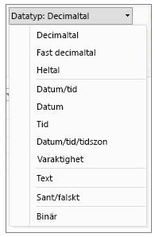
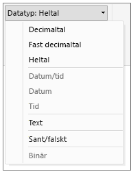

# Datatyper i Power BI Desktop
Den här artikeln beskriver datatyper som stöds i Power BI Desktop och dataanalysuttryck (DAX). 

När du läser in data i Power BI Desktop försöker den konvertera datatypen för källkolumnen till en datatyp som ger bättre stöd för effektivare lagring, beräkningar och datavisualisering. Om till exempel en kolumn med värden som du importerar från Excel saknar bråkvärden, konverterar Power BI Desktop hela datakolumnen till datatypen Heltal som passar bättre vid lagring.

Det här konceptet är viktigt eftersom vissa DAX-funktioner har särskilda datatypskrav. I många fall kommer DAX konvertera datatypen åt dig, men det finns tillfällen där det inte görs.  Om till exempel en DAX-funktion kräver datatypen Datum och datatypen för kolumnen är Text, fungerar DAX-funktionen inte korrekt.  Det är därför både viktigt och användbart att få rätt datatyp för en kolumn. Implicita konverteringar beskrivs senare i den här artikeln.

## Bestämma och ange datatyp för en kolumn
I Power BI Desktop kan du fastställa och ange datatyp för en kolumn i frågeredigeraren, i datavyn eller rapportvyn:

**Datatyper i frågeredigeraren**

**Datatyper i datavyn eller rapportvyn**

Listrutan Datatyp i frågeredigeraren har två datatyper som för närvarande inte finns i datavyn eller rapportvyn: **Datum/tid/tidszon** och **Varaktighet**. När en kolumn med dessa datatyper läses in i modellen och visas i datavyn eller rapportvyn, kommer en kolumn med datatypen Datum/tid/tidszon att konverteras till Datum/tid och en kolumn med datatypen Varaktighet kommer att konverteras till ett decimaltal.

### Nummertyper
Power BI Desktop stöder tre typer av nummer:

**Decimaltal** – Visar ett 64-bitars (8 byte) flyttalsnummer. Det är den vanligaste nummertypen och motsvarar tal som du vanligtvis ser dem.  Även om den är utformad att hantera tal med bråkvärden, hanterar den också heltal.  Typen Decimaltal kan hantera negativa värden från -1,79E +308 till -2,23E -308, 0 och positiva värden från 2,23E -308 till 1,79E + 308. Till exempel är siffror som 34, 34,01 och 34,000367063 giltiga decimaltal. Det största värdet som kan visas i typen Decimaltal är 15 siffror långt.  Decimaltecknet kan finnas var som helst i talet. Typen Decimaltal motsvarar hur Excel lagrar dessa tal.

**Fast decimaltal** – Har en fast plats för decimaltecknet. Decimaltecknet har alltid fyra siffror till höger och upp till 19 signifikanta siffror.  Det största värdet som kan visas är 922 337 203 685 477,5807 (positivt eller negativt).  Typen Fast decimaltal är användbar när avrundning kan leda till fel.  När du arbetar med många tal som har små bråkvärden kan de ibland ackumuleras och få fram ett tal som inte riktigt stämmer.  Eftersom värden efter fyra siffrorna till höger om decimaltecknet trunkeras, kan du med typen Fast decimaltal undvika dessa typer av fel.   Om du är bekant med SQL Server motsvarar datatypen SQL Servers decimal (19,4) eller valutadatatypen i Power Pivot. 

**Heltal** – Visar ett värde som 64-bitars heltal (8 byte). Eftersom det är ett heltal finns det inga siffror till höger om decimaltecknet. Det kan användas för 19 siffror, positiva eller negativa heltal mellan -9 223 372 036 854 775 808 (-2^63) och 9 223 372 036 854 775 807 (2^63-1).  Det kan visa det största möjliga talet i flera olika numeriska datatyper.  Precis som med Fast decimaltyp kan typen Heltal vara användbar i fall där du behöver styra avrundningen. 

### Datum/tid-typer
Power BI Desktop stöder fem datum/tid-datatyper i frågevyn och tre i rapportvyn och modellen.   Både datum/tid/tidszon och Varaktighet konverteras vid inläsningen till modellen.

**Datum/tid** – Visar både ett datum- och ett tidsvärde.  Datum/tidsvärdet lagras som typen Decimaltal.  Så du kan faktiskt konvertera mellan de två.   Tidsdelen i ett datum lagras som ett bråkvärde till hela multiplar av 1/300 sekunder (3,33 ms).  Datum mellan åren 1900 och 9999 stöds.

**Datum** – Visar bara ett datum (ingen tidsdel).  När datumet konverteras till modellen är det samma som ett datum/tid-värde med noll för bråkvärdet.

**Tid** – Visar bara tid (ingen datumdel).  När tidsvärdet konverteras till modellen är det samma som ett datum/tid-värde utan några siffror till vänster om decimaltecknet.

**Datum/tid/tidszon** – Visar UTC-datum/-tid.  För närvarande konverteras det till Datum/tid när det läses in i modellen.

**Varaktighet** – Visar en viss tidslängd. Den konverteras till typen Decimaltal när den läses in i modellen.  Som decimaltal kan den adderas eller subtraheras från ett datum/tid-fält med korrekta resultat.  Som decimaltal kan du lätt kan använda den i visualiseringar som visar omfattning.

### Texttyp
**Text**  – En datasträng med Unicode-tecken. Det kan vara strängar, tal eller datum som visas i ett textformat. Den maximala stränglängden är 268 435 456 Unicode-tecken (256 megatecken) eller 536 870 912 byte.

### Typen Sant/falskt
**Sant/falskt** – Ett booleskt värde för antingen sant eller falskt.

### Typen tomt/null
**Tomt** – Är en datatyp i DAX som visar och ersätter null-värden i SQL. Du kan skapa ett tomt värde med funktionen [BLANK](http://msdn.microsoft.com/library/ee634820.aspx) och testa om det finns några tomma värden med hjälp av den logiska funktionen [ISBLANK](https://msdn.microsoft.com/library/ee634204.aspx).

### Tabelldatatyp
DAX använder en tabelldatatyp i många funktioner, till exempel aggregeringar och beräkningar av tidsinformation. Vissa funktioner kräver en referens till en tabell. Andra funktioner returnerar en tabell som sedan kan användas som indata för andra funktioner. I vissa funktioner som kräver en tabell som indata, kan du ange ett uttryck som returnerar en tabell. För vissa funktioner krävs en referens till en bastabell. Information om kraven för specifika funktioner finns i [DAX-funktionsreferens](https://msdn.microsoft.com/library/ee634396.aspx).

## Implicit och explicit konvertering av datatyper i DAX-formler
Varje DAX-funktion har specifika krav beträffande vilka typer av data som används som indata och utdata. Till exempel kräver en del funktioner heltal för vissa argument och datum för andra, medan andra funktioner kräver text eller tabeller.

Om datan i kolumnen som du anger som ett argument inte är kompatibel med den datatyp som krävs av funktionen, returnerar DAX i många fall ett fel. Dock kan det hända att DAX försöker att implicit konvertera datan till den datatyp som krävs. Till exempel:

* Du kan ange ett datum som en sträng och DAX parsar då strängen och försöker omvandla den till ett Windows-format för datum och tid.
* Du kan lägga till TRUE + 1 och få resultatet 2, eftersom TRUE är implicit konverterat till talet 1 och åtgärden 1+1 utförs.
* Om du lägger till värden i två kolumner och det ena värdet visas som text ("12") och det andra som ett tal (12), konverterar DAX implicit strängen till ett tal och utför additionen för att få ett numeriskt resultat. Följande uttryck returnerar 44: = "22" + 22.
* Om du försöker sammanfoga två tal visar Excel dem som strängar och sammanfogar dem sedan. Följande uttryck returnerar "1234": = 12 & 34.

### Tabell med implicit datakonvertering
Vilken typ av konvertering som utförs bestäms av operatorn, som konverterar värdena om det krävs innan den begärda åtgärden utförs. I tabellerna visas en lista med operatorerna och den konvertering som utförs på varje datatyp i kolumnen när den paras ihop med datatypen i korsande raden.

> [!NOTE]
>  Textdatatyper ingår inte i dessa tabeller. När ett tal visas som ett textformat kommer Power BI i vissa fall försöka fastställa nummertypen och visa den som ett tal.
> 
> 

**Addition (+)**

| Operator(+) | INTEGER | CURRENCY | REAL | Datum/tid |
| --- | --- | --- | --- | --- |
| INTEGER |INTEGER |CURRENCY |REAL |Datum/tid |
| CURRENCY |CURRENCY |CURRENCY |REAL |Datum/tid |
| REAL |REAL |REAL |REAL |Datum/tid |
| Datum/tid |Datum/tid |Datum/tid |Datum/tid |Datum/tid |

Om till exempel ett reellt tal används i en addition i kombination med valutadata, konverteras båda värdena till REAL och resultatet returneras som REAL.

**Subtraktion (-)**

I följande tabell är radrubriken minuend (vänster sida) och kolumnrubriken är subtrahend (höger sida).

| Operator(-) | INTEGER | CURRENCY | REAL | Datum/tid |
| --- | --- | --- | --- | --- |
| INTEGER |INTEGER |CURRENCY |REAL |REAL |
| CURRENCY |CURRENCY |CURRENCY |REAL |REAL |
| REAL |REAL |REAL |REAL |REAL |
| Datum/tid |Datum/tid |Datum/tid |Datum/tid |Datum/tid |

Om till exempel om ett datum används i en subtraktion med någon annan datatyp, kommer båda värdena konverteras till datum och det returnerade värdet är också ett datum.

> [!NOTE]
>    Datamodeller stöder också den enställiga operatorn – (negativ), men den här operatorn ändrar inte datatyp för operanden.
> 
> 

**Multiplikation (*)**

| Operator(\*) | INTEGER | CURRENCY | REAL | Datum/tid |
| --- | --- | --- | --- | --- |
| INTEGER |INTEGER |CURRENCY |REAL |INTEGER |
| CURRENCY |CURRENCY |REAL |CURRENCY |CURRENCY |
| REAL |REAL |CURRENCY |REAL |REAL |

Om till exempel ett heltal kombineras med ett reellt tal i en multiplikation, kommer båda talen att konverteras till ett reellt tal och det returnerade värdet är också REAL.

**Division (/)**

I följande tabell är radrubriken täljaren och kolumnrubriken är nämnaren.

| Operator(/) (rad/kolumn) | INTEGER | CURRENCY | REAL | Datum/tid |
| --- | --- | --- | --- | --- |
| INTEGER |REAL |CURRENCY |REAL |REAL |
| CURRENCY |CURRENCY |REAL |CURRENCY |REAL |
| REAL |REAL |REAL |REAL |REAL |
| Datum/tid |REAL |REAL |REAL |REAL |

Om till exempel ett heltal kombineras med ett valutavärde i en division, kommer båda talen konverteras till reella tal och det returnerade värdet är också reellt.

### Jämförelseoperatorer
I jämförelseuttryck anses booleska värden vara större än strängvärden och strängvärden anses vara större än numeriska eller datum/tid-värden. Tal och datum/tid-värden anses ha samma rangordning. Inga implicita konverteringar utförs för booleska värden eller strängvärden. BLANK eller ett tomt värde konverteras till 0/""/false, beroende på datatypen för det andra jämförelsevärdet.

Följande DAX-uttryck visar hur det fungerar:

=IF(FALSE()\>"sant","Uttrycket är sant", "Uttrycket är falskt"), returnerar "Uttrycket är sant"

=IF("12"\>12,"Uttrycket är sant", "Uttrycket är falskt"), returnerar "Uttrycket är sant"

=IF("12"=12,"Uttrycket är sant", "Uttrycket är falskt"), returnerar "Uttrycket är falskt"

Konverteringar utförs implicit för numeriska eller datum/tid-typer enligt följande tabell:

| Jämförelseoperator | INTEGER | CURRENCY | REAL | Datum/tid |
| --- | --- | --- | --- | --- |
| INTEGER |INTEGER |CURRENCY |REAL |REAL |
| CURRENCY |CURRENCY |CURRENCY |REAL |REAL |
| REAL |REAL |REAL |REAL |REAL |
| Datum/tid |REAL |REAL |REAL |Datum/tid |

### Hantera tomma värden, tomma strängar och nollvärden
I DAX visas null-värden, tomma värden, tomma celler eller saknade värden med samma nya värdetyp, BLANK. Du kan dessutom skapa tomma värden med funktionen BLANK, eller testa om det finns tomma värden med funktionen ISBLANK.

Hur tomma värden ska hanteras i åtgärder som till exempel addition eller sammanfogning, beror på den enskilda funktionen. I följande tabell sammanfattas skillnaderna mellan DAX och Microsoft Excel-formler för hur tomma värden hanteras.

| Uttryck | DAX | Excel |
| --- | --- | --- |
| BLANK + BLANK |BLANK |0(zero) |
| BLANK + 5 |5 |5 |
| BLANK * 5 |BLANK |0(zero) |
| 5/BLANK |Infinity |Error |
| 0/BLANK |NaN |Error |
| BLANK/BLANK |BLANK |Error |
| FALSE OR BLANK |FALSE |FALSE |
| FALSE AND BLANK |FALSE |FALSE |
| TRUE OR BLANK |TRUE |TRUE |
| TRUE AND BLANK |FALSE |TRUE |
| BLANK OR BLANK |BLANK |Error |
| BLANK AND BLANK |BLANK |Error |

