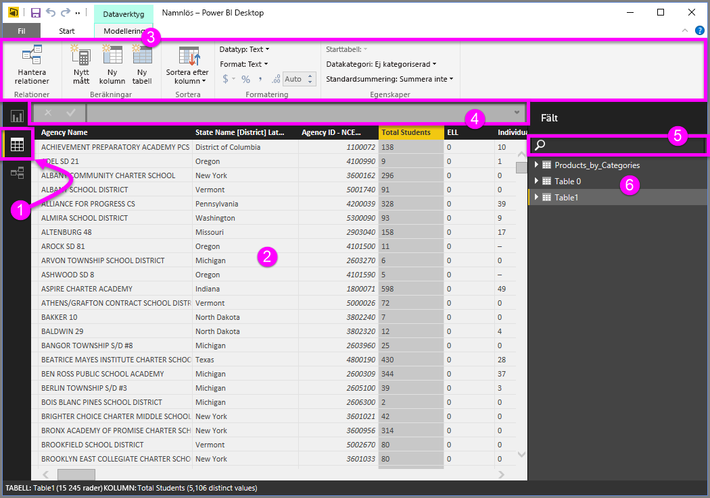

# Datavy i Power BI Desktop
**Datavyn** hjälper dig att inspektera, utforska och förstå data i Power BI Desktop-modellen. Det skiljer sig från hur du visar tabeller, kolumner och data i **frågeredigeraren**. I datavyn tittar du på dina data *efter* att de har lästs in i modellen.

När du utformar dina data, vill ibland du se vad som faktiskt finns i en tabell eller kolumn utan att skapa ett visuellt objekt på rapportarbetsytan, ofta på radnivå. Detta gäller särskilt när du skapar mått och beräknade kolumner och du behöver identifiera en datatyp eller datakategori.

Låt oss ta en närmare titt.

**1.** Ikonen datavy – Klicka här för att ange en datavy.

**2.** Datarutnät – visar den valda tabellen och alla kolumner och rader i den. Kolumner som inte visas i rapporten är nedtonade. Du kan högerklicka på en kolumn för alternativ.

**3.** Menyfliksområdet Modellering – hantera relationer, skapa beräkningar, ändra datatyp, format och datakategori för en kolumn.

**4.** Formelfält – ange DAX formler för mått och beräknade kolumner.

**5.** Sök – Sök efter en tabell eller kolumn i modellen.

**6.** Fältlista – Markera en tabell eller kolumn att visa i rutnätet.

