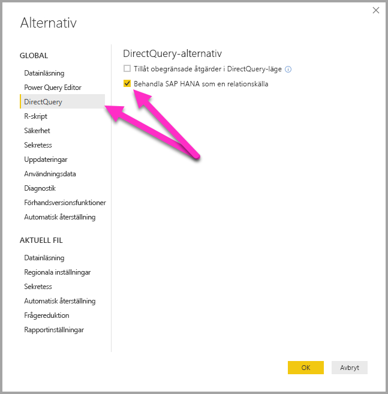
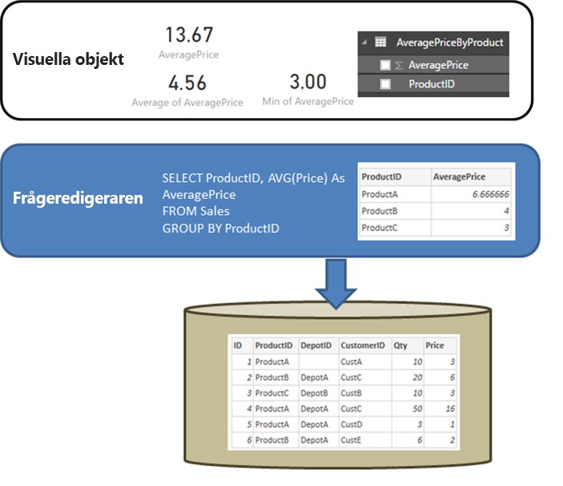

# DirectQuery och SAP HANA
Du kan ansluta till **SAP HANA**-datakällor direkt med **DirectQuery**. Det finns två alternativ när du ansluter till HANA:

* **Hantera HANA som en flerdimensionell källa (standard):** för närvarande i förhandsvisning och den nya standardinställningen. I det här fallet ska beteendet vara detsamma som när Power BI ansluter till andra flerdimensionella källor som SAP Business Warehouse eller Analysis Services. När du ansluter till HANA med den här inställningen väljs en enda analys eller beräkning och alla åtgärder, hierarkier och attribut för den vyn blir tillgängliga i fältlistan. Då visuell information skapas, kommer sammanställda data alltid att hämtas från HANA. Det här är den normala metod som rekommenderas.

* **Hantera HANA som en relationskälla:** I det här fallet behandlar Power BI HANA som relationskälla. Detta ger dig större flexibilitet, men var försiktig så att åtgärder aggregeras som förväntat och så att prestandaproblem undviks.

Den metod som används för att ansluta bestäms av ett alternativ för globala verktyg, vilket anges genom att välja **Fil > Alternativ och inställningar** och sedan **Alternativ > DirectQuery**, och sedan alternativet  **Hantera HANA som en relationskälla**, enligt följande bild. 

Observera att **SAP HANA-anslutningsapp** för närvarande är i **Förhandsgranskning** och måste aktiveras innan det alternativ som nämnts tidigare visas. Om du vill aktivera den nya förhandsgranskningsupplevelsen för SAP HANA markerar du den under **Alternativ > Förhandsgranskningsfunktioner**, enligt följande bild.

Alternativet att behandla HANA som en relationskälla styr den metod som används för alla *nya* anslutningar som skapats. Det har ingen effekt på några befintliga HANA-anslutningar i den aktuella rapporten eller på anslutningar i andra rapporter som är öppna. Om alternativet för närvarande är avmarkerat, gör tillägget av en ny anslutning till HANA med hjälp av **Hämta Data**, att anslutningen behandlar HANA som en flerdimensionella källa. Men om en annan rapport öppnas som också ansluter till HANA kommer rapporten fortsätta att fungera enligt det alternativ som angavs *när den skapades*. Det innebär att alla rapporter som ansluter till HANA som skapades före februari 2018 fortsätter att behandla HANA som en relationskälla. 

De två metoderna består av mycket olika beteenden och det går inte att växla en befintlig rapport från en metod till den andra. 

Nu ska vi titta på mer information om dessa två metoder var för sig.

## Hantera HANA som en flerdimensionell källa (standard)

Detta är standardbeteendet och det är för närvarande under förhandsgranskning. Följ stegen som beskrivs i föregående avsnitt för att aktivera alternativet Förhandsgranskning. 

När den här **Förhandsgransknings**funktionen är aktiverad i **Alternativ > Förhandsgranskningsfunktioner** (se tidigare avsnitt för anvisningar om hur du gör den här inställningen), använder alla nya anslutningar till HANA den här anslutningsmetoden som standard och behandlar HANA som en flerdimensionella källa. För att behandla en anslutning till HANA som relationskälla måste du välja **Fil > Alternativ och inställningar** och sedan kryssrutan under **Direct Query > Behandla HANA som relationskälla**. När den här funktionen är i **Förhandsgranskning**, *kan inte* rapporter som skapas med den flerdimensionella metoden publiceras till Power BI-tjänsten vilket leder till fel när rapporten öppnas i Power BI-tjänsten.  

När du ansluter till HANA som en flerdimensionell källa, gäller följande:

* I **Hämta datanavigatör**, kan en enda HANA-vy väljas. Det går inte att välja enskilda åtgärder eller attribut. Det finns ingen fråga definierad vid tidpunkten för anslutning, vilket skiljer sig från att importera data eller när du använder DirectQuery när du behandlar HANA som en relationskälla. Det innebär också att det inte går att använda en HANA SQL-fråga direkt när du väljer den här anslutningsmetoden.

* Alla åtgärder, hierarkier och attribut för den valda vyn kommer att visas i listan. 

* Då ett mått används i en visualisering efterfrågas HANA om att hämta måttvärdet på den aggregeringsnivå som krävs för visualiseringen. Så när du hanterar icke-additiva mått (räknare, kvoter och så vidare) utförs alla aggregeringar av HANA, och ingen ytterligare aggregering utförs av Power BI. 

* Vissa begränsningar måste införas för att säkerställa att rätt aggregeringsvärden alltid kan hämtas från HANA. T.ex. går det inte att lägga till beräknade kolumner eller kombinera data från flera HANA-vyer i samma rapport. 

Att behandla HANA som en flerdimensionell källa ger inte den större flexibilitet som tillhandahålls av *relations*metoden, men det är enklare och säkerställer rätt aggregeringsvärden när du hanterar mer komplexa HANA-åtgärder och ger vanligtvis bättre prestanda. 

Listan **Fält** kommer att innehålla alla åtgärder, attribut och hierarkier från HANA-vyn. Observera följande beteenden som gäller när du använder den här anslutningsmetoden:

* Alla attribut som ingår i minst en hierarki döljs som standard. Dock kan du se dem om det behövs genom att välja **Visa dolda** på snabbmenyn i fältlistan. På samma snabbmenyn kan de göras synliga, om det behövs.

* I HANA, kan du definiera ett attribut för att använda ett annat attribut som dess etikett. Till exempel kan **Produkt** (med värde 1,2,3 och så vidare) använda **ProductName** (med värden cykel, skjorta, handskar och så vidare) som dess etikett. I det här fallet kommer endast ett fält, **Produkt** att visas i listan vars värden kommer att vara etiketterna cykel, skjorta, handskar och så vidare, men som kommer att sorteras enligt, och med unikhet bestämmas av, nyckelvärdena 1,2,3. En dold kolumn **Product.Key** skapas också, för att tillåta åtkomst till de underliggande nyckelvärdena om det behövs. 

Alla variabler som definieras i den underliggande HANA visas vid tidpunkten för anslutning och nödvändiga värden kan anges. Dessa värden kan senare ändras genom att välja **Redigera frågor** från menyfliken och sedan **Redigera variabler** från den nedrullningsbara menyn som visas. 

De modelleringar som tillåts är mer restriktiva än i vanliga fall när du använder DirectQuery, eftersom det är nödvändigt att säkerställa att rätt aggregeringsdata alltid kan hämtas från HANA. Det är dock fortfarande möjligt att göra många tillägg och ändringar, inklusive definiera åtgärder, byta namn på och dölja fält samt definiera visningsformat. Alla ändringar kommer att bevaras vid uppdatering och alla icke motstridiga ändringar till vyn HANA kommer att tillämpas. 

### Ytterligare modelleringsbegränsningar

Den primära ytterligare modelleringsbegränsningen vid anslutning till SAP HANA med DirectQuery (behandla som flerdimensionell källa) är följande: 

* **Inget stöd för beräknade kolumner:** möjligheten att skapa beräknade kolumner är inaktiverad. Det innebär också att gruppering och klustring, som skapar beräknade kolumner, inte är tillgängligt.
* **Ytterligare begränsningar för mått:** Det finns ytterligare begränsningar av de DAX-uttryck som kan användas i mått för att återspegla den supportnivå som erbjuds av SAP HANA.
* **Inget stöd för att definiera relationer:** Bara en enda vy kan vara frågor inom en rapport och därför finns inget stöd för att definiera relationer.
* **Ingen datavy:** **datavyn** visar normalt detaljerad nivådata i tabellerna. På grund av naturen för OLAP-källor som SAP HANA, är den här vyn inte tillgänglig via SAP HANA.
* **Information om kolumner och mått är fasta:** listan över kolumner och mått som visas i fältlistan korrigeras i den underliggande källan och kan inte modifieras. Det går till exempel inte att ta bort en kolumn eller ändra dess datatyp (det går däremot att byta namn på den).
* **Ytterligare begränsningar i DAX:** det finns ytterligare begränsningar för DAX som kan användas i måttdefinitioner, för att återspegla begränsningar i källan. Det är till exempel inte möjligt att använda en aggregeringsfunktion via en tabell.

### Ytterligare visualiseringsbegränsningar

Den finns några begränsningar i visualiseringar vid anslutning till SAP HANA med DirectQuery (behandla som flerdimensionell källa): 
* **Ingen sammansättning av kolumner:** Det går inte att ändra aggregering för en kolumn på en visualisering och den är alltid *Sammanfatta inte*.

## Behandla HANA som en relationskälla 

När du väljer att ansluta till HANA som relationskälla blir viss ytterligare flexibilitet tillgänglig. Du kan exempelvis skapa beräknade kolumner, ta med data från flera HANA-vyer och skapa relationer mellan de resulterande tabellerna. När du använder SAP HANA på detta sätt, är det dock viktigt att förstå vissa aspekter av hur anslutningar behandlas, för att kontrollera följande: 

* Resultaten motsvarar förväntningarna när SAP HANA-vyn innehåller icke-additiva mått (till exempel olika antal, eller medelvärden, istället för enkla summor).
* De resulterande frågorna är effektiva

Det är en god idé att börja med att förstå beteendet för en relationskälla såsom SQL Server när frågan som definierats i **Hämta data** eller **Frågeredigeraren** utför en aggregering. I exemplet som följer returnerar en fråga som definierats i **Frågeredigeraren** det genomsnittliga priset enligt *ProductID*.  

Om data som importeras till Power BI (jämfört med DirectQuery), återges följande resultat:

* Data importeras på den aggregationsnivå som definierats av frågan som skapades i **Frågeredigeraren**. Till exempel, genomsnittligt pris på produkten. Detta resulterar i en tabell med de två kolumnerna *ProductID* och *AveragePrice* som kan användas i visuella objekt.
* I ett visuellt objekt kommer all efterföljande aggregation (exempelvis *summa*, *medelvärde*, *minimivärde*, övrigt) att utföras över den importerade informationen. Till exempel, om du inkluderar *genomsnittspris* i ett visuellt objekt kommer *Summa* att användas som standard. Summan returneras över *AveragePrice* för varje  *ProductID* – vilket i detta exempelfall är 13,67. Samma gäller för en annan mängdfunktion (t.ex *minimivärde*, *medelvärde*, osv) som används på den visuella informationen. Till exempel returnerar *medelvärde* för *genomsnittspris* medelvärdet för 6,66, 4 och 3, vilket är lika med 4,56 och inte medelvärdet av *Pris* från 6 poster i den underliggande tabellen, vilket är 5,17.
  
Om **DirectQuery** (över samma relationskälla) används i stället för Importera gäller samma semantik och samma resultat skapas:  

* Exakt samma data presenteras på rapportnivån för samma fråga – trots att data inte importeras.

* I ett visuellt objekt kommer all efterföljande aggregation (*summa*, *medelvärde*, *minimivärde*, övrigt) att utföras över den logiska tabellen från frågan. Och igen, ett visuellt objekt med *medelvärdet* av *Genomsnittspris* returnerar 4,56 igen.
  
Nu ska vi titta på SAP HANA när anslutningen behandlas som en relationskälla. Power BI kan arbeta med både *Analytiska vyer* och *Beräkningsvyer* i SAP HANA och båda innehåller mått. I dagsläget följer metoden för SAP HANA samma principer som vi beskriv tidigare i det här avsnittet: frågan som definierades i **Hämta data** eller **Frågeredigeraren** avgör tillgängliga data och alla efterföljande aggregeringar i visuella objekt sker över dessa data. Samma gäller för både Importera och DirectQuery.  
Men HANA:s specifika egenskaper gör att frågan i den första dialogrutan i **Get Data** eller **Frågeredigeraren** alltid är en aggregeringsfråga och kommer oftast innehålla mått där den aktuella aggregationen som används definieras av HANA-vyn.

Motsvarigheten till SQL Server exemplet ovan är att det finns en HANA-vy som innehåller *ID*, *ProductID*, *DepotID* och mått inklusive  *genomsnittspris* som har definierats i vyn som *Medelvärde av priset*.  
    
Om upplevelsen **Hämta data** innehåller val för måtten **ProductID** och **AveragePrice** är detta den definierande frågan för vyn som begär aggregerade data (i tidigare exempel har pseudo-SQL använts för enkelhetens skull, även om detta inte motsvarar den exakta syntaxen hos HANA SQL). I sådant fall kommer ytterligare aggregeringar som definieras i det visuella objektet att aggregeras ytterligare till följd av en sådan fråga. Igen, enligt beskrivningen ovan för SQL Server gäller detta både för Import och DirectQuery. Observera att frågan från **Hämta data** eller **Frågeredigeraren** med DirectQuery är ett underordnat val inom en fråga som har skickats till HANA. Således kommer inte alla data att läsas in före nästa aggregering.  

Alla dessa överväganden och beteenden kräver följande viktiga överväganden när du använder DirectQuery över HANA:  

* Lägg märke till all annan aggregation som utförs i visuella objekt när måttet i HANA inte är additivt (till exempel inte en enkel *summa*, *minimivärde* eller *maxvärde*).

* I **Hämta data** eller **frågeredigeraren** tas endast de obligatoriska kolumnerna med för att hämta nödvändiga data, vilket speglar det faktum att resultatet måste vara en rimlig fråga som kan skickas till HANA. Till exempel, om du väljer dussintals kolumner eftersom du tror att de kommer att behövas för efterföljande visuella objekt kommer aggregatfrågan som används i det underordnade valet för DirectQuery att innehålla dessa dussintals kolumner. De kommer att prestera under förväntan.
  
Låt oss ta en titt på ett exempel. Om vi väljer fem kolumner i följande exempel (**CalendarQuarter**, **Color**, **LastName**, **ProductLine**, **SalesOrderNumber**) i dialogrutan **Hämta data** tillsammans med måttet *OrderQuantity* betyder det att följande SQL-fråga ställs till HANA om vi skapar ett enkelt visuellt objekt med Min OrderQuantity (minsta beställningskvantitet). Den skuggade delen är delmarkeringen som innehåller frågan från **Hämta data** / **frågeredigeraren**. Om den här delmarkeringen ger ett resultat med mycket hög kardinalitet kommer resultatet från HANA antagligen vara otillfredställande.  

   
På grund av detta beteende rekommenderar vu att objekt som valts i **Hämta data** eller **Frågeredigeraren** begränsas till nödvändiga objekt för att utgöra en lämplig fråga för HANA.  

## Metodtips 

För båda metoderna för att ansluta till SAP HANA gäller även rekommendationer för att använda DirectQuery för HANA, särskilt de som är relaterade till att säkerställa god prestanda. De här rekommendationerna beskrivs i detalj i artikeln [använda DirectQuery i Power BI](desktop-directquery-about.md).
   
## Begränsningar

I följande lista beskrivs alla SAP HANA-funktioner som inte stöds fullt ut eller funktioner som fungerar annorlunda mot när du använder Power BI. 

* **Överordnade-underordnade hierarkier** – Överordnade-underordnade hierarkier visas inte i Power BI.
Detta beror på att Power BI har åtkomst till HANA med SQL-gränssnittet och överordnade-underordnade hierarkier inte fullständigt kan nås via SQL.
* **Andra metadata för hierarki** – Grundstrukturen för hierarkier visas i Power BI, men vissa metadata för hierarki (till exempel att styra beteendet för ojämna hierarkier) har ingen effekt.
Detta beror på begränsningar av SQL-gränssnittet.
* **Anslutningen med SSL** – Du kan inte ansluta till SAP HANA-instanser som konfigurerats för att använda SSL.
Stöd för attributvyer – Power BI kan ansluta till vyer för analys och beräkning, men det går inte att ansluta direkt till attributvyer.
* **Stöd för katalogobjekt** – Power BI kan inte ansluta till katalogobjekt.
* **Ändra till variabler efter publicering** – Du kan inte ändra värdena för variablerna HANA direkt i Power BI-tjänsten när rapporten har publicerats. 
 
## Kända problem 
I följande lista beskrivs alla kända problem vid anslutning till SAP HANA (DirectQuery) med hjälp av Power BI. 

* **HANA-problem vid fråga för räknare och andra åtgärder** – Felaktiga data returneras från HANA om anslutning till en analysvy och ett räknarmått och vissa andra förhållandemått ingår i samma visualisering. Detta omfattas av SAP-kommentar 2128928 (oväntade resultat vid fråga för en beräknad kolumn och en räknare. Förhållandemåttet blir felaktig i det här fallet. 

* **Flera Power BI-kolumner från en enda HANA-kolumn** – För vissa beräkningsvyer, där en HANA-kolumn används i mer än en hierarki, visas HANA som två separata attribut. Detta resulterar i att två kolumner skapas i Power BI.  Dessa kolumner döljs som standard, men alla frågor som rör hierarkierna eller kolumnerna direkt fungerar korrekt. 
 
## Nästa steg

Mer information om DirectQuery finns i följande resurser:

* [DirectQuery i Power BI](desktop-directquery-about.md)
* [Datakällor som stöds av DirectQuery](desktop-directquery-data-sources.md)
* [DirectQuery och SAP BW](desktop-directquery-sap-bw.md)
* [Lokal datagateway](service-gateway-onprem.md)

