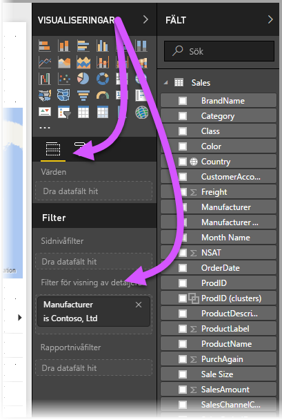
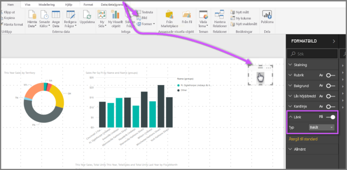
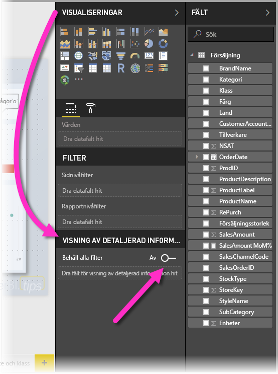
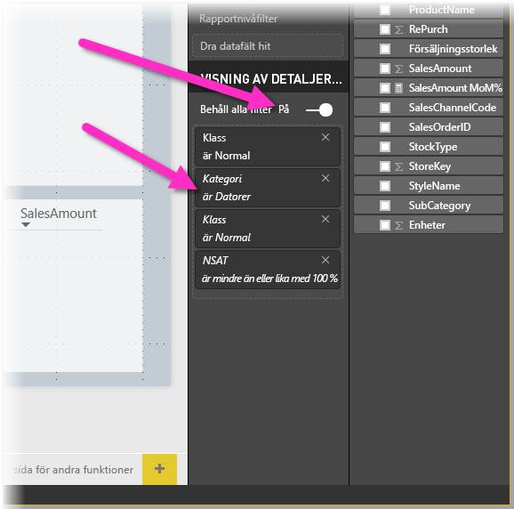

# Konfigurera detaljvisning i Power BI-rapporter
Med *visning av detaljerad information* i Power BI-rapporter kan du skapa en sida i rapporten som fokuserar på en specifik enhet – till exempel en leverantör, kund eller tillverkare. När rapportläsarna använder visning av detaljerad information högerklickar de på datapunkt i andra rapportsidor och använder visning av detaljerad information till den sidan som är i fokus för att hämta information som har filtrerats för det sammanhanget. Du kan också [skapa en knapp som visar detaljerad information](desktop-drill-through-buttons.md) när de klickar på den.

Du kan konfigurera visning av detaljerad information i dina rapporter i Power BI Desktop eller Power BI-tjänsten.

## Konfigurera sidan för visning av detaljerad information
1. Du konfigurerar visning av detaljerad information genom att skapa en rapportsida med önskade visuella objekt för den typ av enhet som du ska tillhandahålla detaljerad visning för. 

    Anta exempelvis att du vill låta tillverkare visa detaljerad information. Då kan du skapa en sida för detaljerad visning med visuella objekt som visar totalförsäljning, totalt antal levererade enheter, försäljning enligt kategori, försäljning enligt region och så vidare. Därmed är visualiseringen på den sidan alltid specifik för den tillverkare du valde när de väljer en högre detaljnivå.

2. På den sidan på detaljnivå går du till avsnittet **Fält** i rutan **Visuella objekt** och drar fältet som du vill aktivera detaljnivå för till brunnen med **Filter för granska på samma nivå**.

    

    När du lägger till ett fält i brunnen **Filter för granska på samma nivå** skapar Power BI automatiskt en *bakåtknapp*. Det visuella objektet blir en knapp i publicerade rapporter. Användare av rapporten i Power BI-tjänsten kan använda den här knappen för att gå tillbaka till sidan som de kommer ifrån.

    

> [!IMPORTANT]
> Du kan konfigurera och öka detaljnivån på en sida i samma rapport, men du kan göra detta på en sida i en annan rapport.  

## Använda en egen bild för en bakåtknapp    
 Eftersom bakåtknappen är en bild kan du ersätta bilden för det visuella objektet med vilken bild du vill. Den fungerar fortfarande som en bakåtknapp så att användaren kan gå tillbaka till ursprungssidan. 

Om du vill använda en egen bild för en bakåtknapp följer du de här stegen:

1. Välj **Bild** på fliken **Start**. Leta upp bilden och placera den på detaljgranskningssidan.

2. Välj din nya bild på detaljgranskningssidan. Under fönstret **Formatera bild** ställer du in skjutreglaget **Åtgärd** till **På** och anger sedan **Typen** som **Bakåt**. Bilden fungerar nu som en bakåtknapp.

    

    
     Nu kan användarna högerklicka på en datapunkt i rapporten och få en snabbmeny med stöd för detaljgranskning på sidan. 

    

    När rapportkonsumenterna valde drillthrough filtrerades sidan för att visa information om datapunkten som de högerklickade på. Låt oss till exempel anta att de högerklickade på en datapunkt om Contoso (en tillverkare) och valde att öka detaljnivån (drillthrough). Detaljgranskningssidan som de går till filtreras till Contoso.

## Skicka alla filter i detaljgranskning

Du kan skicka alla tillämplig filter till detaljgranskningsfönstret. Du kan till exempel välja bara en viss kategori av produkter och de visualiseringar som har filtrerats till denna kategori, och sedan välja detaljgranskning. Du kanske är intresserad av hur denna detaljgranskning skulle se ut om alla de filter som används.

Om du vill behålla alla filter som används går du till avsnittet **Visning av detaljerad information** i fönstret **Visualiseringar** och ställer in **Behåll alla filter** till **På**. 

När du sedan genomför drillthrough på någon visualisering ser du vilka filter som har tillämpats på grund av att källvisualiseringen har tillfälliga filter. I avsnittet **Visning av detaljerad information** i fönstret **Visualisering** visas dessa tillfälliga filter i kursiv stil. 

Observera att även om du kan göra detta med sidorna för knappbeskrivningar så skulle vara en konstig upplevelse eftersom knappbeskrivningen inte skulle verka som att den fungerar korrekt. Därför rekommenderas du att inte göra det med verktygstips.

## Lägg till ett mått i detaljerad visning

Förutom att överföra alla filter till detaljgranskningsfönstret kan du även lägga till ett mått eller en sammanfattande numerisk kolumn i detaljgranskningsområdet. Du behöver bara dra detaljgranskningsfältet till **detaljgransknings**-kortet för att det ska börja användas. 

När du lägger till ett mått (eller en sammanfattade numerisk kolumn) kan du gå till sidan när fältet används i området *Värde* i en visualisering.

Svårare än så är det inte att använda detaljgranskning i dina rapporter. Det är ett bra sätt att få en utökad vy över den enhetsinformation som du har valt för ditt detaljgranskningsfilter.

## Nästa steg

Följande artiklar kan också vara av intresse för dig:

* [Använda visning av detaljerad information mellan rapporter i Power BI-rapporter](desktop-cross-report-drill-through.md)
* [Använda utsnitt i Power BI Desktop](visuals/power-bi-visualization-slicers.md)

