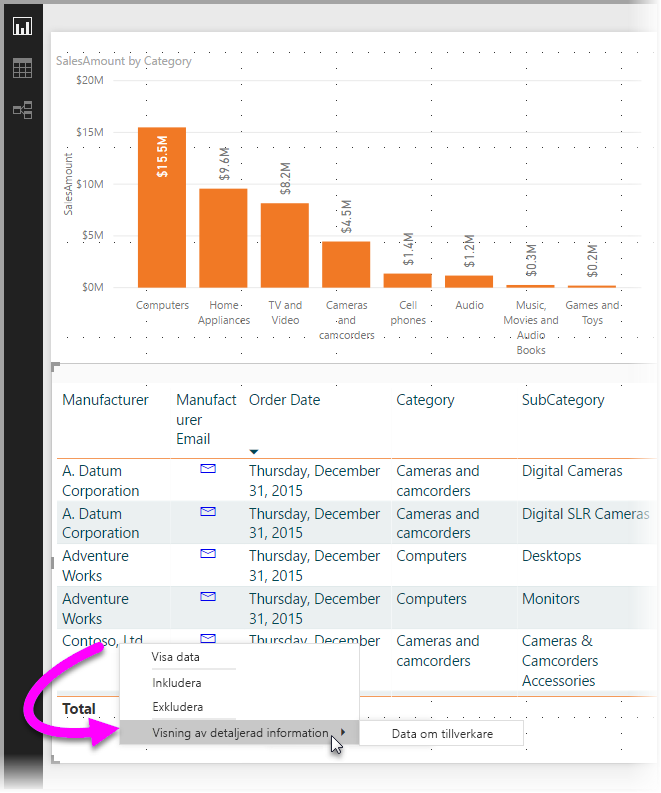

# Använd drillthrough i Power BI Desktop
Med **drillthrough** i **Power BI Desktop** kan du skapa en sida i rapporten som fokuserar på en specifik enhet – till exempel en leverantör, kund eller tillverkare. Med den fokuserade rapportsidan kan användare högerklicka på en datapunkt i andra rapportsidor och använda drillthrough till sidan i fokus för att hämta information som har filtrerats för det sammanhanget.

## Använda drillthrough
För att använda **drillthrough**skapar du en rapportsida med visuella objekt som du vill se om typen av enhet för vilken du ökar detaljnivån. Om du vill använda drillthrough för en tillverkare kan du skapa en drillthrough-sida med visuella objekt som visar totalförsäljning, totalt antal levererade enheter, försäljning enligt kategori, försäljning enligt region och så vidare. Därmed är visualiseringen alltid specifik för tillverkaren du klickade på och valde drillthrough för.

Sedan, på drillthrough-sidan i avsnittet **fält** i rutan **Visuella objekt** kan du dra fältet som du vill använda drillthrough på i brunnen **Drillthrough-filter**.

När du lägger till ett fält i brunnen **Drillthrough-filter** skapar **Power BI Desktop** automatiskt en *bakåtknapp*. Knappen visas i publicerade rapporter och låter användare av rapporten **Power BI-tjänsten** enkelt komma tillbaka till sidan som de kommer ifrån (sidan där de har valt drillthrough).

Eftersom den *tillbaka*-knappen är en bild kan du ersätta den med vilken bild du vill och den kommer fortfarande att fungera korrekt som knapp för att låta användaren återvända till ursprungssidan. Om du vill använda din egen bild för en bakåt-knapp är det bara att placera en bild på drillthrough-sidan, välja bilden och aktivera skjutreglaget för *bakåt*. Nu fungerar din bild som *tillbaka*-knapp.

När din **drillthrough**-sida är klar öppnas en snabbmenyn som låter användarna gå till drillthrough-sidan när de högerklickar på en datapunkt i din rapport som använder fältet som du angav i **Drillthrough-filtret**.

När de valde drillthrough filtrerades sidan för att visa information om datapunkten som de högerklickade på. Om de högerklickade på en datapunkt om Contoso (en tillverkare) och har valt drillthough filtreras drillthrough-sidan till Contoso.

> [!NOTE]
> Det är endast fält som finns i **Drillthrough-filterbrunnen** som skickas vidare till drillthrough-rapportsidan. Ingen övrig kontextinformation skickas.
> 
> 

Svårare än så är det inte att använda **drillthrough** i dina rapporter. Det är ett bra sätt att få en utökad vy över den enhetsinformation som du har valt för ditt drillthrough-filter.

