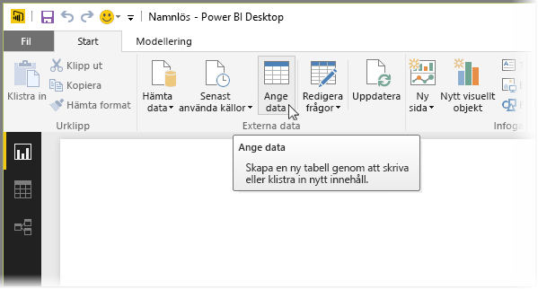
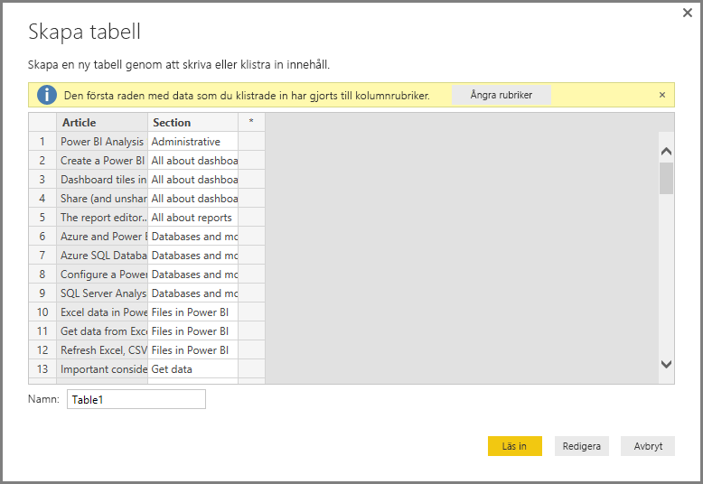
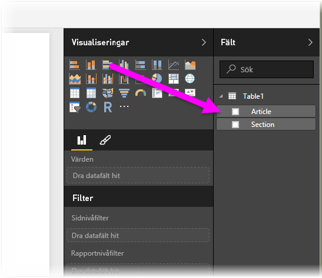

# Ange data direkt i Power BI Desktop

Med Power BI Desktop kan du ange data direkt och använda dessa data i dina rapporter och visualiseringar. Du kan till exempel kopiera delar av en arbetsbok eller en webbsida och sedan klistrar in den i Power BI Desktop.

Om du vill ange data direkt till Power BI Desktop i form av en ny tabell väljer du **Ange data** från menyfliksområdet **Start**.

Power BI Desktop kan försöka göra mindre omvandlingar av data, vid behov, precis som när du läser in data från andra källor. I följande fall upphöjdes till exempel den första raden av data till rubriker.

Om du vill forma data som du har angett eller klistrat in, väljer du **Redigera** för att öppna **Frågeredigeraren**. Du kan forma och omvandla data innan du överför den till Power BI Desktop. Välj **Läs in** för att importera datan som den visas.

När du väljer **Läs in**, skapar Power BI Desktop en ny tabell från dina data och gör den tillgänglig i **Fält**-fönstret. I följande bild visar Power BI Desktop min nya tabell med namnet *Table1*, samt de två fält i tabellen som skapades.

Det är allt! Så enkelt är det att ange data i Power BI Desktop.

Du är nu redo att använda datan i Power BI Desktop. Du kan skapa visuella objekt, rapporter eller interaktioner med andra data som du vill ansluta till och importera, exempelvis Excel-arbetsböcker, databaser eller andra datakällor.

## Nästa steg

Det finns alla möjliga sorters data du kan ansluta till med Power BI Desktop. Kolla in följande resurser för mer information om datakällor:

* [Vad är Power BI Desktop?](desktop-what-is-desktop.md)
* [Datakällor i Power BI Desktop](desktop-data-sources.md)
* [Forma och kombinera data i Power BI Desktop](desktop-shape-and-combine-data.md)
* [Anslut till Excel-arbetsböcker i Power BI Desktop](desktop-connect-excel.md)
* [Anslut till CSV-filer i Power BI Desktop](desktop-connect-csv.md)
