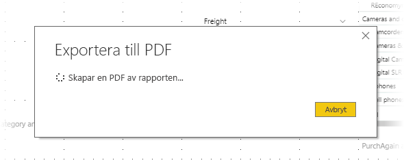

# Exportera rapporter till PDF från Power BI Desktop
I **Power BI Desktop** kan du exportera rapporter till en PDF-fil och på så sätt enkelt dela eller skriva ut dina rapporter från PDF-filen.

Det är enkelt att exportera rapporter från **Power BI Desktop** till en PDF-fil, så att du kan skriva ut PDF-filen eller dela PDF-dokumentet med andra. Välj bara **Fil > Exportera till PDF** från Power BI Desktop.

Funktionen **Exportera till PDF** exporterar alla *synliga* sidor i rapporten, och varje rapportsida exporteras till en separat sida i PDF-filen. Rapportsidor som för närvarande inte visas, till exempel knappbeskrivningar eller dolda sidor, exporteras inte till PDF-filen. 

När du väljer **Fil > Exportera till PDF** initieras exporten och en dialogruta öppnas som visar exportprocessen. Dialogrutan finns kvar på skärmen tills exporten har slutförts. Under exportprocessen inaktiveras all interaktion med rapporten som exporteras. Det enda sättet att interagera med rapporten är att vänta tills exporten har slutförts eller att avbryta exporten. 

När exporten har slutförts läses PDF-filen in i det förvalda PDF-visningsprogrammet på datorn. 

## Överväganden och begränsningar
Det finns några saker som du bör tänka på när du använder funktionen **Exportera till PDF**:

* Funktionen **Exportera till PDF** är endast tillgänglig med **Power BI Desktop**, och är för närvarande inte tillgänglig i **Power BI-tjänsten**.
* Anpassade visuella objekt exporteras med funktionen, men skrivbordsunderlägg som har lagts till i rapporten exporteras *inte*.

Eftersom skrivbordsunderlägg inte exporteras till PDF-filen bör du vara särskilt uppmärksam på rapporter som har mörk bakgrund. Om texten i rapporten är ljus eller vit, så att den framhävs mot den mörka bakgrunden, blir den svårläst eller oläslig eftersom funktionen Exportera till PDF inte exporterar skrivbordsunderlägget med resten av rapporten. 

## Nästa steg
Det finns en mängd intressanta visuella element och funktioner i **Power BI Desktop**. Mer information finns här:

* [Använda visuella element för att förbättra Power BI-rapporter](desktop-visual-elements-for-reports.md)
* [Vad är Power BI Desktop?](desktop-what-is-desktop.md)

