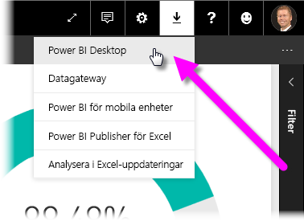
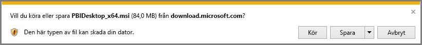
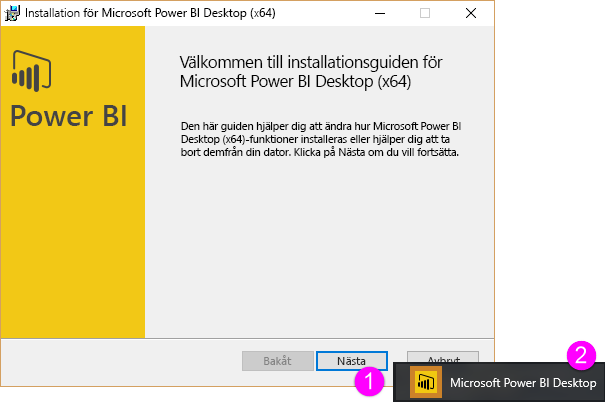
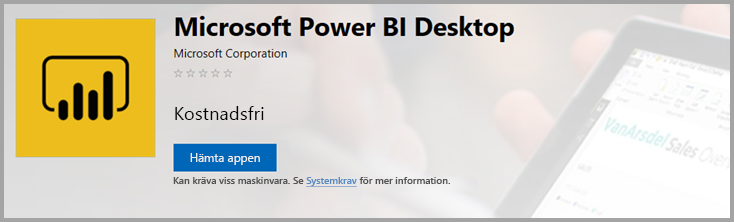
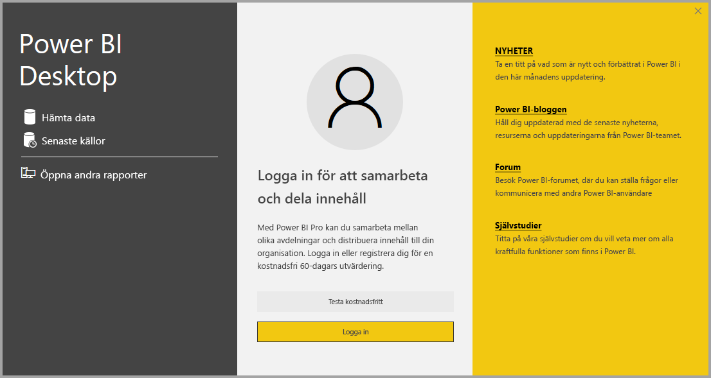

# Hämta Power BI Desktop
**Power BI Desktop** låter dig skapa avancerade frågor, modeller och rapporter som visualiserar data. Med **Power BI Desktop**, kan du skapa datamodeller, skapa rapporter och dela ditt arbete genom att publicera till Power BI-tjänsten.  **Power BI Desktop** är en kostnadsfri nedladdning.

Du kan hämta **Power BI Desktop** på två sätt som beskrivs i följande avsnitt:

* **Ladda ned** direkt (ett MSI-paket som du hämtar och installerar på din dator)
* Installera som en app från **Microsoft Store**

Endera metod ger dig den senaste versionen av **Power BI Desktop** på din dator, men det finns några skillnader att tänka på, vilka beskrivs i följande avsnitt.

## Ladda ner Power BI Desktop
Om du vill ladda ner den senaste versionen av **Power BI Desktop**, kan du välja nedladdningsikonen från det övre högra hörnet av Power BI-tjänsten och välja **Power BI Desktop**.

Du kan också hämta den senaste versionen av Power BI Desktop från följande nedladdningssida:

* [**Power BI Desktop-nedladdning** (både 32- och 64-bitars versioner)](https://powerbi.microsoft.com/desktop).
  
  

Oavsett hur du väljer att ladda ned det så kommer **Power BI Desktop** att be dig att köra installationsfilen efter att du laddat ner den:

**Power BI Desktop** installeras som ett program och körs på skrivbordet.

> [!NOTE]
> Att installera den nedladdade (MSI)-versionen och **Microsoft Store**-versionen av **Power BI Desktop** på samma dator (kallas ibland en *sida-vid-sida*-installation) stöds inte.
> 
> 

## Installera som en app från Microsoft Store
Du kan också hämta **Power BI Desktop** från Microsoft Store med följande länk:

* [Installera **Power BI Desktop** från **Microsoft Store**](http://aka.ms/pbidesktopstore)

Det finns några fördelar med att få **Power BI Desktop** från Microsoft Store:

* **Automatiska uppdateringar** – Windows hämtar den senaste versionen automatiskt i bakgrunden så snart den finns tillgänglig så att din version alltid är uppdaterad.
* **Mindre nedladdningar** – **Microsoft Store** ser till att enbart komponenter som har ändrats i varje uppdatering hämtas till datorn, vilket resulterar i mindre nedladdningar för varje uppdatering.
* **Admin-behörighet behövs inte** – när du hämtar MSI:n direkt och installerar den, behöver du vara administratör för att installationen ska slutföras. När du får **Power BI Desktop** från Microsoft Store, behövs *ingen* adminbehörighet.
* **Redo för IT lansering** – **Microsoft Store**-versionen kan enklare distribueras eller *lanseras* till alla i din organisation och kan göra **Power BI Desktop** tillgängligt via **Microsoft Store för företag**.
* **Språkidentifiering** – **Microsoft Store**-versionen inkluderar alla språk som stöds och kontrollerar vilka språk som används på datorn varje gång den startas. Detta påverkar även lokaliseringen av modeller som skapats i **Power BI Desktop**, inbyggda datumhierarkier kommer till exempel att matcha det språk som **Power BI Desktop** använde när .pbix-filen skapades.

Det finns några överväganden och begränsningar för att installera **Power BI Desktop** från Microsoft Store, som inkluderar följande:

* Om du använder SAP-anslutningsappen, kan du behöva flytta dina SAP-drivrutinsfiler till *Windows\System32*-mappen.
* Att installera **Power BI Desktop** från Microsoft Store kopierar inte användarinställningar från MSI-versionen. Du kan behöva återansluta till de senaste datakällorna och ange dina autentiseringsuppgifter för datakälla igen. 

> [!NOTE]
> Att installera den nedladdade (MSI)-versionen och **Microsoft Store**-versionen av **Power BI Desktop** på samma dator (kallas ibland en *sida-vid-sida*-installation) stöds inte. Du måste manuellt avinstallera **Power BI Desktop** innan du hämtar det från **Microsoft Store**
> 
> [!NOTE]
> Power BI Report Server-versionen av **Power BI Desktop** är en separat installation och skiljer sig från de versioner som beskrivs i den här artikeln. Mer information om **Power BI Desktop**s rapportserverversion finns i [Skapa en Power BI-rapport för Power BI-rapportservern](report-server/quickstart-create-powerbi-report.md).
> 
> 

## Använd Power BI Desktop
När du startar **Power BI Desktop**, visas en *Välkommen*-skärm.

Om det här är först gången du använder **Power BI Desktop** (om installationen inte är en uppgradering), uppmanas du att fylla i ett formulär och besvara några frågor eller logga in på **Power BI-tjänsten** innan du kan fortsätta.

Därifrån kan du börja skapa datamodeller eller rapporter och sedan dela dem med andra på Power BI-tjänsten. Kolla in länkarna **mer information** i slutet av den här artikeln för länkar till guider som kan hjälpa dig att komma igång med **Power BI Desktop**.

## Minimikrav
Följande lista innehåller minimikraven för att köra **Power BI Desktop**:

* Windows 7 / Windows Server 2008 R2 eller senare
* .NET 4.5
* Internet Explorer 9 eller senare
* **Minne (RAM):** Minst 1 GB tillgängligt, 1,5 GB eller mer rekommenderas.
* **Bildskärm:** Minst 1 440 x 900 eller 1 600 x 900 (16:9) rekommenderas. Lägre upplösningar, till exempel 1 024 x 768 eller 1 280 x 800 rekommenderas inte, eftersom vissa kontroller (till exempel att stänga startskärmen) visas utanför de upplösningarna.
* **Windows bildskärmsinställningar:** Om dina bildskärmsinställningar är inställda att ändra storleken på text, appar och andra objekt till mer än 100%, kanske du inte ser vissa dialogrutor som måste stängas eller svaras på för att fortsätta med **Power BI Desktop**. Om du påträffar det här problemet, kontrollera dina **bildskärmsinställningar** genom att gå till **Inställningar > System > Visa** i Windows och använda skjutreglaget för att återställa bildskärmsinställningarna till 100 %.
* **Processor:** 1 gigahertz (GHz) eller snabbare x86- eller x64-bitars processor rekommenderas.

## Överväganden och begränsningar

Vi vill alltid att du ska ha en bra upplevelse när du använder Power BI Desktop. Det kan dock hända att du stöter på problem med Power BI Desktop. Det här avsnittet innehåller lösningar eller förslag för att hantera problem som kan uppstå. 

### Problem när du använder tidigare versioner av Power BI Desktop

Ett fel liknande det nedan kan visas om en inaktuell version av **Power BI Desktop** används: 

    "We weren't able to restore the saved database to the model" 

Användaren kan oftast åtgärda problemet genom att uppdatera till den aktuella versionen av Power BI Desktop.

### Avaktivera aviseringar
Vi rekommenderar att du uppdaterar till den senaste versionen av Power BI Desktop för att kunna utnyttja nya funktioner, prestanda, stabilitet och andra förbättringar. Det kan hända att vissa företag inte vill att deras användare uppdaterar till varje ny version. Du kan inaktivera meddelanden genom att ändra registret med följande steg:

1. Använd Registereditorn och navigera till *HKEY_LOCAL_MACHINE\SOFTWARE\Microsoft\Microsoft Power BI Desktop*
2. Skapa en ny post där med följande inställningar: *REG_DWORD: DisableUpdateNotification*
3. Ange värdet för den nya posten till **1**.

Datorn måste kanske startas om innan ändringarna börjar gälla.

### Power BI Desktop läser in en partiell skärm

Under vissa omständigheter, inklusive vissa skärmupplösningskonfiguraitoner, kan vissa användare se Power BI Desktop visa innehåll med stora svarta områden. Detta beror vanligtvis på de senaste uppdateringarna för operativsystemet som påverkar hur objekt återges snarare än hur innehåll presenteras i Power BI Desktop. Stora svarta områden är dock inte särskilt tilltalande så du kan lösa problemet med följande steg:

1. Tryck på Start och skriv ordet *suddig* i sökfältet som visas.
2. I dialogrutan som visas väljer du alternativet: *Låt Windows åtgärda appar som är suddiga.*
3. Starta om Power BI Desktop

Problemet kan komma att lösas med kommande Windows-uppdateringar. 
 

## Nästa steg
När du har installerat **Power BI Desktop** kan du komma igång snabbt med hjälp av följande innehåll:

* [Vad är Power BI Desktop?](desktop-what-is-desktop.md)
* [Frågeöversikt med Power BI Desktop](desktop-query-overview.md)
* [Datakällor i Power BI Desktop](desktop-data-sources.md)
* [Anslut till data i Power BI Desktop](desktop-connect-to-data.md)
* [Forma och kombinera data i Power BI Desktop](desktop-shape-and-combine-data.md)
* [Vanliga frågeuppgifter i Power BI Desktop](desktop-common-query-tasks.md)   

