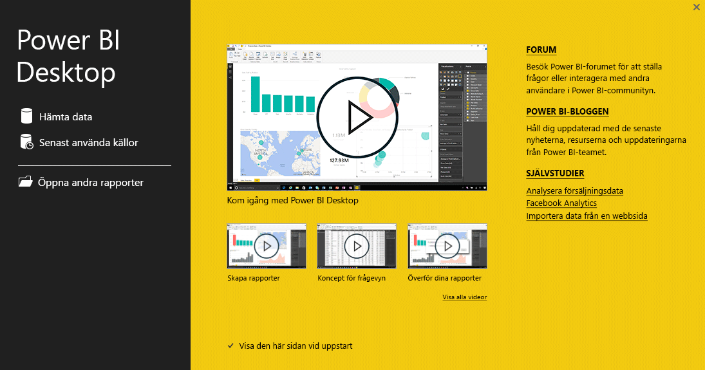
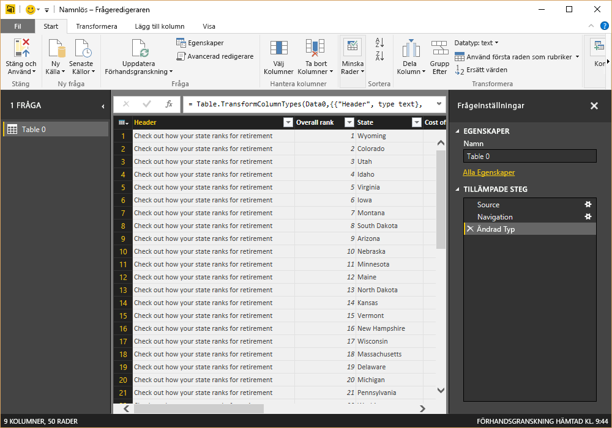
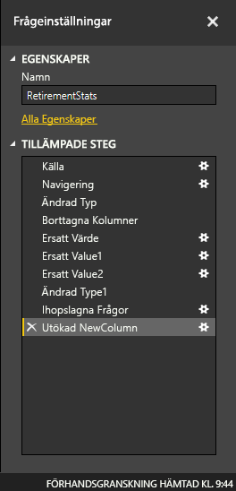

# Komma igång med Power BI Desktop
Välkommen till **Komma igång-guiden för Power BI Desktop**. Den här korta visningen av Power BI Desktop låter dig bekanta dig med hur den fungerar, visar vad den kan göra och ökar dina möjligheter att skapa robusta datamodeller, tillsammans med häpnadsväckande rapporter, som förstärker din affärsintelligens. 

Vill du titta istället för att läsa? Då kan du [ta en titt på vår kom igång video](desktop-videos.md). Om du vill följa med i videon med matchande exempeldata, kan du [hämta den här Excel-exempelarbetsboken](http://go.microsoft.com/fwlink/?LinkID=521962).

Power BI Desktop låter dig skapa en samling frågor, dataanslutningar och rapporter som enkelt kan delas med andra. Power BI Desktop integrerar beprövad Microsoft-teknologi – den kraftfulla frågemotorn, datamodellering och visualiseringar – och fungerar sömlöst tillsammans med [**Power BI-tjänsten**](https://app.powerbi.com/) online.

Med en kombination av **Power BI Desktop** (där analytiker och andra kan skapa kraftfulla dataanslutningar, modeller och rapporter) och [**Power BI-tjänsten**](https://preview.powerbi.com/) (där Power BI Desktop-rapporter kan delas så att användare kan visa och interagera med dem), blir nya insikter från en värld av data enklare än någonsin att modellera, skapa, dela och utöka.

Dataanalytiker kommer att finna Power BI Desktop kraftfull, flexibel, och högtillgänglig för att ansluta till och forma en värld av data, skapa robusta modeller och skapa välstrukturerade rapporter.

## Så här använder du den här guiden
Du kan använda den här guiden på ett par olika sätt – kolla igenom den för en snabb överblick eller läs igenom varje avsnitt för en mer ingående förståelse av hur Power BI Desktop fungerar.

Om har bråttom, kan du göra en visuell snabbläsning av den här guiden på ett par minuter och få en bra uppfattning av hur Power BI Desktop fungerar och hur du använder den. Det mest i den här guiden består av skärmbilder som visuellt visar hur Power BI Desktop fungerar.

För en mer ingående förståelse så kan du läsa igenom avsnitten, utföra stegen och få fram din egen Power BI Desktop-fil som är redo för publicering till **Power BI**-tjänsten och delas med andra.

>[!NOTE]
>Det finns också en separat och specialiserad version av **Power BI** som heter [**Power BI-rapportserver**](report-server/get-started.md), som är till för kunder som behöver ha kvar sina data och rapportering lokalt. Det finns även en specialiserad version av **Power BI Desktop** för användning med den versionen, som heter **Power BI Desktop för Power BI-rapportserver**, som bara fungerar med rapportserver-versionen av Power BI. Den här artikeln beskriver standardversionen av **Power BI Desktop**.

## Så här fungerar Power BI Desktop
Med Power BI Desktop *ansluter du till data* (vanligtvis flera datakällor), *formar data* (med frågor som skapa insiktsfulla, övertygande datamodeller) och använder den modellen för att *skapa rapporter* (som andra kan dra nytta av, bygga vidare på och dela).

När stegen är klara så att du är nöjd – ansluta, forma och rapportera – så kan du spara arbetet i Power BI Desktop-filformatet, som är .pbix-tillägget. Power BI Desktop-filer kan delas som andra filer, men det mest övertygande sättet att dela Power BI Desktop-filer på är att överföra dem (dela dem) på [**Power BI-tjänsten**](https://preview.powerbi.com/). 

Power BI Desktop centraliserar, förenklar och strömlinjeformar något som annars kan uppfattas som en utspridd, lösryckt och mödosam process med att business intelligence-centrallager och -rapporter.

Är du redo att testa? Då sätter vi igång.

## Installera och kör Power BI Desktop
Du kan hämta Power BI Desktop från **Power BI**-tjänsten genom att välja **kugghjuls**ikonen och sedan välja **Power BI Desktop**.

Power BI Desktop installeras som ett program och körs på skrivbordet.

När du startar Power BI Desktop, visas en *välkommen*-skärm.

Du kan **hämta data**, se **senaste källorna**, eller **öppna andra** **rapporter** direkt från *välkommen*-skärmen (från länkar i det vänstra fönstret). Om du stänger skärmen (välj **x** i övre högra hörnet), visas **rapport**vyn av Power BI Desktop.

Det finns tre vyer i Power BI Desktop:**rapportvyn**, **datavyn** och **relationsvyn**. Power BI Desktop innehåller även **Frågeredigeraren**, som du öppnar i ett separat fönster. I **Frågeredigeraren**, kan du skapa frågor och transformera data. Du kan därefter läsa in denna förfinade datamodell i Power BI Desktop och skapa rapporter.

Följande skärmbild visar de tre visningsikonerna till vänster i Power BI Desktop: **Rapport**, **Data** och **Relationer**, uppifrån och ned. Den aktuella vyn indikeras av det gula fältet på vänster sida. I det här fallet visas **rapport**vyn. Ändra vy genom att välja någon av dessa tre ikoner.

Med Power BI Desktop installerat är du redo att ansluta till data, forma data och skapa rapporter (vanligtvis i den ordningen). I nästa avsnitt, ska vi ta en rundtur genom var och en i turordning.

## Ansluta till data
Med Power BI Desktop installerat, är du redo att ansluta till den ständigt växande världen av data. Det finns *många olika typer* av datakällor tillgängliga i frågefönstret. Följande bild visar hur du ansluter till data, genom att välja menyfliksområdet **Start** och därefter **Hämta data\> Mer**.

 

I den här guidade turen, ska vi ansluta till ett par olika **Webb**datakällor.

Tänk dig att du ska pensionera dig – du vill leva där det finns en massa sol, ett bra skatteklimat och bra sjukvård – eller så kanske du är en dataanalytiker och behöver den informationen för att hjälpa dina kunder. Du vill kanske hjälpa ett solglasögonföretag att rikta sin försäljning där solen skiner oftast.

I båda fallen har följande webbresurs intressanta data om dessa ämnen och mer:

[*http://www.bankrate.com/finance/retirement/best-places-retire-how-state-ranks.aspx*](http://www.bankrate.com/finance/retirement/best-places-retire-how-state-ranks.aspx)

Välj **Hämta data \> Webb** och klistra in adressen.

 

När du väljer **OK**, används **Fråge**funktionen i Power BI Desktop. Frågan kontaktar webbresursen och **Navigerings**fönstret returnerar resultatet från den webbsidan. I det här fallet hittades en tabell (*Tabell 0*) och det övergripande webbdokumentet. Vi vill använda tabellen, så vi väljer den från listan. **Navigerings**fönstret visar en förhandsgranskning.

 

Vi kan nu redigera frågan innan du läser in tabellen genom att välja **Redigera** längst ned i fönstret eller så kan vi läsa in tabellen.

När vi väljer **Redigera**, startar frågeredigeraren och en representativ vy av tabellen visas. Fönstret **Frågeinställningar** visas (om det inte öppnas kan du välja **Visa** från menyfliken och sedan **Visa\> Frågeinställningar** för att visa fönstret **Frågeinställningar**). Det ser ut så här.

 

Mer information om hur du ansluter till data finns i [Anslut till data i Power BI Desktop](desktop-connect-to-data.md).

I nästa avsnitt justerar vi data så att de uppfyller våra behov. Processen med att justera anslutna data kallas att *forma* data.

## Forma och kombinera data
Nu när vi har anslutit till en datakälla, behöver vi justera dessa data så att de uppfyller våra behov. Ibland innebär justering att *omvandla* data – till exempel byta namn på kolumner eller tabeller, ändra text till tal, ta bort rader, ställa in den första raden som rubrik och så vidare.

Frågeredigeraren i Power BI Desktop använder sig mycket av högerklicksmenyer förutom att ha uppgifter tillgängliga i menyfliksområdet. Merparten av det du kan välja i menyfliksområdet **Omvandla** är också tillgängligt genom att högerklicka på ett objekt (till exempel en kolumn) och välja från menyn som visas.

## Forma data
När du formar data i **frågeredigeraren** ger du stegvisa-instruktioner (som **frågeredigeraren** utför) för att justera de data som **frågeredigeraren** hämtar och presenterar. Den ursprungliga datakällan påverkas inte utan det är endast den här datavyn som justeras eller *formas*.

De steg som du anger (till exempel när du byter namn på en tabell, transformerar datatypen eller tar bort kolumner) registreras av **frågeredigeraren** och varje gång den här frågan ansluter till datakällan utförs dessa steg så att data alltid utformas på det sätt som du anger. Den här processen inträffar när du använder frågan i Power BI Desktop eller för alla som använder din delade fråga, till exempel i **Power BI**-tjänsten. De här stegen fångas i ordning i fönstret **Frågeinställningar** under **Tillämpade steg**.

Följande bild visar fönstret **Frågeinställningar** för en fråga som har formats – vi ska gå igenom de här stegen i följande stycken.

 

Nu ska vi gå tillbaka till våra pensionsdata som vi hittade genom att ansluta till en Webbdatakälla och formar dessa data efter våra behov.

Till att börja med, har de flesta klassificeringar förts in i **Frågeredigeraren** som heltal, men inte alla (en kolumn som innehåller text och siffror, så konverterades in automatiskt). Vi behöver data som siffror. Inga problem – det är bara att högerklicka på kolumnrubriken och välja **Ändra typ \> Heltal** för att ändra datatypen. Om vi behöver välja fler än en kolumn, kan vi först markera en kolumn och sedan hålla ned **Skift**, välja fler intilliggande kolumner och högerklicka på en kolumnrubrik för att ändra alla valda kolumner. Du kan också använda **Ctrl** för att välja kolumner som inte ligger bredvid varandra.

 

Du kan också ändra, eller *omvandla* dessa kolumner från text till rubrik från menyfliksområdet **Omvandla**. Här är menyfliksområdet **Omvandla** med en pil som pekar mot knappen **Datatyp**, som låter dig omvandla den aktuella datatypen till en annan.

 

Observera att i **Frågeinställningarna**, återspeglar **tillämpade steg** de ändringar som har gjorts. Om jag vill ta bort något steg från formningsprocessen, väljer jag det steget och trycker på **X** till vänster om steget.

 

Vi behöver göra några fler ändringar för att få frågan dit vi vill:

* *Ta bort den första kolumnen* – den behövs inte, den innehåller endast överflödiga rader som säger ”Se hur din delstat rangordnas för pensioner”, vilket är en rest från att datakällan var en webbaserad tabell

<!-- -->

* *Åtgärda några fel* – på webbsidan hade en kolumn text blandat med siffrorna (stater som var på delad plats i en kategori). Det fungerade bra på webbplatsen, men inte för vår dataanalys. Det är (i det här fallet) enkelt att korrigera och visar några häftiga funktioner i **Frågeredigeraren** och dess **Tillämpade steg**

<!-- -->

* *Ändra tabellnamnet* – **Tabell 0** är inte en användbar beskrivning, men det är lätt att ändra det

Var och en av de här stegen visas i **[Forma och kombinera Data i Power BI Desktop](desktop-shape-and-combine-data.md)**. Passa på att kolla in den sidan eller fortsätt i det här dokumentet för att se vad du ska göra härnäst. Nästa avsnitt fortsätter efter att ovanstående ändringar tillämpats.

## Kombinera data
Våra data om olika delstater är intressanta och kommer vara användbara för att skapa mer analysverktyg och -frågor. Men det finns ett problem: de flesta data använder en tvåbokstavsförkortning för delstatskoder, inte det fullständiga namnet på delstaten. Vi behöver hitta ett sätt att associera delstatsnamn med deras förkortningar.

Vi har tur: det finns en annan offentlig datakälla som gör just detta, men den måste formas en hel del innan vi kan ansluta den till vår pensionstabell. Här är webbresursen för delstatsförkortningar:

<http://en.wikipedia.org/wiki/List_of_U.S._state_abbreviations>

Från menyfliksområdet **Start** i **Frågeredigeraren**, väljer vi **Hämta Data\> Webb** och skriver in adressen, väljer **Ok** så visar **Navigerings**fönstret vad det fann på den webbplatsen.

 

Vi väljer **Tabell [redigera]** eftersom den inkluderar data vi vill ha, men det kommer att krävas en hel del formning innan vi kan reducera tabellens data. Var och en av de här stegen visas också i **[Forma och kombinera Data i Power BI Desktop](desktop-shape-and-combine-data.md)**. För att sammanfatta de här stegen är det här vad vi ska göra:

Vi väljer **Redigera**, sedan:

* *Ta bort de två översta raderna* – de är ett resultat av sättet webbsidans tabell skapades och vi behöver dem inte.

<!-- -->

* *Ta bort de understa 26 raderna* – de är territorier som vi inte behöver inkludera.

<!-- -->
* *Filtrera bort Washington DC* – tabellen med pensionsstatistik inkluderar inte DC så vi utesluter den från listan.

<!-- -->

* *Ta bort några kolumner som inte behövs* – vi behöver bara mappningen av delstaten till dess officiella tvåbokstavsförkortning så vi kan ta bort de andra kolumnerna.

<!-- -->

* *Använd den första raden som rubriker* – eftersom vi har tagit bort de tre översta raderna är den aktuella översta raden vår önskade rubrik.

    >[!NOTE]
    >Detta är ett bra tillfälle att påpeka att *sekvensen* för de tillämpade stegen i **Frågeredigeraren** är viktig och kan påverka hur data formas. Det är också viktigt att tänka på hur ett steg kan påverka andra efterföljande steg. Om du tar bort ett steg från **Tillämpade steg**, kanske efterföljande steg inte fungerar som avsett på grund av effekten av frågornas ordningsföljd.

* *Byt namn på kolumner och själva tabellen* – som vanligt, finns det ett par olika sätt att byta namn på en kolumn, du kan välja det du föredrar.

Nu när vi har format *StateCodes*-tabellen, kan vi kombinera de här två tabellerna, eller frågorna till en. Eftersom tabellerna vi nu har är ett resultat av de frågor vi tillämpade på data, kallas de ofta för *frågor*.

Det finns två huvudsakliga sätt att kombinera frågor – *sammanslagning* och *bifoga*.

När du har en eller flera kolumner som du vill lägga till i en annan fråga kan du **sammanfoga** frågorna. När du har ytterligare rader med data som du vill lägga till en befintlig fråga kan du **bifoga** frågan.

I det här fallet vill vi sammanfoga frågor. För att komma igång, väljer vi frågan som vi vill att den andra frågan ska sammanfogas *till*, därefter väljer vi **sammanfoga frågor** från **Start**-fliken på menyfliksområdet.

 

Fönstret **Sammanfoga** visas och ber oss välja vilken tabell som vi vill sammanfoga i den valda tabellen samt vilka matchande kolumner som ska användas för sammanfogningen. Välj *Stat* från *RetirementStats*-tabellen (fråga) och välj därefter *StateCodes*-frågan (enkelt i det här fallet när det bara finns en fråga – när du ansluter till flera datakällor, finns det flera frågor att välja mellan). När vi väljer rätt matchande kolumner – *Delstat* från *RetirementStats*, och *Delstatsnamn* från *StateCodes* – ser **Sammanfognigns**fönstret ut ungefär så här och **Ok**-knappen är aktiverad.

 

En **NewColumn** skapas i slutet av frågan, vilket är innehållet för tabellen (frågan) som har sammanfogats med den befintliga frågan. Alla kolumner från den sammanfogade frågan ryms i **NewColumn**, men du kan välja att **Expandera** tabellen och inkludera alla kolumner som du vill. Om du vill expandera den sammanfogade tabellen och välja vilka kolumner som ska ingå, väljer du expandera-ikonen (). Fönstret **Expandera** visas.

 

I det här fallet är vi bara intresserade av kolumnen *Delstatskod* så vi väljer bara den kolumnen och sedan **OK**. Vi avmarkerar kryssrutan från **Använd ursprungligt kolumnnamn som prefix** eftersom vi vare sig behöver eller vill ha det. Om vi lämnar den markerad, skulle den sammanfogade kolumnen heta *NewColumn.State Code* (det ursprungliga kolumnnamnet, eller *NewColumn*, därefter en punkt, därefter namnet på den kolumn som tas in i frågan).

>[!NOTE]
>Vill du experimentera med hur du hanterar *NewColumn*-tabellen? Du kan prova dig fram och om du inte gillar resultatet är det bara att ta bort steget från listan **Tillämpade steg** i fönstret **Frågeinställningar**. Din fråga återgår till tillståndet innan du tillämpade steget **Expandera**. Det är som en gratis uppfräschning, som du kan upprepa hur många gånger som helst tills du är nöjd med expanderingsprocessen.

Nu har vi en enskild fråga (tabellen) som kombinerar två datakällor som har formats efter våra behov. Den här frågan kan fungera som bas för många intressanta dataanslutningar – till exempel statistik över bostadskostnader, demografi eller jobbmöjligheter i varje delstat.

För en fullständig beskrivning av varje steg för att forma och kombinera data, se [Forma och kombinera data i Power BI Desktop](desktop-shape-and-combine-data.md).

För tillfället har vi tillräckligt med data för att skapa några intressanta rapporter, allt i Power BI Desktop. Eftersom det är en milstolpe, sparar vi den här Power BI Desktop-filen – vi kallar den **Komma igång med Power BI Desktop**. Tillämpa ändringarna i **Frågeredigeraren** och läs in dem i Power BI Desktop, genom att välja **Stäng och tillämpa** från **Start**-menyfliksområdet.

## Skapa rapporter
Ytterligare ändringar kan göras efter att tabellen har lästs in och du kan ladda om en modell för att tillämpa de ändringar du gör. För tillfället duger det här. Du kan börja bygga rapporter i **rapportvyn** i Power BI Desktop.

**Rapportvyn** innehåller fem huvudområden:

1. Menyfliksområdet, där vanliga uppgifter som är associerade med rapporter och visualiseringar visas
2. **Rapportvyn**, eller arbetsytan, där visualiseringarna skapas och arrangeras
3. Flikområdet **Sidor** längst ned, där du kan välja eller lägga till en rapportsida
4. Rutan **Visualiseringar**, där du ändrar visualiseringar, anpassar färger, tillämpar filter, drar fält och mycket annat
5. Rutan **Fält**, där du kan dra frågeelement och filter till **rapportvyn** eller till området **Filter** i fönstret **Visualiseringar**
   
   

Du kan dölja fönstren **Visualiseringar** och **Fält** genom att välja den lilla pilen längs kanten, vilket ger mer utrymme i **rapportvyn** för att skapa snygga visualiseringar. När du modifierar visualiseringar visas även pilar som pekar uppåt eller nedåt, vilket innebär att du kan visa respektive dölja motsvarande avsnitt.

 

Om du vill skapa en visualisering är det bara att dra ett fält från listan **Fält** till **rapportvyn**. I det här fallet drar vi fältet *Delstat* från *RetirementStats* och ser vad som händer.

 

Ser man på... Power BI Desktop har automatiskt skapat en kartabaserad visualisering eftersom programmet registrerade att fältet *Delstat* innehöll geoplatsdata.

Observera att i rutan **visualiseringar**, kan jag välja olika typer av visualiseringar och i området under ikonerna, kan jag dra fälten till olika områden för att tillämpa en teckenförklaring, eller på annat sätt modifiera visualiseringen.

 

Vi spolar framåt lite och se hur **Rapport**vyn ser ut när en handfull visualiseringar har lagts till, samt några nya rapportsidor. Mer information om rapporter finns i [Rapportvyn i Power BI Desktop](desktop-report-view.md).

Den första sidan i rapporten ger en översikt över data baserat på *Övergripande rangordning*. När vi väljer du något av visualiseringarna, visar **Fält och filter**-rutan vilka fält som är markerade och strukturen för visualiseringen (vilka fält som tillämpas på den **Delade axeln**, **Kolumnvärdena** och **Radvärden**).

 

Det finns sex **Sidor** i den här rapporten, varje sida visualiserar olika element av våra data.

1. Den första sidan som visas ovan, visar alla delstater baserat på *Övergripande rangordning*.
2. Den andra sidan fokuserar på de översta tio delstaterna baserat på *Övergripande rangordning*.
3. I den tredje sidan visualiseras de bästa 10 delstaterna för levnadskostnad (och associerade data).
4. Väder är fokuset för den fjärde sidan, filtrerat till de 15 soligaste delstaterna.
5. På den femte sidan, mappas och visualiseras samhällets välstånd för de översta 15 delstaterna.
6. Slutligen visualiseras brottsstatistik och visar de bästa (och sämsta) tio delstaterna.

Så här ser rapportsidan som fokuserar på levnadskostnader ut.

 

Det finns en massa olika intressanta rapporter och visualiseringar som du kan skapa.

## Dela ditt arbete
Nu när vi har en Power BI Desktop-rapport som är förhållandevis fullständig, kan vi dela den med andra på **Power BI**-tjänsten. Det finns några olika sätt att dela ditt arbete i Power BI Desktop. Du kan publicera det till **Power BI**-tjänsten, du kan överföra .pbix-filen direkt från Power BI-tjänsten, eller så kan du spara .pbix-filen och skicka den vilken annan fil som helst.

Först ska vi titta på hur man publicerar till **Power BI**-tjänsten direkt från Power BI Desktop. På **Start**-menyfliksområdet, väljer du **Publicera**.

Du kanske uppmanas att logga in på Power BI.

När du har loggat in och publiceringsprocessen är klar visas följande dialogruta.

När du loggar in på Power BI, ser du den Power BI Desktop-fil som du precis läste in i avsnittet **Instrumentpaneler**, **Rapporter** och **datauppsättningar** av tjänsten.

Ett annat sätt att dela ditt arbete är att läsa in det från **Power BI**-tjänsten. Följande länk öppnar **Power BI**-tjänsten i en webbläsare:

`https://app.powerbi.com`

Välj **Hämta Data** för att starta processen med att läsa in din Power BI Desktop-rapport.

 

Sidan **Hämta Data** visas, där du kan välja var du vill hämta dina data från. I det här fallet, väljer vi **Hämta** från **Filer**-rutan.

**Filer**-vyn visas. I det här fallet väljer vi **Lokal fil**.

När du väljer filen, överför Power BI filen.

När filen har överförts, kan du välja den från **Rapporter** i den vänstra rutan i Power BI-tjänsten.

**Power BI**-tjänsten visar den första sidan i rapporten. Längst ned på sidan, kan du välja någon av flikarna för att visa den sidan i rapporten.

 

Du kan göra ändringar i en rapport i **Power BI**-tjänsten genom att välja **Redigera rapport** från rapportarbetsytans överkant.

För att spara din rapport, väljer du **Filen \> Spara som** från tjänsten. Det finns en massa olika intressanta visualiseringar som du kan skapa i **Power BI**-tjänsten från din rapport som du kan fästa på en *Instrumentpanel*. Mer information om instrumentpaneler i **Power BI**-tjänsten<strong>[ finns i Tips för att designa en utmärkt instrumentpanel](service-dashboards-design-tips.md)</strong>.

 

När du sparat väljer du **Dela**-ikonen från huvudsidan.

 

Härifrån kan du skicka ett e-postmeddelande till kollegor som du vill dela instrumentpanelen med.

 

Mer information om hur du skapar, delar och modifierar instrumentpaneler finns i [Dela en instrumentpanel](service-share-dashboards.md).

Det finns alla typer av övertygande datarelaterade kombinationsprogram och visualiseringar som du kan skapa med Power BI Desktop och Power BI-tjänsten. Ta en titt i nästa avsnitt för mer information.

## Diagnostik

Power BI Desktop stöder anslutning till en diagnostikport. Diagnostikporten gör att andra verktyg kan ansluta och utföra spårningar för att ställa diagnoser. *Det finns inte stöd för att göra ändringar i modellen! Ändringar i modellen kan leda till skador och förlorade data.*

## Nästa steg
Det finns olika typer av saker som du kan göra med Power BI Desktop. Läs följande resurser för mer information om dess möjligheter:

* [Frågeöversikt med Power BI Desktop](desktop-query-overview.md)
* [Datakällor i Power BI Desktop](desktop-data-sources.md)
* [Anslut till data i Power BI Desktop](desktop-connect-to-data.md)
* [Forma och kombinera data i Power BI Desktop](desktop-shape-and-combine-data.md)
* [Vanliga frågeuppgifter i Power BI Desktop](desktop-common-query-tasks.md)   