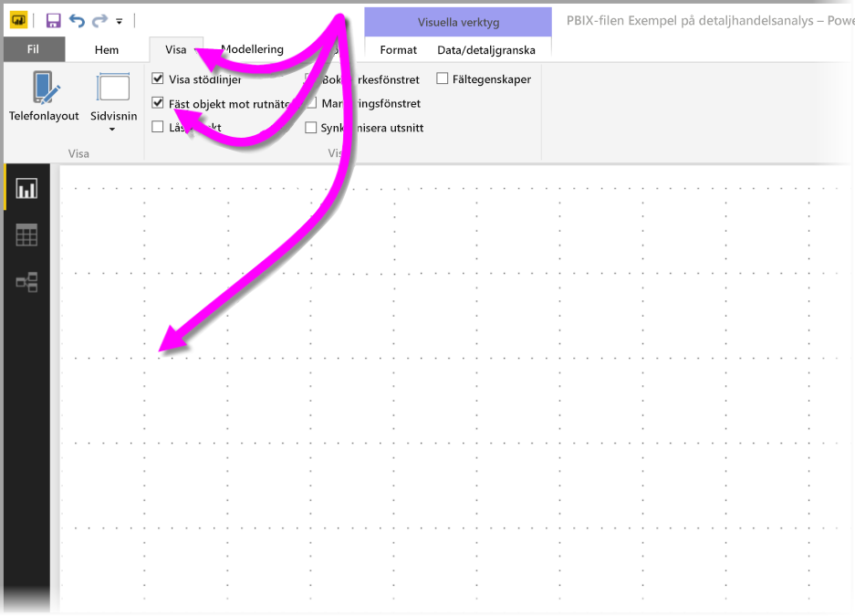
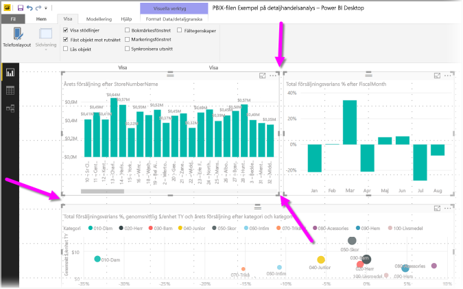
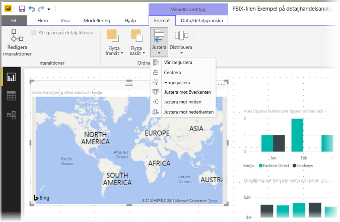
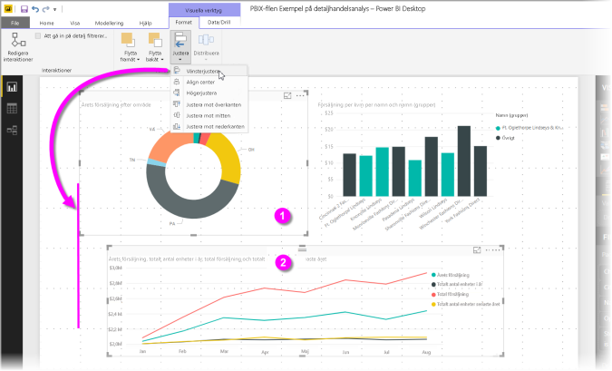

# Använd stödlinjer och fäst till rutnät i Power BI Desktop-rapporter
Rapportarbetsytan för**Power BI Desktop** erbjuder stödlinjer som gör att du snyggt kan justera visuell information på en rapportsida. Den erbjuder även funktionen fäst till rutnät så att visuell information i dina rapporter blir snyggt justerad och jämnt fördelade.

I **Power BI Desktop** kan du även justera z-ordningen (flytta framåt, bakåt) för objekt i en rapport samt justera eller jämt fördela markerad visuell information på arbetsytan.

### Använda stödlinjer och fästa till rutnät
Om du vill aktivera stödlinjer och fäst till rutnät, väljer du menyfliken **Visa** och aktiverar kryssrutorna för **Visa stödlinjer** och **Fäst objekt till rutnät.** Du kan välja en eller båda rutorna. De är oberoende av varandra.

> [!NOTE]
> Om **Visa stödlinjer** och **Fäst till rutnät** är inaktiverade, kan du ansluta till någon datakälla så aktiveras de.
> 
> 

### Använd stödlinjer
Stödlinjer är synliga hjälpmedel som låter dig se om två eller flera visuella objekt är justerade. När du försöker fastställa om två (eller flera) visuella objekt är vågrätt eller lodrätt justerade, använder du stödlinjerna för att visuellt avgöra om deras gränser är justerade.

Du kan använda *CTRL + klick* för att markera flera visuella objekt samtidigt, vilket gör att de valda visualiseringarnas kanter visas så att du kan avgöra om de är justerade.

#### Använd stödlinjer i visuell information
I Power BI finns det också stödlinjer i visuell information som hjälper dig att visuellt jämföra datapunkter och värden. Från och med lanseringen av **Power BI Desktop** september 2017, kan du nu hantera stödlinjerna inom visualiseringar med korten **x-axel** eller **y-axel** (beroende på visualiseringstyp), vilka återfinns i avsnittet **Format** i fönstret **Visualiseringar**. Du kan hantera följande stödlinjeelement i en visualisering:

* Aktivera och inaktivera stödlinjer
* Ändra färgen på stödlinjer
* Justera linjen (bredden) för stödlinjer
* Välj linjeformatet för stödlinjer i visualiseringen, till exempel fylld, streckad eller prickad

Det kan vara särskilt användbart att modifiera vissa egenskaper hos stödlinjerna för rapporter där en mörk bakgrund används för visuell information. Följande bild visar avsnittet *stödlinjer* i kortet **x-axel**.

### Använd fäst till rutnät
När du aktiverar **Fäst till rutnät**, justeras automatiskt all visuell information på den **Power BI Desktop**-arbetsyta som du flyttar (eller ändrar storlek på) till närmaste stödlinjeaxel, vilket gör det enklare att se till två eller flera visualiseringar justeras till samma vågräta eller lodräta plats eller storlek.

Det är inte svårare än så att använda **stödlinjer** och **fäst till rutnät** för att enkelt se till att dina rapportvisualiseringar är snyggt justerade.

### Använd z-ordning, justera och distribuera
Du kan också hantera fram till bak-ordningen för visualiseringar i en rapport, vilket ofta kallas *z-ordningen* för element. På så sätt kan du överlappa visuell information på valfritt sätt och sedan justera fram till bak sorteringen för varje visualisering. Den här sorteringen utförs med knapparna **Flytta framåt** och **flytta bakåt**, i avsnittet **Sortera** i menyfliksområdet **Format** som visas så fort du markerar en eller flera visualiseringar på sidan (och inte syns om inga visualiseringar har valts).

Menyfliksområdet **Format** låter dig justera visuell information på många olika sätt. På så sätt kan du se till att dina visualiseringar visas på sidan med just den justering som du tycker ser bäst ut och fungerar bäst.

När en visualisering är markerad, justerar du den till kanten (eller till center) av rapportens arbetsyta med knappen **Justera**, enligt följande bild.

När två eller flera visualiseringar är markerade, justeras de till varandra och använder den befintliga justerade gränsen för visualiseringarna för justering. När två visualiseringar har valts och knappen *Vänsterjustera* väljs, till exempel, kommer de att justeras till den vänstra kanten för alla valda visualiseringar.

Du kan även distribuera dina visualiseringar jämt över rapportarbetsytan, antingen vågrätt eller lodrätt. Använd bara knappen **Fördela** från menyfliksområdet **Format**.

Med bara några val från de här verktygen för stödlinjer, justering och distribution, kommer dina rapporter att se ut exakt som du vill.

