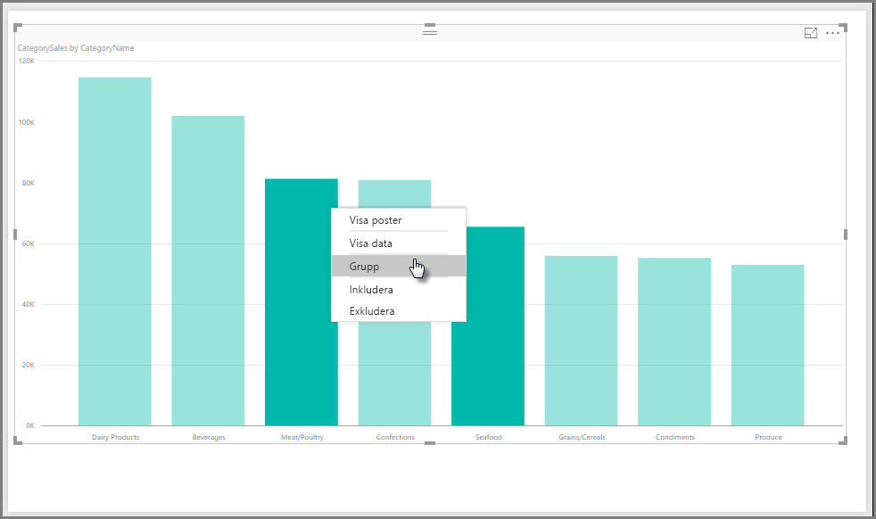
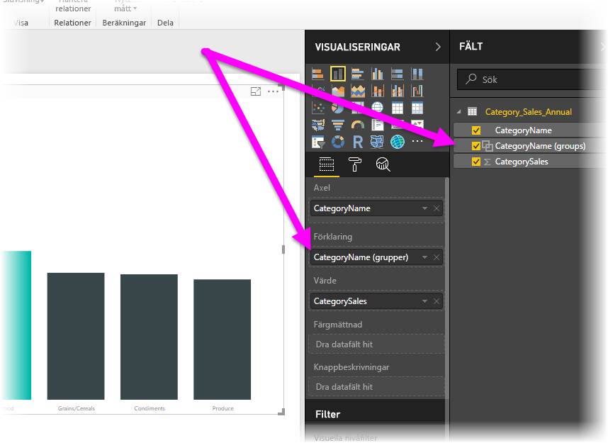
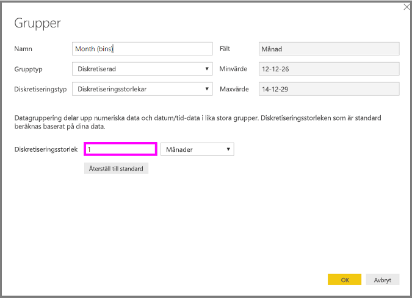

# Använd gruppering i Power BI Desktop
När Power BI Desktop skapar visuella objekt aggregeras dina data i segment (eller grupper) baserat på värdena i underliggande data. Det är ofta bra, men ibland vill du begränsa hur dessa segmentvisas. Du kanske exempelvis vill placera tre produktkategorier i en större kategori (en *grupp*). Du vill kanske se försäljningssiffror i diskreta enheter om 1 000 000 kronor istället för att visa storleken 923 983 kronor.

Du kan *gruppera* datapunkter i Power BI Desktop, vilket hjälper dig att tydligt visa, analysera och utforska data och trender i visuella objekt. Du kan också definiera en *diskretiseringsstorlek* som gör att värden placeras i lika stora grupper som gör det enklare att visa informationen tydligt. Den här åtgärden kallas ofta för *diskretisering*.

## Med gruppering
När du ska använda gruppering väljer du två eller flera element i ett visuellt objekt genom att Ctrl+klicka. Högerklicka sedan på ett av de valda elementen och välj **Grupp** på snabbmenyn.

När du har skapat gruppen läggs den till i bucketen **Förklaring** för det visuella objektet. Gruppen visas också i listan **Fält**.

När du har en grupp kan du enkelt redigera gruppens medlemmar. Högerklicka på fältet i bucketen **Förklaring** eller i listan **Fält** och välj sedan **Redigera grupper**.

I dialogrutan **Grupper** kan du skapa nya grupper och ändra befintliga grupper. Du kan också *byta namn* på dina grupper. Dubbelklicka bara på grupprubriken i rutan **Grupper och medlemmar** och ange sedan det nya namnet.

Du kan göra många olika saker med grupper. Du kan lägga till objekt från listan **Ej grupperade värden** i en ny grupp eller i en av de befintliga grupperna. Om du vill skapa en ny grupp markerar du två eller flera objekt (genom att Ctrl+klicka) i rutan **Ej grupperade värden** och väljer sedan knappen **Gruppera** under rutan.

Du kan lägga till ett ej grupperat värde i en befintlig grupp: markera det **ej grupperade värdet**, markera den befintliga gruppen där du vill lägga till värdet och välj knappen **Gruppera**. Om du vill ta bort ett objekt från en grupp markerar du det i rutan **Grupper och medlemmar** väljer sedan **Dela upp grupp**. Du kan också flytta ej grupperade kategorier till gruppen **Andra** eller låta dem vara enskilda.

> [!NOTE]
> Du kan skapa grupper för valfritt fält i brunnen **Fält** utan att behöva välja flera objekt från ett befintligt visuellt objekt. Det är bara att högerklicka på fältet och välja **Ny grupp** på den meny som visas.

## Med hjälp av diskretisering
Du kan ange diskretiseringsstorlek för numeriska och tidvärden i **Power BI Desktop.** Du kan använda diskretisering till att anpassa storleken för data som visas i Power BI Desktop.

Om du vill använda en diskretiseringsstorlek högerklickar du på ett **fält** och väljer **Ny grupp**.

I dialogrutan **Grupper** kan du ange önskad **diskretiseringsstorlek**.

När du väljer **OK**, lägg märke till att ett nytt fält visas i rutan **Fält** med **(diskreta grupper)** . Du kan sedan dra fältet till arbetsytan för att använda diskretiseringsstorleken i ett visuellt objekt.

Titta på den här *videon* för att se hur [diskretisering](https://www.youtube.com/watch?v=BRvdZSfO0DY) går till.

Och så enkelt är det att använda *gruppering* och *diskretisering* så att visuella objekt i dina rapporter visar data precis som du vill.
