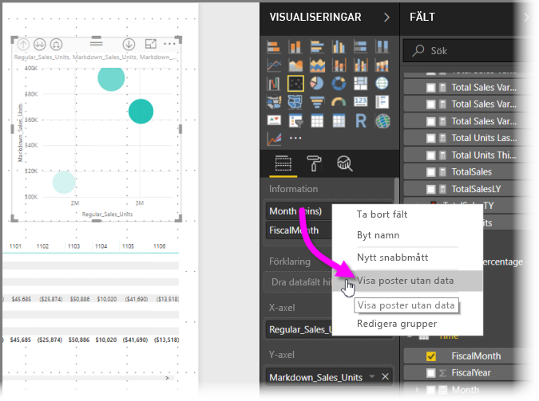

# Högdensitetssampling i Power BI-punktdiagram
Från och med september 2017-versionen av **Power BI Desktop** och uppdateringar av **Power BI-tjänsten**, finns en ny samplingsalgoritm tillgänglig som förbättrar hur punktdiagram visar högdensitetsdata.

Du kan till exempel skapa ett punktdiagram från din organisations försäljningsaktivitet där varje butik har tiotusentals datapunkter varje år. Ett punktdiagram med sådan försäljningsinformation skulle sampla data (välja en meningsfull återgivning av dessa data som illustrerar hur försäljningen skedde över tid) från tillgängliga data, samt skapa ett punktdiagram med flera serier som därmed representerar underliggande data. Detta är vanligt vid högdensitetspunktdiagram. Power BI har förbättrat sin sampling av högdensitetsdata, vilket beskrivs i den här artikeln.

> [!NOTE]
> Algoritmen för **högdensitetssampling** som beskrivs i den här artikeln är tillgänglig i punktdiagram för både **Power BI Desktop** och **Power BI-tjänsten**.
> 
> 

## Så här fungerar punktdiagram med hög densitet
Tidigare valde **Power BI** en uppsättning samplade datapunkter från alla underliggande data på ett deterministiskt sätt för att skapa ett punktdiagram. Mer specifikt väljer Power BI de första och sista raderna med data i punktdiagramserien och delar upp de återstående raderna jämnt så att 3 500 datapunkter fördelas över punktdiagrammet. Till exempel om urvalet hade 35 000 rader skulle den första och sista raden väljas för punktdiagrammet. Var tionde rad utgör sedan en punkt i diagrammet (35 000/10 = var tionde rad = 3 500 datapunkter). Tidigare visades inte null-värden som inte kunde inte ritas (till exempel textvärden) i dataserien och således beaktades de inte vid generering av det visuella objektet. Med sådan sampling är den upplevda tätheten av punktdiagrammet baserad på representativa datapunkter. Därmed är den underförstådda visuella tätheten en följd av de valda punkterna och inte hela datasamlingen.

När du aktiverar **Provtagning med hög densitet**  implementerar Power BI implementerar en algoritm som eliminerar överlappande punkter och garanterar att det går att interagera med individuella punkter i det visuella objektet. Algoritmen säkerställer också att alla punkter i datauppsättningen visas i det visuella objektet, vilket ger ett sammanhang för betydelsen av de valda punkterna, snarare än bara ett representativt urval.

Per definition samplas högdensitetsdata för att skapa visualiseringar förhållandevis snabbt som reagerar på interaktivitet. För många datapunkter i ett visuellt objekt kan göra det tungt, och det kan dra uppmärksamheten från synligheten för trender. Metoden för att sampla data styr skapandet av samplingsalgoritmen för att ge bästa möjliga visualisering och säkerställa att alla data representeras. Algoritmen i Power BI har förbättrats för att ge den bästa kombinationen av svarstider, återgivning och att bevara viktiga punkter i varje datauppsättningen.

> [!NOTE]
> Punktdiagram med hjälp av algoritmen för **högdensitetssampling** ritas bäst på kvadratiska visuella objekt, precis som med alla punktdiagram.
> 
> 

## Så här fungerar samplingsalgoritmen för punktdiagram
Den nya algoritmen för **högdensitetssampling** för punktdiagram använder metoder som avbildar underliggande data mer effektivt och undviker överlappande punkter. Detta är tack vare en lite startradie för varje datapunkt (den visuella cirkeln för varje punkt i det visuella objektet). Sedan ökar radien för alla datapunkter. När två (eller fler) datapunkter överlappar varandra, representerar en enskild cirkel (med större radie) de överlappande datapunkterna. Algoritmen fortsätter att öka radien för datapunkter, tills radievärdet resulterar i ett rimligt antal datapunkter – 3 500 – som visas i punktdiagram.

Metoderna i den här algoritmen se till att avvikare representeras i det visuella objektet. Algoritmen respekterar skala när överlappning fastställs, så att exponentiella skalor visualiseras utan att göra avkall på underliggande datapunkter.

Algoritmen bevarar punktdiagrammets övergripande form.

> [!NOTE]
> När du använder algoritmen för **sampling med hög densitet** för punktdiagram, är målet *korrekt distribution* av data och den *inte* underförstådda visuella densiteten. Du kan exempelvis se ett punktdiagram med många cirklar som överlappar (densitet) i ett visst område och du vet att många datapunkter måste vara samlade där. Eftersom algoritmen för **sampling med hög densitet** kan använda en cirkel för att representera många datapunkter visas sådana underförstådda visuella tätheter (eller ”kluster”) inte. Du kan använda utsnitt för att få mer information i ett visst område.
> 
> 

Dessutom ignoreras datapunkter som inte kan ritas (till exempel null-värden eller textvärden). Istället väljs ett värde som kan ritas vilket så att punktdiagrammets form bevaras.

### När standardalgoritmen för punktdiagram används
Det finns omständigheter då **högdensitetssampling** inte kan tillämpas på ett punktdiagram och den ursprungliga algoritmen används. Dessa omständigheter är följande:

* Om du högerklickar på ett värde under **Information**och väljer **Visa poster utan data** från menyn återgår punktdiagrammet till den ursprungliga algoritmen.
  
  
* Alla värden i axeln **Spela upp** resulterar i punktdiagrammet återgår till den ursprungliga algoritmen.
* Om både X- och Y-axlarna saknas på ett punktdiagram återgår diagrammet till den ursprungliga algoritmen.
* Om du använder en **förhållanderad** i fönstret **Analys** återgår diagrammet till den ursprungliga algoritmen.
  
  

## Så här aktiverar du sampling med hög densitet för ett punktdiagram
Om du vill aktivera **Högdensitetssampling** väljer du ett punktdiagram, går till rutan **Formatering** och expanderar kortet **Allmänt**. Mot slutet av det kortet flyttar du skjutreglaget **Högdensitetssampling** till **På**.

> [!NOTE]
> När skjutreglaget är aktiverat försöker Power BI använda algoritmen för **sampling med hög densitet** när det är möjligt. När algoritmen inte kan användas (till exempel om du placerar ett värde på axeln *Spela upp*) stannar skjutreglaget kvar i läget **På**, även om diagrammet har återställts till algoritmen som standard. Om du sedan tar bort ett värde från axeln *Spela upp* (eller om villkoren för att aktivera användningen av algoritmen för högdensitetssampling ändras) kommer diagrammet att använda högdensitetssampling automatiskt för diagrammet, eftersom funktionen är aktiv.
> 
> [!NOTE]
> Datapunkter grupperas eller väljs av indexet. En förklaring påverkar inte samplingsfrekvensen för algoritmen, utan påverkar endast sorteringen av den visuella informationen.
> 
> 

## Överväganden och begränsningar
Algoritmen för högdensitetssampling är en viktig förbättring i Power BI, men det finns några saker som är bra att veta när du arbetar med högdensitetsvärden och punktdiagram.

* Algoritmen för **högdensitetssampling** fungerar endast med realtidsanslutningar till modeller som är baserade på Power BI-tjänsten eller DirectQuery.

## Nästa steg
Information om högdensitetssampling i andra diagram finns i följande artikel.

* [Högdensitetssampling av linjer i Power BI](desktop-high-density-sampling.md)

