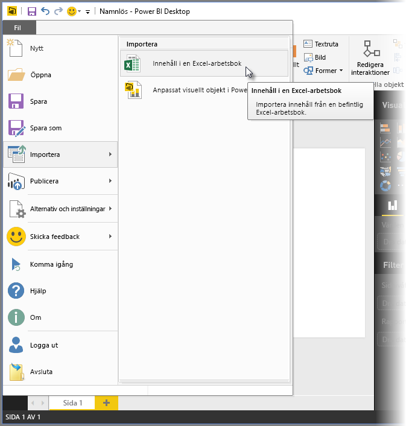
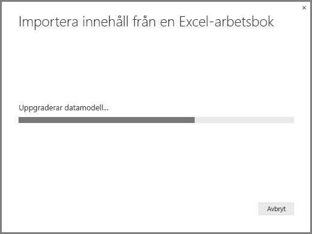
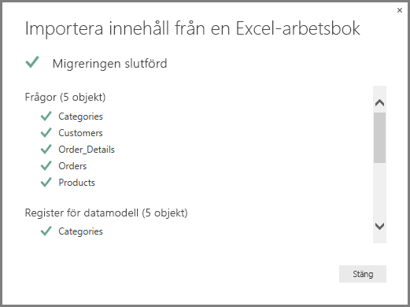
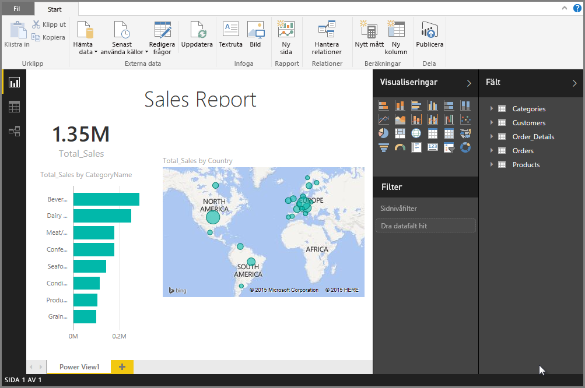

# Importera Excel-arbetsböcker till Power BI Desktop
Med **Power BI Desktop** kan du enkelt importera Excel-arbetsböcker som innehåller Power Query-frågor, Power Pivot-modeller och Power View-kalkylblad till Power BI Desktop. Rapporter och visualiseringar skapas automatiskt utifrån Excel-arbetsboken och när de importerats, kan du fortsätta att förbättra och förfina rapporterna med hjälp av Power BI Desktop med hjälp av befintliga funktioner och nya funktioner som lanseras med varje månatlig Power BI Desktop-uppdatering.

I framtiden är planen att tillhandahålla ytterligare kommunikation mellan Excel och Power BI Desktop (till exempel import/export). Den aktuella möjligheten att importera arbetsböcker till Power BI Desktop låter befintliga Excel-användare komma igång med Power BI Desktop.

## Hur gör jag för att importera en Excel-arbetsbok?
Importera en arbetsbok från Power BI Desktop genom att välja **Fil -\> Import -\> Excel-arbetsboksinnehåll**.

Ett fönster visas som låter dig välja arbetsbok att importera. Det finns för tillfället ingen begränsning för storlek eller antal objekt i arbetsboken, men större arbetsböcker tar längre tid för Power BI Desktop att analysera och importera.

> [!NOTE]
> Om du vill läsa in eller importera Excel-filer från **delade OneDrive för företag**-mappar eller från **Office 365-grupp**mappar, använder du URL:en för Excel-filen och anger den i **webb**datakällan i Power BI Desktop. Det finns några steg du måste följa för att korrekt formatera **OneDrive för företag**-URL:en så kolla in [Använd OneDrive för företag-länkar i Power BI Desktop](desktop-use-onedrive-business-links.md) för mer information och korrekt antal steg.
> 
> 

När en arbetsbok har valts, analyserar Power BI Desktop arbetsboken och konverterar den till en Power BI Desktop-fil (.pbix). Den här åtgärden är en engångshändelse. När Power BI Desktop-filen har skapats med de här stegen, är den inte beroende av den ursprungliga Excel-arbetsboken och kan modifieras eller ändras (och sparas och delas) utan att påverka den ursprungliga arbetsboken.

När importen har slutförts, visas en **sammanfattnings**sida som beskriver de objekt som konverterats och listar även objekt som inte kunde importeras.

När du väljer **Stäng**, läses rapporten in i Power BI Desktop. Följande bild visar Power BI Desktop efter att en Excel-arbetsbok har importerats: Power BI Desktop läste automatiskt in rapporten utifrån arbetsbokens innehåll.

Nu när arbetsboken har importerats kan du fortsätta arbeta med rapporten. Du kan till exempel skapa nya visualiseringar, lägga till data, eller skapa nya rapportsidor. Med de funktioner som ingår i Power BI Desktop.

## Vilka arbetsbokselement importeras?
Power BI Desktop kan importera följande element, som vanligtvis kallas *objekt*, i Excel.

| Objekt i Excel-arbetsboken | Slutresultatet i Power BI Desktop-filen |
| --- | --- |
| Power Query-frågor |Alla Power Query-frågor från Excel konverteras till frågor i Power BI Desktop. Om det fanns frågegrupper definierade i Excel-arbetsboken, replikeras samma organisation i Power BI Desktop. Alla frågor har lästs in om de inte har ställts in på Skapa enbart anslutning i Excel. Inläsningsbeteendet kan anpassa från dialogrutan **Egenskaper** i fliken **Start** i **Frågeredigeraren** i Power BI Desktop. |
| Power Pivot externa dataanslutningar |Alla Power Pivot externa dataanslutningar kommer att konverteras till frågor i Power BI Desktop. |
| Länkade tabeller eller tabeller för den aktuella arbetsboken |Om det finns en kalkylbladstabell i Excel som är länkad till datamodellen, eller länkar till en fråga (med hjälp av *From Table* eller funktionen *Excel.CurrentWorkbook()* i M), visas följande alternativ: 1. Importera tabellen till Power BI Desktop-filen. Den här tabellen är en engångs-ögonblicksbild av data. Därefter kan du inte redigera data i tabellen i Power BI Desktop. Det finns en storleksgräns på 1 miljon tecken (totalt, genom att kombinera alla kolumnrubriker och celler) för tabeller som skapats med det här alternativet. 2. Behåll en anslutning till den ursprungliga arbetsboken. Du kan även behålla en anslutning till den ursprungliga Excel-arbetsboken så hämtar Power BI Desktop det senaste innehållet i den här tabellen med varje uppdatering precis som andra frågor som skapas mot en Excel-arbetsbok i Power BI Desktop. |
| Datamodelldata för beräknade kolumner, mått, KPI:er, datakategorier och relationer |Dessa datamodellobjekt konverteras till motsvarande objekt i Power BI Desktop. Observera att det finns vissa datakategorier som inte är tillgängliga i Power BI Desktop ännu, till exempel **Bild**. I dessa fall återställs datakategoriinformationen för kolumnerna i fråga. |
| Power View-kalkylblad |En ny rapportsida skapas för varje Power View-kalkylblad i Excel. Namnet och sorteringen för dessa rapportsidor matchar den ursprungliga Excel-arbetsboken. |

## Finns det några begränsningar för import av en arbetsbok?
Det finns några begränsningar för import av en arbetsbok till Power BI Desktop, som anges i följande lista:

* **Externa anslutningar till Analysis Services-tabellmodeller:** i Excel 2013 är det möjligt att skapa en anslutning till SQL Server Analysis Services-tabellmodeller och skapa Power View-rapporter ovanpå dessa modeller utan att behöva importera data. Den här typen av anslutning stöds inte för tillfället som en del av att importera Excel-arbetsböcker till Power BI Desktop. Under tiden måste du återskapa dessa externa anslutningar i Power BI Desktop.
* **Hierarkier:** den här typen av datamodellobjekt stöds för närvarande inte i Power BI Desktop. Därför ignoreras hierarkier som en del av att importera en Excel-arbetsbok till Power BI Desktop.
* **Binära datakolumner:** den här typen av datamodellobjekt stöds för närvarande inte i Power BI Desktop. Binära datakolumner tas bort från den resulterande tabellen i Power BI Desktop.
* **Power View-element som inte stöds:** det finns några funktioner i Power View som inte är tillgängliga i Power BI Desktop, till exempel teman eller vissa typer av visualiseringar (punktdiagram med uppspelningsaxel, beteenden för att öka detaljnivå, osv.). Dessa visualiseringar som inte stöds, resulterar i meddelanden om *visualiseringen stöds inte* på deras motsvarande platser i Power BI Desktop-rapporten, vilka du kan ta bort eller konfigurera om efter behov.
* **Namngivna områden som använder** ***från tabellen*** **i Power Query, eller** ***Excel.currentworkbook*** **i M:** det finns inte stöd för att importera dessa namngivna områdesdata till Power BI Desktop för närvarande, men det är en planerad uppdatering för Power BI Desktop. För närvarande laddas dessa namngivna områden till Power BI Desktop som en anslutning till den externa Excel-arbetsboken.
* **PowerPivot till SSRS:** externa PowerPivot-anslutningar till SQL Server Reporting Services (SSRS) stöds inte för närvarande, eftersom datakällan inte är tillgänglig i Power BI Desktop för tillfället.

