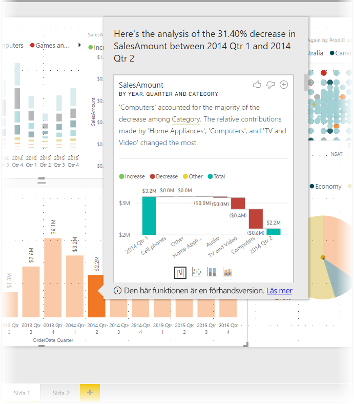
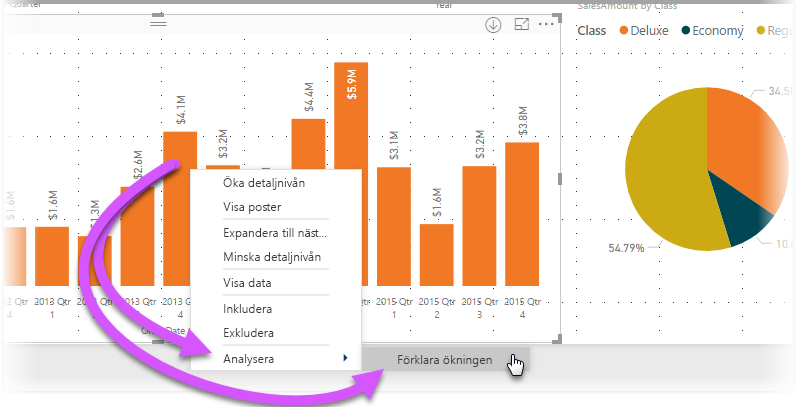
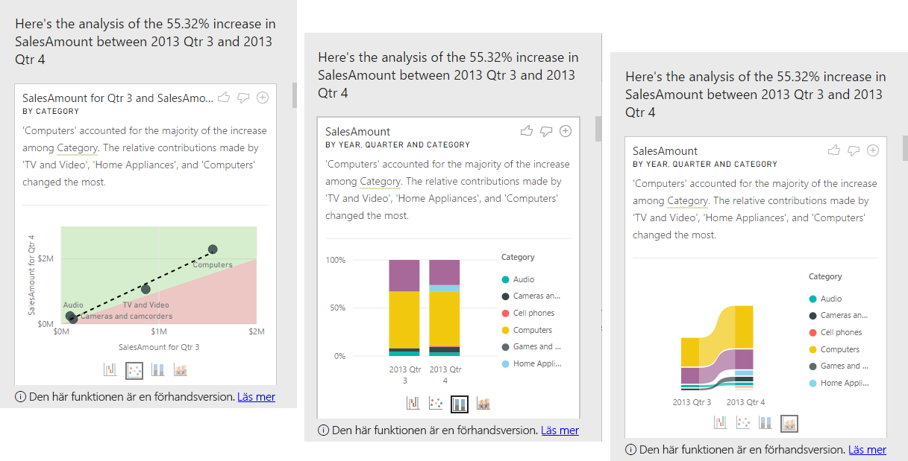

# Använda insikter i Power BI Desktop (förhandsversion)
Du kan uppmana **Power BI Desktop** att förklara ökningar eller minskningar i diagram och få snabba, automatiserade, insiktsfulla analyser om dina data. Det är bara att högerklicka på en datapunkt och välja **Analysera> förklarar minskningen** (eller ökningen, om fältet tidigare var lägre) så levereras insikter till dig i ett lättanvänt fönster.

Funktionen insikter är sammanhangsberoende och bygger på den direkt föregående datapunkten, till exempel föregående stapel eller kolumn.

> [!NOTE]
> Den här funktionen är en förhandsversion och kan komma att ändras. Funktionen insikter aktiveras som standard (du inte behöver markera kryssrutan Förhandsgranskning för att aktivera den) från och med versionen från September 2017 av **Power BI Desktop**.
> 
> 

## Använda insikter
Om du vill använda insikter högerklickar du på en datapunkt i ett stapel- eller linjediagram och väljer **Analysera > Förklara ökningen** (eller *förklara minskningen* eftersom alla insikter baseras på ändringar från den tidigare datapunkten).

**Power BI Desktop** kör sedan maskininlärningsalgoritmer över dessa data och fyller ett fönster med ett visuellt objekt och en beskrivning som visar vilka kategorier som har påverkat ökningen eller minskningen mest. Som standard visas insikter som ett *vattenfallsdiagram*, enligt följande bild.

Genom att välja små ikoner längst ned i vattenfallsdiagrammet kan du låta insikterna visas som ett punktdiagram, stående stapeldiagram eller ett diagram i menyfliksområdet.

Ikonerna *tummen upp* och *Tummen ned* överst på sidan finns där så att du kan ge feedback om det visuella objektet och funktionen.

Knappen **+** längst upp i det visuella objektet låter dig lägga till det markerade visuella objektet i rapporten, precis som om du hade skapat det visuella objektet manuellt. Sedan kan du formatera eller justera det nya visuella objektet på samma sätt som något annat visuellt objekt i din rapport. Du kan bara lägga till ett visuellt objekt med insikter när du redigerar en rapport i **Power BI Desktop**.

Du kan använda insikter när rapporten är i läs- eller redigeringsläge, vilket gör det flexibelt för dataanalys och för att skapa visuella objekt som du kan lägga till i dina rapporter.

## Överväganden och begränsningar
Eftersom insikter baseras på ändringar från tidigare datapunkter är de inte tillgängliga när du väljer den första datapunkten i ett visuellt objekt. 

Följande lista innehåller en samling scenarier som för närvarande inte fungerar med **insikter**:

* TopN-filter
* Inkludera/exkludera filter
* Måttfilter
* Icke-additiva mått och aggregeringar
* Visa värde som
* Filtrerade mått (vår nyhet för punktdiagram i insikter)
* Kategoriska kolumner på x-axeln, såvida inte den definierar en skalär sortering enligt kolumn. Om du använder en hierarki måste alla kolumner i den aktiva hierarkin matcha det här villkoret
* Icke-numeriska mått

Dessutom stöds följande modelltyper och datakällor inte för närvarande med insikter:

* DirectQuery
* Live Connect
* Lokal Reporting Services
* Bädda in

## Nästa steg
För mer information om **Power BI Desktop**, och hur du kommer igång, ta en titt i följande artiklar.

* [Komma igång med Power BI Desktop](desktop-getting-started.md)
* [Frågeöversikt med Power BI Desktop](desktop-query-overview.md)
* [Datakällor i Power BI Desktop](desktop-data-sources.md)
* [Anslut till data i Power BI Desktop](desktop-connect-to-data.md)
* [Forma och kombinera data i Power BI Desktop](desktop-shape-and-combine-data.md)
* [Vanliga frågeuppgifter i Power BI Desktop](desktop-common-query-tasks.md)   

