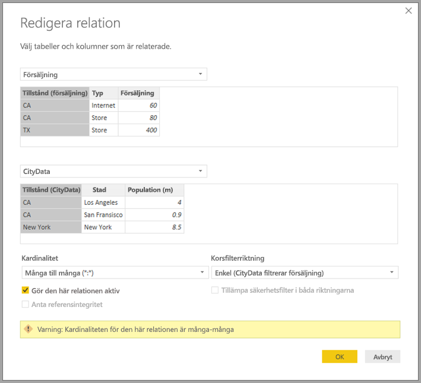

# Relationer med kardinaliteten många-många i Power BI Desktop

Med funktionen för *relationer med kardinaliteten många-många* i Power BI Desktop kan du koppla tabeller som använder kardinaliteten *Många till många*. Du kan på ett enklare och mer intuitivt sätt skapa datamodeller som innehåller två eller flera datakällor. Funktionen för *relationer med kardinaliteten många-många* är en del av de mer omfattande funktionerna för *sammansatta modeller* i Power BI Desktop.

Funktionen för *relationer med kardinaliteten många-många* i Power BI Desktop är en av tre relaterade funktioner:

* **Sammansatta modeller**: Låter en rapport ha två eller flera dataanslutningar, inklusive DirectQuery-anslutningar eller importera, i valfri kombination. Mer information finns i [Använda sammansatta modeller i Power BI Desktop](desktop-composite-models.md).

* **Relationer med kardinaliteten många-många**: Med *sammansatta modeller* kan du etablera *relationer med kardinaliteten många-många* mellan tabeller. Det här tillvägagångssättet tar bort krav på unika värden i tabeller. Det tar också bort behovet av tidigare lösningar. Du behöver till exempel inte lägga till nya tabeller bara för att skapa relationer. Denna funktion beskrivs ytterligare i den här artikeln.

* **Lagringsläge**: Nu kan du ange vilka visuella objekt som kräver en fråga till serverdelens datakällor. Visuella objekt som inte kräver en fråga importeras även om de är baserade på DirectQuery. Den här funktionen hjälper till att förbättra prestanda och minskar belastningen på serversidan. Tidigare startade även enkla visuella objekt såsom utsnitt frågor som skickades till serverdelskällor. Mer information finns i [Lagringsläge i Power BI Desktop (förhandsversion)](desktop-storage-mode.md).

## Det här löser *relationer med kardinaliteten många-många*

Innan funktionen för *relationer med kardinaliteten många-många* blev tillgänglig definierades relationen mellan två tabeller i Power BI. Minst en av de tabellkolumner som ingick i relationen var tvungen att innehålla unika värden. Ofta innehöll dock inga kolumner unika värden. 

Till exempel hade två tabeller kanske en kolumn med namnet *Land*, men värdena för *Land* var inte unika i endera tabell. Det var nödvändigt att skapa en lösning för att koppla sådana tabeller. En sådan lösning kan vara att i modellen introducera ytterligare tabeller med nödvändiga unika värden. Med funktionen för *relationer med kardinaliteten många-många* kan du koppla sådana tabeller direkt genom att använda en relation med kardinaliteten **Många-till-många**.  

## Använda *relationer med kardinaliteten många-många*

När du definierar en relation mellan två tabeller i Power BI måste du definiera kardinaliteten för relationen. Till exempel skulle relationen mellan *ProductSales* och *Produkt*&mdash;med hjälp av kolumnerna *ProductSales[ProductCode]* och *Product[ProductCode]*&mdash;definieras som *Många-1*. Vi definierar relationen på det här sättet eftersom det finns många försäljningar för varje produkt och kolumnen i tabellen *Product* *(ProductCode)* är unik. När du definierar en relationskardinalitet som *Många-1*, *1-Många* eller *1-1* verifierar Power BI den för att säkerställa att den kardinalitet som du väljer matchar faktiska data.

Se till exempel den enkla modellen i följande bild:

Tänk dig nu att tabellen *Produkt* bara visar två rader enligt nedan:

Tänk dig även att tabellen *Försäljning* bara hade fyra rader, inklusive en rad för produkt C. På grund av ett fel med referensintegritet finns raden för produkt C inte i tabellen *Produkt*.

*ProductName* och *Pris* (från tabellen *Produkt*), tillsammans med den totala *Kvantitet* för varje produkt (från tabellen *ProductSales*) skulle då visas som i följande bild: 

Som du ser i föregående bild finns en tom rad med namnet *ProductName* som är associerad med försäljning för produkten C. Den här tomma raden står för följande:

* Alla rader i tabellen *ProductSales* som det inte finns någon motsvarande rad för i tabellen *Produkt*. Det finns ett problem med referensintegritet, som vi kan se för produkten *C* i det här exemplet.

* Alla rader i tabellen *ProductSales* där sekundärnyckelkolumnen är null. 

Av dessa anledningar står den tomma raden i båda fallen för försäljning där *ProductName* och *Pris* är okända.

Det händer dock ibland att tabellerna kopplas av två kolumner men ingendera kolumn är unik. Tänk dig exempelvis följande två tabeller:

* Tabellen *Försäljning* visar försäljningsdata efter *Delstat*, där varje rad innehåller försäljningsmängd för typen av försäljning i den delstaten. Delstaterna inkluderar CA, WA och TX. 

    

* Tabellen *CityData* visar data om städer, inklusive befolkning och delstat (inklusive CA, WA och New York).

    

Även om det finns en kolumn för *Delstat* i båda tabellerna, och det är rimligt att vilja rapportera om både total försäljning efter delstat och total befolkning i varje delstat, finns det ett problem: kolumnen *Delstat* är inte unik i endera tabell. 

## Den tidigare lösningen

I Power BI Desktop-versioner som är äldre än versionen för juli 2018 kunde användare inte skapa en direkt relation mellan dessa tabeller. En vanlig lösning var att göra följande:

* Skapa en tredje tabell som bara innehåller unika ID:n för *Delstat*. Tabellen skulle kunna vara något eller allt av följande:
  * En beräknad tabell (definieras med hjälp av Data Analysis-uttryck [DAX]).
  * En tabell baserad på en fråga som definieras i frågeredigeraren, som kan visa de unika ID:na hämtade från en av tabellerna.
  * Den kombinerade fullständiga uppsättningen.

* Relatera de två ursprungliga tabellerna till den nya tabellen med hjälp av vanliga *Många-1*-relationer.

Du kan antingen lämna lösningstabellen synlig eller dölja den så att den inte visas i listan **Fält**. Om du skulle dölja tabellen skulle *Många-1*-relationerna vanligtvis anges att filtrera i båda riktningarna, och då skulle då kunna använda fältet *Delstat* från endera tabell. Efterföljande korsfiltrering skulle spridas till den andra tabellen. Denna metod visas i följande bild:

Ett visuellt objekt som visar *Delstat* (från tabellen *CityData*) tillsammans med total *Befolkning* och total *Försäljning*, ser då ut på följande sätt:

> [!NOTE]
> Eftersom delstaten från tabellen *CityData* används i den här lösningen kan endast de delstater som anges i den tabellen listas. Därför utesluts TX. Till skillnad från fallet med *Många-1*-relationer inkluderar informationen inte en tom rad som täcker sådana felmatchade rader trots att totalraden inkluderar alla *Försäljningar* (inklusive dem i TX). På samma sätt skulle det inte finnas någon tom rad som täcker *Försäljning* där det fanns ett nullvärde för *Delstat*.

Om du även lägger till *Stad* till det visuella objektet gäller att även om befolkningen per *Stad* är känd så upprepar den *Försäljning* som visas för *Stad* den *Försäljning* som gäller för motsvarande *Delstat*. Detta är vanligtvis fallet när grupperingen i en kolumn är inte relaterad till ett visst sammanställningsmått enligt det som visas i följande bild:

Om vi definierar den tabellen *Försäljning* som en kombination av alla *Delstater* i den här lösningen och gör den synlig i listan **fält** skulle samma visuella objekt visa både *Delstat* (i den nya tabellen) och total *Befolkning* samt total *Försäljning* enligt följande bild:

Som du kan skulle *TX*&mdash;med *Försäljning*-data men okända *Befolkning*-data&mdash;och *New York*&mdash;med kända *Befolkning*-data men inga *Försäljning*-data&mdash;inkluderas. Den här lösningen inte optimal och har många problem. I och med skapandet av relationer med kardinaliteten många-många åtgärdas problemen enligt beskrivningen i följande avsnitt.

## Använda *relationer med kardinaliteten många-många* i stället för en tillfällig lösning

Från och med versionen för juli 2018 av Power BI Desktop kan du direkt relatera tabeller, till exempel dem som beskrevs ovan, utan att behöva använda liknande tillfälliga lösningar. Nu är det möjligt att ange relationskardinaliteten till *Många till många*. Den här inställningen anger att ingendera tabell innehåller unika värden. För sådana relationer kan du fortfarande kontrollera vilken tabell som filtrerar den andra tabellen eller tillämpa dubbelriktad filtrering där varje tabell filtrerar den andra tabellen.  

I Power BI Desktop är kardinaliteten som standard *Många till många* när det fastställs att ingendera tabell innehåller unika värden för kolumnerna i relationen. I sådana fall visas en varning för att bekräfta att relationsinställningen är ditt avsedda beteende i stället för en oavsedd konsekvens av ett dataproblem. 

När du till exempel skapar en relation direkt mellan *CityData* och *Försäljning*&mdash;där filter skulle flöda från *CityData* till *Försäljning*&mdash;visar Power BI Desktop fönstret **Redigera relation** enligt följande bild:

Den resulterande **Relationsvyn** skulle då visa den direkta många-till-många-relationen mellan de två tabellerna. Tabellernas visning listan **Fält** samt deras efterföljande beteende när de visuella objekten skapas liknar den gången då vi tillämpade den tillfälliga lösningen. I den här lösningen görs den extra tabell som visar distinkta *Delstat*-data inte synlig. Till exempel skulle enligt beskrivningen i föregående avsnitt ett visuellt objekt som visar *Delstat*, *Befolkning* och *Försäljning* visas på följande sätt:

De största skillnaderna mellan *relationer med kardinaliteten många-många* och de mer typiska *Många-1*-relationerna är följande:

* De värden som visas omfattar inte en tom rad som står för felmatchade rader i den andra tabellen. Inte heller står värdena för rader där den kolumn som används i relationen i den andra tabellen är null.
* Det går inte att använda funktionen `RELATED()` eftersom mer än en rad kan vara relaterad.
* Om du använder funktionen `ALL()` i en tabell kommer inte filter som använts på andra, relaterade tabeller av en många-till-många-relation att tas bort. I föregående exempel skulle ett mått som definierats enligt det som visas i följande skript inte ta bort filter i kolumner på den relaterade tabellen *CityData*:

    

    Ett visuellt objekt som visar data för *Delstat*, *Försäljning* och *Total försäljning* skulle resultera i följande:

    

Med föregående skillnader i åtanke bör du se till att de beräkningar som använder `ALL(\<Table>)`, till exempel *% av totalsumma*, returnerar de förväntade resultaten. 

## Begränsningar och överväganden

Det finns en del begränsningar för den här versionen av *relationer med kardinaliteten många-många* och sammansatta modeller.

Följande (flerdimensionella) Live-anslutningskällor kan inte användas med sammansatta modeller:

* SAP HANA
* SAP Business Warehouse
* SQL Server Analysis Services
* Power BI-datauppsättningar
* Azure Analysis Services

När du ansluter till dessa flerdimensionella källor med DirectQuery kan du inte ansluta till en annan DirectQuery-källa eller kombinera den med importerade data.

De befintliga begränsningarna med att använda DirectQuery gäller fortfarande när du använder *relationer med kardinaliteten många-många*. Många av dessa begränsningarna är nu per tabell, beroende på tabellens lagringsläge. En beräknad kolumn i en importerad tabell kan till exempel referera till andra tabeller, men en beräknad kolumn i en DirectQuery-tabell kan fortfarande bara referera till kolumner i samma tabell. Andra begränsningar gäller för modellen som helhet om någon av tabellerna inom modellen är DirectQuery. Till exempel är funktionerna QuickInsights och Frågor och svar är inte tillgängliga på en modell om någon av tabellerna i den har lagringsläget DirectQuery. 

## Nästa steg

Mer information om sammansatta modeller och DirectQuery finns i följande artiklar:
* [Sammansatta modeller i Power BI Desktop](desktop-composite-models.md)
* [Lagringsläge i Power BI Desktop (förhandsversion)](desktop-storage-mode.md)
* [Använda DirectQuery i Power BI Desktop](desktop-directquery-about.md)
* [Datakällor som stöds av DirectQuery i Power BI Desktop](desktop-directquery-data-sources.md)
