# Använd det visuella matrisobjektet i Power BI Desktop
Med den visuella **matris**-funktionen kan du skapa visuell matrisinformation (kallas ibland också *tabeller*) i **Power BI Desktop**-rapporter och markera flera element i matrisen med andra visuella objekt. Dessutom kan du välja rader, kolumner och även enskilda celler och korsmarkeringar. Matrisen har dessutom stöd för stegvis layout för optimal användning av utrymmet.

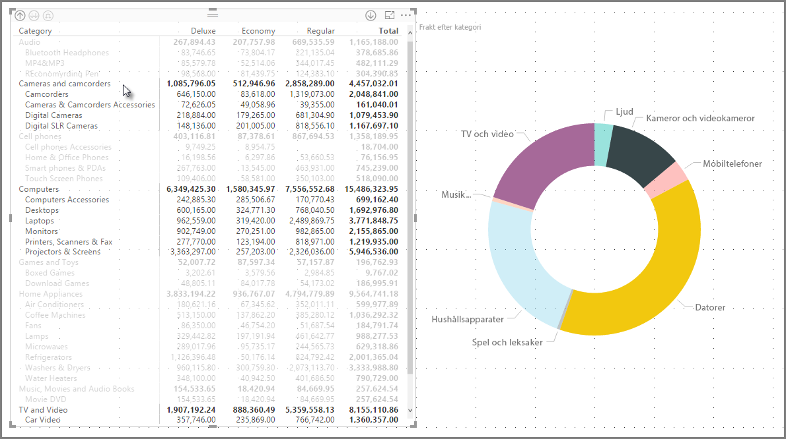

Det finns många funktioner som är kopplade till matrisen och vi ska gå igenom dem i följande avsnitt i den här artikeln.

> [!NOTE]
> Från och med lanseringen i juli 2017 speglar matriser och tabeller i **Power BI Desktop** formatmallar(inklusive färger) från den kopplade **rapportens tema**. Dessa kanske inte är de färger som du förväntar dig för din matris, vilket kan ändras i konfigurationen för ditt **Rapporttema**. Se [**Använda rapportteman i Power BI Desktop**](desktop-report-themes.md) för mer information om teman.
> 
> 

## Beräkning av summor i Power BI

Innan vi går vidare till hur man använder det visuella **matris**objektet är det viktigt att du förstår hur Power BI beräknar total- och delsummor i tabeller och matriser. När det gäller summa- och delsummarader utvärderas måttet för alla rader i underliggande data – det handlar *inte* bara om att lägga till värdena i de tabellrader som syns eller visas. Detta innebär att du kan få andra värden än vad du räknat med i totalsummaraden. 

Ta en titt på följande visuella **matris**objekt. 

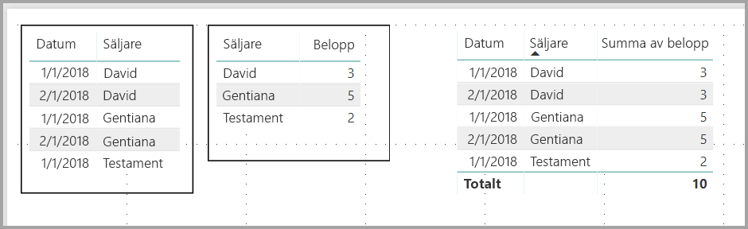

I det här exemplet visar varje rad i det visuella **matris**objektet längst till höger *Belopp* för varje kombination säljare/datum. Men eftersom en säljare visas för flera datum kan siffrorna visas mer än en gång. Den korrekta totalsumman för underliggande data och en enkel addering av de synliga värdena överensstämmer därmed inte. Detta är ett vanligt mönster när det värde som du summerar finns på ”ett”-sidan i ett ett-till-många-samband.

Tänk på att dessa värden, när du arbetar med total- och delsummor, baseras på underliggande data och inte enbart på de värden som visas. 

## Använd detaljerad vy i matris
Det finn sen mängd intressanta aktiviteter som ökar detaljnivån i **matrisen** som inte var tillgängliga tidigare. Detta inkluderar möjligheten att specificera med rader, kolumner och även i enskilda avsnitt och celler. Nu ska vi titta på hur var och en av dessa fungerar.

### Specificera radrubriker
I fönstret **Visuella objekt**, när du lägger till flera fält i området **Rader** avsnitt brunnen **fält** aktiveras specificering på raderna i matrisen. Detta påminner om hur du skapar en hierarki som sedan låter dig specificera (och återgå) i hierarkin och analysera data på varje nivå.

I följande bild skapar avsnittet **Rader** *Kategori* och *Underkategori* en gruppering (eller hierarki) i de rader som vi kan se i större detalj.

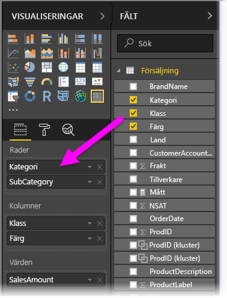

När en gruppering har skapats i avsnittet **Rader** visar det visuella objektet ikonerna *detaljgranska* och *expandera* i det övre vänstra hörnet.

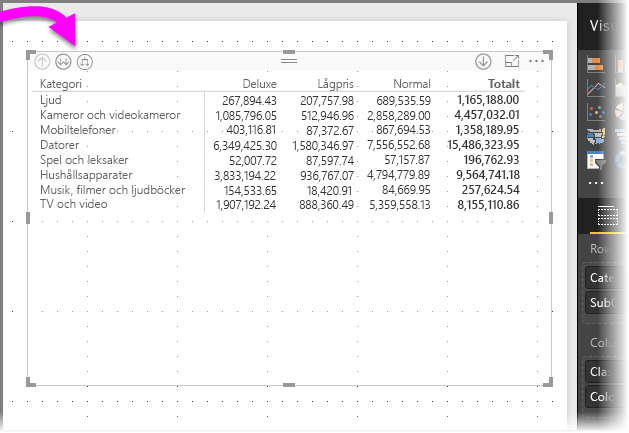

På samma sätt som funktionerna detaljgranska och expandera i andra visuella objekt kan vi detaljgranska hierarkin (eller återgå) med dessa knappar. I det här fallet kan vi gå från *Kategori* till *Underkategori*, vilket visas i följande bild, där ikonen för att gå ned en detaljnivå (högaffeln) har valts.

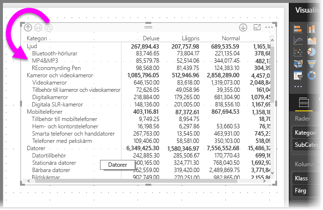

Förutom dessa ikoner kan du högerklicka på någon av dessa radrubriker och öka detaljnivån genom att välja från menyn som visas.

Observera att det finns flera alternativ på menyn som visas, vilket genererar olika resultat:

Genom att välja den **detaljnivån** expanderas matrisen för *den* radnivån, *exklusive* radrubriken som högerklickades. I följande bild högerklickade du på *datorer* och valde **detaljnivån**. Observera att andra topprader inte längre visas i matrisen. Detta är en mycket användbar funktion och som är särskilt fiffig när det är dags att **korsmarkera** avsnitt.

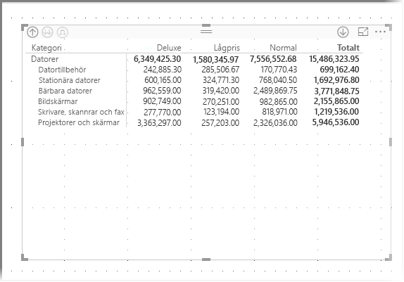

Du kan klicka på ikonen **Minska detaljnivån** för att gå tillbaka till föregående toppnivån. Om du sedan väljer **Visa nästa nivå** från snabbmenyn ser du en alfabetisk lista över alla objekt på nästa nivå (i det här fallet fältet *underkategori*) utan kategoriseringen för nästa hierarkinivå.

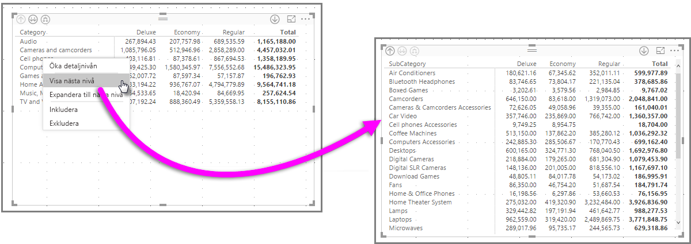

När du klickar på ikonen **Minska detaljnivån** i det övre vänstra hörnet av matrisen visas alla toppkategorier, högerklicka igen och välj **Expandera till nästa nivå**, så visas följande:

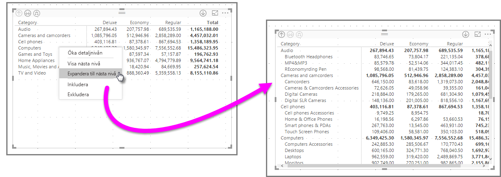

Du kan också använda menyalternativen **Inkludera** och **Undanta** för att behålla (eller ta bort, respektive) raden du högerklickade på (och eventuella underkategorier) från matrisen.

### Gå nedåt i kolumnrubriker
På samma sätt som du kan gå nedåt en nivå i Rader kan du göra samma med **Kolumner**. I följande bild ser du att det finns två fält i fältbrunnen **kolumner**, vilket skapar en hierarki som liknar den som vi använder för rader tidigare i den här artikeln. I fältbrunnen **Kolumner**har vi *Klass* och *Färg*.

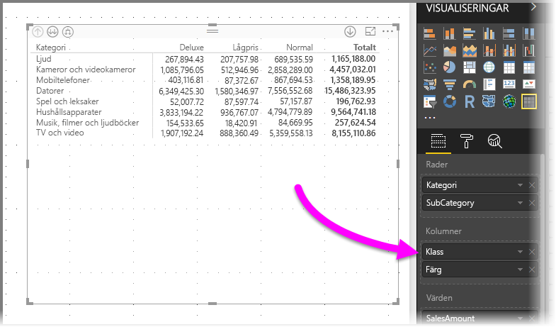

När vi högerklickar på en kolumn i **matrisen** visas alternativet att gå nedåt. I följande bild, högerklickar vi på *Deluxe* och väljer **Öka detaljnivån**.

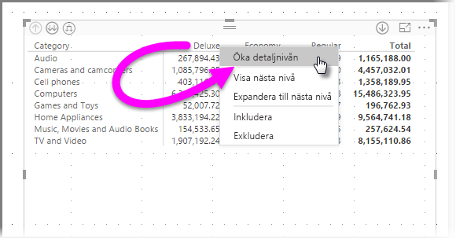

När du väljer **Öka detaljnivån** visas nästa nivå i hierarkin för kolumnen *Deluxe*, vilken i detta fall är *Färg*.

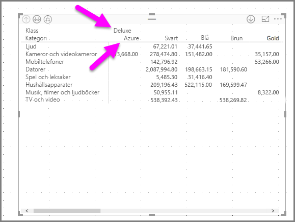

Resten av alternativen i högerklicksmenyn fungerar för kolumner på samma sätt som de gör för rader (mer information finns i föregående avsnitt **Öka detaljnivån för radrubriker**). Du kan **Visa nästa nivå**, **Expandera till nästa nivå**, **Inkludera** eller **Undanta** för dina kolumner på samma sätt som för rader.

> [!NOTE]
> Ikonerna för att öka och minska detaljnivån längst upp till vänster på matrisen gäller endast för rader. Du måste använda högerklicksmenyn för att öka detaljnivån i kolumner.
> 
> 

## Stegvis layout med matriser
**Matriser** har automatiskt indrag för underkategorier i en hierarki när de visas under en överordnad kategori. Detta kallas **Stegvis layout**.

I den *ursprungliga* versionen av matrisen visades underkategorier i en helt annan kolumn och tog upp mer utrymme i det visuella objektet. Följande bild visar tabellen i den ursprungliga **matrisen**. Observera underkategorierna i en separat kolumn.

I följande bild visas en **Matris** med **Stegvis layout**. Lägg märke till kategorin *datorer* visar underkategorierna något indragna (tillbehör för datorer, stationära datorer, bärbara datorer, skärmar och så vidare) vilket är tydligare och mycket mer komprimerat.

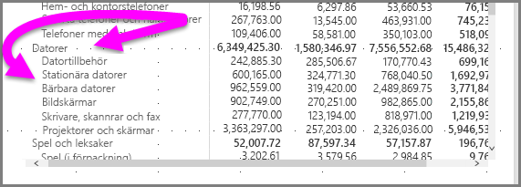

Du kan enkelt ändra inställningarna för stegvis layout. Expandera området **radrubriker** i **format**-området (rollerikonen) i fönstret **Visuella objekt** för den valda **matrisen**. Du har två alternativ: knappen **Stegvis layout** (som aktiverar eller inaktiverar funktionen) och **stegvis layoutindrag** (anger indrag i bildpunkter).

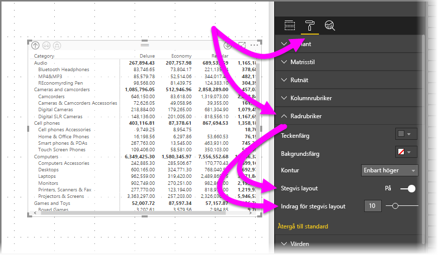

Om du inaktiverar **stegvis layout** visas underkategorierna har i en annan kolumn snarare än under överordnad kategori.

## Delsummor med matriser
Du kan aktivera eller inaktivera delsummor i matriser, för såväl rader som kolumner. I följande bild ser du att raddelsummor är inställda på **På**.

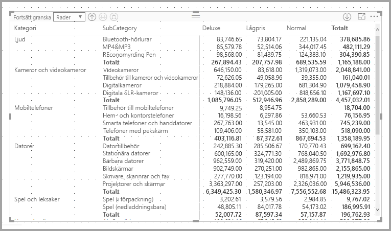

I området **Format** i fönstret **Visuella objekt** expanderar du kortet **Delsummor** och aktiverar skjutreglaget **Raddelsummor** till  **Inaktivera**. När du gör det visas inte delsummor.

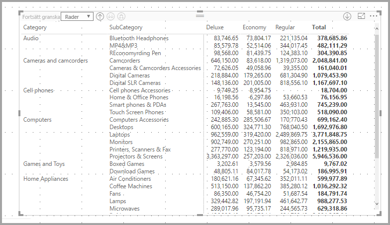

Samma sak gäller för kolumndelsummor.

## Korsmarkering med matriser
Med visualiseringen **Matris** kan du välja alla element i matrisen som grund för korsmarkering. Markera en kolumn i en **matris** för att markera den och alla andra visuella objekt på rapportsidan. Detta har varit en vanlig funktion för andra visualiseringar och val av datapunkter, så nu har visualiseringen **Matris** samma funktion.

Dessutom fungerar Ctrl + klicka för korsmarkering. I följande bild valdes till exempel en samling av underkategorier från **matrisen**. Observera hur objekt som inte var markerat från det visuella objektet är nedtonade och hur övriga visuella objekt på sidan återspeglar de val du gjorde i **matrisen**.

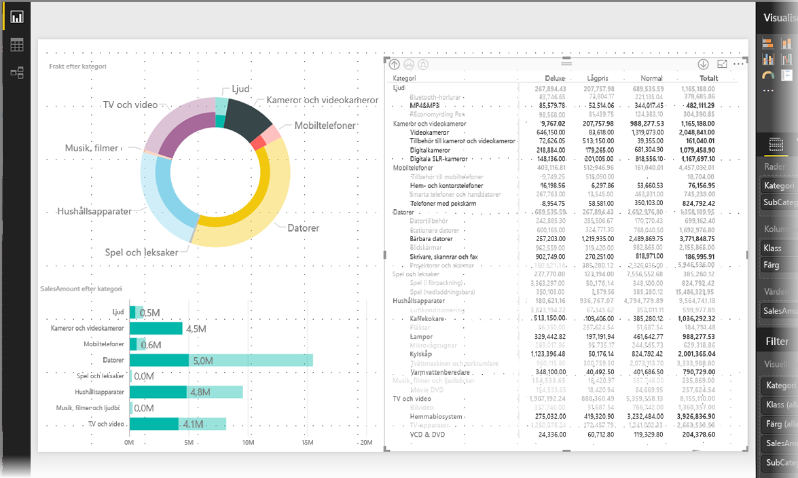

## Fyllning och teckenfärger med matriser
Med visualiseringen **Matris** kan du använda **villkorsstyrd formatering** (färger och fyllning) för cellernas bakgrundsfärger samt på själva texten och värdena.

Om du vill tillämpa villkorsstyrd formatering, kan du göra något av följande när en matris väljs:

* I fönstret **Fält** högerklickar du på fältet och väljer **Villkorsstyrd formatering** på menyn.
  
  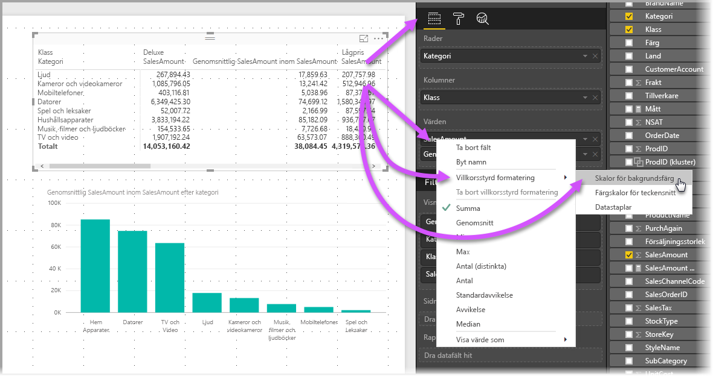
* Alternativt kan du gå till fönstret **Format** och expandera kortet **Villkorsstyrd formatering** och flytta skjutreglaget till **på** för antingen **Bakgrundsfärgskalor** eller **Teckensnittfärgskalor**. När du aktiverar något av dessa alternativ visas en länk till *Avancerade kontroller*, där du kan anpassa färger och värden för formatering av färg.
  
  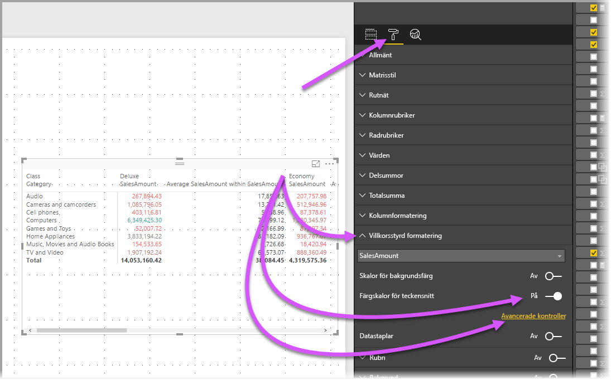

Båda metoder ger samma resultat. Om du väljer *avancerade kontroller* visas följande dialogruta där du kan göra justeringar:

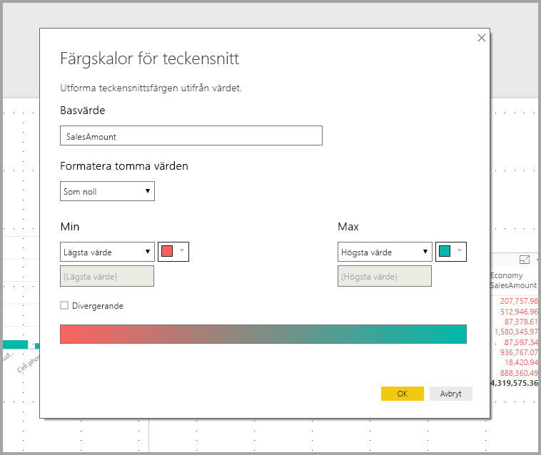

## Nästa steg

Följande artiklar kan också vara av intresse för dig:

* [Använd stödlinjer och fäst till rutnät i Power BI Desktop-rapporter](desktop-gridlines-snap-to-grid.md)
* [Datakällor i Power BI Desktop](desktop-data-sources.md)
* [Datatyper i Power BI Desktop](desktop-data-types.md)

 