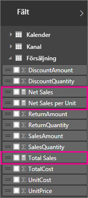
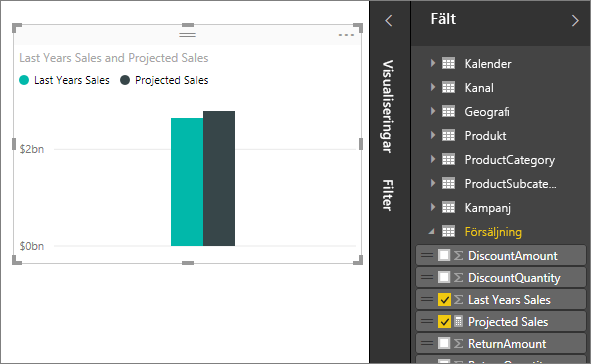
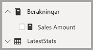

# Mått i Power BI Desktop

**Power BI Desktop** hjälper dig att skapa insikter om dina data med bara några klickningar. Men data innehåller ibland inte allt du behöver för att besvara några av dina viktigaste frågor. Mått kan vara en hjälp på vägen.

Mått används i några av de vanligaste dataanalyserna. Enkla summeringar, till exempel summor, medelvärden, lägsta, högsta och antal, kan ställas in via fältkällan. Detta beskrivs i videon [Summarization and category](https://docs.microsoft.com/power-bi/guided-learning/visualizations?tutorial-step=16) (Summering och kategori). Du kan skapa mer avancerade beräkningar med hjälp av en DAX-formel. Det beräknade resultatet av mått ändras alltid när du interagerar med dina rapporter, vilket ger snabb och dynamisk utforskning av dina data. Låt oss ta en närmare titt.

## Förstå mått

I **Power BI Desktop** skapas och visas mått i **Rapportvyn** eller **Datavyn**. Åtgärder som du skapar själv visas i fält med en Kalkylatorikon. Du kan kalla åtgärder vad du vill och lägga till dem i en ny eller befintlig visualisering precis som ett annat fält.

> [!NOTE]
> Du kan också vara intresserad av **snabbåtgärder**, som är färdiga åtgärder som du kan välja från dialogrutor. Det är ett bra sätt att snabbt skapa mått och ett bra sätt att lära dig DAX-syntaxen, eftersom de automatiskt skapade formlerna DAX är tillgängliga att granska. Läs artikeln: [snabbåtgärder](desktop-quick-measures.md).
> 
> 

## Data Analysis-uttryck

Mått beräknar ett resultat från en uttrycksformel. När du skapar egna åtgärder, använder du formelspråket [Data Analys-uttryck](https://msdn.microsoft.com/library/gg413422.aspx) (DAX). DAX innehåller ett bibliotek med över 200 funktioner, operatorer och konstruktioner. DAX-biblioteket ger stor flexibilitet när du skapar mått för att beräkna resultat för praktiskt taget alla dataanalysbehov.

DAX-formler påminner mycket om Excel formler. DAX stöder dessutom många av funktionerna i Excel, till exempel DATUM, SUMMA och VÄNSTER. Men funktionerna i DAX är avsedda för användning med relationsdata som de vi har i Power BI Desktop.

## Låt oss ta en titt på ett exempel
Jan är försäljningschef på Contoso. Jan har blivit ombedd att ange försäljningsprognoser för återförsäljare under nästa räkenskapsår. Jan bestämmer sig för att basera sina uppskattningar på förra årets försäljningssiffror, med sex procents årlig ökning från olika kampanjer som är inplanerade under de kommande sex månaderna.

För att rapportera uppskattningarna importerar hon fjolårets säljdata till Power BI Desktop. Jan hittar fältet SalesAmount i tabellen Reseller Sales. Eftersom de data som hon har importerat endast innehåller försäljningssiffror för det senaste året, ändrar Jan namnet på fältet SalesAmount till Förra årets försäljning. Sedan drar Jan Förra årets försäljning till rapportarbetsytan. Den visas i ett diagram som ett enda värde, vilket är summan av alla återförsäljares försäljning förra året.

Jan observerar att en beräkning har angetts automatiskt, trots att det inte har specificerats någon. Power BI Desktop skapade ett eget mått genom att addera alla värden i Förra årets försäljning.

Men Jan behöver ett mått för att beräkna en uppskattning för nästa år som bygger på förra årets försäljning multiplicerat med 1,06, för att ta den förväntade ökningen på 6 procent i beräkningen. För den här beräkningen skapar Jan sitt eget mått. Med funktionen Nytt mått skapar Jan ett nytt mått och anger sedan följande DAX-formel:

    Projected Sales = SUM('Sales'[Last Years Sales])*1.06

Jan drar sedan måttet Säljprognos till diagrammet.

Nu har Jan ett mått för att beräkna framtida försäljning med minimal ansträngning. Jan kan analysera sina prognoser ytterligare genom att filtrera specifika återförsäljare eller lägga till andra fält i rapporten.

## Datakategorier för mått

Du kan också välja datakategorier för mått. 

På så sätt kan du till exempel använda mått för att skapa URL:er dynamiskt, och markera datakategorin som en webbadress. 

Du kan till exempel skapa tabeller som visar måtten som webbadresser och sedan klicka på URL:en som skapas baserat på ditt val. Detta är särskilt användbart om du vill länka till andra Power BI-rapporter med [URL-filterparametrar](service-url-filters.md).

## Ordna dina mått

Måtten har en *starttabell* som anger var de finns i fältlistan. Du kan ändra deras plats genom att välja en plats från tabellerna i din modell.

Du kan också ordna fält i en tabell i *visningsmappar*. Välj **Modellvyn** på vänster sida av Power BI Desktop-fönstret och välj sedan det fält som du vill flytta från listan med tillgängliga fält som visas på arbetsytan. I egenskapsfönstret visas en textruta för **visningsmapp**. När du skriver ett namn i fältet **Visningsmapp** skapas mappen och det valda fältet flyttas till den mappen.

Du kan skapa undermappar med hjälp av ett omvänt snedstreck. Om du till exempel skriver *Ekonomi\Valutor* skapas mappen *Ekonomi*, och i den mappen skapas mappen *Valutor*.

Du kan göra så att ett fält visas i flera mappar genom att avgränsa mappnamnen med ett semikolon. Om du till exempel skriver *Produkter\Namn;Avdelningar* visas fältet i mappen *Avdelningar* och i mappen *Namn* inuti mappen *Produkter*.

Slutligen kan du skapa en särskilt tabell som endast innehåller mått som alltid visas längst upp i **fältlistan**. Det gör du genom att skapa en tabell med bara en kolumn. Du kan använda **Ange data** för att skapa tabellen. Flytta sedan dina mått till tabellen. Slutligen döljer du kolumnen (inte tabellen) som du skapade. Du måste stänga och öppna **fältlistan** på nytt för att den ska visas korrekt i Power BI Desktop. Det gör du genom att klicka på sparrikonen överst i **fältlistan**.

## Läs mer
Det här er bara en snabbintroduktion till mått men det finns mycket mer information om att skapa egna mått. Läs [Självstudie: Skapa dina egna mått i Power BI Desktop](desktop-tutorial-create-measures.md), där du kan ladda ned en exempelfil och få stegvisa anvisningar om hur du skapar fler mått.  

Om du vill fördjupa dig i DAX kan du läsa [Grunderna för DAX i Power BI Desktop](desktop-quickstart-learn-dax-basics.md). Lathunden för [Data Analysis Expressions](https://msdn.microsoft.com/library/gg413422.aspx) innehåller detaljerade artiklar om alla funktioner, syntaxer operatörer och namnkonventioner. DAX har funnits i åratal i Power Pivot i Excel och SQL Server Analysis Services, så det finns en mängd andra användbara resurser som du kan dra nytta av. Läs [DAX Resource Center Wiki](http://social.technet.microsoft.com/wiki/contents/articles/1088.dax-resource-center.aspx), där inflytelserika BI-experter delar med sig av sina kunskaper om DAX.

