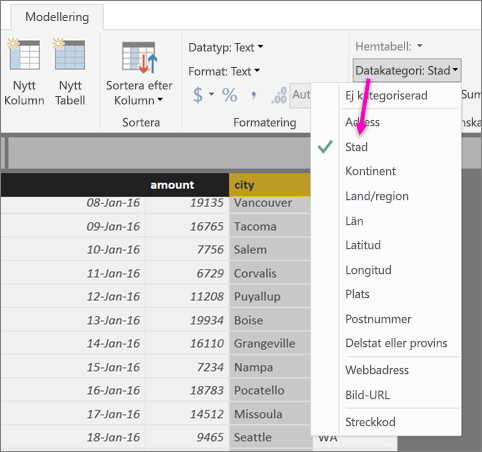
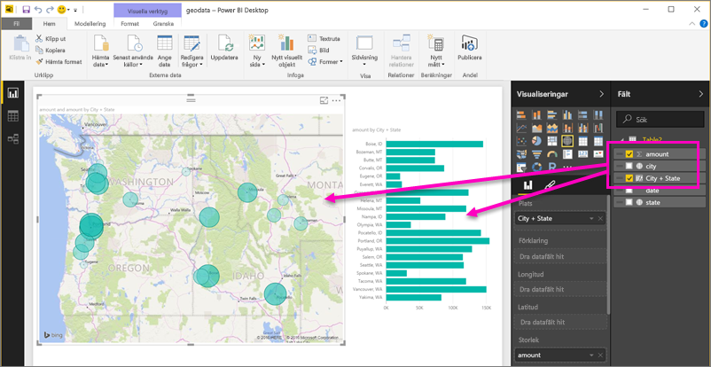
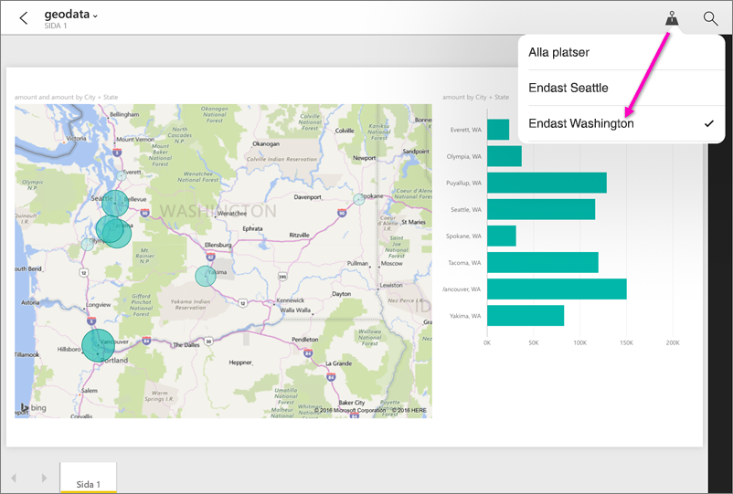

# Ange geografiska filter i Power BI Desktop för mobilapparna
Du kan i Power BI Desktop [kategorisera geografiska data](desktop-data-categorization.md) för en kolumn, så att Power BI Desktop vet hur värden ska hanteras i visuella objekt i en rapport. En fördel när du och dina kolleger ser rapporten i Power BI-mobilapparna är att Power BI automatiskt anger geografiska filter baserat på var ni befinner er. 

Anta exempelvis att du är en försäljningschef som reser för att träffa kunder och du snabbt vill filtrera försäljning och intäkter för en viss kund som du planerar att besöka. Du vill filtrera ut data för din aktuella plats, oavsett om det gäller region, stad eller en faktisk adress. Senare, om du har tid, tänker du besöka andra kunder i närheten. Du kan [filtrera rapporten efter din plats för att söka efter dessa kunder](mobile-apps-geographic-filtering.md).

> [!NOTE]
> Du kan bara filtrera efter plats i mobilappen om geografiska namn i rapporten är på engelska &#150; till exempel ”New York City” eller ”Germany”.
> 
> 

## Identifiera geografiska data i rapporten
1. Växla till Datavy i Power BI Desktop .
2. Välj en kolumn med geografiska data &#151; till exempel kolumnen Stad.
   
    
3. På fliken **Modellering** väljer du **Datakategori** och sedan rätt kategori &#151; i det här exemplet **Stad**.
   
    
4. Fortsätt konfigurera geografiska datakategorier för andra fält i modellen. 
   
   > [!NOTE]
   > Du kan ange flera kolumner för varje datakategori i en modell, men om du gör det kan modellen inte filtrera efter geografi i Power BI-mobilappen. Om du vill använda geografisk filtrering i mobilappar, anger du endast en kolumn för varje datakategori &#151; till exempel bara en kolumn för **Stad**, en kolumn för **Region** och en kolumn för **Land**. 
   > 
   > 

## Skapa visuella objekt med geografiska data
1. Växla till Rapportvy , och skapa visuella objekt som använder de geografiska fälten i dina data. 
   
    
   
    I det här exemplet innehåller modellen också en beräknad kolumn där både staden och regionen finns tillsammans i en kolumn. Läs mer om [att skapa beräknade kolumner i Power BI Desktop](desktop-calculated-columns.md).
   
    
2. Publicera rapporten i Power BI-tjänsten.

## Visa rapporten i Power BI-mobilappen
1. Öppna rapporten i någon av [Power BI-mobilapparna](mobile-apps-for-mobile-devices.md).
2. Om du använder en geografisk plats med data i rapporten kan du filtrera den automatiskt till din plats.
   
    

Läs mer om att [filtrera en rapport efter plats i Power BI-mobilapparna](mobile-apps-geographic-filtering.md).

## Nästa steg
* [Datakategorisering i Power BI Desktop](desktop-data-categorization.md)  
* Har du några frågor? [Fråga Power BI Community](http://community.powerbi.com/)

