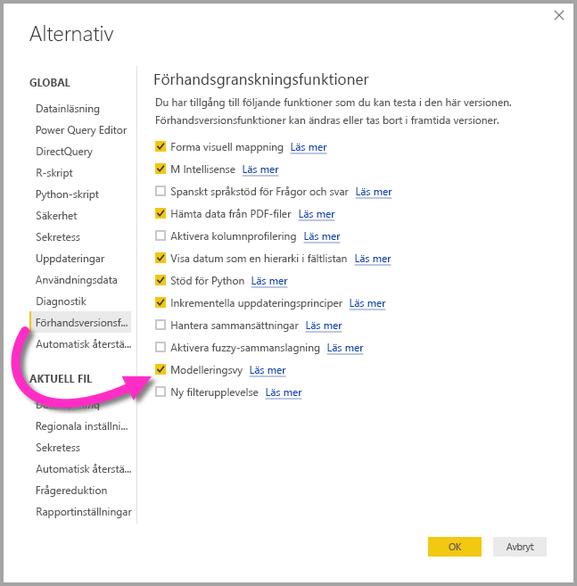
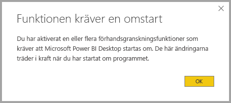
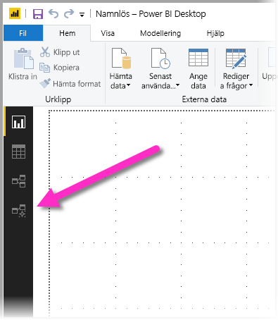
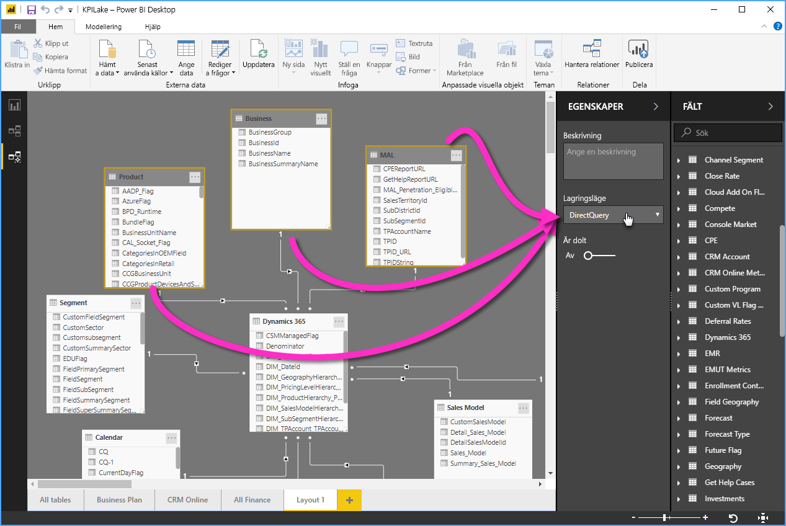

# Modelleringsvyn i Power BI Desktop (förhandsversion)

Med **Modelleringsvyn** i **Power BI Desktop** kan du visa och arbeta med komplexa datauppsättningar som innehåller många tabeller. Med modelleringsvyn kan du göra följande:

## Aktivera förhandsfunktionen Modelleringsvy

Modelleringsvyfunktionen är i förhandsversion och måste aktiveras i **Power BI Desktop**. Aktivera modelleringsvyn genom att välja **Arkiv > Alternativ och inställningar > Alternativ > Förhandsfunktioner** och därefter välja kryssrutan **Modelleringsvy** i som det visas i följande bild.

Du kommer att behöva starta om **Power BI Desktop** för att förhandsfunktionen ska aktiveras. 

## Använda Modelleringsvyn

Om du vill komma åt Modelleringsvyn så väljer du Modelleringsvy-ikonen som visas på vänster sida av **Power BI Desktop** som det visas i följande bild.

## Skapa separata diagram

Med Modelleringsvyn så kan du skapa diagram över din modell som endast innehåller en delmängd av tabellerna i din modell. Det kan ge en bättre uppfattning av de tabeller som du vill arbeta med och underlätta arbete med komplexa datauppsättningar. Skapa ett nytt diagram med endast en delmängd av tabellerna genom att klicka på tecknet **+** bredvid fliken **Alla tabeller** längst ned i Power BI Desktop-fönstret.

Du kan sedan dra en tabell från listan **Fält** till diagramytan. Högerklicka på tabellen och välj sedan **Lägg till relaterade tabeller** från menyn som visas.

När du gör det så visas tabeller som är relaterade till den ursprungliga tabellen i det nya diagrammet. Följande bild visar hur relaterade tabeller visas när du har valt menyalternativet **Lägg till relaterade tabeller**.

## Ställ in gemensamma egenskaper

Du kan välja flera objekt på samma gång i modelleringsvyn genom att hålla ned **Ctrl**-tangenten och klicka på flera tabeller. När du väljer flera tabeller så markeras de i Modelleringsvyn. När flera tabeller är markerade så blir ändringar som tillämpas i **Egenskaper**-fönstret gällande för alla valda tabeller.

Du kan till exempel ändra den [lagringsläge](desktop-storage-mode.md) för flera tabeller i din diagramvy genom att hålla ned **Ctrl**-tangenten, markera tabeller och därefter ändra inställningen för lagringsläge i **Egenskaper**-fönstret.

## Nästa steg

Följande artiklar beskriver mer om datamodeller och beskriver även DirectQuery i detalj.

* [Sammansättningar i Power BI Desktop (förhandsversion)](desktop-aggregations.md)
* [Sammansatta modeller i Power BI Desktop (förhandsversion)](desktop-composite-models.md)
* [Lagringsläge i Power BI Desktop (förhandsversion)](desktop-storage-mode.md)
* [Många-till-många-relationer i Power BI Desktop (förhandsversion)](desktop-many-to-many-relationships.md)

DirectQuery-artiklar:

* [Använd DirectQuery i Power BI](desktop-directquery-about.md)
* [Datakällor som stöds av DirectQuery i Power BI](desktop-directquery-data-sources.md)
