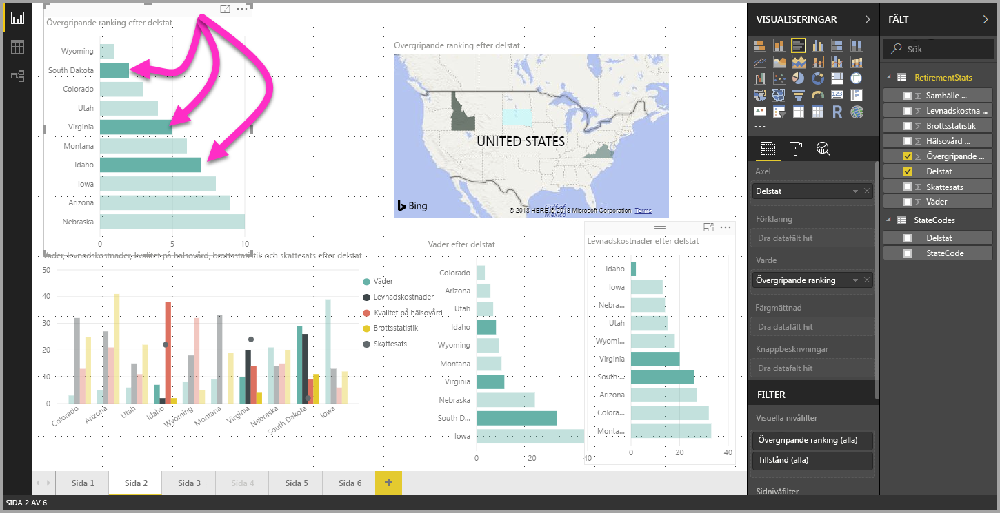

# Välj flera dataelement i visualiseringar med Power BI Desktop

I Power BI Desktop kan du markera en datapunkt i ett visst visuellt objekt genom att helt enkelt klicka på datapunkten i det visuella objektet. Om du har ett viktigt stapel- eller diagramelement och du vill ha annan visuell information på rapportsidan för att markera data baserat på ditt val, kan du klicka på dataelementet i en visualisering och visa resultat som visas i annan visualisering på sidan. Detta är grundläggande eller enkelvalsmarkering. Följande bild visar en grundläggande markering. 

Med flerval du nu välja fler än en datapunkt på **Power BI Desktop**-rapportsidan och markera resultaten på visualiseringarna på sidan. Detta motsvarar en **och**-instruktion eller -funktion såsom ”markera resultat för Idaho **och** Virginia”. För att välja flera datapunkter i visualiseringar använder du **CTRL + klicka**. Följande bild visar **flera datapunkter** valda (flerval).

Detta låter som en enkel funktion, men den öppnar upp många olika möjligheter när du skapar, delar och interagerar med rapporter. 

## Nästa steg

Följande artiklar kan också vara av intresse för dig:

* [Använd stödlinjer och fäst till rutnät i Power BI Desktop-rapporter](desktop-gridlines-snap-to-grid.md)
* [Om filter och markeringar i Power BI-rapporter](power-bi-reports-filters-and-highlighting.md)

